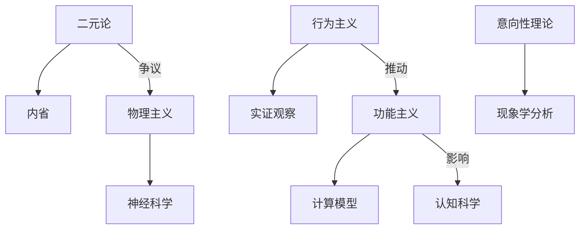

# 07.2.x 心灵哲学流派与理论

## 📋 目录

- [07.2.x 心灵哲学流派与理论](#072x-心灵哲学流派与理论)
  - [📋 目录](#-目录)
  - [1 x5 心灵哲学流派与理论对比及结构图 072x5-心灵哲学流派与理论对比及结构图](#1-x5-心灵哲学流派与理论对比及结构图-072x5-心灵哲学流派与理论对比及结构图)
    - [1.1 主要心灵哲学流派与理论对比表](#11-主要心灵哲学流派与理论对比表)
    - [1.2 Mermaid结构图：心灵哲学流派关系](#12-mermaid结构图心灵哲学流派关系)

---

## 1 x5 心灵哲学流派与理论对比及结构图 072x5-心灵哲学流派与理论对比及结构图

### 1.1 主要心灵哲学流派与理论对比表

| 流派         | 代表人物         | 核心观点         | 方法论特征         | 主要贡献         |
|--------------|------------------|------------------|--------------------|------------------|
| 二元论       | 笛卡尔           | 心灵与身体分离   | 本体区分、内省     | 近代心身问题     |
| 行为主义     | 华生、斯金纳     | 心灵=行为模式    | 实证观察、刺激反应 | 行为科学基础     |
| 物理主义     | 斯马特、费格尔   | 心灵=物理状态    | 还原论、神经科学   | 认知神经科学     |
| 功能主义     | 普特南、福多尔   | 心灵=功能结构    | 计算模型、功能分析 | 认知科学模型     |
| 意向性理论   | 布伦塔诺、塞尔   | 心灵具有指向性   | 意向性分析、现象学 | 意识哲学创新     |

### 1.2 Mermaid结构图：心灵哲学流派关系

---
> 交叉引用：[07.2.4 现象学哲学分析](./现象学哲学分析.md)｜[07.2.6 规范伦理学分析](./规范伦理学分析.md)｜[07.2.1 信息本体论分析](./信息本体论分析.md)
