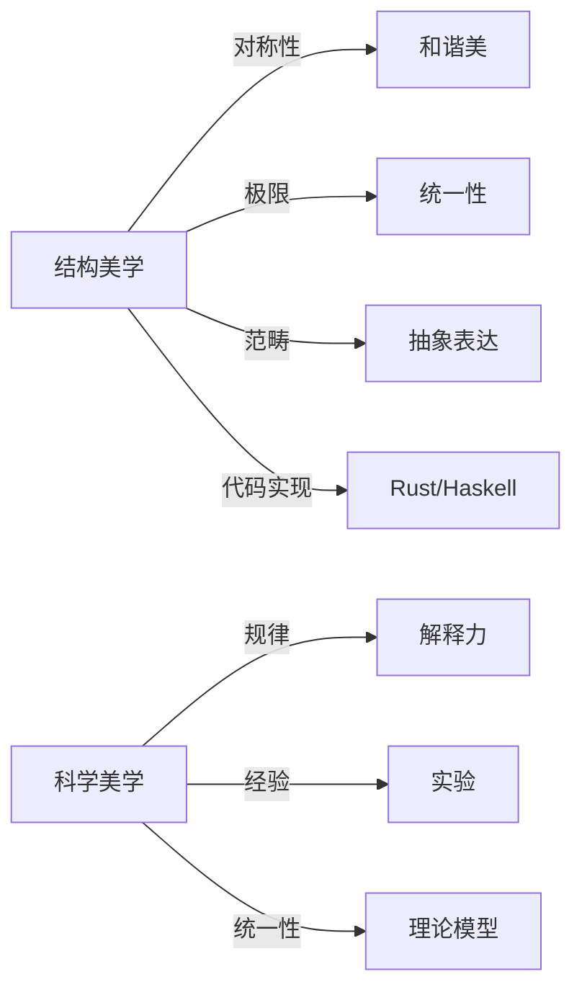

# 范畴世界的不变之美：连续性、迁越性与完整性的形式科学革命

---

## 1 科学美学与形式美学分析

> 参见：[07.2.8 结构美学分析](./结构美学分析.md)、[07.1.3 科学美学基础](../07.1_Foundations/07.1.3_Scientific_Aesthetics.md)

## 📋 目录

- [1 科学美学与形式美学分析](#1-科学美学与形式美学分析)
- [2 结构美学与科学美学的比较 07297-结构美学与科学美学的比较](#2-结构美学与科学美学的比较-07297-结构美学与科学美学的比较)
  - [2.1 结构美学与科学美学对比表](#21-结构美学与科学美学对比表)
  - [2.2 形式美学的范畴建模代码](#22-形式美学的范畴建模代码)
    - [2.2.1 Rust 示例](#221-rust-示例)
    - [2.2.2 Haskell 示例](#222-haskell-示例)
  - [2.3 Mermaid 结构图示](#23-mermaid-结构图示)

---

> 交叉引用：[07.2.8 结构美学分析](./结构美学分析.md)｜[07.2.1 信息本体论](./信息本体论分析.md)｜[07.1.3 科学美学基础](../07.1_Foundations/07.1.3_Scientific_Aesthetics.md)

## 12 结构美学与科学美学的比较 07297-结构美学与科学美学的比较

### 12.1 结构美学与科学美学对比表

| 维度         | 结构美学（范畴论）         | 科学美学（科学哲学）         |
|--------------|----------------------------|------------------------------|
| 核心关注     | 结构、关系、极限、对称性   | 规律、解释、经验、统一性     |
| 形式化工具   | 范畴、函子、极限、单子     | 逻辑、模型、归纳、演绎       |
| 美学标准     | 极小生成、和谐、对称、普适 | 简洁、优雅、解释力、预测性   |
| 典型表达     | 图示、抽象代数、类型系统   | 公式、实验、理论模型         |
| 代码实现     | Rust/Haskell抽象、类型系统 | Python/Matlab建模、仿真      |

### 12.2 形式美学的范畴建模代码

#### 2.2.1 Rust 示例

```rust
// 形式美学的范畴建模（极简）
trait Beauty {
    fn harmony(&self) -> bool;
}
struct Symmetry;
impl Beauty for Symmetry {
    fn harmony(&self) -> bool { true }
}
```

#### 2.2.2 Haskell 示例

```haskell
-- 形式美学的Haskell建模
class Beauty a where
  harmony :: a -> Bool

data Symmetry = Symmetry
instance Beauty Symmetry where
  harmony _ = True
```

### 12.3 Mermaid 结构图示



---
> 交叉引用：[07.2.8 结构美学分析](./结构美学分析.md)｜[07.2.1 信息本体论](./信息本体论分析.md)｜[07.1.3 科学美学基础](../07.1_Foundations/07.1.3_Scientific_Aesthetics.md)
