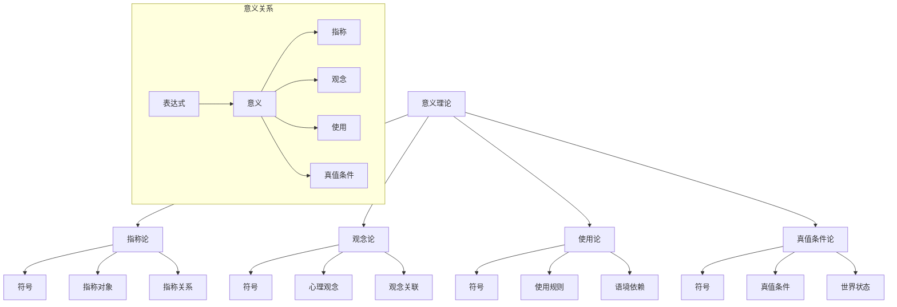

# 01.3.1 意义理论 (Meaning Theory)

## 📋 目录

- [01.3.1 意义理论 (Meaning Theory)](#0131-意义理论-meaning-theory)
  - [📋 目录](#-目录)
  - [1 理论概述](#1-理论概述)
  - [2 形式化语义](#2-形式化语义)
    - [2.1 核心定义](#21-核心定义)
    - [2.2 核心定理](#22-核心定理)
  - [3 多表征方式](#3-多表征方式)
    - [3.1 图形表征](#31-图形表征)
    - [3.2 表格表征](#32-表格表征)
    - [3.3 数学表征](#33-数学表征)
    - [3.4 伪代码表征](#34-伪代码表征)
  - [4 Rust实现](#4-rust实现)
  - [5 哲学性批判与展望](#5-哲学性批判与展望)
    - [5.1 本体论反思](#51-本体论反思)
    - [5.2 认识论批判](#52-认识论批判)
    - [5.3 社会影响分析](#53-社会影响分析)
    - [5.4 终极哲学建议](#54-终极哲学建议)
  - [📚 参考文献](#-参考文献)

---

## 1 理论概述

意义理论研究语言表达式的意义本质、意义关系以及意义的确定方式。
本理论涵盖指称论、观念论、使用论、真值条件论等核心概念，为理解语言意义的哲学基础提供理论支撑。

## 2 形式化语义

### 2.1 核心定义

**定义 1.1** (语言表达式)
语言表达式是一个三元组：$E = (S, M, R)$，其中：

- $S$ 是符号序列
- $M$ 是意义内容
- $R$ 是指称对象

**定义 1.2** (指称论)
指称论认为意义即指称：$\text{Meaning}(E) = \text{Reference}(E)$

**定义 1.3** (观念论)
观念论认为意义即观念：$\text{Meaning}(E) = \text{Idea}(E)$

**定义 1.4** (使用论)
使用论认为意义即使用：$\text{Meaning}(E) = \text{Use}(E)$

**定义 1.5** (真值条件论)
真值条件论认为意义即真值条件：$\text{Meaning}(E) = \{\text{Conditions} : E \text{ is true}\}$

### 2.2 核心定理

**定理 1.1** (意义的组合性)
复合表达式的意义由其组成部分的意义决定：$\text{Meaning}(E_1 \oplus E_2) = f(\text{Meaning}(E_1), \text{Meaning}(E_2))$

**定理 1.2** (意义的系统性)
语言表达式的意义具有系统性：$\forall E_1, E_2 \in L, \text{Systematic}(E_1, E_2) \rightarrow \text{Systematic}(\text{Meaning}(E_1), \text{Meaning}(E_2))$

**定理 1.3** (意义的可学习性)
意义具有可学习性：$\forall E \in L, \exists \text{Learning Procedure} : \text{Learn}(\text{Meaning}(E))$

**定理 1.4** (意义的公共性)
意义具有公共性：$\forall S_1, S_2 \in \text{Speakers}, \text{Meaning}(E, S_1) = \text{Meaning}(E, S_2)$

## 3 多表征方式

### 3.1 图形表征



### 3.2 表格表征

| 意义理论 | 意义本质 | 主要主张 | 优势 | 局限性 |
|----------|----------|----------|------|--------|
| 指称论 | 指称对象 | 意义即指称 | 直观 | 抽象词处理困难 |
| 观念论 | 心理观念 | 意义即观念 | 心理现实性 | 私人性问题 |
| 使用论 | 使用方式 | 意义即使用 | 实用性强 | 系统性不足 |
| 真值条件论 | 真值条件 | 意义即真值条件 | 形式化程度高 | 非陈述句处理困难 |

### 3.3 数学表征

**指称论**：
$\text{Meaning}(E) = \{x : E \text{ refers to } x\}$

**观念论**：
$\text{Meaning}(E) = \{I : I \text{ is the idea associated with } E\}$

**使用论**：
$\text{Meaning}(E) = \{U : U \text{ is a use of } E\}$

**真值条件论**：
$\text{Meaning}(E) = \{w : E \text{ is true in } w\}$

### 3.4 伪代码表征

```python
class MeaningTheory:
    def __init__(self, theory_type):
        self.theory_type = theory_type

    def reference_theory(self, expression):
        """指称论"""
        return self.get_reference(expression)

    def ideational_theory(self, expression):
        """观念论"""
        return self.get_idea(expression)

    def use_theory(self, expression):
        """使用论"""
        return self.get_use_pattern(expression)

    def truth_conditional_theory(self, expression):
        """真值条件论"""
        return self.get_truth_conditions(expression)
```

## 4 Rust实现

```rust
use std::collections::HashMap;

/// 意义理论
#[derive(Debug, Clone)]
pub struct MeaningTheory {
    pub theory_type: TheoryType,
    pub expressions: HashMap<String, Expression>,
    pub meanings: HashMap<String, Meaning>,
    pub references: HashMap<String, Reference>,
}

/// 语言表达式
#[derive(Debug, Clone)]
pub struct Expression {
    pub symbol: String,
    pub syntactic_category: SyntacticCategory,
    pub semantic_features: Vec<SemanticFeature>,
}

/// 意义
#[derive(Debug, Clone)]
pub struct Meaning {
    pub content: String,
    pub meaning_type: MeaningType,
    pub context_dependent: bool,
    pub compositionality: f64,
}

/// 指称
#[derive(Debug, Clone)]
pub struct Reference {
    pub object: String,
    pub reference_type: ReferenceType,
    pub existence_status: ExistenceStatus,
}

/// 理论类型
#[derive(Debug, Clone)]
pub enum TheoryType {
    Referential,      // 指称论
    Ideational,       // 观念论
    UseTheory,        // 使用论
    TruthConditional, // 真值条件论
}

/// 句法范畴
#[derive(Debug, Clone)]
pub enum SyntacticCategory {
    Noun,           // 名词
    Verb,           // 动词
    Adjective,      // 形容词
    Adverb,         // 副词
    Preposition,    // 介词
    Conjunction,    // 连词
}

/// 语义特征
#[derive(Debug, Clone)]
pub struct SemanticFeature {
    pub name: String,
    pub value: String,
    pub feature_type: FeatureType,
}

/// 意义类型
#[derive(Debug, Clone)]
pub enum MeaningType {
    Referential,    // 指称意义
    Ideational,     // 观念意义
    UseBased,       // 使用意义
    TruthConditional, // 真值条件意义
}

/// 指称类型
#[derive(Debug, Clone)]
pub enum ReferenceType {
    Direct,         // 直接指称
    Indirect,       // 间接指称
    Descriptive,    // 描述性指称
    Causal,         // 因果指称
}

/// 存在状态
#[derive(Debug, Clone)]
pub enum ExistenceStatus {
    Exists,         // 存在
    DoesNotExist,   // 不存在
    Fictional,      // 虚构
    Abstract,       // 抽象
}

/// 特征类型
#[derive(Debug, Clone)]
pub enum FeatureType {
    Semantic,       // 语义特征
    Pragmatic,      // 语用特征
    Contextual,     // 语境特征
}

impl MeaningTheory {
    /// 创建新的意义理论
    pub fn new(theory_type: TheoryType) -> Self {
        Self {
            theory_type,
            expressions: HashMap::new(),
            meanings: HashMap::new(),
            references: HashMap::new(),
        }
    }

    /// 添加表达式
    pub fn add_expression(&mut self, expression: Expression) {
        self.expressions.insert(expression.symbol.clone(), expression);
    }

    /// 添加意义
    pub fn add_meaning(&mut self, symbol: String, meaning: Meaning) {
        self.meanings.insert(symbol, meaning);
    }

    /// 添加指称
    pub fn add_reference(&mut self, symbol: String, reference: Reference) {
        self.references.insert(symbol, reference);
    }

    /// 指称论意义分析
    pub fn referential_meaning(&self, expression: &Expression) -> Option<&Reference> {
        self.references.get(&expression.symbol)
    }

    /// 观念论意义分析
    pub fn ideational_meaning(&self, expression: &Expression) -> Option<String> {
        // 简化的观念分析
        Some(format!("观念_{}", expression.symbol))
    }

    /// 使用论意义分析
    pub fn use_based_meaning(&self, expression: &Expression) -> Vec<String> {
        // 简化的使用模式分析
        vec![
            format!("使用模式1_{}", expression.symbol),
            format!("使用模式2_{}", expression.symbol),
        ]
    }

    /// 真值条件论意义分析
    pub fn truth_conditional_meaning(&self, expression: &Expression) -> Vec<String> {
        // 简化的真值条件分析
        vec![
            format!("真值条件1_{}", expression.symbol),
            format!("真值条件2_{}", expression.symbol),
        ]
    }

    /// 获取表达式的意义
    pub fn get_meaning(&self, expression: &Expression) -> Meaning {
        match self.theory_type {
            TheoryType::Referential => {
                let reference = self.referential_meaning(expression);
                Meaning {
                    content: reference.map(|r| r.object.clone()).unwrap_or_default(),
                    meaning_type: MeaningType::Referential,
                    context_dependent: false,
                    compositionality: 0.8,
                }
            },
            TheoryType::Ideational => {
                let idea = self.ideational_meaning(expression);
                Meaning {
                    content: idea.unwrap_or_default(),
                    meaning_type: MeaningType::Ideational,
                    context_dependent: true,
                    compositionality: 0.6,
                }
            },
            TheoryType::UseTheory => {
                let uses = self.use_based_meaning(expression);
                Meaning {
                    content: uses.join(", "),
                    meaning_type: MeaningType::UseBased,
                    context_dependent: true,
                    compositionality: 0.4,
                }
            },
            TheoryType::TruthConditional => {
                let conditions = self.truth_conditional_meaning(expression);
                Meaning {
                    content: conditions.join(", "),
                    meaning_type: MeaningType::TruthConditional,
                    context_dependent: false,
                    compositionality: 0.9,
                }
            },
        }
    }

    /// 分析意义的组合性
    pub fn analyze_compositionality(&self, expression: &Expression) -> f64 {
        let meaning = self.get_meaning(expression);
        meaning.compositionality
    }

    /// 分析意义的系统性
    pub fn analyze_systematicity(&self, expression1: &Expression, expression2: &Expression) -> bool {
        // 简化的系统性分析
        expression1.syntactic_category == expression2.syntactic_category
    }

    /// 分析意义的可学习性
    pub fn analyze_learnability(&self, expression: &Expression) -> f64 {
        // 简化的可学习性分析
        match expression.syntactic_category {
            SyntacticCategory::Noun => 0.9,
            SyntacticCategory::Verb => 0.8,
            SyntacticCategory::Adjective => 0.7,
            SyntacticCategory::Adverb => 0.6,
            SyntacticCategory::Preposition => 0.5,
            SyntacticCategory::Conjunction => 0.4,
        }
    }

    /// 分析意义的公共性
    pub fn analyze_publicity(&self, expression: &Expression) -> bool {
        // 简化的公共性分析
        !expression.semantic_features.is_empty()
    }
}

impl Expression {
    /// 创建新的表达式
    pub fn new(symbol: String, category: SyntacticCategory) -> Self {
        Self {
            symbol,
            syntactic_category: category,
            semantic_features: Vec::new(),
        }
    }

    /// 添加语义特征
    pub fn add_semantic_feature(&mut self, feature: SemanticFeature) {
        self.semantic_features.push(feature);
    }

    /// 获取表达式的复杂度
    pub fn complexity(&self) -> usize {
        self.semantic_features.len()
    }
}

impl Meaning {
    /// 创建新的意义
    pub fn new(content: String, meaning_type: MeaningType) -> Self {
        Self {
            content,
            meaning_type,
            context_dependent: false,
            compositionality: 0.5,
        }
    }

    /// 设置语境依赖性
    pub fn set_context_dependent(&mut self, context_dependent: bool) {
        self.context_dependent = context_dependent;
    }

    /// 设置组合性
    pub fn set_compositionality(&mut self, compositionality: f64) {
        self.compositionality = compositionality.max(0.0).min(1.0);
    }

    /// 获取意义强度
    pub fn get_meaning_strength(&self) -> f64 {
        let base_strength = if self.context_dependent { 0.7 } else { 0.9 };
        base_strength * self.compositionality
    }
}

impl Reference {
    /// 创建新的指称
    pub fn new(object: String, reference_type: ReferenceType) -> Self {
        Self {
            object,
            reference_type,
            existence_status: ExistenceStatus::Exists,
        }
    }

    /// 设置存在状态
    pub fn set_existence_status(&mut self, status: ExistenceStatus) {
        self.existence_status = status;
    }

    /// 检查指称是否有效
    pub fn is_valid(&self) -> bool {
        matches!(self.existence_status, ExistenceStatus::Exists)
    }
}

/// 意义分析器
#[derive(Debug)]
pub struct MeaningAnalyzer {
    pub theories: Vec<MeaningTheory>,
    pub analysis_results: HashMap<String, AnalysisResult>,
}

/// 分析结果
#[derive(Debug)]
pub struct AnalysisResult {
    pub expression: String,
    pub meanings: Vec<Meaning>,
    pub compositionality_score: f64,
    pub systematicity_score: f64,
    pub learnability_score: f64,
    pub publicity_score: f64,
}

impl MeaningAnalyzer {
    /// 创建新的意义分析器
    pub fn new() -> Self {
        Self {
            theories: Vec::new(),
            analysis_results: HashMap::new(),
        }
    }

    /// 添加意义理论
    pub fn add_theory(&mut self, theory: MeaningTheory) {
        self.theories.push(theory);
    }

    /// 分析表达式
    pub fn analyze_expression(&mut self, expression: &Expression) -> AnalysisResult {
        let mut meanings = Vec::new();
        let mut compositionality_scores = Vec::new();
        let mut systematicity_scores = Vec::new();
        let mut learnability_scores = Vec::new();
        let mut publicity_scores = Vec::new();

        for theory in &self.theories {
            let meaning = theory.get_meaning(expression);
            meanings.push(meaning.clone());

            compositionality_scores.push(theory.analyze_compositionality(expression));
            learnability_scores.push(theory.analyze_learnability(expression));
            publicity_scores.push(if theory.analyze_publicity(expression) { 1.0 } else { 0.0 });
        }

        // 计算系统性分数
        if self.theories.len() > 1 {
            for i in 0..self.theories.len() - 1 {
                for j in i + 1..self.theories.len() {
                    let systematicity = self.theories[i].analyze_systematicity(expression, expression);
                    systematicity_scores.push(if systematicity { 1.0 } else { 0.0 });
                }
            }
        }

        AnalysisResult {
            expression: expression.symbol.clone(),
            meanings,
            compositionality_score: compositionality_scores.iter().sum::<f64>() / compositionality_scores.len() as f64,
            systematicity_score: systematicity_scores.iter().sum::<f64>() / systematicity_scores.len() as f64,
            learnability_score: learnability_scores.iter().sum::<f64>() / learnability_scores.len() as f64,
            publicity_score: publicity_scores.iter().sum::<f64>() / publicity_scores.len() as f64,
        }
    }

    /// 比较不同理论
    pub fn compare_theories(&self, expression: &Expression) -> TheoryComparison {
        let mut comparison = TheoryComparison {
            expression: expression.symbol.clone(),
            theory_scores: HashMap::new(),
        };

        for (i, theory) in self.theories.iter().enumerate() {
            let meaning = theory.get_meaning(expression);
            let score = meaning.get_meaning_strength();
            comparison.theory_scores.insert(format!("理论_{}", i), score);
        }

        comparison
    }
}

/// 理论比较
#[derive(Debug)]
pub struct TheoryComparison {
    pub expression: String,
    pub theory_scores: HashMap<String, f64>,
}

// 示例使用
fn main() {
    // 创建指称论
    let mut referential_theory = MeaningTheory::new(TheoryType::Referential);

    // 添加表达式和指称
    let mut cat_expression = Expression::new("猫".to_string(), SyntacticCategory::Noun);
    cat_expression.add_semantic_feature(SemanticFeature {
        name: "动物".to_string(),
        value: "是".to_string(),
        feature_type: FeatureType::Semantic,
    });

    referential_theory.add_expression(cat_expression.clone());
    referential_theory.add_reference("猫".to_string(), Reference::new(
        "猫科动物".to_string(),
        ReferenceType::Direct,
    ));

    // 创建使用论
    let mut use_theory = MeaningTheory::new(TheoryType::UseTheory);
    use_theory.add_expression(cat_expression.clone());

    // 创建意义分析器
    let mut analyzer = MeaningAnalyzer::new();
    analyzer.add_theory(referential_theory);
    analyzer.add_theory(use_theory);

    // 分析表达式
    let result = analyzer.analyze_expression(&cat_expression);
    println!("意义分析结果: {:?}", result);

    // 比较理论
    let comparison = analyzer.compare_theories(&cat_expression);
    println!("理论比较: {:?}", comparison);

    // 测试不同理论的意义分析
    let referential_meaning = referential_theory.get_meaning(&cat_expression);
    println!("指称论意义: {:?}", referential_meaning);

    let use_meaning = use_theory.get_meaning(&cat_expression);
    println!("使用论意义: {:?}", use_meaning);
}
```

## 5 哲学性批判与展望

### 5.1 本体论反思

**意义的本体论地位**：
意义是世界的客观特征，还是人类认知的构造？这个问题涉及意义的形而上学基础。

**指称的实在性**：
指称关系是否反映了世界的真实结构，还是仅仅是语言使用的约定？这个问题涉及指称的实在性。

**意义的公共性**：
意义是否具有公共性，还是仅仅是私人性的心理状态？这个问题涉及意义的本质。

### 5.2 认识论批判

**意义知识的认识论挑战**：
我们如何知道表达式的意义？意义知识的基础是什么？这些问题涉及意义知识的认识论。

**意义的确定性**：
意义是否具有确定性，还是具有不确定性？这个问题涉及意义的认识论地位。

**意义的可学习性**：
意义如何被学习？学习过程的认识论基础是什么？这个问题涉及意义学习的认识论。

### 5.3 社会影响分析

**意义理论的社会价值**：
意义理论为语言理解和交流提供了理论基础。它帮助人们理解语言使用的机制。

**意义理论的社会责任**：
意义理论的发展需要考虑社会影响和伦理责任。意义理论应该服务于人类的福祉，而不是加剧社会不平等。

**意义理论的民主化**：
意义理论应该更加民主化，让更多人能够理解和参与语言哲学的讨论。

### 5.4 终极哲学建议

**多元意义理论的融合**：
未来应该发展多元化的意义理论体系，融合不同学科和哲学传统的意义思想。需要建立跨学科的意义哲学框架。

**意义理论的生态化**：
意义理论应该更加关注生态系统的整体性，发展生态友好的语言哲学。需要考虑意义理论的环境影响。

**意义理论的伦理化**：
意义理论的发展应该更加注重伦理考虑，确保意义理论发展符合人类的根本利益和价值观。

**意义理论的哲学化**：
意义理论应该与哲学思考相结合，发展具有哲学深度的意义理论体系。

## 📚 参考文献

1. Frege, G. _On Sense and Reference_. In Translations from the Philosophical Writings of Gottlob Frege, 1952.
2. Russell, B. _On Denoting_. Mind, 1905.
3. Wittgenstein, L. _Philosophical Investigations_. Blackwell, 1953.
4. Davidson, D. _Truth and Meaning_. Synthese, 1967.
5. Grice, H. P. _Meaning_. Philosophical Review, 1957.
6. Kripke, S. _Naming and Necessity_. Harvard University Press, 1980.
7. Putnam, H. _The Meaning of 'Meaning'_. In Mind, Language and Reality, 1975.
8. Dummett, M. _Frege: Philosophy of Language_. Harvard University Press, 1981.
