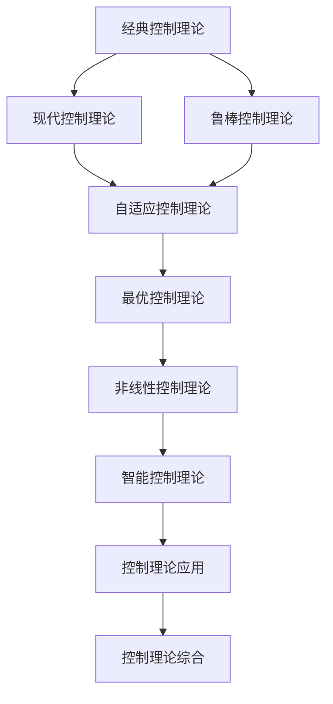

# 控制论理论索引 (Control Theory Index)

## 📋 **目录**

### 1.1 [经典控制理论](051_Classical_Control_Theorymd)

### 1.2 [现代控制理论](052_Modern_Control_Theorymd)

### 1.3 [鲁棒控制理论](053_Robust_Control_Theorymd)

### 1.4 [自适应控制理论](054_Adaptive_Control_Theorymd)

### 1.5 [最优控制理论](055_Optimal_Control_Theorymd)

### 1.6 [非线性控制理论](056_Nonlinear_Control_Theorymd)

### 1.7 [智能控制理论](057_Intelligent_Control_Theorymd)

### 1.8 [控制理论应用](058_Control_Theory_Applicationsmd)

---

## 📋 目录

  - [1.1 [经典控制理论](051_Classical_Control_Theorymd)](#11-经典控制理论051_classical_control_theorymd)
  - [1.2 [现代控制理论](052_Modern_Control_Theorymd)](#12-现代控制理论052_modern_control_theorymd)
  - [1.3 [鲁棒控制理论](053_Robust_Control_Theorymd)](#13-鲁棒控制理论053_robust_control_theorymd)
  - [1.4 [自适应控制理论](054_Adaptive_Control_Theorymd)](#14-自适应控制理论054_adaptive_control_theorymd)
  - [1.5 [最优控制理论](055_Optimal_Control_Theorymd)](#15-最优控制理论055_optimal_control_theorymd)
  - [1.6 [非线性控制理论](056_Nonlinear_Control_Theorymd)](#16-非线性控制理论056_nonlinear_control_theorymd)
  - [1.7 [智能控制理论](057_Intelligent_Control_Theorymd)](#17-智能控制理论057_intelligent_control_theorymd)
  - [1.8 [控制理论应用](058_Control_Theory_Applicationsmd)](#18-控制理论应用058_control_theory_applicationsmd)
- [1 控制论理论概述](#1-控制论理论概述)
  - [1.1 核心特征](#11-核心特征)
  - [1.2 理论层次](#12-理论层次)
- [2 理论关联图](#2-理论关联图)
- [3 详细主题结构](#3-详细主题结构)
  - [3.1 经典控制理论](#31-经典控制理论)
  - [3.2 现代控制理论](#32-现代控制理论)
  - [3.3 鲁棒控制理论](#33-鲁棒控制理论)
  - [3.4 自适应控制理论](#34-自适应控制理论)
  - [3.5 最优控制理论](#35-最优控制理论)
  - [3.6 非线性控制理论](#36-非线性控制理论)
  - [3.7 智能控制理论](#37-智能控制理论)
  - [3.8 控制理论应用](#38-控制理论应用)
- [4 与其他理论的关联](#4-与其他理论的关联)
  - [4.1 向上关联](#41-向上关联)
  - [4.2 向下关联](#42-向下关联)
- [5 学习路径建议](#5-学习路径建议)
  - [5.1 基础路径](#51-基础路径)
  - [5.2 专业路径](#52-专业路径)
- [6 核心概念索引](#6-核心概念索引)
- [7 持续更新](#7-持续更新)
- [8 待完成任务](#8-待完成任务)
- [9 批判性分析](#9-批判性分析)
  - [9.1 多元理论视角](#91-多元理论视角)
  - [9.2 局限性分析](#92-局限性分析)
  - [9.3 争议与分歧](#93-争议与分歧)
  - [9.4 应用前景](#94-应用前景)
  - [9.5 改进建议](#95-改进建议)

---

## 1 控制论理论概述

控制论理论研究系统的动态行为和控制策略，为自动化、机器人、航空航天等领域提供理论基础。它结合了数学、物理和工程学的知识，是形式科学体系的重要组成部分。

### 1.1 核心特征

1. **系统建模**：建立系统的数学模型
2. **稳定性分析**：分析系统的稳定性
3. **控制器设计**：设计有效的控制策略
4. **性能优化**：优化控制性能
5. **鲁棒性保证**：确保控制的鲁棒性

### 1.2 理论层次

```text
┌─────────────────────────────────────────────────────────────┐
│                    控制理论综合 (5.9)                         │
├─────────────────────────────────────────────────────────────┤
│ 应用理论 (5.8) │ 智能控制 (5.7) │ 非线性控制 (5.6) │ 最优控制 (5.5) │
├─────────────────────────────────────────────────────────────┤
│ 自适应控制 (5.4) │ 鲁棒控制 (5.3) │ 现代控制 (5.2) │ 经典控制 (5.1) │
└─────────────────────────────────────────────────────────────┘
```

---

## 2 理论关联图



---

## 3 详细主题结构

### 3.1 经典控制理论

- **5.1.1** [传递函数](05.1_Classical_Control_Theory.md#511-传递函数)
- **5.1.2** [根轨迹法](05.1_Classical_Control_Theory.md#512-根轨迹法)
- **5.1.3** [频域分析](05.1_Classical_Control_Theory.md#513-频域分析)
- **5.1.4** [PID控制器](05.1_Classical_Control_Theory.md#514-pid控制器)

### 3.2 现代控制理论

- **5.2.1** [状态空间模型](05.2_Modern_Control_Theory.md#521-状态空间模型)
- **5.2.2** [可控性与可观性](05.2_Modern_Control_Theory.md#522-可控性与可观性)
- **5.2.3** [极点配置](05.2_Modern_Control_Theory.md#523-极点配置)
- **5.2.4** [状态观测器](05.2_Modern_Control_Theory.md#524-状态观测器)

### 3.3 鲁棒控制理论

- **5.3.1** [不确定性建模](05.3_Robust_Control_Theory.md#531-不确定性建模)
- **5.3.2** [H∞控制](05.3_Robust_Control_Theory.md#532-h∞控制)
- **5.3.3** [μ综合](05.3_Robust_Control_Theory.md#533-μ综合)
- **5.3.4** [鲁棒稳定性](05.3_Robust_Control_Theory.md#534-鲁棒稳定性)

### 3.4 自适应控制理论

- **5.4.1** [参数估计](05.4_Adaptive_Control_Theory.md#541-参数估计)
- **5.4.2** [模型参考自适应控制](05.4_Adaptive_Control_Theory.md#542-模型参考自适应控制)
- **5.4.3** [自校正控制](05.4_Adaptive_Control_Theory.md#543-自校正控制)
- **5.4.4** [稳定性分析](05.4_Adaptive_Control_Theory.md#544-稳定性分析)

### 3.5 最优控制理论

- **5.5.1** [变分法](05.5_Optimal_Control_Theory.md#551-变分法)
- **5.5.2** [极大值原理](05.5_Optimal_Control_Theory.md#552-极大值原理)
- **5.5.3** [动态规划](05.5_Optimal_Control_Theory.md#553-动态规划)
- **5.5.4** [线性二次型调节器](05.5_Optimal_Control_Theory.md#554-线性二次型调节器)

### 3.6 非线性控制理论

- **5.6.1** [非线性系统分析](05.6_Nonlinear_Control_Theory.md#561-非线性系统分析)
- **5.6.2** [反馈线性化](05.6_Nonlinear_Control_Theory.md#562-反馈线性化)
- **5.6.3** [滑模控制](05.6_Nonlinear_Control_Theory.md#563-滑模控制)
- **5.6.4** [Lyapunov稳定性](05.6_Nonlinear_Control_Theory.md#564-lyapunov稳定性)

### 3.7 智能控制理论

- **5.7.1** [模糊控制](05.7_Intelligent_Control_Theory.md#571-模糊控制)
- **5.7.2** [神经网络控制](05.7_Intelligent_Control_Theory.md#572-神经网络控制)
- **5.7.3** [遗传算法控制](05.7_Intelligent_Control_Theory.md#573-遗传算法控制)
- **5.7.4** [专家系统控制](05.7_Intelligent_Control_Theory.md#574-专家系统控制)

### 3.8 控制理论应用

- **5.8.1** [工业过程控制](05.8_Control_Theory_Applications.md#581-工业过程控制)
- **5.8.2** [机器人控制](05.8_Control_Theory_Applications.md#582-机器人控制)
- **5.8.3** [航空航天控制](05.8_Control_Theory_Applications.md#583-航空航天控制)
- **5.8.4** [汽车控制](05.8_Control_Theory_Applications.md#584-汽车控制)

---

## 4 与其他理论的关联

### 4.1 向上关联

- **类型理论**：[04_Type_Theory](../05_Type_Theory/01_Type_Theory_Index.md)
- **数学基础理论**：[02_Mathematical_Foundation](../02_Mathematical_Foundations/01_Mathematical_Foundation_Index.md)

### 4.2 向下关联

- **分布式系统理论**：[06_Distributed_Systems_Theory](../06_Distributed_Systems_Theory/01_Distributed_Systems_Theory_Index.md)
- **时态逻辑理论**：[10_Temporal_Logic_Theory](../10_Temporal_Logic_Theory/01_Temporal_Logic_Theory_Index.md)

---

## 5 学习路径建议

### 5.1 基础路径

1. 经典控制理论 → 现代控制理论 → 鲁棒控制理论
2. 自适应控制理论 → 最优控制理论 → 非线性控制理论
3. 智能控制理论 → 控制理论应用 → 控制理论综合

### 5.2 专业路径

- **工业控制方向**：经典控制 → PID控制 → 工业过程控制
- **机器人方向**：现代控制 → 非线性控制 → 机器人控制
- **航空航天方向**：最优控制 → 鲁棒控制 → 航空航天控制

---

## 6 核心概念索引

| 概念 | 定义位置 | 相关理论 |
|------|----------|----------|
| 传递函数 | [5.1.1](05.1_Classical_Control_Theory.md#511-传递函数) | 经典控制理论 |
| 状态空间 | [5.2.1](05.2_Modern_Control_Theory.md#521-状态空间模型) | 现代控制理论 |
| 鲁棒性 | [5.3.1](05.3_Robust_Control_Theory.md#531-不确定性建模) | 鲁棒控制理论 |
| 自适应 | [5.4.1](05.4_Adaptive_Control_Theory.md#541-参数估计) | 自适应控制理论 |
| 最优控制 | [5.5.1](05.5_Optimal_Control_Theory.md#551-变分法) | 最优控制理论 |
| 非线性 | [5.6.1](05.6_Nonlinear_Control_Theory.md#561-非线性系统分析) | 非线性控制理论 |
| 智能控制 | [5.7.1](05.7_Intelligent_Control_Theory.md#571-模糊控制) | 智能控制理论 |
| 过程控制 | [5.8.1](05.8_Control_Theory_Applications.md#581-工业过程控制) | 控制理论应用 |

---

## 7 持续更新

**最后更新时间**：2024-12-20
**版本**：v1.0.0
**维护者**：控制论理论重构团队

---

## 8 待完成任务

- [ ] 创建所有子主题的详细文档
- [ ] 建立控制概念间的交叉引用系统
- [ ] 完善数学推导和算法
- [ ] 构建控制理论与工程实践的桥梁

## 9 批判性分析

### 9.1 多元理论视角

**层次化视角**：索引按“经典→现代→鲁棒/自适应→最优/非线性→智能→应用”递进，利于学习路径清晰；但跨范式交叉关系仍需强化标注。

**工程视角**：应突出约束、实现与验证在各分支中的角色，减少“理论孤岛”。

**关联视角**：与分布式/时态逻辑/软件工程等相邻模块的桥接有助于系统化实践。

### 9.2 局限性分析

**链接一致性**：命名、锚点与路径需长期维护，易产生断链与重复。

**更新滞后**：索引对新增分支与交叉主题的反映可能滞后于内容更新。

**度量缺失**：缺乏对每篇文档成熟度、示例完备度与验证程度的标注。

### 9.3 争议与分歧

**学科划分**：鲁棒/最优/自适应/非线性的先后与从属关系存在不同观点。

**学习路径**：按数学难度、工程应用、或行业场景组织的优先级选择各异。

### 9.4 应用前景

**教学导航**：面向课程/培训的结构化路线图与“最小可行组合”推荐。

**工程入口**：结合行业模板（过程/机器人/航天）提供落地最短路径。

### 9.5 改进建议

**健康度标注**：为每篇子文档标注“覆盖/示例/验证/状态”四象限健康度。

**交叉索引增强**：增加到相邻学科与工具链的标准化交叉链接与示例集合。

**自动化检查**：引入脚本定期校验链接、锚点与目录一致性，生成修复建议。
