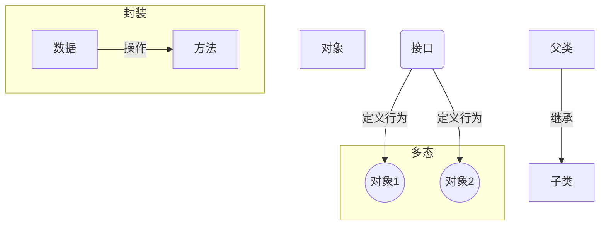

# 08.3.1 命令式与面向对象编程 (Imperative and Object-Oriented)

## 目录

- [08.3.1 命令式与面向对象编程 (Imperative and Object-Oriented)](#0831-命令式与面向对象编程-imperative-and-object-oriented)
  - [1 . 定义与背景](#1-定义与背景)
  - [2 . 批判性分析](#2-批判性分析)
  - [3 . 核心概念](#3-核心概念)
  - [4 . 形式化表达](#4-形式化表达)
  - [5 . 交叉引用](#5-交叉引用)
  - [6 . 参考文献](#6-参考文献)
  - [7 批判性分析](#7-批判性分析)
  - [批判性分析](#批判性分析)

---

## 1. 定义与背景

**命令式编程 (Imperative Programming)** 是一种以描述改变程序状态的命令（语句）来构建程序的范式。程序的核心是"如何做"，通过一系列指令来修改状态，最终达到期望的结果。

**面向对象编程 (Object-Oriented Programming, OOP)** 可以看作是命令式编程的一种特例和演进。它将**状态（数据）**和**操作该状态的命令（方法）**封装在称为"对象"的单元中。

---

## 2. 批判性分析

- **优点**:
  - **命令式**: 模型与底层冯·诺依曼计算机体系结构紧密对应，效率高，易于理解。
  - **OOP**: 通过封装、继承和多态，极大地提高了代码的可重用性、可维护性和对复杂系统的建模能力。
- **缺点**:
  - **命令式**: 可变状态（Mutable State）是万恶之源，使得并发编程和程序推理变得极其困难。
  - **OOP**: 继承可能破坏封装性（脆弱的基类问题）；不恰当的抽象可能导致过度工程。

---

## 3. 核心概念

- **命令式编程**:
  - **变量 (Variables)**: 具名的内存位置。
  - **赋值 (Assignment)**: 修改变量的值。
  - **控制流 (Control Flow)**: `if-then-else`, `for/while` 循环, `goto`。
- **面向对象编程**:
  - **封装 (Encapsulation)**: 将数据和操作数据的代码捆绑在一起，并对外部隐藏实现细节。
  - **继承 (Inheritance)**: 允许一个类（子类）获取另一个类（父类）的属性和方法。
  - **多态 (Polymorphism)**: 允许不同类的对象对同一消息做出响应。最常见的是基于子类型的多态。
  - **抽象 (Abstraction)**: 关注对象的本质特征，忽略不重要的细节。

---

## 4. 形式化表达

**OOP 概念关系**:

---

## 5. 交叉引用

- [编程范式总览](README.md)
- [函数式编程](08.3.2_Functional_Programming.md)
- [设计模式](README.md)

---

## 6. 参考文献

1. Dahl, Ole-Johan, and Nygaard, Kristen. "Class and subclass declarations." *IFIP Working Conference on Simulation Languages*, 1967. (Simula, 第一个OOP语言)
2. Gamma, Erich, et al. *Design Patterns: Elements of Reusable Object-Oriented Software*. 1994.

## 批判性分析

- 本节内容待补充：请从多元理论视角、局限性、争议点、应用前景等方面进行批判性分析。
