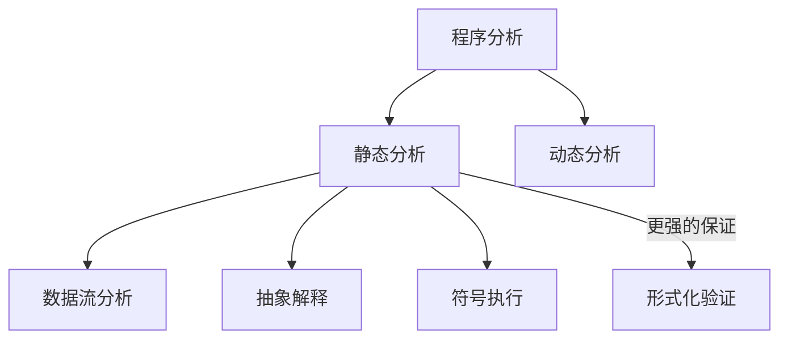

# 08.5.3 程序分析与验证 (Program Analysis and Verification)

## 目录

- [08.5.3 程序分析与验证 (Program Analysis and Verification)](#0853-程序分析与验证-program-analysis-and-verification)
  - [1 . 定义与背景](#1-定义与背景)
  - [2 . 批判性分析](#2-批判性分析)
  - [3 . 核心技术](#3-核心技术)
  - [4 . 形式化表达](#4-形式化表达)
  - [5 . 交叉引用](#5-交叉引用)
  - [6 . 参考文献](#6-参考文献)
  - [7 批判性分析](#7-批判性分析)
  - [批判性分析](#批判性分析)

---

## 1. 定义与背景

**程序分析**是自动地、系统性地分析程序行为和属性的过程。**程序验证**是程序分析的一个子领域，其目标是**证明**或**反驳**程序是否满足某个给定的规范。

这些技术是现代软件开发工具（如编译器、静态分析器、IDE）和软件质量保证活动的核心。

---

## 2. 批判性分析

- **静态 vs. 动态**:
  - **静态分析**: 在不执行程序的情况下，对源代码或中间代码进行分析。
  - **动态分析**: 通过在受控环境中执行程序并观察其行为来进行分析。
- **可靠性 vs. 精确性 (Soundness vs. Precision)**:
  - **可靠的 (Sound)** 分析不会漏掉任何潜在的错误（没有假阴性），但可能会报告一些实际上不会发生的错误（假阳性）。
  - **精确的 (Precise)** 分析尽可能减少假阳性的数量。
  - **莱斯定理 (Rice's Theorem)** 表明，对于程序的所有非平凡的语义属性，都不存在一个能对所有程序都终止的、可靠且精确的分析算法。因此，所有实用的分析工具都在这两者之间进行权衡。

---

## 3. 核心技术

- **数据流分析 (Data-Flow Analysis)**:
  - **描述**: 一系列用于收集程序中数据如何流动的信息的技术。
  - **示例**:
    - **可达定义分析 (Reaching Definitions Analysis)**: 对于程序中的每个点，哪些变量的赋值可以"到达"这个点。
    - **活性变量分析 (Live-Variable Analysis)**: 对于程序中的每个点，哪些变量的值在未来可能会被使用。
- **符号执行 (Symbolic Execution)**:
  - **描述**: 一种使用符号值（而非具体值）来执行程序的分析技术。它探索程序的多条路径，并为每条路径生成一个路径条件。通过约束求解器来检查路径的可行性。
- **抽象解释 (Abstract Interpretation)**:
  - **描述**: 一种程序分析的通用理论，它通过在抽象域（而非具体值域）上安全地近似程序语义来推导程序的不变量。
- **形式化验证 (Formal Verification)**:
  - **描述**: 应用数学方法来证明程序的正确性。
  - **技术**: 模型检测、定理证明。（详见形式化方法章节）

---

## 4. 形式化表达

**静态分析、动态分析与形式化验证的关系**:

形式化验证可以被看作是静态分析中追求最强保证的一个分支。

---

## 5. 交叉引用

- [高级主题总览](README.md)
- [形式化方法](README.md)
- [类型系统](README.md)

---

## 6. 参考文献

1. Nielson, Flemming, Nielson, Hanne R., and Hankin, Chris. *Principles of Program Analysis*. 2005.
2. Cadar, Cristian, and Sen, Koushik. "Symbolic execution for software testing: three decades later." *Communications of the ACM*, 2013.

## 批判性分析

- 本节内容待补充：请从多元理论视角、局限性、争议点、应用前景等方面进行批判性分析。
