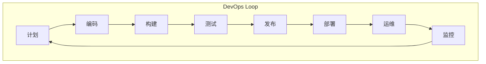

# 07.2.3 DevOps

## 目录

- [07.2.3 DevOps](#0723-devops)
  - [1 . 定义与背景](#1-定义与背景)
  - [2 . 批判性分析](#2-批判性分析)
  - [3 . 核心理念 (CALMS)](#3-核心理念-calms)
  - [4 . 形式化表达](#4-形式化表达)
  - [5 . 交叉引用](#5-交叉引用)
  - [6 . 参考文献](#6-参考文献)
  - [7 批判性分析](#7-批判性分析)
  - [批判性分析](#批判性分析)

---

## 1. 定义与背景

**DevOps** 是一种文化、理念和实践的集合，旨在打破软件开发（Dev）和IT运维（Ops）之间的壁垒，通过自动化和协作，实现更快、更可靠的软件交付。它不是一个孤立的工具或流程，而是对整个软件交付生命周期的思维方式的转变。

---

## 2. 批判性分析

- **优点**: 加快软件交付速度；提高系统的可靠性和稳定性；促进团队协作和沟通。
- **缺点**: 需要深度的文化变革，组织惯性是最大的阻力；对自动化工具链的依赖性高；可能会模糊角色职责，对工程师的技能要求更高（T型人才）。

---

## 3. 核心理念 (CALMS)

DevOps的理念可以概括为CALMS框架：

- **文化 (Culture)**: 打破孤岛，鼓励共享责任、协作和透明。
- **自动化 (Automation)**: 将构建、测试、部署等一切可自动化的环节自动化，减少人为错误。
- **精益 (Lean)**: 应用精益思想，关注价值流动，消除浪费，持续改进。
- **度量 (Measurement)**: 通过度量和监控来驱动决策，从构建时间到用户行为都要度量。
- **共享 (Sharing)**: 鼓励在团队内部和团队之间共享知识、工具和经验。

---

## 4. 形式化表达

**DevOps 无限循环**:

- **开发 (Dev)**: Plan -> Code -> Build -> Test
- **运维 (Ops)**: Release -> Deploy -> Operate -> Monitor

---

## 5. 交叉引用

- [软件开发方法论总览](README.md)
- [敏捷与Scrum](07.2.1_Agile_and_Scrum.md)
- [持续集成与持续部署 (CI/CD)](07.2.4_CI_CD.md)

---

## 6. 参考文献

1. Kim, Gene, et al. *The Phoenix Project: A Novel About IT, DevOps, and Helping Your Business Win*. 2013.
2. Humble, Jez, and Farley, David. *Continuous Delivery: Reliable Software Releases through Build, Test, and Deployment Automation*. 2010.

## 批判性分析

- 本节内容待补充：请从多元理论视角、局限性、争议点、应用前景等方面进行批判性分析。
