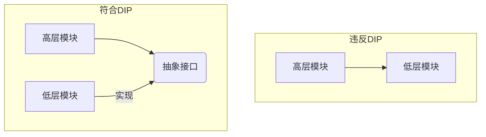

# 07.3.1 架构设计原则 (Architectural Principles)

## 目录

- [07.3.1 架构设计原则 (Architectural Principles)](#0731-架构设计原则-architectural-principles)
  - [目录](#目录)
  - [1. 定义与背景](#1-定义与背景)
  - [2. 批判性分析](#2-批判性分析)
  - [3. 核心原则](#3-核心原则)
  - [4. 形式化表达](#4-形式化表达)
  - [5. 交叉引用](#5-交叉引用)
  - [6. 参考文献](#6-参考文献)
  - [批判性分析](#批判性分析)

---

## 1. 定义与背景

架构设计原则是指导架构师和开发人员做出决策的一系列基本准则和最佳实践。它们旨在解决软件设计中的常见问题，如耦合、内聚、复杂性管理等，从而提高系统的质量属性（如可维护性、可扩展性）。

---

## 2. 批判性分析

- **优点**: 为设计决策提供了坚实的理论基础；促进了团队成员之间的共同语言；有助于构建长期健康和可持续的系统。
- **缺点**: 原则本身是抽象的，需要根据具体上下文进行解释和应用；过度或不恰当地应用原则可能导致过度工程。

---

## 3. 核心原则

- **SOLID 原则**:
  - **S - 单一职责原则 (Single Responsibility Principle)**: 一个类或模块应该只有一个变更的理由。
  - **O - 开放/封闭原则 (Open/Closed Principle)**: 软件实体（类、模块、函数等）应该对扩展开放，对修改封闭。
  - **L - 里氏替换原则 (Liskov Substitution Principle)**: 子类型必须能够替换掉它们的基类型。
  - **I - 接口隔离原则 (Interface Segregation Principle)**: 客户端不应该被强迫依赖于它们不使用的方法。
  - **D - 依赖倒置原则 (Dependency Inversion Principle)**: 高层模块不应该依赖于低层模块，两者都应该依赖于抽象；抽象不应该依赖于细节，细节应该依赖于抽象。
- **DRY (Don't Repeat Yourself)**: 系统中的每一部分知识都必须有一个单一的、明确的、权威的表示。
- **KISS (Keep It Simple, Stupid)**: 系统的设计和实现应尽可能地简单，避免不必要的复杂性。
- **YAGNI (You Ain't Gonna Need It)**: 只在真正需要的时候才添加功能，避免过度设计和过早优化。
- **关注点分离 (Separation of Concerns, SoC)**: 将一个复杂的系统分解成不同的、独立的关注点。

---

## 4. 形式化表达

**依赖倒置原则 (DIP) 图示**:

DIP通过引入抽象层，解耦了高层和低层模块，使得高层模块不依赖于低层模块的具体实现。

---

## 5. 交叉引用

- [软件架构与设计总览](README.md)
- [设计模式](README.md)
- [架构模式](07.3.2_Architectural_Patterns.md)

---

## 6. 参考文献

1. Martin, Robert C. _Agile Software Development, Principles, Patterns, and Practices_. 2002.
2. Hunt, Andrew, and Thomas, David. _The Pragmatic Programmer: From Journeyman to Master_. 1999.

## 批判性分析

- 本节内容待补充：请从多元理论视角、局限性、争议点、应用前景等方面进行批判性分析。
