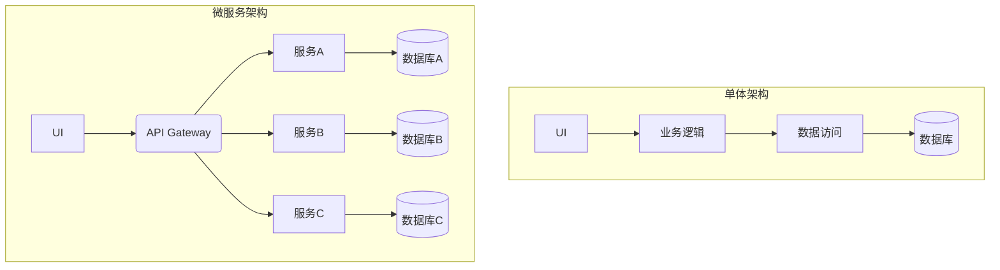

# 07.3.2 架构模式 (Architectural Patterns)

## 目录

- [07.3.2 架构模式 (Architectural Patterns)](#0732-架构模式-architectural-patterns)
  - [1 . 定义与背景](#1-定义与背景)
  - [2 . 批判性分析](#2-批判性分析)
  - [3 . 核心模式](#3-核心模式)
  - [4 . 形式化表达](#4-形式化表达)
  - [5 . 交叉引用](#5-交叉引用)
  - [6 . 参考文献](#6-参考文献)
  - [7 批判性分析](#7-批判性分析)
  - [批判性分析](#批判性分析)

---

## 1. 定义与背景

架构模式是针对特定上下文中常见软件架构问题的一种通用的、可复用的解决方案。它描述了系统的高层组织结构，定义了子系统、组件的职责，以及它们之间的关系和交互规则。

---

## 2. 批判性分析

- **优点**: 提供了一套经过验证的、可靠的解决方案；促进了架构师之间的沟通；为系统设计提供了起点。
- **缺点**: 没有银弹，每个模式都有其适用的上下文和优缺点；错误地应用模式可能导致不必要的复杂性或性能问题。

---

## 3. 核心模式

- **分层架构 (Layered Architecture)**:
  - **描述**: 将系统组织成一系列层次，每个层次为上层提供服务，并使用下层的服务。常见的如四层架构（表现层、业务逻辑层、数据访问层、数据存储层）。
  - **优点**: 关注点分离，易于理解和维护。
- **微服务架构 (Microservices Architecture)**:
  - **描述**: 将单个应用程序开发为一套小服务的集合，每个服务运行在自己的进程中，并通过轻量级机制（通常是HTTP API）进行通信。
  - **优点**: 技术异构性、弹性、可扩展性、易于部署。
- **单体架构 (Monolithic Architecture)**:
  - **描述**: 传统的、将所有功能都构建在单个、统一的单元中的架构。
  - **优点**: 开发简单，易于测试和部署（在早期）。
- **事件驱动架构 (Event-Driven Architecture)**:
  - **描述**: 系统组件之间通过生产和消费异步的事件来进行通信。
  - **优点**: 松耦合，高可伸缩性。
- **客户端-服务器架构 (Client-Server Architecture)**:
  - **描述**: 将系统分为提供服务的服务器和请求服务的客户端。
- **模型-视图-控制器 (Model-View-Controller, MVC)**:
  - **描述**: 一种将应用程序分为三个互联部分的架构模式：模型（数据和业务逻辑）、视图（用户界面）和控制器（处理用户输入）。

---

## 4. 形式化表达

**单体 vs. 微服务**:

---

## 5. 交叉引用

- [软件架构与设计总览](README.md)
- [架构设计原则](07.3.1_Architectural_Principles.md)
- [分布式系统理论](README.md)

---

## 6. 参考文献

1. Buschmann, Frank, et al. *Pattern-Oriented Software Architecture, Volume 1: A System of Patterns*. 1996.
2. Newman, Sam. *Building Microservices: Designing Fine-Grained Systems*. 2015.

## 批判性分析

- 本节内容待补充：请从多元理论视角、局限性、争议点、应用前景等方面进行批判性分析。
