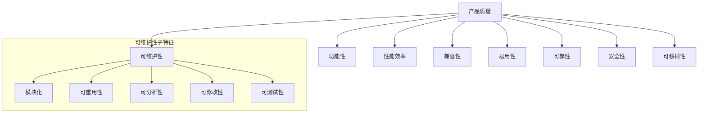

# 07.5.1 软件质量模型 (Software Quality Models)

## 目录

- [07.5.1 软件质量模型 (Software Quality Models)](#0751-软件质量模型-software-quality-models)
  - [1 . 定义与背景](#1-定义与背景)
  - [2 . 批判性分析](#2-批判性分析)
  - [3 . 核心模型](#3-核心模型)
  - [4 . 形式化表达](#4-形式化表达)
  - [5 . 交叉引用](#5-交叉引用)
  - [6 . 参考文献](#6-参考文献)
  - [7 批判性分析](#7-批判性分析)

---

## 1. 定义与背景

软件质量模型提供了一个框架，用于定义和评估软件产品的质量。这些模型将抽象的"质量"概念分解为一系列具体的、可度量的特征和子特征，从而为质量保证活动提供了共同的语言和目标。

---

## 2. 批判性分析

- **优点**: 为质量评估提供了系统性的、结构化的方法；有助于在项目相关方之间就质量目标达成共识。
- **缺点**: 模型本身是通用的，需要针对具体项目进行裁剪；某些质量属性（如"易用性"）难以进行客观、量化的度量。

---

## 3. 核心模型

- **McCall's 质量模型 (1977)**:
  - **描述**: 最早的质量模型之一，将质量分为三个主要方面：产品操作（Product Operation）、产品修正（Product Revision）和产品转移（Product Transition）。
- **Boehm 质量模型 (1978)**:
  - **描述**: 与McCall模型类似，但层次更分明，强调了硬件无关性、完整性和人类工程学。
- **ISO/IEC 9126 (后被 ISO/IEC 25010 取代)**:
  - **描述**: 一个国际标准的软件质量模型，定义了六大质量特性：
        1. **功能性 (Functionality)**
        2. **可靠性 (Reliability)**
        3. **易用性 (Usability)**
        4. **效率 (Efficiency)**
        5. **可维护性 (Maintainability)**
        6. **可移植性 (Portability)**
  - 它还定义了使用质量（Quality in Use）模型。
- **ISO/IEC 25010:2011 (SQuaRE)**:
  - **描述**: ISO 9126的演进版本，在原有基础上增加了"安全性 (Security)"和"兼容性 (Compatibility)"作为顶级质量特征。

---

## 4. 形式化表达

**ISO/IEC 25010 产品质量模型**:

---

## 5. 交叉引用

- [软件质量与测试总览](README.md)
- [测试理论与层级](07.5.2_Testing_Theory_and_Levels.md)
- [代码质量与度量](07.5.3_Code_Quality_and_Metrics.md)

---

## 6. 参考文献

1. McCall, J. A., Richards, P. K., & Walters, G. F. *Factors in software quality*. 1977.
2. International Organization for Standardization. *ISO/IEC 25010:2011 Systems and software engineering — Systems and software Quality Requirements and Evaluation (SQuaRE) — System and software quality models*. 2011.

## 批判性分析

- 本节内容待补充：请从多元理论视角、局限性、争议点、应用前景等方面进行批判性分析。
