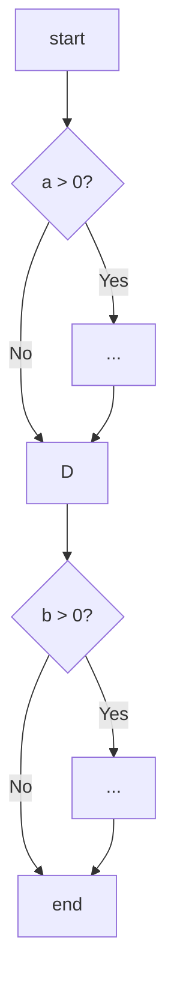

# 07.5.3 代码质量与度量 (Code Quality and Metrics)

## 目录

- [07.5.3 代码质量与度量 (Code Quality and Metrics)](#0753-代码质量与度量-code-quality-and-metrics)
  - [目录](#目录)
  - [1. 定义与背景](#1-定义与背景)
  - [2. 批判性分析](#2-批判性分析)
  - [3. 核心度量指标](#3-核心度量指标)
  - [4. 形式化表达](#4-形式化表达)
  - [5. 交叉引用](#5-交叉引用)
  - [6. 参考文献](#6-参考文献)
  - [批判性分析](#批判性分析)

---

## 1. 定义与背景

代码质量是软件质量的基石，它描述了代码的健康状况、可维护性和可理解性。代码质量度量（Code Metrics）是用于量化评估代码质量的一系列指标，旨在将主观的"好代码"概念转变为客观的数据。

---

## 2. 批判性分析

- **优点**: 提供客观数据来识别潜在问题区域（技术债务）；跟踪代码库随时间变化的趋势；帮助设定改进目标。
- **缺点**: **没有单一指标能完全定义代码质量**。过度关注或误用指标可能导致不良行为（如为了降低圈复杂度而拆分出不必要的函数）。指标应作为参考，而非绝对标准。

---

## 3. 核心度量指标

- **圈复杂度 (Cyclomatic Complexity)**:
  - **描述**: 由Thomas J. McCabe, Sr.在1976年提出，用于衡量一个程序独立路径的数量。通常，圈复杂度越高，代码越难理解和测试。
  - **计算**: $M = E - N + 2P$，其中E是图中边的数量，N是节点数量，P是连通分量数量。
- **代码行数 (Lines of Code, LOC)**:
  - **描述**: 最简单但也是最容易被误用的指标。可以作为模块规模的一个粗略估计。
- **代码覆盖率 (Code Coverage)**:
  - **描述**: 在测试执行期间，有多少比例的代码被执行过。它是衡量测试完备性的一个指标，但**100%覆盖率不等于没有bug**。
- **内聚与耦合 (Cohesion and Coupling)**:
  - **内聚 (Cohesion)**: 衡量一个模块内部各元素之间相关联的程度。**高内聚**是期望的。
  - **耦合 (Coupling)**: 衡量模块之间相互依赖的程度。**低耦合**是期望的。
- **技术债务 (Technical Debt)**:
  - **描述**: 隐喻，指开发团队为追求短期目标而选择的非最优（但权宜）的解决方案，这些方案在未来需要付出额外的成本（利息）来修复。

---

## 4. 形式化表达

**圈复杂度示例**:

```java
// 圈复杂度为 3
void process(int a, int b) {
    if (a > 0) { // +1
        // ...
    }
    if (b > 0) { // +1
        // ...
    }
}
```



此图中有7个节点，8条边，所以圈复杂度 M = 8 - 7 + 2 = 3。

---

## 5. 交叉引用

- [软件质量与测试总览](README.md)
- [软件质量模型](07.5.1_Software_Quality_Models.md)
- [测试理论与层级](07.5.2_Testing_Theory_and_Levels.md)

---

## 6. 参考文献

1. McCabe, Thomas J. "A Complexity Measure." _IEEE Transactions on Software Engineering_, 1976.
2. Fowler, Martin. "TechnicalDebt." 2009.


## 批判性分析

- 本节内容待补充：请从多元理论视角、局限性、争议点、应用前景等方面进行批判性分析。
