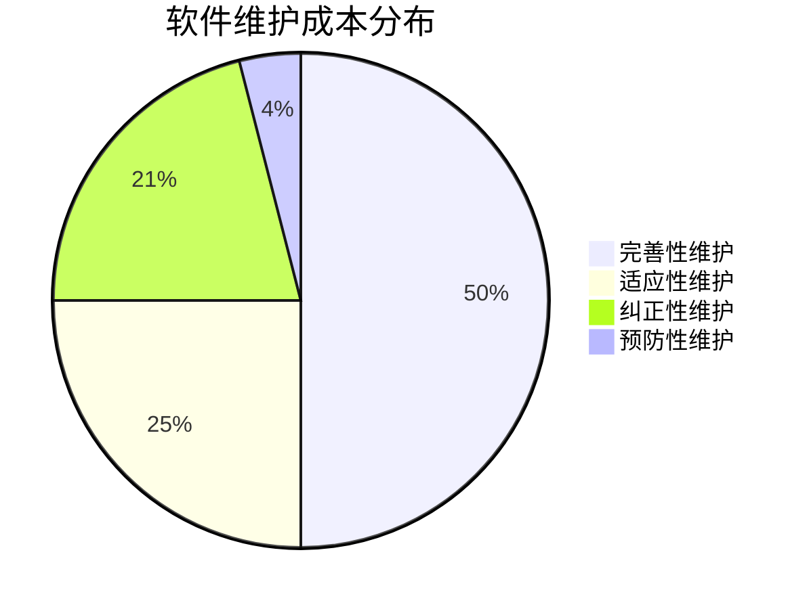

# 07.6.1 软件维护模型 (Maintenance Models)

## 目录

- [07.6.1 软件维护模型 (Maintenance Models)](#0761-软件维护模型-maintenance-models)
  - [目录](#目录)
  - [1. 定义与背景](#1-定义与背景)
  - [2. 批判性分析](#2-批判性分析)
    - [多元理论视角](#多元理论视角)
    - [局限性](#局限性)
    - [争议与分歧](#争议与分歧)
    - [应用前景](#应用前景)
    - [改进建议](#改进建议)
  - [3. 维护的类型](#3-维护的类型)
  - [4. 形式化表达](#4-形式化表达)
  - [5. 交叉引用](#5-交叉引用)
  - [6. 参考文献](#6-参考文献)

---

## 1. 定义与背景

软件维护是指在软件产品交付后，为修正错误、改进性能或其他属性、或使产品适应变化的环境而进行的修改活动。长期来看，维护成本往往是软件总成本中最大的部分。

---

## 2. 批判性分析

### 多元理论视角

- 工程视角：软件维护模型为软件工程提供系统化的维护方法论。
- 管理视角：维护模型涉及资源分配、优先级管理和成本控制。
- 质量视角：维护模型通过规范化流程提高软件质量。
- 生命周期视角：维护是软件生命周期的重要组成部分。

### 局限性

- 模型简化：维护模型往往过度简化复杂的维护现实。
- 成本估算：维护成本的准确估算困难。
- 质量度量：维护质量的客观度量标准缺乏。
- 适用性限制：不同模型适用于不同类型的软件项目。

### 争议与分歧

- 维护优先级：不同类型维护的优先级排序。
- 成本分配：维护成本在不同项目间的分配方法。
- 质量评估：维护质量评估的标准和权重。
- 自动化程度：多大程度上依赖自动化维护工具。

### 应用前景

- 企业级系统：大型企业软件的维护管理。
- 遗留系统：遗留系统的现代化维护。
- 云原生应用：云环境下的持续维护。
- 开源项目：开源软件的社区维护模式。

### 改进建议

- 发展更精确的维护成本估算模型。
- 建立维护质量评估和监控体系。
- 推进维护最佳实践和标准化。
- 加强维护管理的工具支持。

---

## 3. 维护的类型

根据 **ISO/IEC 14764** 标准，软件维护可以分为四类：

- **纠正性维护 (Corrective Maintenance)**:
  - **描述**: 响应和修复用户报告的、在软件中发现的错误和缺陷。这是最传统的"bug修复"。
- **适应性维护 (Adaptive Maintenance)**:
  - **描述**: 修改软件以使其能在变化的或新的环境中（如新的操作系统、硬件或法规）继续使用。
- **完善性维护 (Perfective Maintenance)**:
  - **描述**: 根据用户的新需求，对软件进行修改以增加新功能或提升性能、可维护性等。这是最大的一部分维护活动。
- **预防性维护 (Preventive Maintenance)**:
  - **描述**: 为提高软件未来的可维护性或可靠性，在问题发生前提前主动对软件进行修改，如代码重构、更新文档。

---

## 4. 形式化表达

**软件维护类型分布 (典型)**:

---

## 5. 交叉引用

- [软件维护与演化总览](README.md)
- [重构](07.6.2_Refactoring.md)
- [Lehman's Laws of Software Evolution](./TODO.md)

---

## 6. 参考文献

1. Lientz, B. P., & Swanson, E. B. _Software maintenance management_. 1980.
2. Lehman, M. M. "Programs, life cycles, and laws of software evolution." _Proceedings of the IEEE_, 1980.
3. International Organization for Standardization. _ISO/IEC 14764:2006 Software Engineering — Software Life Cycle Processes — Maintenance_. 2006.
