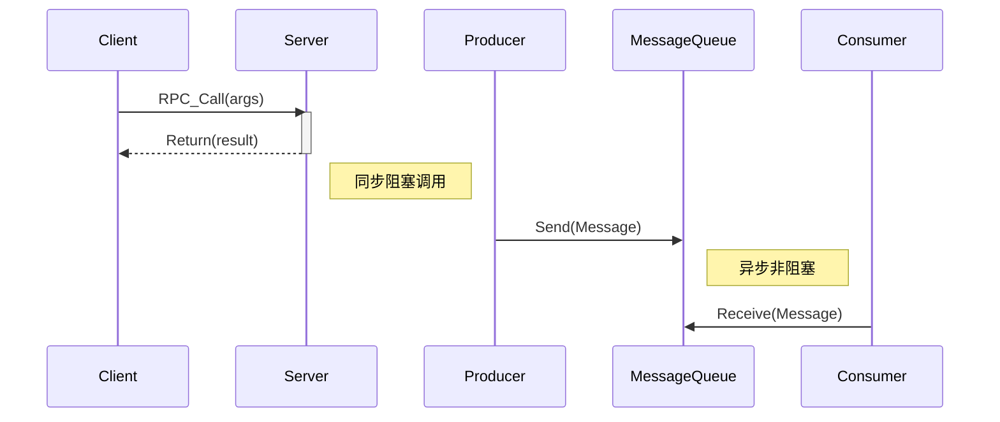

# 06.2 分布式通信 (Distributed Communication)

## 目录

- [06.2 分布式通信 (Distributed Communication)](#062-分布式通信-distributed-communication)
  - [目录](#目录)
  - [1. 定义与背景](#1-定义与背景)
  - [2. 批判性分析](#2-批判性分析)
  - [3. 核心通信模式](#3-核心通信模式)
  - [4. 形式化表达](#4-形式化表达)
  - [5. 交叉引用](#5-交叉引用)
  - [6. 参考文献](#6-参考文献)
  - [批判性分析](#批判性分析)

---

## 1. 定义与背景

分布式通信是分布式系统的血脉，它定义了系统中分离的组件如何交换信息。与单机内的函数调用不同，分布式通信必须处理网络延迟、不可靠性和异构性等问题。

---

## 2. 批判性分析

### 多元理论视角

- 网络视角：分布式通信基于网络理论，处理延迟、丢包、乱序等网络问题。
- 系统视角：通信模式影响系统架构，从紧耦合到松耦合的不同设计选择。
- 协议视角：从RPC到消息队列，不同通信协议为分布式系统提供不同的抽象层次。
- 工程视角：通信设计需要在性能、可靠性和复杂性之间找到平衡。

### 局限性

- 真实网络中的抖动、重排、丢包、路径非对称使协议假设经常失效。
- 安全与合规（认证、加密、审计）引入额外时延与复杂性。
- 网络分区和延迟导致系统行为不可预测。
- 跨地域通信面临带宽和延迟限制。

### 争议与分歧

- 一体化服务网格vs轻量直连，哪种更适合现代分布式系统。
- 端到端语义保证应由基础设施还是业务协议承担。
- 同步vs异步通信，哪种更适合特定应用场景。
- 集中式vs去中心化通信架构的优劣之争。

### 应用前景

- 大规模微服务：微服务架构中的服务间通信。
- 数据管道：大数据处理中的数据传输。
- 边缘计算：边缘与物联网的低功耗长时延通信。
- 云原生：云环境下的分布式通信基础设施。

### 改进建议

- 以SLO驱动的通信语义选择与自适应QoS。
- 加强因果追踪与流控可视化，辅助定位尾延迟根因。
- 推广零拷贝、批量与压缩等传输优化。
- 发展智能路由和负载均衡技术。

---

## 3. 核心通信模式

- **远程过程调用 (Remote Procedure Call, RPC)**:
  - **描述**: 使客户端能够像调用本地函数一样调用远程服务器上的过程。它隐藏了底层的网络通信细节。
  - **优点**: 简单，符合程序员的直觉。
  - **缺点**: 同步阻塞可能导致性能问题；紧耦合。
  - **代表技术**: gRPC, Apache Thrift.
- **消息队列 (Message Queuing, MQ)**:
  - **描述**: 基于异步消息传递的中间件。发送者将消息放入队列，接收者在方便时取出处理。
  - **优点**: 解耦、异步、削峰填谷。
  - **缺点**: 增加了系统复杂度和延迟。
  - **代表技术**: RabbitMQ, Apache Kafka.
- **发布/订阅 (Publish/Subscribe)**:
  - **描述**: 消息队列的一种变体，发布者将消息发送到特定主题（Topic），多个订阅者可以订阅该主题以接收消息。
  - **优点**: 实现了发送者和接收者在时间、空间和同步性上的完全解耦。
- **组通信 (Group Communication)**:
  - **描述**: 消息被发送到进程组，组中的所有成员都会收到该消息。常用于实现容错和复制。
  - **核心属性**: 原子性（消息要么所有成员都收到，要么都没有）和有序性（所有成员以相同顺序接收消息）。

---

## 4. 形式化表达

**RPC vs MQ 模型**:

---

## 5. 交叉引用

- [分布式系统总览](README.md)
- [共识与协作](06.3_Consensus_and_Coordination.md)
- [计算机网络理论](README.md)

---

## 6. 参考文献

1. Birman, Kenneth P. *Guide to Reliable Distributed Systems*. 2012.
2. Tanenbaum, Andrew S., and Van Steen, Maarten. *Distributed Systems*. 2017.

## 批判性分析

- 本节内容待补充：请从多元理论视角、局限性、争议点、应用前景等方面进行批判性分析。
