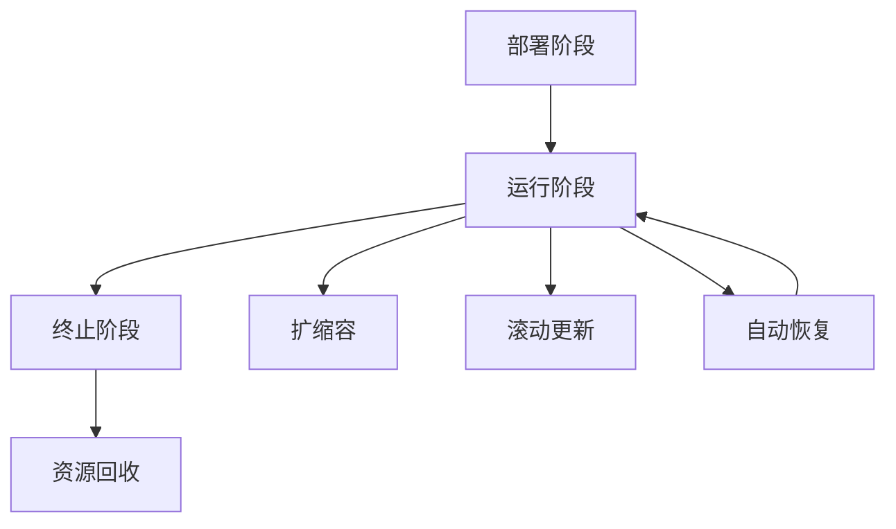

# 10.2.2 Kubernetes 工作流编排原理

## 目录

- [10.2.2 Kubernetes 工作流编排原理](#1022-kubernetes-工作流编排原理)
  - [1 . 声明式API与工作流编排](#1-声明式api与工作流编排)
  - [2 . 控制循环与状态转换](#2-控制循环与状态转换)
  - [3 . 编排生命周期与Operator模式](#3-编排生命周期与operator模式)
  - [4 . 形式化描述](#4-形式化描述)
  - [4 生命周期有向图（Mermaid）](#4-生命周期有向图mermaid)
  - [5 . 交叉引用与本地跳转](#5-交叉引用与本地跳转)
  - [6 批判性分析](#6-批判性分析)
  - [批判性分析](#批判性分析)

---

## 1. 声明式API与工作流编排

Kubernetes 用户声明期望状态，控制器自动实现状态收敛。YAML资源定义→API Server→控制器监听→自动调整。

## 2. 控制循环与状态转换

Observe-Diff-Act循环：

- 观察（Observe）：监控当前状态
- 比较（Diff）：与期望状态对比
- 行动（Act）：采取措施收敛

## 3. 编排生命周期与Operator模式

- 部署、运行、终止阶段全生命周期管理
- Operator模式：自定义资源+自定义控制器，实现复杂应用自动化

## 4. 形式化描述

- 形式化：S为当前状态，S*为期望状态，C为控制器，C: S→S*，循环直到S≈S*
- 生命周期可建模为有向图G=(V,E)，V为状态，E为转换

## 4.1 生命周期有向图（Mermaid）

## 5. 交叉引用与本地跳转

- [Kubernetes架构与核心理论](10.2.1_Kubernetes_Architecture.md)
- [Kubernetes Rust 代码实现](10.2.3_Kubernetes_Rust_Examples.md)
- [Kubernetes与Docker关系](10.2.4_Kubernetes_Docker_Relationship.md)

## 批判性分析

- 本节内容待补充：请从多元理论视角、局限性、争议点、应用前景等方面进行批判性分析。
