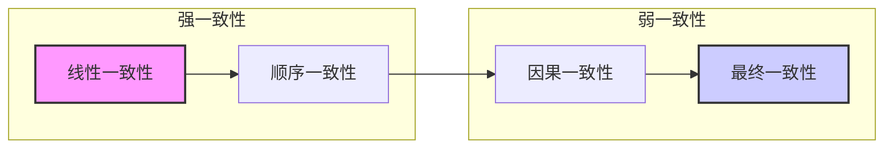

# 06.4 复制与一致性 (Replication and Consistency)

## 目录

- [06.4 复制与一致性 (Replication and Consistency)](#064-复制与一致性-replication-and-consistency)
  - [目录](#目录)
  - [1. 定义与背景](#1-定义与背景)
  - [2. 批判性分析](#2-批判性分析)
  - [3. 核心概念](#3-核心概念)
  - [4. 形式化表达](#4-形式化表达)
  - [5. 交叉引用](#5-交叉引用)
  - [6. 参考文献](#6-参考文献)
  - [批判性分析](#批判性分析)

---

## 1. 定义与背景

为了提高可用性和性能，分布式系统通常会将数据和服务复制到多个节点上（**复制**）。然而，这引入了一个核心挑战：如何维护这些副本之间的数据一致性（**一致性**）。一致性模型定义了系统对客户端读写操作的顺序和可见性所做的保证。

---

## 2. 批判性分析

### 多元理论视角

- 系统视角：复制与一致性为分布式系统提供可靠性保障，平衡可用性与一致性。
- 算法视角：从强一致性到弱一致性，不同一致性模型为分布式计算提供理论基础。
- 工程视角：一致性设计需要在性能、可用性和复杂性之间找到平衡。
- 应用视角：不同应用场景对一致性要求不同，需要灵活的一致性模型。

### 局限性

- 写放大与冲突：弱一致性引入冲突合并与因果维护成本，强一致性牺牲可用性与延迟。
- 观测困难：跨副本的因果链与调试证据缺失，问题定位困难。
- 性能开销：强一致性机制引入额外的通信和同步开销。
- 复杂性增加：一致性协议显著增加系统复杂性，提高开发和维护成本。

### 争议与分歧

- 端到端线性一致是否必要，CRDT/OR-Set等是否能覆盖主流业务语义。
- 强一致性vs弱一致性，哪种更适合现代分布式系统。
- 一致性模型的简化vs现实复杂性的平衡。
- 一致性策略的自动化vs人工干预的争议。

### 应用前景

- 云数据库：大规模分布式数据库的一致性保障。
- 多活架构：跨地域的多活系统设计。
- 边缘缓存：边缘计算环境下的数据一致性。
- 协同编辑：实时协作应用的一致性模型。

### 改进建议

- 以SLO为中心的模型选择与动态降级策略。
- 冲突可视化与开发者工具链，提高调试效率。
- 与事务/共识/订阅系统的组合模板化。
- 发展自适应一致性机制，根据网络条件动态调整。

---

## 3. 核心概念

- **状态机复制 (State Machine Replication, SMR)**:
  - **描述**: 一种实现容错服务的通用方法。通过保证所有副本都以相同的顺序执行相同的操作序列（通过共识算法实现），来确保它们的状态保持一致。
- **一致性模型 (Consistency Models)**:
  - **强一致性 (Strong Consistency)**:
    - **线性一致性 (Linearizability)**: 最强的一致性模型。任何读操作都能返回最近一次写操作的结果，所有操作看起来是按照某个全局时钟顺序原子执行的。
    - **顺序一致性 (Sequential Consistency)**: 比线性一致性弱。所有进程看到的操作顺序是一样的，但这个顺序不一定与实时顺序一致。
  - **弱一致性 (Weak Consistency)**:
    - **因果一致性 (Causal Consistency)**: 保证有因果关系的操作顺序在所有副本上都得以维持，但无因果关系的操作可以乱序。
    - **最终一致性 (Eventual Consistency)**: 最弱的模型。如果停止对数据项的更新，所有副本最终会收敛到相同的值。这是许多高可用性系统（AP系统）的选择。

---

## 4. 形式化表达

**一致性模型谱系**:

| 一致性模型 | 保证 | 性能/可用性 | 示例 |
| :--- | :--- | :--- | :--- |
| **线性一致性** | 实时性，原子性 | 低 | Zookeeper, etcd |
| **顺序一致性** | 所有进程看到相同顺序 | 中 | |
| **因果一致性** | 保持因果依赖 | 中高 | |
| **最终一致性** | 最终会收敛 | 高 | DNS, DynamoDB |

---

## 5. 交叉引用

- [分布式系统总览](README.md)
- [基础理论](06.1_Foundations.md)
- [共识与协作](06.3_Consensus_and_Coordination.md)

---

## 6. 参考文献

1. Herlihy, Maurice P., and Wing, Jeannette M. "Linearizability: a correctness condition for concurrent objects." *ACM Transactions on Programming Languages and Systems*, 1990.
2. Lamport, Leslie. "How to make a multiprocessor computer that correctly executes multiprocess programs." *IEEE Transactions on Computers*, 1979.
3. Vogels, Werner. "Eventually consistent." *ACM Queue*, 2008.

## 批判性分析

- 本节内容待补充：请从多元理论视角、局限性、争议点、应用前景等方面进行批判性分析。
