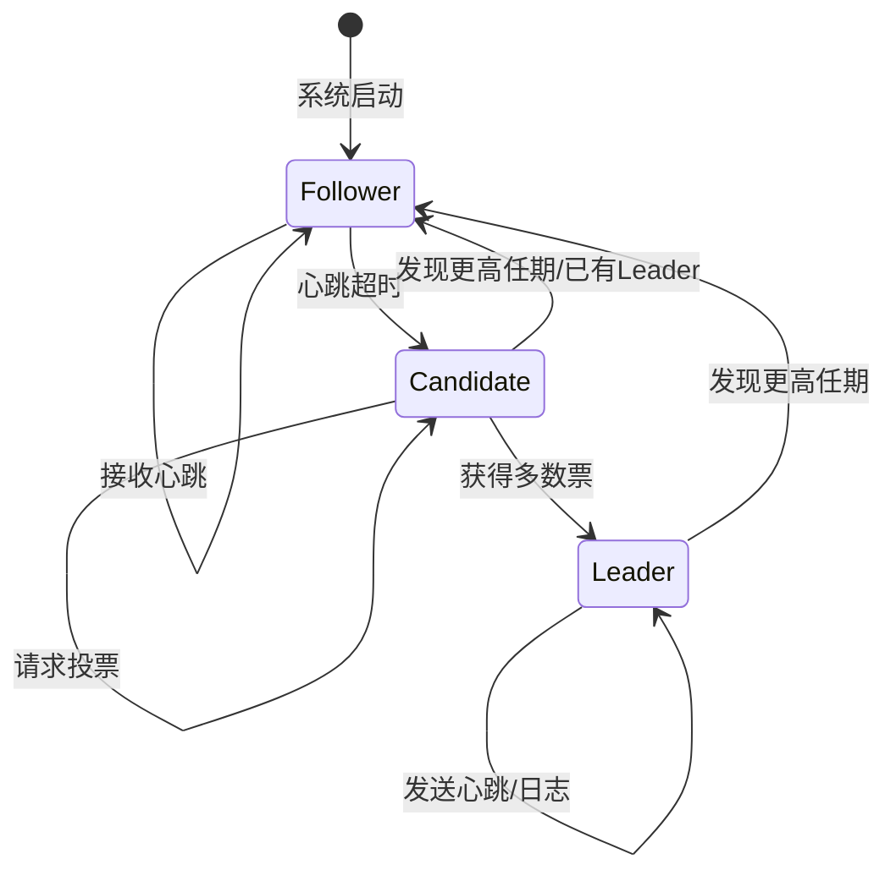

# 06.3 共识与协作 (Consensus and Coordination)

## 目录

- [06.3 共识与协作 (Consensus and Coordination)](#063-共识与协作-consensus-and-coordination)
  - [1 . 定义与背景](#1-定义与背景)
  - [2 . 批判性分析](#2-批判性分析)
  - [2. 批判性分析](#2-批判性分析)
  - [3. 核心问题与算法](#3-核心问题与算法)
  - [4. 形式化表达](#4-形式化表达)
  - [5. 交叉引用](#5-交叉引用)
  - [6. 参考文献](#6-参考文献)
  - [批判性分析](#批判性分析)

---

## 1 . 定义与背景

共识问题是分布式计算中的核心问题：要求一组相互独立的节点，就一个值或一系列值达成唯一的、不可撤销的协议。共识是实现系统状态一致性、领导者选举、分布式锁等协作任务的基础。

---

## 2 . 批判性分析

### 1 多元理论视角

- 理论视角：FLP不可能性定理和CAP定理为分布式共识提供了理论边界和限制。
- 算法视角：Paxos、Raft、Zab等算法从不同角度解决共识问题，各有优缺点。
- 工程视角：实际系统中需要在理论完美性和工程可实现性之间找到平衡。
- 网络视角：网络分区、延迟、丢包等网络问题对共识算法性能产生重要影响。

### 2.2 局限性

- 性能限制：共识算法在广域网环境下性能下降，难以满足高吞吐量需求。
- 复杂性：Paxos等经典算法理解困难，实现复杂，容易出错。
- 扩展性：单Leader架构存在性能瓶颈，难以扩展到大规模集群。
- 故障处理：拜占庭故障和网络分区等复杂故障场景处理能力有限。

### 2.3 争议与分歧

- 算法选择：Paxos vs Raft vs Zab，不同算法的适用性争议。
- 架构设计：单Leader vs 多Leader vs 无Leader架构的优劣之争。
- 一致性级别：强一致性 vs 最终一致性，性能与一致性的权衡。
- 实现策略：理论完美 vs 工程实用，学术研究与实际应用的差异。

### 2.4 应用前景

- 区块链：分布式账本和智能合约的共识机制。
- 云原生：Kubernetes、微服务等云原生架构的协调服务。
- 边缘计算：边缘节点间的协作和状态同步。
- 物联网：大规模IoT设备的分布式协调和管理。

### 2.5 改进建议

- 发展新型算法：设计更适合现代网络环境的共识算法。
- 推进形式化验证：使用形式化方法验证共识算法的正确性。
- 加强性能优化：通过并行化、批处理等技术提高共识性能。
- 跨领域整合：与网络科学、博弈论、密码学等领域的深度融合。

---

## 3 . 核心问题与算法

- **共识属性 (Consensus Properties)**:
  - **一致性 (Agreement)**: 所有正确的节点必须就同一个值达成一致。
  - **有效性 (Validity)**: 如果所有正确的节点都提议了同一个值v，那么最终决议的值必须是v。
  - **可终止性 (Termination)**: 所有正确的节点最终必须能做出决定。
- **Paxos 算法**:
  - **描述**: 由Lamport提出的第一个被证明的共识算法，分为两个阶段（Prepare/Promise 和 Propose/Accept）。非常强大但难以理解和实现。
  - **变种**: Multi-Paxos, Cheap Paxos.
- **Raft 算法**:
  - **描述**: 由Ongaro和Ousterhout设计，目标是比Paxos更易于理解和实现。它将共识问题分解为三个子问题：领导者选举、日志复制和安全性。
  - **优点**: 设计清晰，被广泛应用于现代分布式系统（如etcd, Consul）。
- **Zab (ZooKeeper Atomic Broadcast)**:
  - **描述**: ZooKeeper使用的原子广播协议，类似于Raft，也包含领导者选举和原子广播阶段，为客户端提供高可用的分布式协作服务。

---

## 4 . 形式化表达

**Raft 领导者选举流程**:

---

## 5 . 交叉引用

- [分布式系统总览](README.md)
- [基础理论](06.1_Foundations.md)
- [复制与一致性](06.4_Replication_and_Consistency.md)

---

## 6 . 参考文献

1. Lamport, Leslie. "The Part-Time Parliament." *ACM Transactions on Computer Systems*, 1998.
2. Ongaro, Diego, and Ousterhout, John. "In search of an understandable consensus algorithm." *USENIX Annual Technical Conference*, 2014.
3. Chandra, Tushar D., and Toueg, Sam. "Unreliable failure detectors for reliable distributed systems." *Journal of the ACM*, 1996.

## 7 批判性分析

- 本节内容待补充：请从多元理论视角、局限性、争议点、应用前景等方面进行批判性分析。
