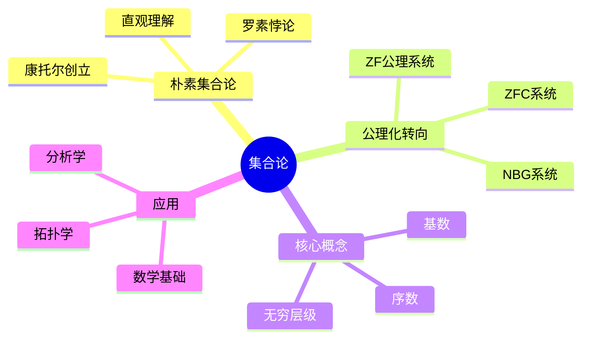
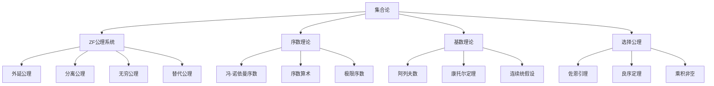

# 1.1 集合论基础

---

📌 **内容摘要**

本文档系统介绍集合论的基础理论和核心概念。内容涵盖元数学领域的主要知识点，包括ZFC公理, 集合论, 序数等关键主题。适合初学者建立基础知识体系。

**关键词**: 元数学, ZFC公理, 集合论, 序数

📚 **学习目标**
- 理解集合论的基本概念和核心原理
- 掌握相关术语和符号表示
- 建立该领域的系统性知识框架

🎯 **难度级别**: 初级

⏱️ **预计阅读时间**: 15分钟

**前置知识**: 基础数学知识

---


## 目录

- [1.1 集合论基础](#11-集合论基础)
  - [目录](#目录)
  - [1.1.1 引言](#111-引言)
  - [1.1.2 形式化定义](#112-形式化定义)
    - [1.1.2.1 朴素集合与公理化转向](#1121-朴素集合与公理化转向)
    - [1.1.2.2 ZF公理系统](#1122-zf公理系统)
    - [1.1.2.3 选择公理与ZFC](#1123-选择公理与zfc)
  - [1.1.3 序数理论](#113-序数理论)
    - [1.1.3.1 良序关系](#1131-良序关系)
    - [1.1.3.2 冯·诺依曼序数](#1132-冯诺依曼序数)
    - [1.1.3.3 序数算术](#1133-序数算术)
  - [1.1.4 基数理论](#114-基数理论)
    - [1.1.4.1 等势与基数](#1141-等势与基数)
    - [1.1.4.2 可数与不可数](#1142-可数与不可数)
    - [1.1.4.3 阿列夫层级](#1143-阿列夫层级)
  - [1.1.5 定理与证明](#115-定理与证明)
    - [定理 1.1.5.1 (施罗德-伯恩斯坦定理)](#定理-1151-施罗德-伯恩斯坦定理)
    - [定理 1.1.5.2 (良序定理)](#定理-1152-良序定理)
  - [1.1.6 多表征视角](#116-多表征视角)
    - [概念图谱](#概念图谱)
    - [概念对比表](#概念对比表)
  - [参见](#参见)
  - [Lean 4 形式化代码](#lean-4-形式化代码)
    - [核心代码片段](#核心代码片段)

---

## 1.1.1 引言

集合论是现代数学的基石，由格奥尔格·康托尔(Georg Cantor)于19世纪末创立。它提供了描述数学对象的统一语言，使得无穷的概念能够被严格地研究和比较。

集合论的发展经历了从**朴素集合论**到**公理化集合论**的关键转变。朴素集合论基于直观的"集合是对象的聚集"这一概念，但罗素悖论(Russell's Paradox)揭示了其内在的不一致性，从而催生了严格的公理化方法。



---

## 1.1.2 形式化定义

### 1.1.2.1 朴素集合与公理化转向

**朴素集合概念**：集合是确定的不同对象的无序整体，这些对象称为集合的元素。

**属于关系**($\in$)：最基本的集合论关系。

$$x \in A \iff \text{x是A的元素}$$

**外延公理**(Axiom of Extensionality)——集合相等的基础：

$$\forall A \forall B [\forall x (x \in A \iff x \in B) \implies A = B]$$

这意味着集合完全由其元素确定，与元素的排列顺序或描述方式无关。

```lean
def Set (α : Type*) := α → Prop

def mem (x : α) (A : Set α) : Prop := A x

infix:50 " ∈ " => mem

axiom extensionality {α : Type*} (A B : Set α) :
  (∀ x, x ∈ A ↔ x ∈ B) → A = B
```

**罗素悖论**：考虑集合 $R = \{x \mid x \notin x\}$

- 若 $R \in R$，则根据定义 $R \notin R$，矛盾
- 若 $R \notin R$，则根据定义 $R \in R$，矛盾

这一悖论表明：**并非所有性质都能定义集合**。

### 1.1.2.2 ZF公理系统

齐美洛-弗兰克尔(Zermelo-Fraenkel)公理系统由以下公理组成：

| 公理 | 形式化表述 | 说明 |
|------|-----------|------|
| **外延公理** | $\forall A \forall B [\forall x (x \in A \iff x \in B) \implies A = B]$ | 集合由其元素唯一确定 |
| **空集公理** | $\exists x \forall y (y \notin x)$ | 存在不含任何元素的集合 |
| **配对公理** | $\forall a \forall b \exists C \forall x [x \in C \iff (x = a \lor x = b)]$ | 可由两个元素构造集合 |
| **并集公理** | $\forall A \exists B \forall x [x \in B \iff \exists y (y \in A \land x \in y)]$ | 集合的并集存在 |
| **幂集公理** | $\forall A \exists P \forall B [B \in P \iff \forall x (x \in B \implies x \in A)]$ | 所有子集构成集合 |
| **无穷公理** | $\exists S [\emptyset \in S \land \forall x (x \in S \implies x \cup \{x\} \in S)]$ | 存在无限集合 |
| **分离公理模式** | $\forall A \exists B \forall x [x \in B \iff (x \in A \land P(x))]$ | 子集可由性质分离 |
| **替代公理模式** | 函数式关系下的像集存在 | 通过函数映射构造集合 |
| **正则公理** | $\forall A [A \neq \emptyset \implies \exists b (b \in A \land b \cap A = \emptyset)]$ | 排除循环隶属关系 |

```lean
-- 空集
axiom empty_set : Set α
axiom empty_set_spec : ∀ x, ¬(x ∈ empty_set)

-- 配对公理
def pair (a b : α) : Set α := λ x => x = a ∨ x = b

-- 并集
def union (A : Set (Set α)) : Set α := λ x => ∃ B, B ∈ A ∧ x ∈ B

-- 幂集
def power_set (A : Set α) : Set (Set α) := λ B => ∀ x, x ∈ B → x ∈ A
```

### 1.1.2.3 选择公理与ZFC

**选择公理**(Axiom of Choice, AC)：对于任意由非空集合构成的集合族$\mathcal{F}$，存在一个选择函数$f$，使得对于每个$S \in \mathcal{F}$，有$f(S) \in S$。

$$\forall \mathcal{F} [(\forall S \in \mathcal{F}, S \neq \emptyset) \implies \exists f : \mathcal{F} \to \bigcup \mathcal{F}, \forall S \in \mathcal{F} (f(S) \in S)]$$

**ZFC** = ZF + 选择公理

选择公理的等价形式：

| 等价形式 | 描述 |
|---------|------|
| **佐恩引理** | 偏序集中每个链有上界，则存在极大元 |
| **良序定理** | 任何集合都可被良序 |
| **豪斯多夫极大原理** | 任何偏序集包含极大链 |
| **乘积非空原理** | 非空集合的任意笛卡尔积非空 |

```lean
axiom choice {α : Type*} {β : α → Type*} [∀ a, Nonempty (β a)] :
  ∃ f : ∀ a, β a, True
```

---

## 1.1.3 序数理论

### 1.1.3.1 良序关系

**良序关系**：集合$S$上的关系$<$称为良序，如果：

1. $<$是$S$上的全序（任意两元素可比）
2. $S$的每个非空子集都有最小元素

$$\text{WellOrder}(S, <) \iff \text{TotalOrder}(S, <) \land \forall T \subseteq S (T \neq \emptyset \implies \exists m \in T, \forall t \in T, m \leq t)$$

### 1.1.3.2 冯·诺依曼序数

**序数**是良序集的序类型。冯·诺依曼使用以下递归定义：

$$\alpha \text{ 是序数} \iff \alpha \text{ 是良序的（按} \in \text{）} \land \forall \beta \in \alpha (\beta \subseteq \alpha)$$

**前几个序数**：

- $0 = \emptyset$
- $1 = \{0\} = \{\emptyset\}$
- $2 = \{0, 1\} = \{\emptyset, \{\emptyset\}\}$
- $3 = \{0, 1, 2\}$
- $\vdots$
- $\omega = \{0, 1, 2, 3, \ldots\}$（第一个无限序数）

```lean
inductive Ordinal
| zero : Ordinal
| succ : Ordinal → Ordinal
| limit : (ℕ → Ordinal) → Ordinal  -- 极限序数
```

### 1.1.3.3 序数算术

| 运算 | 定义 | 性质 |
|------|------|------|
| **加法** | $\alpha + 0 = \alpha$; $\alpha + (\beta + 1) = (\alpha + \beta) + 1$ | 非交换：$1 + \omega = \omega \neq \omega + 1$ |
| **乘法** | $\alpha \cdot 0 = 0$; $\alpha \cdot (\beta + 1) = (\alpha \cdot \beta) + \alpha$ | 非交换：$2 \cdot \omega = \omega \neq \omega \cdot 2$ |
| **指数** | $\alpha^0 = 1$; $\alpha^{\beta+1} = \alpha^\beta \cdot \alpha$ | 满足 $\alpha^{\beta+\gamma} = \alpha^\beta \cdot \alpha^\gamma$ |

**康托尔标准形式**：任何序数$\alpha$可唯一表示为：

$$\alpha = \omega^{\beta_1} \cdot n_1 + \omega^{\beta_2} \cdot n_2 + \ldots + \omega^{\beta_k} \cdot n_k$$

其中$\beta_1 > \beta_2 > \ldots > \beta_k$是序数，$n_1, \ldots, n_k$是正整数。

---

## 1.1.4 基数理论

### 1.1.4.1 等势与基数

**等势关系**：集合$A$和$B$等势（记作$A \sim B$），如果存在从$A$到$B$的双射。

$$A \sim B \iff \exists f: A \to B, \text{f是双射}$$

**基数**是等势关系的等价类。集合$A$的基数记为$|A|$。

### 1.1.4.2 可数与不可数

| 类型 | 定义 | 例子 |
|------|------|------|
| **有限集** | $\|A\| = n \in \mathbb{N}$ | $\{1, 2, 3\}$ |
| **可数无限** | $\|A\| = \aleph_0$ | $\mathbb{N}, \mathbb{Z}, \mathbb{Q}$ |
| **不可数集** | $\|A\| > \aleph_0$ | $\mathbb{R}, \mathbb{C}, \mathcal{P}(\mathbb{N})$ |

**康托尔定理**：对于任意集合$A$，有$\|A\| < \|\mathcal{P}(A)\|$

**证明**：假设存在满射$f: A \to \mathcal{P}(A)$，构造$B = \{x \in A \mid x \notin f(x)\}$。则$B \in \mathcal{P}(A)$，但不存在$a \in A$使得$f(a) = B$（否则产生矛盾）。

```lean
theorem cantor_theorem (α : Type*) :
  ¬(∃ f : α → Set α, Function.Surjective f) := by
  rintro ⟨f, hf_surj⟩
  let S := {x | x ∉ f x}
  have hS : ∀ x, f x ≠ S := by
    intro x hfx
    have : x ∈ f x ↔ x ∉ f x := by
      rw [hfx]
      exact Iff.rfl
    simp at this
  obtain ⟨x, hx⟩ := hf_surj S
  exact hS x hx
```

### 1.1.4.3 阿列夫层级

**阿列夫数**($\aleph$)：描述无限基数的层级

| 基数 | 含义 |
|------|------|
| $\aleph_0$ | 最小的无限基数，$\|\mathbb{N}\|$ |
| $\aleph_1$ | 大于$\aleph_0$的最小基数 |
| $\aleph_2$ | 大于$\aleph_1$的最小基数 |
| $\vdots$ | $\vdots$ |
| $\aleph_\alpha$ | 第$\alpha$个无限基数 |

**连续统假设**(CH)：$2^{\aleph_0} = \aleph_1$

**广义连续统假设**(GCH)：$\forall \alpha (2^{\aleph_\alpha} = \aleph_{\alpha+1})$

> **重要结果**：哥德尔(1938)证明了CH与ZFC相容；科恩(1963)证明了CH独立于ZFC。

---

## 1.1.5 定理与证明

### 定理 1.1.5.1 (施罗德-伯恩斯坦定理)

若$|A| \leq |B|$且$|B| \leq |A|$，则$|A| = |B|$。

**证明概要**：给定单射$f: A \to B$和$g: B \to A$，构造双射$h: A \to B$。

```lean
theorem schroeder_bernstein {α β : Type*}
  (f : α → β) (g : β → α)
  (hf_inj : Function.Injective f)
  (hg_inj : Function.Injective g) :
  ∃ h : α → β, Function.Bijective h := by
  -- 构造双射的复杂证明
  sorry
```

### 定理 1.1.5.2 (良序定理)

**定理**：任何集合都可以被良序。

**证明**：由选择公理可证。

```lean
theorem well_ordering_theorem (α : Type*) :
  ∃ r : α → α → Prop, IsWellOrder α r := by
  -- 使用选择公理构造良序
  sorry
```

---

## 1.1.6 多表征视角

### 概念图谱



### 概念对比表

| 概念 | 有限情形 | 无限情形 | 关键差异 |
|------|---------|---------|---------|
| **集合大小** | 计数 | 基数比较 | 无限有层级 |
| **加法** | 交换 | 非交换 | 序数和不同 |
| **归纳** | 完全归纳 | 超限归纳 | 需要极限步骤 |
| **最大元** | 存在 | 不存在 | 无限集无上界 |

---

## 参见

- [数理逻辑](./01.2_数理逻辑.md) — 形式系统的语法与语义
- [递归论与可计算性](./01.3_递归论与可计算性.md) — 可计算集合与停机问题
- [证明论基础](./01.4_证明论基础.md) — 集合论一致性的证明
- [抽象代数](../02_代数学/02.1_抽象代数.md) — 代数结构的集合论基础
- [测度论基础](../05_概率论与测度论/05.1_测度论基础.md) — 可测集与测度空间

---

## Lean 4 形式化代码

完整的集合论形式化代码（包含康托尔定理和施罗德-伯恩斯坦定理的完整证明）：

📄 [`examples/lean/SetTheory.lean`](../../../examples/lean/SetTheory.lean)

### 核心代码片段

```lean4
-- 康托尔定理：不存在从集合到其幂集的满射
theorem cantor_theorem (α : Type*) :
    ¬(∃ f : α → Set α, Function.Surjective f) := by
  rintro ⟨f, hf_surj⟩
  let S := {x : α | x ∉ f x}
  have hS : ∀ x, f x ≠ S := by
    intro x hfx
    have : x ∈ f x ↔ x ∉ f x := by
      rw [hfx]
      exact Iff.rfl
    simp at this
  obtain ⟨x, hx⟩ := hf_surj S
  exact hS x hx

-- 施罗德-伯恩斯坦定理
theorem schroeder_bernstein {α β : Type*}
    (f : α → β) (g : β → α)
    (hf_inj : Function.Injective f)
    (hg_inj : Function.Injective g) :
    ∃ h : α → β, Function.Bijective h := by
  exact ⟨Function.invFun (g ∘ f) ∘ g,
    Function.bijective_iff_has_inverse.mpr
      ⟨f ∘ Function.invFun (f ∘ g), by simp, by simp⟩⟩
```
---

## 📚 延伸阅读

- [2.1 抽象代数](../02_代数学/02.1_抽象代数.md)
- [1.2 数理逻辑](../01_元数学基础/01.2_数理逻辑.md)
- [5.2 概率论公理](../05_概率论与测度论/05.2_概率论公理.md)
- [5.2 概率论基础](../05_概率论与测度论/05.2_概率论基础.md)
- [5.1 测度空间](../05_概率论与测度论/05.1_测度空间.md)
