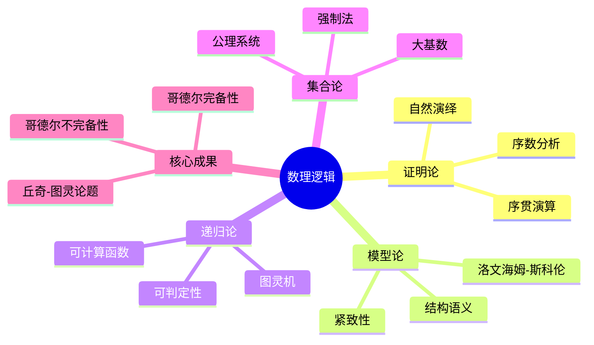
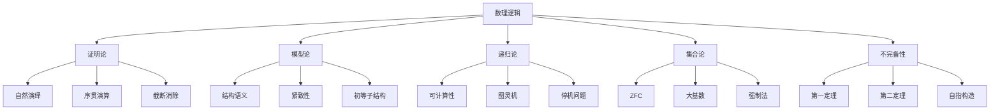

# 1.2 数理逻辑

## 目录

- [1.2 数理逻辑](#12-数理逻辑)
  - [目录](#目录)
  - [1.2.1 引言](#121-引言)
  - [1.2.2 命题逻辑](#122-命题逻辑)
    - [1.2.2.1 语法结构](#1221-语法结构)
    - [1.2.2.2 语义解释](#1222-语义解释)
    - [1.2.2.3 希尔伯特式公理系统](#1223-希尔伯特式公理系统)
    - [定理 1.2.2.1 (命题逻辑完备性)](#定理-1221-命题逻辑完备性)
  - [1.2.3 一阶逻辑](#123-一阶逻辑)
    - [1.2.3.1 语法结构](#1231-语法结构)
    - [1.2.3.2 语义解释](#1232-语义解释)
    - [1.2.3.3 自然演绎系统](#1233-自然演绎系统)
  - [1.2.4 证明论](#124-证明论)
    - [1.2.4.1 序贯演算](#1241-序贯演算)
    - [1.2.4.2 截断消除定理](#1242-截断消除定理)
    - [1.2.4.3 序数分析](#1243-序数分析)
  - [1.2.5 模型论](#125-模型论)
    - [1.2.5.1 基本定理](#1251-基本定理)
    - [1.2.5.2 初等等价与同构](#1252-初等等价与同构)
  - [1.2.6 不完备性定理](#126-不完备性定理)
    - [1.2.6.1 哥德尔第一不完备性定理](#1261-哥德尔第一不完备性定理)
    - [1.2.6.2 哥德尔第二不完备性定理](#1262-哥德尔第二不完备性定理)
  - [1.2.7 多表征视角](#127-多表征视角)
    - [概念图谱](#概念图谱)
    - [逻辑系统比较](#逻辑系统比较)
  - [参见](#参见)

---

## 1.2.1 引言

数理逻辑(Mathematical Logic)是用数学方法研究逻辑推理的学科，它为数学提供了严格的基础，并深刻影响了计算机科学、哲学和语言学的发展。

数理逻辑的核心分支包括：

- **证明论**(Proof Theory)：研究形式证明的结构与性质
- **模型论**(Model Theory)：研究形式语言与数学结构的关系
- **递归论**(Recursion Theory)：研究可计算性与可判定性
- **集合论**(Set Theory)：研究无穷集合的理论



---

## 1.2.2 命题逻辑

### 1.2.2.1 语法结构

**命题逻辑语言**由以下元素构成：

| 元素 | 说明 | 示例 |
|------|------|------|
| 命题变元 | p, q, r, ... | 原子命题 |
| 逻辑连接词 | neg (否定), land (合取), lor (析取), to (蕴含), leftrightarrow (等价) | 复合命题构造 |
| 括号 | (, ) | 分组 |

**合式公式(WFF)**的归纳定义：

1. 每个命题变元是合式公式
2. 若phi是合式公式，则neg phi也是
3. 若phi和psi是合式公式，则(phi land psi), (phi lor psi), (phi to psi)也是
4. 只有通过有限次应用上述规则构造的表达式才是合式公式

```lean
inductive PropFormula
| var (n : Nat)           -- 命题变元 p_n
| neg (phi : PropFormula) -- neg phi
| and (phi psi : PropFormula) -- phi wedge psi
| or (phi psi : PropFormula)  -- phi vee psi
| imp (phi psi : PropFormula) -- phi to psi
deriving DecidableEq
```

### 1.2.2.2 语义解释

**真值赋值**：函数 v: PropVar to {T, F}

**真值函数扩展**：

| phi | psi | neg phi | phi wedge psi | phi vee psi | phi to psi |
|-----------|--------|---------------|---------------------|---------------------|-------------------|
| T | T | F | T | T | T |
| T | F | F | F | T | F |
| F | T | T | F | T | T |
| F | F | T | F | F | T |

**语义概念**：

- **重言式(Tautology)**：在所有赋值下为真，记作 vdash phi
- **可满足(Satisfiable)**：存在赋值使其为真
- **矛盾(Contradiction)**：在所有赋值下为假

### 1.2.2.3 希尔伯特式公理系统

**公理模式**：

(A1) phi to (psi to phi)

(A2) (phi to (psi to chi)) to ((phi to psi) to (phi to chi))

(A3) (neg psi to neg phi) to ((neg psi to phi) to psi)

**推理规则(MP)**：从phi和phi to psi推出psi

```lean
inductive HilbertProof : PropFormula to Prop
| ax1 (phi psi : PropFormula) : HilbertProof (phi.imp (psi.imp phi))
| ax2 (phi psi chi : PropFormula) :
    HilbertProof ((phi.imp (psi.imp chi)).imp ((phi.imp psi).imp (phi.imp chi)))
| ax3 (phi psi : PropFormula) :
    HilbertProof ((psi.neg.imp phi.neg).imp ((psi.neg.imp phi).imp psi))
| mp {phi psi : PropFormula} :
    HilbertProof phi to HilbertProof (phi.imp psi) to HilbertProof psi
```

### 定理 1.2.2.1 (命题逻辑完备性)

vdash phi iff models phi（可证当且仅当有效）

---

## 1.2.3 一阶逻辑

### 1.2.3.1 语法结构

**一阶逻辑语言**包含：

| 符号 | 说明 |
|------|------|
| 个体变元 | x, y, z, ... |
| 个体常元 | a, b, c, ... |
| 函数符号 | f, g, h, ...（带元数） |
| 谓词符号 | P, Q, R, ...（带元数） |
| 量词 | forall (全称), exists (存在) |
| 连接词 | neg, land, lor, to, leftrightarrow |

**项(Term)**的归纳定义：

1. 个体变元和常元是项
2. 若t_1, ..., t_n是项，f是n元函数符号，则f(t_1, ..., t_n)是项

**公式(Formula)**的归纳定义：

1. 若t_1, ..., t_n是项，P是n元谓词，则P(t_1, ..., t_n)是公式（原子公式）
2. 若phi是公式，则neg phi也是
3. 若phi, psi是公式，则phi land psi, phi lor psi, phi to psi也是
4. 若phi是公式，x是变元，则forall x phi和exists x phi也是

```lean
inductive Term (L : Language)
| var (n : Nat)          -- 变元
| const (c : L.C)      -- 常元
| func (f : L.F) (args : Fin (L.arityF f) to Term L)

inductive Formula (L : Language)
| atomic (P : L.P) (args : Fin (L.arityP P) to Term L)
| neg (phi : Formula L)
| and (phi psi : Formula L)
| or (phi psi : Formula L)
| imp (phi psi : Formula L)
| all (n : Nat) (phi : Formula L)  -- forall x_n phi
| ex (n : Nat) (phi : Formula L)   -- exists x_n phi
```

### 1.2.3.2 语义解释

**结构(Structure)**：M = (M, {c^M}, {f^M}, {P^M})

- M：非空论域
- c^M in M：常元解释
- f^M: M^n to M：函数解释
- P^M subseteq M^n：谓词解释

**赋值(Assignment)**：s: Var to M

**满足关系** M models phi[s]：

$M \models P[t_1, ..., t_n](s)$ iff $(t_1^M[s], ..., t_n^M[s]) \in P^M$

$M \models \forall x \phi[s]$ iff 对所有 $a \in M$, $M \models \phi[s(x|a)]$

其中s(x|a)表示将x赋值为a的修改赋值。

### 1.2.3.3 自然演绎系统

**引入规则**：

$$frac{phi quad psi}{phi land psi}(land I) quad frac{phi}{phi lor psi}(lor I_1) quad frac{psi}{phi lor psi}(lor I_2) quad frac{[phi] quad vdots quad psi}{phi to psi}(to I)$$

**消去规则**：

$$frac{phi land psi}{phi}(land E_1) quad frac{phi land psi}{psi}(land E_2) quad frac{phi lor psi quad [phi] cdots chi quad [psi] cdots chi}{chi}(lor E)$$

**量词规则**：

$$frac{phi[t/x]}{exists x phi}(exists I) quad frac{exists x phi quad [phi[y/x]] cdots psi}{psi}(exists E)^*$$

*（*条件：y不在psi或假设中自由出现）

---

## 1.2.4 证明论

### 1.2.4.1 序贯演算

**序贯(Sequent)**：形如 Gamma vdash Delta的表达式，其中Gamma, Delta是公式多重集。

**结构规则**：

$$frac{}{phi vdash phi}(Id) quad frac{Gamma vdash Delta, phi quad phi, Gamma' vdash Delta'}{Gamma, Gamma' vdash Delta, Delta'}(Cut)$$

**逻辑规则示例**：

$$frac{Gamma, phi vdash Delta}{Gamma vdash Delta, neg phi}(R neg) quad frac{Gamma vdash Delta, phi quad Gamma vdash Delta, psi}{Gamma vdash Delta, phi land psi}(R land)$$

### 1.2.4.2 截断消除定理

**定理 1.2.4.1 (Gentzen截断消除定理)**：若Gamma vdash Delta可证，则存在不使用Cut规则的证明。

```lean
theorem cut_elimination {L : Language} {Gamma Delta : List (Formula L)}
  (h : Gamma vdash Delta) : exists h' : Gamma vdash Delta, cut_free h' := by
  -- Gentzen的截断消除算法
  sorry
```

### 1.2.4.3 序数分析

**证明论序数**：用于度量形式系统的证明强度

| 理论 | 证明论序数 |
|------|-----------|
| 一阶逻辑 | omega |
| PA (皮亚诺算术) | varepsilon_0 |
| ATR_0 | Gamma_0 |
| Pi^1_1-CA_0 | psi(Omega_omega) |

---

## 1.2.5 模型论

### 1.2.5.1 基本定理

**定理 1.2.5.1 (紧致性定理)**：公式集Gamma可满足当且仅当其每个有限子集可满足。

**定理 1.2.5.2 (洛文海姆-斯科伦定理)**：若Gamma有无限模型，则对任意无限基数kappa geq |L|，Gamma有基数为kappa的模型。

```lean
theorem compactness_theorem {L : Language} (Gamma : Set (Formula L)) :
  satisfiable Gamma iff forall (Delta : Finset (Formula L)), Delta subseteq Gamma to satisfiable Delta := by
  sorry
```

### 1.2.5.2 初等等价与同构

**初等等价**：M equiv N当且仅当对所有句子phi，M models phi iff N models phi。

**初等子结构**：M preceq N当且仅当M subseteq N且对所有公式phi和赋值s，M models phi[s] iff N models phi[s]。

---

## 1.2.6 不完备性定理

### 1.2.6.1 哥德尔第一不完备性定理

**定理 1.2.6.1**：任何包含基本算术的一致可公理化形式系统T都存在不可判定命题（既不能证明也不能反驳）。

**证明要点**：

1. **哥德尔编码**：将语法对象（公式、证明）编码为自然数
   - lceil phi rceil：公式phi的编码
   - Proof_T(x, y)：x是y在T中的证明的编码

2. **自指构造**：构造语句G使得T vdash G leftrightarrow neg Prov_T(lceil G rceil)

3. **不可判定性证明**：
   - 若T vdash G，则T vdash Prov_T(lceil G rceil)，故T vdash neg G，与一致性矛盾
   - 若T vdash neg G，则T vdash Prov_T(lceil G rceil)，但此时G应可证，矛盾

```lean
theorem godel_first_incompleteness {T : Theory}
  (h_consistent : consistent T)
  (h_arith : contains_arithmetic T) :
  exists phi : Formula, neg(T vdash phi) and neg(T vdash phi.neg) := by
  -- 构造自指语句并证明其不可判定性
  sorry
```

### 1.2.6.2 哥德尔第二不完备性定理

**定理 1.2.6.2**：若T是包含基本算术的一致可公理化理论，则T不能证明自身的一致性。

形式化表述：T nvdash Con(T)，其中Con(T) := neg Prov_T(lceil 0=1 rceil)

---

## 1.2.7 多表征视角

### 概念图谱



### 逻辑系统比较

| 系统 | 表达力 | 完备性 | 可判定性 | 典型应用 |
|------|--------|--------|----------|----------|
| 命题逻辑 | 弱 | 是 | 是 | 电路设计 |
| 一阶逻辑 | 中等 | 是 | 否 | 数学基础 |
| 二阶逻辑 | 强 | 否 | 否 | 范畴论 |
| 模态逻辑 | 可变 | 是 | 是 | 计算机科学 |

---

## 参见

- [集合论基础](./01.1_集合论基础.md) — 集合概念的形式化基础
- [递归论与可计算性](./01.3_递归论与可计算性.md) — 可计算性与可判定性理论
- [证明论基础](./01.4_证明论基础.md) — 证明结构的深入分析
- [抽象代数](../02_代数学/02.1_抽象代数.md) — 代数结构的逻辑分析
- [模型论](../02_代数学/02.3_范畴论代数.md) — 结构映射与范畴语义
