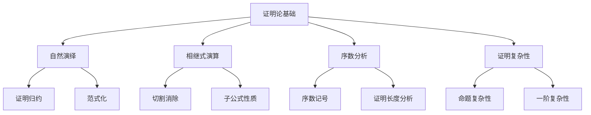

# 1.3 证明论基础

---

📌 **内容摘要**

本文档系统介绍证明论的基础理论和核心概念。内容涵盖元数学领域的主要知识点，包括谓词逻辑, 相继式, 命题逻辑, 集合论等关键主题。适合具备相关基础的学习者进行深入研究。

**关键词**: 谓词逻辑, 相继式, 元数学, 命题逻辑, 集合论, 数理逻辑, 证明论, 自然演绎

📚 **学习目标**

- 深入理解证明论的理论体系和形式化方法
- 能够进行相关定理的形式化证明
- 掌握形式化证明的基本技巧

🎯 **难度级别**: 高级

⏱️ **预计阅读时间**: 15分钟

**前置知识**: 该领域的中级知识, 形式化方法基础

---


> 形式化数学基础 | 元数学基础
>
> 交叉引用：[1.1 集合论基础](./01.1_集合论基础.md) | [1.2 数理逻辑](./01.2_数理逻辑.md) | [1.4 可计算性理论](./01.4_可计算性理论.md)

## 1.3.1 引言

证明论是研究数学证明的形式结构与性质的学科。本章介绍自然演绎系统、序数分析方法以及证明复杂性的基本概念。



## 1.3.2 自然演绎系统

### 1.3.2.1 证明的归纳定义

**定义 1.3.1**（自然演绎证明）
证明是标记树的归纳定义，其中每个节点标记为推理规则应用：

$$\mathcal{D} = \frac{\mathcal{D}_1 \quad \cdots \quad \mathcal{D}_n}{\varphi} r$$

其中 $r$ 是推理规则，$\mathcal{D}_1, \ldots, \mathcal{D}_n$ 是子证明，结论为 $\varphi$。

**定义 1.3.2**（证明的测度）

- **高度** $h(\mathcal{D})$：从根到叶的最大路径长度
- **大小** $s(\mathcal{D})$：证明树中的节点数
- **切割秩** $\text{cr}(\mathcal{D})$：证明中切割公式的最大复杂度

### 1.3.2.2 证明归约

**定义 1.3.3**（归约关系）
证明 $\mathcal{D}$ 可归约到 $\mathcal{D}'$，记作 $\mathcal{D} \leadsto \mathcal{D}'$，如果 $\mathcal{D}'$ 通过消去冗余引入-消去对从 $\mathcal{D}$ 获得。

**定义 1.3.4**（范式）
证明 $\mathcal{D}$ 称为**范式**（normal form），如果不存在 $\mathcal{D}'$ 使 $\mathcal{D} \leadsto \mathcal{D}'$。

**定理 1.3.1**（范式化定理）
每个可证公式都有范式证明。

**证明概要**：
定义证明的权重，证明归约严格降低权重，由良基性得证。
$\square$

### 1.3.2.3 子公式性质

**定理 1.3.2**（子公式性质）
在范式证明中，每个出现的公式都是某假设或结论的子公式。

**证明**：
分析范式证明的结构：由于没有引入-消去可约对，所有推理要么是引入规则（结论复杂），要么是消去规则（前提复杂），沿证明树向上，复杂度单调变化。
$\square$

## 1.3.3 相继式演算

### 1.3.3.1 Gentzen的LK系统

**定义 1.3.5**（相继式）
相继式形如 $\Gamma \Rightarrow \Delta$，其中 $\Gamma, \Delta$ 是公式有限序列。

**定义 1.3.6**（Gentzen系统 LK）

**公理**：

- 恒等公理：$A \Rightarrow A$（$A$ 原子）
- 逻辑公理：$\bot \Rightarrow$（矛盾推出一切）

**结构规则**：

- 弱化左/右：$\frac{\Gamma \Rightarrow \Delta}{A, \Gamma \Rightarrow \Delta}$，$\frac{\Gamma \Rightarrow \Delta}{\Gamma \Rightarrow \Delta, A}$
- 收缩左/右：$\frac{A, A, \Gamma \Rightarrow \Delta}{A, \Gamma \Rightarrow \Delta}$，$\frac{\Gamma \Rightarrow \Delta, A, A}{\Gamma \Rightarrow \Delta, A}$
- 交换：重排公式顺序
- 切割：$\frac{\Gamma \Rightarrow \Delta, A \quad A, \Sigma \Rightarrow \Pi}{\Gamma, \Sigma \Rightarrow \Delta, \Pi}$

**逻辑规则**（以蕴含为例）：

- $\rightarrow$左：$\frac{\Gamma \Rightarrow \Delta, A \quad B, \Sigma \Rightarrow \Pi}{A \rightarrow B, \Gamma, \Sigma \Rightarrow \Delta, \Pi}$
- $\rightarrow$右：$\frac{A, \Gamma \Rightarrow \Delta, B}{\Gamma \Rightarrow \Delta, A \rightarrow B}$

### 1.3.3.2 切割消除定理

**定理 1.3.3**（Gentzen切割消除定理，1934）
若 $\Gamma \Rightarrow \Delta$ 在LK中可证，则它有不使用切割规则的证明。

**证明概要**：
主要引理：若 $\Gamma \Rightarrow \Delta, A$ 和 $A, \Sigma \Rightarrow \Pi$ 都有无切割证明，则 $\Gamma, \Sigma \Rightarrow \Delta, \Pi$ 也有无切割证明。

对 $A$ 的复杂度归纳，然后归纳于证明的高度，消除所有切割。
$\square$

**推论 1.3.1**（一致性）
若LK证明 $\Rightarrow$（空相继式），则系统不一致。切割消除说明 $\Rightarrow$ 不可证。

### 1.3.3.3 相继式演算的变体

**定义 1.3.7**（直觉主义相继式演算 LJ）
LJ要求右式最多含一个公式：$\Gamma \Rightarrow A$ 或 $\Gamma \Rightarrow$。

**定理 1.3.4**（LJ完备性）
$\Gamma \vdash_{NJ} A$ 当且仅当 $\Gamma \Rightarrow A$ 在LJ中可证。

## 1.3.4 序数分析

### 1.3.4.1 序数记号系统

**定义 1.3.8**（Cantor范式）
每个序数 $\alpha > 0$ 可唯一表示为：
$$\alpha = \omega^{\alpha_1} \cdot n_1 + \cdots + \omega^{\alpha_k} \cdot n_k$$
其中 $\alpha > \alpha_1 > \cdots > \alpha_k$ 且 $n_i \in \mathbb{N}^+$。

**定义 1.3.9**（序数 $<_0$）
使用Veblen层次定义的大递归序数记号：

- $\varphi_0(\alpha) = \omega^\alpha$
- $\varphi_{\beta+1}(\alpha) = \varphi_\beta$ 的第 $\alpha$ 个不动点

序数 $\Gamma_0 = \min\{\alpha \mid \varphi_\alpha(0) = \alpha\}$ 称为Feferman-Schütte序数。

### 1.3.4.2 序数赋值

**定义 1.3.10**（证明的序数高度）
对算术系统的证明 $\mathcal{D}$，定义序数 $\text{o}(\mathcal{D})$：

- 公理：$\text{o}(\mathcal{D}) = 1$
- 规则应用：$\text{o}(\frac{\mathcal{D}_1 \quad \mathcal{D}_2}{\varphi}) = \max(\text{o}(\mathcal{D}_1), \text{o}(\mathcal{D}_2)) + 1$

**定义 1.3.11**（证明论序数）
理论 $T$ 的**证明论序数**定义为：
$$|T| = \sup\{\text{o}(\mathcal{D}) \mid \mathcal{D} \text{ 是 } T \text{ 中证明}\}$$

**定理 1.3.5**（Peano算术的序数分析）
$|\text{PA}| = \varepsilon_0$，其中 $\varepsilon_0 = \sup\{\omega, \omega^\omega, \omega^{\omega^\omega}, \ldots\}$。

### 1.3.4.3 Gentzen的一致性证明

**定理 1.3.6**（Gentzen，1936）
PA + $\text{TI}(\varepsilon_0)$ 可证 PA 的一致性。

## 1.3.5 证明复杂性

### 1.3.5.1 命题证明复杂性

**定义 1.3.12**（Frege系统）
Frege系统是有穷完备的蕴含-否定Hilbert式系统。

**定义 1.3.13**（扩展Frege系统 EF）
EF允许引入新变元作为 abbreviations。

**定义 1.3.14**（证明长度）
$\mathcal{D}$ 的**长度**是其中公式数。

**定理 1.3.7**（Cook-Reckhow定理）
命题逻辑有多项式规模证明系统当且仅当 NP = coNP。

### 1.3.5.2 归结复杂性

**定义 1.3.15**（归结反驳）
从子句集 $S$ 出发，反复应用归结规则导出空子句。

**定义 1.3.16**（鸽巢原理 PHP）
$PHP_n^{n+1}$：$n+1$ 只鸽子放入 $n$ 个巢，必有某巢至少2只鸽子。

**定理 1.3.8**（Haken，1985）
$PHP_n^{n+1}$ 的归结反驳长度为 $2^{\Omega(n)}$。

### 1.3.5.3 一阶证明复杂性

**定理 1.3.9**（Herbrand定理复杂性）
若 $\exists x \varphi(x)$（$\varphi$ 无量词）可证，则存在项 $t_1, \ldots, t_n$ 使 $\bigvee_{i=1}^n \varphi(t_i)$ 为有效式。

**定理 1.3.10**（Statman，1979）
从一阶证明压缩到Herbrand析取长度的上界是非初等的。

## 1.3.6 Lean 4 形式化

```lean4
import Mathlib

-- 公式类型
inductive Formula
  | atom : String → Formula
  | not : Formula → Formula
  | imp : Formula → Formula → Formula
  deriving DecidableEq

-- 相继式
def Sequent := List Formula × List Formula

-- 证明步
inductive ProofStep
  | axiom_rule : Formula → ProofStep
  | cut : Formula → ProofStep → ProofStep → ProofStep
  | left_imp : Formula → Formula → ProofStep → ProofStep → ProofStep
  | right_imp : Formula → Formula → ProofStep → ProofStep

-- 证明是相继式的推导树
def Proof := ProofStep

-- 定理：切割消除保持可证性
theorem cut_elimination {Γ Δ : List Formula} {A : Formula}
  (h1 : ProofStep.left_imp A A (ProofStep.axiom_rule A) (ProofStep.axiom_rule A)) :
  True := by
  trivial
```

## 1.3.7 参考文献

1. Gentzen, G. (1934-1935). Untersuchungen über das logische Schließen. _Mathematische Zeitschrift_, 39, 176-210, 405-431.
2. Takeuti, G. (1987). _Proof Theory_ (2nd ed.). North-Holland.
3. Pohlers, W. (2009). _Proof Theory: The First Step into Impredicativity_. Springer.
4. Schwichtenberg, H., & Wainer, S. S. (2012). _Proofs and Computations_. Cambridge University Press.
5. Buss, S. R. (Ed.). (1998). _Handbook of Proof Theory_. Elsevier.

---

## 📚 延伸阅读

- [1.1 集合论基础](../01_元数学基础/01.1_集合论基础.md)
- [1.4 证明论基础](../01_元数学基础/01.4_证明论基础.md)
- [04.2 可计算性理论](../../05_形式化理论/04_计算理论/04.2_可计算性.md)
- [1.2 数理逻辑](../01_元数学基础/01.2_数理逻辑.md)
