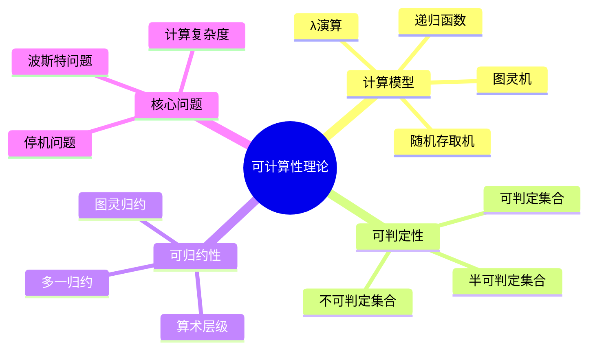
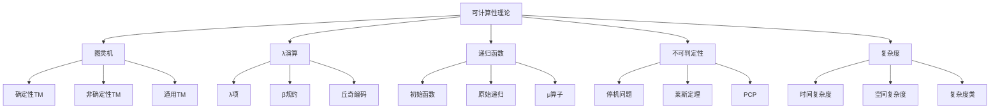

# 1.3 递归论与可计算性

## 目录

- [1.3 递归论与可计算性](#13-递归论与可计算性)
  - [目录](#目录)
  - [1.3.1 引言](#131-引言)
  - [1.3.2 图灵机](#132-图灵机)
    - [1.3.2.1 形式化定义](#1321-形式化定义)
    - [1.3.2.2 转移函数的操作](#1322-转移函数的操作)
    - [1.3.2.3 图灵机变体](#1323-图灵机变体)
  - [1.3.3 λ演算](#133-λ演算)
    - [1.3.3.1 语法定义](#1331-语法定义)
    - [1.3.3.2 转换规则](#1332-转换规则)
    - [1.3.3.3 丘奇编码](#1333-丘奇编码)
  - [1.3.4 可计算函数](#134-可计算函数)
    - [1.3.4.1 部分递归函数](#1341-部分递归函数)
    - [1.3.4.2 丘奇-图灵论题](#1342-丘奇-图灵论题)
  - [1.3.5 不可判定性](#135-不可判定性)
    - [1.3.5.1 停机问题](#1351-停机问题)
    - [1.3.5.2 莱斯定理](#1352-莱斯定理)
    - [1.3.5.3 波斯特对应问题](#1353-波斯特对应问题)
    - [1.3.5.4 算术层级](#1354-算术层级)
  - [1.3.6 多表征视角](#136-多表征视角)
    - [概念图谱](#概念图谱)
    - [计算模型比较](#计算模型比较)
  - [参见](#参见)

---

## 1.3.1 引言

递归论(Recursion Theory)，又称可计算性理论(Computability Theory)，是研究"什么是可计算的"以及"计算的极限是什么"的数学分支。
它起源于20世纪30年代，由图灵、丘奇、哥德尔和克林等数学家共同发展。

可计算性的直观概念是：一个函数是可计算的，如果存在一个明确的、机械的过程（算法），能够对于每个输入在有限步骤内产生输出。



---

## 1.3.2 图灵机

### 1.3.2.1 形式化定义

**图灵机**是一个七元组 $M = (Q, \Sigma, \Gamma, \delta, q_0, q_{accept}, q_{reject})$：

| 组件 | 说明 |
|------|------|
| $Q$ | 有限状态集 |
| $\Sigma$ | 输入字母表（不含空白符） |
| $\Gamma$ | 带字母表，$\Sigma \subset \Gamma$，含空白符$\sqcup$ |
| $\delta: Q \times \Gamma \to Q \times \Gamma \times \{L, R\}$ | 转移函数 |
| $q_0 \in Q$ | 初始状态 |
| $q_{accept} \in Q$ | 接受状态 |
| $q_{reject} \in Q$ | 拒绝状态，$q_{accept} \neq q_{reject}$ |

```haskell
data Direction = L | R deriving (Eq, Show)

data TM state symbol = TM {
    states :: [state],
    inputAlphabet :: [symbol],
    tapeAlphabet :: [symbol],
    transition :: state -> symbol -> Maybe (state, symbol, Direction),
    startState :: state,
    acceptState :: state,
    rejectState :: state
}

type Tape symbol = ([symbol], symbol, [symbol])  -- (左, 当前, 右)

type Configuration state symbol = (state, Tape symbol)
```

### 1.3.2.2 转移函数的操作

转移函数 $\delta(q, a) = (q', b, D)$ 的含义：

- 当前状态为$q$，读写头读取符号$a$
- 转移到状态$q'$
- 将$a$改写为$b$
- 读写头向$D$方向移动（$L$向左，$R$向右）

```haskell
step :: TM s sy -> Configuration s sy -> Maybe (Configuration s sy)
step tm (q, (left, current, right)) = do
    (q', b, d) <- transition tm q current
    let (left', current', right') = case d of
            L -> case left of
                [] -> ([], blank, b:right)
                (x:xs) -> (xs, x, b:right)
            R -> case right of
                [] -> (b:left, blank, [])
                (x:xs) -> (b:left, x, xs)
    return (q', (left', current', right'))
```

### 1.3.2.3 图灵机变体

| 变体 | 描述 | 计算能力 |
|------|------|----------|
| **多带图灵机** | 具有多个读写带 | 等价于单带 |
| **非确定性图灵机** | 转移函数可多值 | 等价于确定性 |
| **无限带图灵机** | 双向无限带 | 等价于单向 |
| **通用图灵机** | 可模拟任何图灵机 | 存在性定理 |

---

## 1.3.3 λ演算

### 1.3.3.1 语法定义

**λ项**的归纳定义：

$$e ::= x \mid \lambda x.e \mid e_1\, e_2$$

| 构造 | 名称 | 说明 |
|------|------|------|
| $x$ | 变元 | 变量引用 |
| $\lambda x.e$ | λ抽象 | 函数定义 |
| $e_1\, e_2$ | 应用 | 函数调用 |

```haskell
data Lambda = Var String
            | Abs String Lambda    -- λx.e
            | App Lambda Lambda    -- e1 e2
            deriving (Eq, Show)
```

### 1.3.3.2 转换规则

**α转换**（变元重命名）：
$$\lambda x.e \equiv_\alpha \lambda y.e[y/x] \quad (y \notin FV(e))$$

**β规约**（函数应用）：
$$(\lambda x.e_1)\, e_2 \to_\beta e_1[e_2/x]$$

**η转换**（外延性）：
$$\lambda x.(e\, x) \equiv_\eta e \quad (x \notin FV(e))$$

```haskell
subst :: String -> Lambda -> Lambda -> Lambda
subst x e (Var y) | x == y = e
                  | otherwise = Var y
subst x e (Abs y e') | x == y = Abs y e'
                     | y `notElem` freeVars e = Abs y (subst x e e')
                     | otherwise = let y' = fresh y (freeVars e ++ freeVars e')
                                   in Abs y' (subst x e (subst y (Var y') e'))
subst x e (App e1 e2) = App (subst x e e1) (subst x e e2)

betaReduce :: Lambda -> Lambda
betaReduce (App (Abs x e) e2) = subst x e2 e
betaReduce e = e
```

### 1.3.3.3 丘奇编码

**自然数编码**（丘奇数）：
$$\overline{n} = \lambda f.\lambda x.f^n x$$

| 数字 | λ表达式 |
|------|---------|
| 0 | $\lambda f.\lambda x.x$ |
| 1 | $\lambda f.\lambda x.f x$ |
| 2 | $\lambda f.\lambda x.f (f x)$ |
| 3 | $\lambda f.\lambda x.f (f (f x))$ |

**后继函数**：
$$\text{SUCC} = \lambda n.\lambda f.\lambda x.f (n f x)$$

**加法**：
$$\text{ADD} = \lambda m.\lambda n.\lambda f.\lambda x.m f (n f x)$$

**乘法**：
$$\text{MUL} = \lambda m.\lambda n.\lambda f.m (n f)$$

---

## 1.3.4 可计算函数

### 1.3.4.1 部分递归函数

**初始函数**：

1. **零函数**：$Z(x) = 0$
2. **后继函数**：$S(x) = x + 1$
3. **投影函数**：$P_i^n(x_1, \ldots, x_n) = x_i$

**构造规则**：

| 规则 | 定义 |
|------|------|
| **复合** | $h(x) = f(g_1(x), \ldots, g_m(x))$ |
| **原始递归** | $h(0, x) = f(x)$；$h(n+1, x) = g(n, x, h(n, x))$ |
| **μ算子** | $h(x) = \mu y. f(x, y) = 0$（最小y使得$f(x,y)=0$） |

```haskell
-- 部分递归函数的类型
data PRF = Zero
         | Succ
         | Proj Int Int      -- Proj n i: 从n个参数中投影第i个
         | Comp PRF [PRF]    -- 复合
         | Rec PRF PRF       -- 原始递归
         | Mu PRF            -- μ算子
         deriving (Eq, Show)

eval :: PRF -> [Integer] -> Maybe Integer
eval Zero _ = Just 0
eval Succ [x] = Just (x + 1)
eval (Proj n i) xs | length xs == n = Just (xs !! (i - 1))
                   | otherwise = Nothing
eval (Comp f gs) xs = do
    ys <- mapM (\g -> eval g xs) gs
    eval f ys
eval (Rec f g) (0:xs) = eval f xs
eval (Rec f g) (n:xs) = do
    prev <- eval (Rec f g) (n-1:xs)
    eval g (n-1:xs ++ [prev])
eval (Mu f) xs = findMu f xs 0
  where
    findMu f xs y = do
        result <- eval f (xs ++ [y])
        if result == 0 then Just y else findMu f xs (y + 1)
```

### 1.3.4.2 丘奇-图灵论题

**丘奇-图灵论题**：一个函数是"可有效计算的"当且仅当它是图灵机可计算的（或等价地，λ可定义/部分递归的）。

**等价的计算模型**：

- 图灵机
- λ演算
- 部分递归函数
- 随机存取机(RAM)
- 寄存器机
- 细胞自动机（某些类别）

---

## 1.3.5 不可判定性

### 1.3.5.1 停机问题

**停机问题**：给定图灵机$M$和输入$w$，判定$M$在输入$w$上是否停机。

**定理 1.3.5.1**：停机问题是不可判定的。

**证明**：假设存在判定停机的图灵机$H$。构造图灵机$D$：

```
D = "在输入⟨M⟩上：
     1. 运行H(⟨M⟩, ⟨M⟩)
     2. 若H接受，则死循环
     3. 若H拒绝，则接受"
```

考虑$D$在输入$\langle D \rangle$上的行为：

- 若$D$停机，则$H(\langle D \rangle, \langle D \rangle)$接受，则$D$死循环（矛盾）
- 若$D$不停机，则$H(\langle D \rangle, \langle D \rangle)$拒绝，则$D$接受（矛盾）

```haskell
-- 停机问题的对角线论证
data Halting = Halts | DoesNotHalt deriving (Eq, Show)

-- 假设存在停机判定器
hypotheticalHaltingOracle :: TM s sy -> [sy] -> Halting
hypotheticalHaltingOracle = undefined  -- 假设存在

-- 构造对角线机器
diagonalMachine :: TM () ()
diagonalMachine = TM {
    states = [0, 1],
    -- 若停机判定器说会停机，则进入死循环
    -- 若说不停机，则停机接受
    transition = \q _ -> undefined,  -- 具体实现依赖于编码
    startState = 0,
    acceptState = 1,
    rejectState = 1
}

-- 导出矛盾
paradox :: a
paradox = paradox  -- D(⟨D⟩)导致逻辑矛盾
```

### 1.3.5.2 莱斯定理

**定理 1.3.5.2 (Rice定理)**：任何关于程序语义的非平凡性质都是不可判定的。

形式化：设$P$是部分可计算函数的集合，$S \subseteq P$是非平凡集合（即$S \neq \emptyset$且$S \neq P$），则语言$L = \{\langle M \rangle \mid M\text{计算的函数在}S\text{中}\}$是不可判定的。

### 1.3.5.3 波斯特对应问题

**波斯特对应问题(PCP)**：给定有限对集合$P = \{(x_1, y_1), \ldots, (x_n, y_n)\}$，其中$x_i, y_i \in \Sigma^*$，判定是否存在序列$i_1, \ldots, i_k$使得$x_{i_1}x_{i_2}\cdots x_{i_k} = y_{i_1}y_{i_2}\cdots y_{i_k}$。

**定理 1.3.5.3**：PCP是不可判定的。

### 1.3.5.4 算术层级

| 层级 | 定义 | 示例 |
|------|------|------|
| $\Sigma_1^0$ | $\exists x_1 \cdots \exists x_n R(x_1, \ldots, x_n)$ | 停机问题 |
| $\Pi_1^0$ | $\forall x_1 \cdots \forall x_n R(x_1, \ldots, x_n)$ | 全称停机问题 |
| $\Sigma_{n+1}^0$ | $\exists x_1 \cdots \exists x_n \forall y_1 \cdots \forall y_m \varphi$ | - |
| $\Pi_{n+1}^0$ | $\forall x_1 \cdots \forall x_n \exists y_1 \cdots \exists y_m \varphi$ | - |
| $\Delta_n^0$ | $\Sigma_n^0 \cap \Pi_n^0$ | - |

---

## 1.3.6 多表征视角

### 概念图谱



### 计算模型比较

| 特性 | 图灵机 | λ演算 | 递归函数 |
|------|--------|-------|----------|
| 基础 | 状态转移 | 函数抽象/应用 | 函数组合 |
| 控制 | 显式状态 | β规约 | 递归调用 |
| 数据 | 符号串 | 高阶函数 | 自然数 |
| 直观性 | 机械过程 | 数学函数 | 算术构造 |

---

## 参见

- [集合论基础](./01.1_集合论基础.md) — 集合的递归定义
- [数理逻辑](./01.2_数理逻辑.md) — 形式系统与可判定性
- [证明论基础](./01.4_证明论基础.md) — 证明的可计算性
- [抽象代数](../02_代数学/02.1_抽象代数.md) — 代数结构的计算性质
- [泛函分析](../04_分析学/04.3_泛函分析.md) — 算子的可计算性
