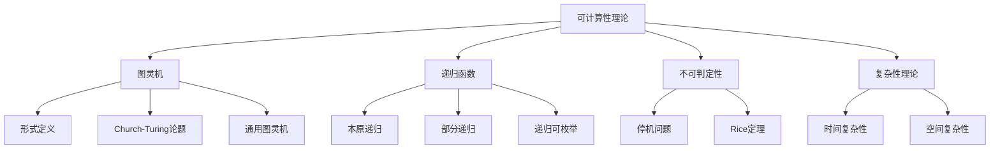

# 1.4 可计算性理论

---

📌 **内容摘要**

本文档深入探讨可计算性理论的核心原理和关键方法。内容涵盖元数学领域的主要知识点，包括谓词逻辑, 图灵机, 可计算性, 相继式, 复杂性等关键主题。适合初学者建立基础知识体系。

**关键词**: 谓词逻辑, 图灵机, 可计算性, 相继式, 复杂性, 元数学, 命题逻辑, 数理逻辑

📚 **学习目标**

- 理解可计算性的基本概念和核心原理
- 掌握相关术语和符号表示
- 建立该领域的系统性知识框架

🎯 **难度级别**: 初级

⏱️ **预计阅读时间**: 15分钟

**前置知识**: 基础数学知识

---


> 形式化数学基础 | 元数学基础
>
> 交叉引用：[1.2 数理逻辑](./01.2_数理逻辑.md) | [1.3 证明论基础](./01.3_证明论基础.md)

## 1.4.1 引言

可计算性理论研究什么是算法可计算的、计算的复杂性以及不可计算问题的存在性。本章形式化介绍图灵机、递归函数和停机问题。



## 1.4.2 图灵机

### 1.4.2.1 形式定义

**定义 1.4.1**（确定性图灵机）
图灵机是七元组 $M = (Q, \Sigma, \Gamma, \delta, q_0, q_{\text{accept}}, q_{\text{reject}})$，其中：

- $Q$：有限状态集
- $\Sigma$：输入字母表，$\sqcup \notin \Sigma$（空白符）
- $\Gamma$：带字母表，$\Sigma \subseteq \Gamma$，$\sqcup \in \Gamma$
- $\delta: Q \times \Gamma \to Q \times \Gamma \times \{L, R\}$：转移函数
- $q_0 \in Q$：初始状态
- $q_{\text{accept}}, q_{\text{reject}} \in Q$：接受/拒绝状态，$q_{\text{accept}} \neq q_{\text{reject}}$

**定义 1.4.2**（格局/配置）
格局是三元组 $(q, w, i)$，其中：

- $q \in Q$：当前状态
- $w \in \Gamma^*$：带内容
- $i \in \mathbb{N}$：读写头位置

**定义 1.4.3**（计算步）
格局 $C = (q, w, i)$ 一步转移到 $C' = (q', w', i')$，记作 $C \vdash C'$，如果：
设 $\delta(q, w[i]) = (q', a, d)$，则：

- $w'$ 在位置 $i$ 处替换为 $a$
- $i' = i - 1$ 若 $d = L$（且 $i > 0$），$i' = i + 1$ 若 $d = R$

### 1.4.2.2 图灵机计算

**定义 1.4.4**（停机与接受）

- $M$ 在输入 $x$ 上**停机**，如果存在有限格局序列 $C_0, C_1, \ldots, C_n$ 使 $C_0 \vdash C_1 \vdash \cdots \vdash C_n$ 且 $C_n$ 的状态为 $q_{\text{accept}}$ 或 $q_{\text{reject}}$
- $M$ **接受** $x$，如果停机于 $q_{\text{accept}}$
- $M$ **拒绝** $x$，如果停机于 $q_{\text{reject}}$ 或永不停机

**定义 1.4.5**（图灵机计算的语言）
$$L(M) = \{x \in \Sigma^* \mid M \text{ 接受 } x\}$$

**定义 1.4.6**（可判定语言）
语言 $L$ 是**可判定的**（decidable/recursive），如果存在图灵机 $M$ 使 $L = L(M)$ 且 $M$ 在所有输入上停机。

**定义 1.4.7**（递归可枚举语言）
语言 $L$ 是**递归可枚举的**（recursively enumerable/semidecidable），如果存在图灵机 $M$ 使 $L = L(M)$（$M$ 可在非 $L$ 的输入上永不停机）。

### 1.4.2.3 Church-Turing论题

**论题 1.4.1**（Church-Turing论题）
直观上算法可计算的函数恰好是图灵机可计算的函数。

**注**：这是论题而非定理，因为它涉及直观概念"算法"的形式化。然而，所有合理的计算模型（lambda演算、递归函数、寄存器机等）都被证明与图灵机等价。

### 1.4.2.4 通用图灵机

**定理 1.4.1**（通用图灵机存在性）
存在图灵机 $U$，对任意图灵机 $M$ 和输入 $x$，$U(\langle M, x \rangle) = M(x)$。

其中 $\langle M, x \rangle$ 是 $M$ 和 $x$ 的编码。

**证明概要**：
$U$ 模拟 $M$ 在 $x$ 上的执行：

1. 检查输入编码的有效性
2. 在带上维护 $M$ 的当前格局
3. 根据 $\delta$ 反复更新格局
4. 当 $M$ 停机时，$U$ 以相同结果停机
$\square$

## 1.4.3 递归函数

### 1.4.3.1 本原递归函数

**定义 1.4.8**（本原递归函数类 PR）
PR 是包含以下基本函数且对以下规则封闭的最小函数类：

**基本函数**：

- 零函数：$Z(x) = 0$
- 后继函数：$S(x) = x + 1$
- 投影函数：$P_i^n(x_1, \ldots, x_n) = x_i$

**构造规则**：

- **复合**：若 $g, h_1, \ldots, h_m \in \text{PR}$，则 $f(x) = g(h_1(x), \ldots, h_m(x)) \in \text{PR}$
- **本原递归**：若 $g, h \in \text{PR}$，则 $f$ 由以下定义：
  $$f(0, x) = g(x)$$
  $$f(n+1, x) = h(n, x, f(n, x))$$

**定理 1.4.2**（PR包含的函数）
以下函数是本原递归的：

- 加法、乘法、幂运算
- 前驱：$\text{pred}(0) = 0$，$\text{pred}(n+1) = n$
- 截断减法：$n \dot{-} m = \max(n-m, 0)$
- 比较函数：$\text{eq}(n, m)$、$\text{lt}(n, m)$

### 1.4.3.2 部分递归函数

**定义 1.4.9**（mu-算子）
对全函数 $f: \mathbb{N}^{n+1} \to \mathbb{N}$，定义：
$$\mu y. f(x, y) = \text{最小的 } y \text{ 使 } f(x, y) = 0 \text{（若存在），否则无定义}$$

**定义 1.4.10**（部分递归函数类 R）
R 是包含基本函数且对复合、本原递归和mu-算子封闭的最小函数类。

**定理 1.4.3**（Kleene范式定理）
每个部分递归函数 $f$ 可表示为：
$$f(x) = U(\mu y. T(e, x, y))$$
其中 $T$ 是Kleene T-谓词（原始递归），$U$ 是本原递归，$e$ 是 $f$ 的哥德尔数。

### 1.4.3.3 递归集与递归可枚举集

**定义 1.4.11**（特征函数）
集合 $A \subseteq \mathbb{N}$ 的**特征函数**：
$$\chi_A(x) = \begin{cases} 1 & x \in A \\ 0 & x \notin A \end{cases}$$

**定义 1.4.12**（半特征函数）
$$\tilde{\chi}_A(x) = \begin{cases} 1 & x \in A \\ \uparrow & x \notin A \end{cases}$$
（$\uparrow$ 表示无定义/发散）

**定理 1.4.4**（递归集的刻画）
$A$ 是递归集当且仅当 $\chi_A$ 是（全）递归函数。

**定理 1.4.5**（递归可枚举集的等价刻画）
以下等价：

1. $A$ 是递归可枚举集
2. $A = \emptyset$ 或 $A = \text{range}(f)$ 对某全递归函数 $f$
3. $A = \{x \mid \exists y. R(x, y)\}$ 对某原始递归关系 $R$
4. $\tilde{\chi}_A$ 是部分递归函数

## 1.4.4 不可判定性

### 1.4.4.1 对角线方法

**定理 1.4.6**（Cantor对角线论证）
集合 $2^{\mathbb{N}} = \{f \mid f: \mathbb{N} \to \{0, 1\}\}$ 是不可数的。

**证明**：
假设 $2^{\mathbb{N}}$ 可数，枚举为 $f_0, f_1, f_2, \ldots$。
定义 $g(n) = 1 - f_n(n)$。
则对所有 $n$，$g \neq f_n$（因为 $g(n) \neq f_n(n)$）。
矛盾。
$\square$

### 1.4.4.2 停机问题

**定义 1.4.13**（停机问题）
$$HALT = \{\langle M, x \rangle \mid M \text{ 在输入 } x \text{ 上停机}\}$$

**定理 1.4.7**（停机问题不可判定）
$HALT$ 不是递归集。

**证明**：
假设 $HALT$ 可判定，存在图灵机 $H$ 判定 $HALT$。

构造图灵机 $D$：

- 输入 $\langle M \rangle$
- 模拟 $H(\langle M, \langle M \rangle \rangle)$
- 若 $H$ 接受（即 $M(\langle M \rangle)$ 停机），则 $D$ 进入无限循环
- 若 $H$ 拒绝（即 $M(\langle M \rangle)$ 不停机），则 $D$ 停机

考虑 $D(\langle D \rangle)$：

- 若 $D(\langle D \rangle)$ 停机，则 $H$ 接受 $\langle D, \langle D \rangle \rangle$，故 $D$ 应进入无限循环，矛盾
- 若 $D(\langle D \rangle)$ 不停机，则 $H$ 拒绝，故 $D$ 应停机，矛盾

因此 $HALT$ 不可判定。
$\square$

### 1.4.4.3 Rice定理

**定理 1.4.8**（Rice定理）
设 $\mathcal{C}$ 是非平凡（既非空也非全体）的图灵机可计算函数类，则：
$$L_{\mathcal{C}} = \{\langle M \rangle \mid M \text{ 计算的函数 } \in \mathcal{C}\}$$
不是递归集。

**证明**：
假设 $L_{\mathcal{C}}$ 可判定，存在图灵机 $R$ 判定之。

不妨设空函数 $\emptyset \notin \mathcal{C}$（否则考虑补集）。取某 $f \in \mathcal{C}$，设 $M_f$ 计算 $f$。

构造图灵机 $M'$：输入 $x$，

1. 模拟 $M$ 在 $\langle M \rangle$ 上运行
2. 若 $M(\langle M \rangle)$ 停机，则模拟 $M_f(x)$ 并输出结果
3. 否则永不停机

若 $M(\langle M \rangle)$ 停机，则 $M'$ 计算 $f$，故 $\langle M' \rangle \in L_{\mathcal{C}}$；
若 $M(\langle M \rangle)$ 不停机，则 $M'$ 计算 $\emptyset$，故 $\langle M' \rangle \notin L_{\mathcal{C}}$。

用 $R$ 判定 $\langle M' \rangle \in L_{\mathcal{C}}$ 即可判定 $HALT$，矛盾。
$\square$

**推论 1.4.1**
以下问题均不可判定：

- 程序是否计算恒零函数
- 程序是否对某输入停机
- 程序计算的函数是否全函数
- 两个程序是否计算相同函数

### 1.4.4.4 归约与完备性

**定义 1.4.14**（多一归约）
$A \leq_m B$（$A$ 多一归约到 $B$），如果存在全递归函数 $f$ 使 $x \in A \Leftrightarrow f(x) \in B$。

**定义 1.4.15**（完备性）
集合 $A$ 是**递归可枚举完备**的，如果：

1. $A$ 是递归可枚举的
2. 对所有递归可枚举集 $B$，$B \leq_m A$

**定理 1.4.9**（$HALT$ 是R.E.-完备）
$HALT$ 是递归可枚举完备的。

## 1.4.5 复杂性理论初步

### 1.4.5.1 时间复杂性

**定义 1.4.16**（时间复杂性类）

- $\text{TIME}(f(n)) = \{L \mid \exists \text{ TM } M \text{ 判定 } L, M \text{ 在时间 } O(f(n)) \text{ 内停机}\}$
- $\text{P} = \bigcup_{k} \text{TIME}(n^k)$
- $\text{EXP} = \bigcup_{k} \text{TIME}(2^{n^k})$

**定义 1.4.17**（非确定性时间）

- $\text{NTIME}(f(n))$：非确定性图灵机在 $O(f(n))$ 步内接受
- $\text{NP} = \bigcup_{k} \text{NTIME}(n^k)$

**定理 1.4.10**（P vs NP问题）
$\text{P} = \text{NP}$ 是否成立是数学中最著名的未解决问题之一。

### 1.4.5.2 空间复杂性

**定义 1.4.18**（空间复杂性类）

- $\text{SPACE}(f(n))$：图灵机使用 $O(f(n))$ 个带格判定语言
- $\text{L} = \text{SPACE}(\log n)$
- $\text{PSPACE} = \bigcup_{k} \text{SPACE}(n^k)$

**定理 1.4.11**（Savitch定理）
$\text{NSPACE}(f(n)) \subseteq \text{SPACE}(f(n)^2)$ 对 $f(n) \geq \log n$。

**推论 1.4.2**
$\text{PSPACE} = \text{NPSPACE}$

### 1.4.5.3 复杂性层次

**定理 1.4.12**（时间层次定理）
若 $f$ 时间可构造且 $f(n) \geq n$，则：
$$\text{TIME}(f(n)) \subsetneq \text{TIME}(f(n)^3)$$

**推论 1.4.3**
$\text{P} \subsetneq \text{EXP}$

**定理 1.4.13**（空间层次定理）
类似结果对空间复杂性成立。

## 1.4.6 Lean 4 形式化

```lean4
import Mathlib

-- 图灵机的简单模型（寄存器机模型）
inductive Instruction
  | zero : ℕ → Instruction
  | succ : ℕ → Instruction
  | jump : ℕ → ℕ → ℕ → Instruction

-- 程序是指令列表
def Program := List Instruction

-- 格局：程序计数器 + 寄存器状态
def Config := ℕ × (ℕ → ℕ)

-- 部分递归函数的定义
inductive PartialRecursive : ℕ → Type
  | zero : PartialRecursive 1
  | succ : PartialRecursive 1
  | proj (n i : ℕ) (h : i < n) : PartialRecursive n
  | comp (m n : ℕ) (f : PartialRecursive m) (gs : Fin m → PartialRecursive n) : PartialRecursive n
  | primrec (n : ℕ) (g : PartialRecursive n) (h : PartialRecursive (n + 2)) : PartialRecursive (n + 1)
  | minimization (n : ℕ) (f : PartialRecursive (n + 1)) : PartialRecursive n

-- 停机问题的不可判定性声明为公理（需要元理论证明）
axiom halt_undecidable : ¬∃ (f : ℕ → Bool), ∀ (e x : ℕ),
  f (Nat.pair e x) = true ↔ ∃ (y : ℕ), PartialRecursive.eval e x = some y

-- 注：实际证明需要在元数学中完成
```

## 1.4.7 参考文献

1. Turing, A. M. (1936). On computable numbers, with an application to the Entscheidungsproblem. _Proceedings of the London Mathematical Society_, 42(2), 230-265.
2. Kleene, S. C. (1952). _Introduction to Metamathematics_. North-Holland.
3. Rogers, H. (1987). _Theory of Recursive Functions and Effective Computability_ (2nd ed.). MIT Press.
4. Sipser, M. (2013). _Introduction to the Theory of Computation_ (3rd ed.). Cengage Learning.
5. Arora, S., & Barak, B. (2009). _Computational Complexity: A Modern Approach_. Cambridge University Press.

---

## 📚 延伸阅读

- [01.4 图灵机与计算](../../02_形式语言/01_形式语言基础/01.4_图灵机与计算.md)
- [1.3 证明论基础](../01_元数学基础/01.3_证明论基础.md)
- [1.4 证明论基础](../01_元数学基础/01.4_证明论基础.md)
- [04.2 可计算性理论](../../05_形式化理论/04_计算理论/04.2_可计算性.md)
- [1.2 数理逻辑](../01_元数学基础/01.2_数理逻辑.md)
