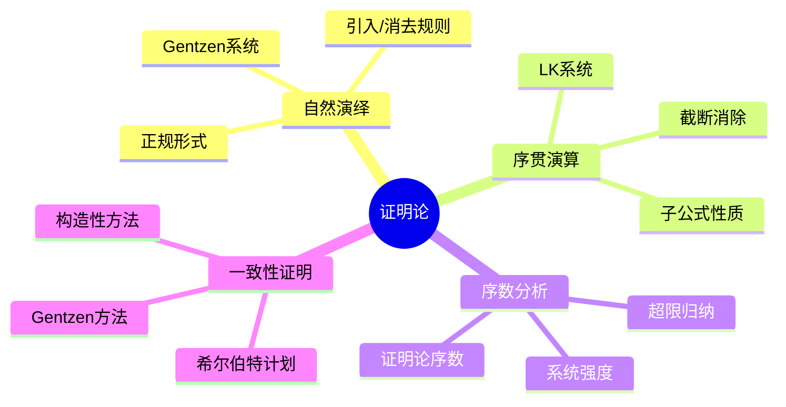
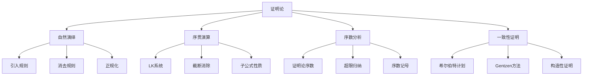

# 1.4 证明论基础

## 目录

- [1.4 证明论基础](#14-证明论基础)
  - [目录](#目录)
  - [1.4.1 引言](#141-引言)
  - [1.4.2 自然演绎系统](#142-自然演绎系统)
    - [1.4.2.1 系统结构](#1421-系统结构)
    - [1.4.2.2 逻辑连接词的规则](#1422-逻辑连接词的规则)
    - [1.4.2.3 量词规则](#1423-量词规则)
    - [1.4.2.4 正规形式](#1424-正规形式)
  - [1.4.3 序贯演算](#143-序贯演算)
    - [1.4.3.1 序贯概念](#1431-序贯概念)
    - [1.4.3.2 LK系统规则](#1432-lk系统规则)
    - [1.4.3.3 逻辑规则](#1433-逻辑规则)
    - [1.4.3.4 截断消除定理](#1434-截断消除定理)
    - [定理 1.4.3.2 (子公式性质)](#定理-1432-子公式性质)
  - [1.4.4 序数分析](#144-序数分析)
    - [1.4.4.1 证明论序数](#1441-证明论序数)
    - [1.4.4.2 康托尔正规形式](#1442-康托尔正规形式)
    - [1.4.4.3 序数记号系统](#1443-序数记号系统)
  - [1.4.5 一致性证明](#145-一致性证明)
    - [1.4.5.1 希尔伯特计划](#1451-希尔伯特计划)
    - [1.4.5.2 Gentzen对PA一致性的证明](#1452-gentzen对pa一致性的证明)
    - [1.4.5.3 构造性方法](#1453-构造性方法)
  - [1.4.6 多表征视角](#146-多表征视角)
    - [概念图谱](#概念图谱)
    - [证明系统比较](#证明系统比较)
  - [参见](#参见)

---

## 1.4.1 引言

证明论(Proof Theory)是数理逻辑的核心分支之一，由大卫希尔伯特(David Hilbert)在20世纪20年代创立。
证明论研究形式证明的结构、性质和变换，关注"什么是证明"以及"证明能告诉我们什么"。

证明论的核心目标包括：

- 分析形式系统的证明结构
- 研究证明的正规化与简化
- 通过序数分析度量系统强度
- 证明数学理论的一致性



---

## 1.4.2 自然演绎系统

### 1.4.2.1 系统结构

自然演绎(Natural Deduction)由格哈德根岑(Gerhard Gentzen)于1935年提出，旨在贴近人类自然的推理方式。

**基本要素**：

- **假设**：推导的出发点，标记为[phi]
- **结论**：推导的结果
- **推理规则**：连接假设与结论的规则

```lean
inductive NDProof (Gamma : Context) : Formula to Prop
| ax (phi : Formula) (h : phi in Gamma) : NDProof Gamma phi
| and_intro {phi psi} : NDProof Gamma phi to NDProof Gamma psi to NDProof Gamma (phi.and psi)
| and_elim_left {phi psi} : NDProof Gamma (phi.and psi) to NDProof Gamma phi
| and_elim_right {phi psi} : NDProof Gamma (phi.and psi) to NDProof Gamma psi
| imp_intro {phi psi} : NDProof (Gamma.cons phi) psi to NDProof Gamma (phi.imp psi)
| imp_elim {phi psi} : NDProof Gamma phi to NDProof Gamma (phi.imp psi) to NDProof Gamma psi
| or_intro_left {phi psi} : NDProof Gamma phi to NDProof Gamma (phi.or psi)
| or_intro_right {phi psi} : NDProof Gamma psi to NDProof Gamma (phi.or psi)
| or_elim {phi psi chi} : NDProof Gamma (phi.or psi) to NDProof (Gamma.cons phi) chi to NDProof (Gamma.cons psi) chi to NDProof Gamma chi
```

### 1.4.2.2 逻辑连接词的规则

**合取(wedge)**：

$$frac{Gamma vdash phi quad Gamma vdash psi}{Gamma vdash phi wedge psi}(wedge I) quad frac{Gamma vdash phi wedge psi}{Gamma vdash phi}(wedge E_1) quad frac{Gamma vdash phi wedge psi}{Gamma vdash psi}(wedge E_2)$$

**析取(vee)**：

$$frac{Gamma vdash phi}{Gamma vdash phi vee psi}(vee I_1) quad frac{Gamma vdash psi}{Gamma vdash phi vee psi}(vee I_2) quad frac{Gamma vdash phi vee psi quad Gamma, phi vdash chi quad Gamma, psi vdash chi}{Gamma vdash chi}(vee E)$$

**蕴含(to)**：

$$frac{Gamma, phi vdash psi}{Gamma vdash phi to psi}(to I) quad frac{Gamma vdash phi quad Gamma vdash phi to psi}{Gamma vdash psi}(to E)$$

**否定(neg)**：

$$frac{Gamma, phi vdash bot}{Gamma vdash neg phi}(neg I) quad frac{Gamma vdash phi quad Gamma vdash neg phi}{Gamma vdash bot}(neg E)$$

### 1.4.2.3 量词规则

**全称量词(forall)**：

$$frac{Gamma vdash phi[t/x]}{Gamma vdash forall x phi}(forall I)^* quad frac{Gamma vdash forall x phi}{Gamma vdash phi[t/x]}(forall E)$$

*条件：x不在Gamma中自由出现

**存在量词(exists)**：

$$frac{Gamma vdash phi[t/x]}{Gamma vdash exists x phi}(exists I) quad frac{Gamma vdash exists x phi quad Gamma, phi[y/x] vdash psi}{Gamma vdash psi}(exists E)^*$$

*条件：y不在Gamma, psi中自由出现

### 1.4.2.4 正规形式

**正规证明(Normal Proof)**：不包含引入后紧跟消去的情况（即不包含"冗余步骤"）。

**定理 1.4.2.1 (正规化定理)**：任何证明都可以转换为正规证明。

**归约规则示例**：

$$frac{frac{vdots}{phi} quad frac{vdots}{psi}}{phi wedge psi}(wedge I) quad longrightarrow_{red} quad frac{vdots}{phi}$$

---

## 1.4.3 序贯演算

### 1.4.3.1 序贯概念

**序贯(Sequent)**：形如 Gamma vdash Delta 的表达式，其中Gamma, Delta是公式多重集。

**解释**：从假设Gamma可以推出结论Delta中至少一个。

### 1.4.3.2 LK系统规则

**结构规则**：

$$frac{}{phi vdash phi}(Id) quad frac{Gamma vdash Delta, phi quad phi, Gamma' vdash Delta'}{Gamma, Gamma' vdash Delta, Delta'}(Cut)$$

**弱化规则**：

$$frac{Gamma vdash Delta}{Gamma, phi vdash Delta}(WL) quad frac{Gamma vdash Delta}{Gamma vdash Delta, phi}(WR)$$

**收缩规则**：

$$frac{Gamma, phi, phi vdash Delta}{Gamma, phi vdash Delta}(CL) quad frac{Gamma vdash Delta, phi, phi}{Gamma vdash Delta, phi}(CR)$$

**交换规则**（在多重集表示中可省略）

### 1.4.3.3 逻辑规则

| 连接词 | 左规则 | 右规则 |
|--------|--------|--------|
| wedge | $$frac{Gamma, phi, psi vdash Delta}{Gamma, phi wedge psi vdash Delta}(L wedge)$$ | $$frac{Gamma vdash Delta, phi quad Gamma vdash Delta, psi}{Gamma vdash Delta, phi wedge psi}(R wedge)$$ |
| vee | $$frac{Gamma, phi vdash Delta quad Gamma, psi vdash Delta}{Gamma, phi vee psi vdash Delta}(L vee)$$ | $$frac{Gamma vdash Delta, phi, psi}{Gamma vdash Delta, phi vee psi}(R vee)$$ |
| to | $$frac{Gamma vdash Delta, phi quad Gamma, psi vdash Delta}{Gamma, phi to psi vdash Delta}(L to)$$ | $$frac{Gamma, phi vdash Delta, psi}{Gamma vdash Delta, phi to psi}(R to)$$ |
| neg | $$frac{Gamma vdash Delta, phi}{Gamma, neg phi vdash Delta}(L neg)$$ | $$frac{Gamma, phi vdash Delta}{Gamma vdash Delta, neg phi}(R neg)$$ |

### 1.4.3.4 截断消除定理

**定理 1.4.3.1 (Gentzen截断消除定理)**：若Gamma vdash Delta在LK中可证，则存在不使用Cut规则的证明。

**证明思路**：通过系统地消除证明中的Cut实例，将Cut"推"向公理，最终消除。

**截断度(Cut-rank)**：用于度量消除过程的复杂度。

```lean
theorem cut_elimination {L : Language} {Gamma Delta : Sequent L}
  (h : LK_derives Gamma Delta) : exists h' : LK_derives Gamma Delta, cut_free h' := by
  -- Gentzen的截断消除算法
  -- 基于截断度的归纳
  sorry
```

### 定理 1.4.3.2 (子公式性质)

截断消除后的证明中，所有出现的公式都是最终序贯中公式的子公式。

---

## 1.4.4 序数分析

### 1.4.4.1 证明论序数

**证明论序数**(Proof-theoretic ordinal)是度量形式系统证明强度的序数。

**定义**：系统T的证明论序数是使得T不能证明该序数超限递归原理的最小序数alpha。

| 系统 | 证明论序数 | 描述 |
|------|-----------|------|
| 一阶逻辑 | omega | 自然数 |
| 皮亚诺算术(PA) | varepsilon_0 | 第一个固定点：omega^{varepsilon_0} = varepsilon_0 |
| ATR_0 | Gamma_0 | 第一个不可达序数 |
| Pi^1_1-CA_0 | psi(Omega_omega) | 证明论大序数 |
| ZFC | 无（更大） | - |

### 1.4.4.2 康托尔正规形式

小于varepsilon_0的序数可唯一表示为：

$$alpha = omega^{beta_1} cdot n_1 + omega^{beta_2} cdot n_2 + cdots + omega^{beta_k} cdot n_k$$

其中alpha > beta_1 > beta_2 > cdots > beta_k，n_i in Nat^+。

### 1.4.4.3 序数记号系统

**Veblen层级**：

- varphi_0(alpha) = omega^alpha
- varphi_{beta+1}(alpha) = 第alpha个varphi_beta的不动点
- varphi_lambda(alpha) = varphi_{alpha}(alpha)（极限序数情形）

**大序数**：

- Gamma_0：第一个不可达序数，Gamma_0 = varphi_{Gamma_0}(0)
- psi(Omega_omega)： collapse序数

---

## 1.4.5 一致性证明

### 1.4.5.1 希尔伯特计划

**希尔伯特计划**的目标：

1. 将所有数学形式化为公理系统
2. 用有限主义方法证明系统的一致性
3. 证明系统的完备性

**哥德尔不完备性定理**的影响：

- 第一定理：足够强的系统无法证明自身的完备性
- 第二定理：足够强的系统无法证明自身的一致性（除非不一致）

### 1.4.5.2 Gentzen对PA一致性的证明

**定理 1.4.5.1**：皮亚诺算术(PA)是一致的。

**Gentzen的证明方法**：

1. **将PA证明翻译为序贯演算**

2. **定义证明的序数值**：对每个证明分配一个小于varepsilon_0的序数

3. **归约步骤降低序数**：每次化简证明时，序数值严格递减

4. **超限归纳**：通过varepsilon_0上的超限归纳，证明归约过程终止

5. **空序贯不可证**：若PA不一致，则可证vdash（空序贯），但通过分析这是不可能的

```lean
def proof_ordinal {Gamma Delta : Sequent L} (h : PA_derives Gamma Delta) : Ordinal :=
  sorry  -- 分配序数值

theorem ordinal_decreases {Gamma Delta} {h1 h2 : PA_derives Gamma Delta}
  (h_red : reduces h1 h2) : proof_ordinal h2 < proof_ordinal h1 :=
  sorry

theorem consistency_PA : neg(PA_derives [] []) := by
  -- 假设可证空序贯
  intro h
  -- 序数值小于epsilon_0
  have h_ord : proof_ordinal h < epsilon_0 := sorry
  -- 通过超限归纳证明归约终止
  -- 导出矛盾
  sorry
```

### 1.4.5.3 构造性方法

**构造性数学**对证明的特殊要求：

- 存在证明必须给出构造方法
- 排中律使用受限
- 双重否定消去受限

**构造性证明的优势**：

- 证明包含计算内容
- 可提取算法
- 更强的元数学性质

---

## 1.4.6 多表征视角

### 概念图谱



### 证明系统比较

| 特性 | 自然演绎 | 希尔伯特式 | 序贯演算 |
|------|----------|-----------|----------|
| 规则数量 | 多（每个连接词2个） | 少（3条公理+MP） | 中（结构+逻辑） |
| 直观性 | 高 | 低 | 中 |
| 元定理证明 | 中 | 难 | 易 |
| 子公式性质 | 无 | 无 | 有 |
| 应用 | 教学 | 元数学 | 自动化 |

---

## 参见

- [集合论基础](./01.1_集合论基础.md) — 超限归纳与良基关系
- [数理逻辑](./01.2_数理逻辑.md) — 形式系统与完备性
- [递归论与可计算性](./01.3_递归论与可计算性.md) — 证明的可计算性
- [实分析](../04_分析学/04.1_实分析.md) — 分析的构造性基础
- [范畴论代数](../02_代数学/02.3_范畴论代数.md) — 证明的范畴语义
