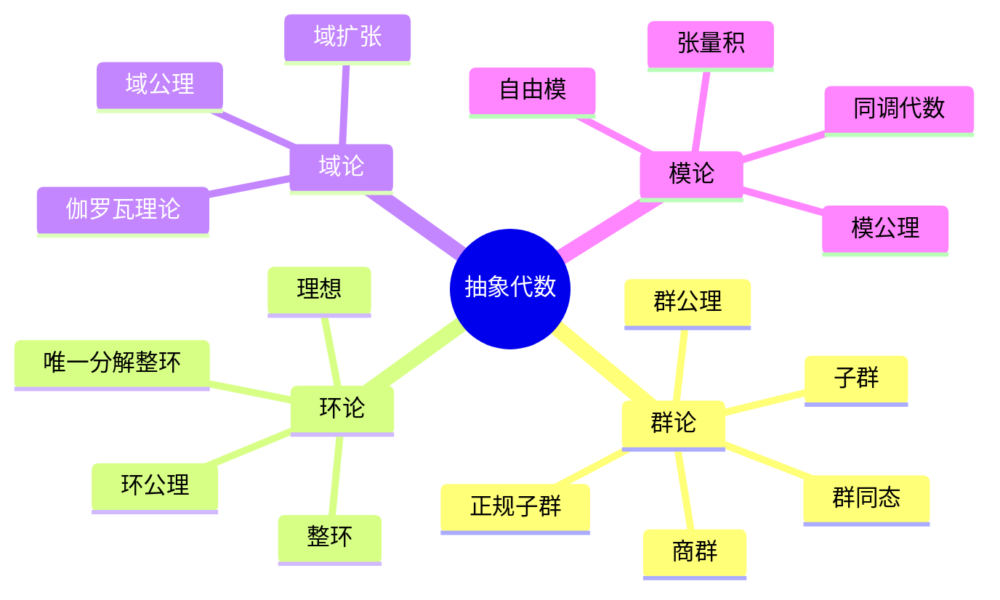
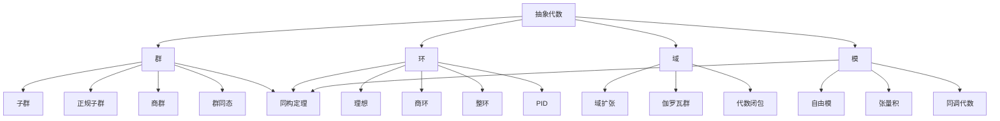

# 2.1 抽象代数

## 目录

- [2.1 抽象代数](#21-抽象代数)
  - [目录](#目录)
  - [2.1.1 引言](#211-引言)
  - [2.1.2 群论基础](#212-群论基础)
    - [2.1.2.1 群的定义](#2121-群的定义)
    - [2.1.2.2 群的例子](#2122-群的例子)
    - [2.1.2.3 子群与正规子群](#2123-子群与正规子群)
    - [2.1.2.4 商群与同态](#2124-商群与同态)
  - [2.1.3 环与域](#213-环与域)
    - [2.1.3.1 环的定义](#2131-环的定义)
    - [2.1.3.2 理想与商环](#2132-理想与商环)
    - [2.1.3.3 整环与域](#2133-整环与域)
  - [2.1.4 模论](#214-模论)
    - [2.1.4.1 模的定义](#2141-模的定义)
    - [2.1.4.2 自由模与张量积](#2142-自由模与张量积)
  - [2.1.5 代数结构同态](#215-代数结构同态)
    - [2.1.5.1 同态基本定理](#2151-同态基本定理)
    - [2.1.5.2 同构定理完整组](#2152-同构定理完整组)
  - [2.1.6 多表征视角](#216-多表征视角)
    - [概念图谱](#概念图谱)
    - [代数结构层次](#代数结构层次)
  - [参见](#参见)

---

## 2.1.1 引言

抽象代数(Abstract Algebra)研究代数结构的性质，通过公理化方法揭示数学对象的共同模式。
核心结构包括群、环、域和模等。

代数结构的演化：

- 19世纪：伽罗瓦创立群论
- 19世纪末：环、域概念形成
- 20世纪：模论、同调代数发展
- 现代：范畴论统一框架



---

## 2.1.2 群论基础

### 2.1.2.1 群的定义

**群(Group)**是一个二元组$(G, \cdot)$，其中$G$是集合，$\cdot: G \times G \to G$是二元运算，满足：

| 公理 | 形式化 | 说明 |
|------|--------|------|
| **封闭性** | $\forall a,b \in G, a \cdot b \in G$ | 运算结果仍在G中 |
| **结合律** | $\forall a,b,c \in G, (a \cdot b) \cdot c = a \cdot (b \cdot c)$ | 运算顺序可结合 |
| **单位元** | $\exists e \in G, \forall a \in G, e \cdot a = a \cdot e = a$ | 存在中性元素 |
| **逆元** | $\forall a \in G, \exists a^{-1} \in G, a \cdot a^{-1} = a^{-1} \cdot a = e$ | 每个元素可逆 |

```lean
class Group (G : Type*) where
  mul : G → G → G
  one : G
  inv : G → G
  mul_assoc : ∀ a b c, mul (mul a b) c = mul a (mul b c)
  one_mul : ∀ a, mul one a = a
  mul_one : ∀ a, mul a one = a
  mul_left_inv : ∀ a, mul (inv a) a = one
  mul_right_inv : ∀ a, mul a (inv a) = one

infixl:70 " * " => Group.mul
notation:max "𝟙" => Group.one
postfix:max "⁻¹" => Group.inv
```

### 2.1.2.2 群的例子

| 群 | 集合 | 运算 | 类型 |
|----|------|------|------|
| $(\mathbb{Z}, +)$ | 整数 | 加法 | 无限阿贝尔群 |
| $(\mathbb{Q}^*, \cdot)$ | 非零有理数 | 乘法 | 无限阿贝尔群 |
| $(\mathbb{Z}_n, +)$ | 模n剩余类 | 模加法 | 有限循环群 |
| $S_n$ | n元置换 | 置换复合 | 有限非阿贝尔群(n≥3) |
| $GL_n(\mathbb{R})$ | 可逆实矩阵 | 矩阵乘法 | 无限非阿贝尔群 |
| $D_n$ | 正n边形对称 | 变换复合 | 二面体群 |

### 2.1.2.3 子群与正规子群

**子群(Subgroup)**：$H \subseteq G$是子群，如果：

- $e \in H$
- $\forall a, b \in H, a \cdot b \in H$
- $\forall a \in H, a^{-1} \in H$

记作$H \leq G$。

**正规子群(Normal Subgroup)**：$N \trianglelefteq G$如果：
$$\forall n \in N, \forall g \in G, gng^{-1} \in N$$

或等价地：$gN = Ng$（左右陪集相等）

```lean
def is_subgroup {G : Type*} [Group G] (H : Set G) : Prop :=
  𝟙 ∈ H ∧
  ∀ a b, a ∈ H → b ∈ H → a * b ∈ H ∧
  ∀ a, a ∈ H → a⁻¹ ∈ H

def is_normal {G : Type*} [Group G] (N : Set G) : Prop :=
  is_subgroup N ∧
  ∀ n ∈ N, ∀ g : G, g * n * g⁻¹ ∈ N
```

### 2.1.2.4 商群与同态

**商群(Quotient Group)**：设$N \trianglelefteq G$，定义$G/N = \{gN \mid g \in G\}$，运算$(gN)(hN) = (gh)N$。

**群同态(Group Homomorphism)**：映射$\varphi: G \to H$满足：
$$\varphi(a \cdot_G b) = \varphi(a) \cdot_H \varphi(b)$$

**同态基本定理**：设$\varphi: G \to H$是同态，则：
$$G / \ker(\varphi) \cong \text{im}(\varphi)$$

```lean
structure GroupHom (G H : Type*) [Group G] [Group H] where
  toFun : G → H
  map_mul : ∀ a b, toFun (a * b) = toFun a * toFun b

def kernel {G H : Type*} [Group G] [Group H] (φ : GroupHom G H) : Set G :=
  {g | φ.toFun g = 𝟙}

def image {G H : Type*} [Group G] [Group H] (φ : GroupHom G H) : Set H :=
  {h | ∃ g, φ.toFun g = h}

theorem first_isomorphism_theorem {G H : Type*} [Group G] [Group H]
  (φ : GroupHom G H) :
  QuotientGroup G (kernel φ) ≅ image φ := by
  sorry
```

---

## 2.1.3 环与域

### 2.1.3.1 环的定义

**环(Ring)**是一个三元组$(R, +, \cdot)$，满足：

1. $(R, +)$是阿贝尔群
2. $(R, \cdot)$是半群（结合律）
3. 分配律：$a \cdot (b + c) = a \cdot b + a \cdot c$，$(b + c) \cdot a = b \cdot a + c \cdot a$

**含幺环**：存在乘法单位元$1 \in R$使得$1 \cdot a = a \cdot 1 = a$。

**交换环**：乘法满足交换律。

```lean
class Ring (R : Type*) where
  add : R → R → R
  mul : R → R → R
  zero : R
  one : R
  neg : R → R
  add_assoc : ∀ a b c, add (add a b) c = add a (add b c)
  add_comm : ∀ a b, add a b = add b a
  zero_add : ∀ a, add zero a = a
  add_left_inv : ∀ a, add (neg a) a = zero
  mul_assoc : ∀ a b c, mul (mul a b) c = mul a (mul b c)
  one_mul : ∀ a, mul one a = a
  mul_one : ∀ a, mul a one = a
  left_distrib : ∀ a b c, mul a (add b c) = add (mul a b) (mul a c)
  right_distrib : ∀ a b c, mul (add a b) c = add (mul a c) (mul b c)
```

### 2.1.3.2 理想与商环

**理想(Ideal)**：子集$I \subseteq R$满足：

1. $(I, +)$是$(R, +)$的子群
2. $\forall r \in R, \forall i \in I, r \cdot i \in I$（左理想）
3. $\forall r \in R, \forall i \in I, i \cdot r \in I$（右理想）

双边理想同时满足2和3。

**商环**：$R/I = \{r + I \mid r \in R\}$

### 2.1.3.3 整环与域

| 结构 | 定义 | 例子 |
|------|------|------|
| **整环** | 无零因子的交换含幺环 | $\mathbb{Z}, \mathbb{Z}[x]$ |
| **主理想整环(PID)** | 每个理想都是主理想 | $\mathbb{Z}, F[x]$ |
| **唯一分解整环(UFD)** | 唯一因子分解 | $\mathbb{Z}[x], F[x,y]$ |
| **欧几里得整环** | 带欧几里得除法 | $\mathbb{Z}, F[x]$ |
| **域** | 非零元都可逆的交换环 | $\mathbb{Q}, \mathbb{R}, \mathbb{C}, \mathbb{F}_p$ |

**域的定义**：交换含幺环$F$满足$F^* = F \setminus \{0\}$在乘法下成群。

```lean
class Field (F : Type*) extends Ring F where
  inv : F → F
  mul_left_inv : ∀ a, a ≠ zero → mul (inv a) a = one
  mul_right_inv : ∀ a, a ≠ zero → mul a (inv a) = one
  mul_comm : ∀ a b, mul a b = mul b a
```

---

## 2.1.4 模论

### 2.1.4.1 模的定义

**模(Module)**：设$R$是环，$R$-模是阿贝尔群$(M, +)$配备数乘$R \times M \to M$满足：

1. $r \cdot (m_1 + m_2) = r \cdot m_1 + r \cdot m_2$
2. $(r_1 + r_2) \cdot m = r_1 \cdot m + r_2 \cdot m$
3. $(r_1 \cdot r_2) \cdot m = r_1 \cdot (r_2 \cdot m)$
4. $1 \cdot m = m$（若$R$含幺）

```lean
class Module (R : Type*) [Ring R] (M : Type*) [AddCommGroup M] where
  smul : R → M → M
  smul_add : ∀ r m₁ m₂, smul r (m₁ + m₂) = smul r m₁ + smul r m₂
  add_smul : ∀ r₁ r₂ m, smul (r₁ + r₂) m = smul r₁ m + smul r₂ m
  mul_smul : ∀ r₁ r₂ m, smul (r₁ * r₂) m = smul r₁ (smul r₂ m)
  one_smul : ∀ m, smul 1 m = m

infixr:73 " • " => Module.smul
```

### 2.1.4.2 自由模与张量积

**自由模(Free Module)**：同构于$R^n$的模，具有基。

**张量积(Tensor Product)**：$R$-模$M$和$N$的张量积$M \otimes_R N$是满足泛性质的模。

**泛性质**：对任意双线性映射$f: M \times N \to P$，存在唯一的线性映射$\tilde{f}: M \otimes_R N \to P$使得$f = \tilde{f} \circ \otimes$。

---

## 2.1.5 代数结构同态

### 2.1.5.1 同态基本定理

| 结构 | 第一同构定理 |
|------|-------------|
| 群 | $G/\ker(\varphi) \cong \text{im}(\varphi)$ |
| 环 | $R/\ker(\varphi) \cong \text{im}(\varphi)$ |
| 模 | $M/\ker(\varphi) \cong \text{im}(\varphi)$ |

### 2.1.5.2 同构定理完整组

**第一同构定理**：如上所述。

**第二同构定理**：$H/(H \cap N) \cong HN/N$

**第三同构定理**：$(G/N)/(H/N) \cong G/H$

**对应定理**：$G$的子群与$G/N$的子群一一对应。

---

## 2.1.6 多表征视角

### 概念图谱



### 代数结构层次

| 结构 | 加法结构 | 乘法结构 | 分配律 |
|------|---------|---------|--------|
| 半群 | - | 半群 | - |
| 幺半群 | - | 幺半群 | - |
| 群 | 群 | - | - |
| 环 | 阿贝尔群 | 半群 | 是 |
| 含幺环 | 阿贝尔群 | 幺半群 | 是 |
| 整环 | 阿贝尔群 | 交换幺半群(无零因子) | 是 |
| 域 | 阿贝尔群 | 阿贝尔群(非零元) | 是 |

---

## 参见

- [集合论基础](../01_元数学基础/01.1_集合论基础.md) — 代数结构的集合论基础
- [线性代数](./02.2_线性代数.md) — 向量空间（域上的模）
- [范畴论代数](./02.3_范畴论代数.md) — 代数的范畴论视角
- [代数几何初步](./02.4_代数几何初步.md) — 环的几何
- [伽罗瓦理论](../02_代数学/02.1_抽象代数.md) — 域扩张与群的关系
