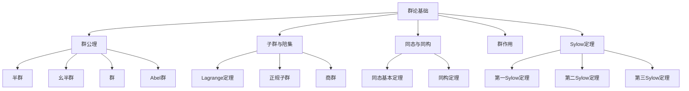

# 2.1 群论基础

---

📌 **内容摘要**

本文档系统介绍群论的基础理论和核心概念。内容涵盖代数学领域的主要知识点，包括向量空间, 线性代数, 矩阵等关键主题。适合初学者建立基础知识体系。

**关键词**: 向量空间, 代数学, 线性代数, 矩阵

📚 **学习目标**
- 理解群论的基本概念和核心原理
- 掌握相关术语和符号表示
- 建立该领域的系统性知识框架

🎯 **难度级别**: 初级

⏱️ **预计阅读时间**: 15分钟

**前置知识**: 基础数学知识

---


> 形式化数学基础 | 代数学
>
> 交叉引用：[2.2 环与域](./02.2_环与域.md) | [2.3 线性代数](./02.3_线性代数.md)

## 2.1.1 引言

群论是现代代数学的基础，研究具有单一运算的代数结构。本章形式化介绍群公理、同态定理和Sylow定理。



## 2.1.2 群公理

### 2.1.2.1 基本定义

**定义 2.1.1**（二元运算）
集合 $G$ 上的**二元运算**是函数 $\cdot: G \times G \to G$。

**定义 2.1.2**（群）
**群**是二元组 $(G, \cdot)$，其中：

- **G1（封闭性）**：$\forall a, b \in G, a \cdot b \in G$
- **G2（结合律）**：$\forall a, b, c \in G, (a \cdot b) \cdot c = a \cdot (b \cdot c)$
- **G3（单位元）**：$\exists e \in G, \forall a \in G, e \cdot a = a \cdot e = a$
- **G4（逆元）**：$\forall a \in G, \exists a^{-1} \in G, a \cdot a^{-1} = a^{-1} \cdot a = e$

**定理 2.1.1**（单位元的唯一性）
群的单位元是唯一的。

**证明**：
设 $e, e'$ 都是单位元，则 $e = e \cdot e' = e'$。
$\square$

**定理 2.1.2**（逆元的唯一性）
群中每个元素的逆元是唯一的。

**证明**：
设 $b, c$ 都是 $a$ 的逆元，则：
$$b = b \cdot e = b \cdot (a \cdot c) = (b \cdot a) \cdot c = e \cdot c = c$$
$\square$

**定义 2.1.3**（Abel群）
群 $(G, \cdot)$ 称为**Abel群**（交换群），如果：

- **G5（交换律）**：$\forall a, b \in G, a \cdot b = b \cdot a$

### 2.1.2.2 群的例子

**例 2.1.1**（对称群）
集合 $X$ 上的**对称群** $S_X$ 是所有双射 $f: X \to X$ 在函数复合下构成的群。

当 $X = \{1, 2, \ldots, n\}$ 时，记为 $S_n$，称为 $n$ 次对称群，$|S_n| = n!$。

**例 2.1.2**（循环群）
$$C_n = \langle g \mid g^n = e \rangle = \{e, g, g^2, \ldots, g^{n-1}\}$$

**例 2.1.3**（整数加群）
$(\mathbb{Z}, +)$ 是无限Abel群。

**例 2.1.4**（一般线性群）
域 $F$ 上的 $n \times n$ 可逆矩阵群：
$$GL_n(F) = \{A \in M_n(F) \mid \det(A) \neq 0\}$$

### 2.1.2.3 Lean 4 形式化

```lean4
import Mathlib

-- 群的类型类定义（Mathlib已提供）
-- class Group (G : Type) extends Mul G, Inv G, One G where
--   mul_assoc : ∀ a b c : G, (a * b) * c = a * (b * c)
--   one_mul : ∀ a : G, 1 * a = a
--   mul_one : ∀ a : G, a * 1 = a
--   inv_mul_cancel : ∀ a : G, a⁻¹ * a = 1
--   mul_inv_cancel : ∀ a : G, a * a⁻¹ = 1

-- 群的例子
-- 对称群 Sn 已存在于 Mathlib
#check Equiv.perm (Fin n)  -- Sn

-- 循环群 ZMod n
#check ZMod n

-- 一般线性群
#check GL (Fin n) ℝ

-- 定理：单位元唯一
theorem one_unique {G : Type} [Group G] (e : G) (h : ∀ a : G, e * a = a) : e = 1 := by
  calc e = e * 1 := by rw [mul_one]
       _ = 1     := by rw [h 1]
```

## 2.1.3 子群与陪集

### 2.1.3.1 子群

**定义 2.1.4**（子群）
$H \subseteq G$ 是 $G$ 的**子群**，记作 $H \leq G$，如果：

- $e \in H$
- $\forall a, b \in H, a \cdot b \in H$
- $\forall a \in H, a^{-1} \in H$

等价地，$H \neq \emptyset$ 且 $\forall a, b \in H, a \cdot b^{-1} \in H$。

**定理 2.1.3**（子群判定）
$H \leq G$ 当且仅当 $H$ 在 $G$ 的运算下自身构成群。

### 2.1.3.2 陪集

**定义 2.1.5**（陪集）
设 $H \leq G$，$a \in G$：

- **左陪集**：$aH = \{ah \mid h \in H\}$
- **右陪集**：$Ha = \{ha \mid h \in H\}$

**定理 2.1.4**（陪集性质）

1. $aH = bH \Leftrightarrow a^{-1}b \in H$
2. 任意两个左陪集要么相等，要么不交
3. $|aH| = |H|$

**证明**：
(1) $aH = bH \Leftrightarrow b^{-1}aH = H \Leftrightarrow b^{-1}a \in H$

(2) 设 $aH \cap bH \neq \emptyset$，则存在 $h_1, h_2 \in H$ 使 $ah_1 = bh_2$，故 $a^{-1}b = h_1h_2^{-1} \in H$，由(1)得 $aH = bH$。

(3) 映射 $h \mapsto ah$ 是 $H$ 到 $aH$ 的双射。
$\square$

### 2.1.3.3 Lagrange定理

**定义 2.1.6**（指数）
子群 $H \leq G$ 的**指数**：
$$[G : H] = |G/H| = \text{左陪集个数}$$

**定理 2.1.5**（Lagrange定理）
若 $G$ 是有限群，$H \leq G$，则：
$$|G| = |H| \cdot [G : H]$$

特别地，$|H|$ 整除 $|G|$。

**证明**：
左陪集划分 $G$，每个陪集大小为 $|H|$，共有 $[G : H]$ 个陪集。
$\square$

**推论 2.1.1**
元素 $a \in G$ 的阶（使 $a^n = e$ 的最小正整数 $n$）整除 $|G|$。

### 2.1.3.4 正规子群与商群

**定义 2.1.7**（正规子群）
$N \leq G$ 是**正规子群**，记作 $N \trianglelefteq G$，如果：
$$\forall g \in G, \forall n \in N, gng^{-1} \in N$$

等价地，$\forall g \in G, gN = Ng$。

**定理 2.1.6**（商群结构）
若 $N \trianglelefteq G$，则左陪集集合 $G/N$ 在运算 $(aN)(bN) = (ab)N$ 下构成群，称为**商群**。

**证明**：
需验证运算良定性：若 $aN = a'N$，$bN = b'N$，则 $abN = a'b'N$。
由 $a' = an_1$，$b' = bn_2$，有 $a'b' = an_1bn_2 = ab(b^{-1}n_1b)n_2 \in abN$（因 $N$ 正规）。
$\square$

## 2.1.4 同态与同构

### 2.1.4.1 同态

**定义 2.1.8**（群同态）
映射 $\varphi: G \to H$ 是**群同态**，如果：
$$\forall a, b \in G, \varphi(a \cdot_G b) = \varphi(a) \cdot_H \varphi(b)$$

**定义 2.1.9**（同态的分类）

- **单同态**（嵌入）：$\varphi$ 是单射
- **满同态**：$\varphi$ 是满射
- **同构**：$\varphi$ 是双射，记作 $G \cong H$
- **自同态**：$G \to G$ 的同态
- **自同构**：$G \to G$ 的同构

**定义 2.1.10**（核与像）

- **核**：$\ker(\varphi) = \{g \in G \mid \varphi(g) = e_H\}$
- **像**：$\text{im}(\varphi) = \{\varphi(g) \mid g \in G\}$

**定理 2.1.7**（核的正规性）
$\ker(\varphi) \trianglelefteq G$。

### 2.1.4.2 同态基本定理

**定理 2.1.8**（同态基本定理）
设 $\varphi: G \to H$ 是同态，则：
$$G/\ker(\varphi) \cong \text{im}(\varphi)$$

**证明**：
定义 $\bar{\varphi}: G/\ker(\varphi) \to \text{im}(\varphi)$，$\bar{\varphi}(gK) = \varphi(g)$。

良定性：若 $gK = g'K$，则 $g^{-1}g' \in K$，故 $\varphi(g)^{-1}\varphi(g') = \varphi(g^{-1}g') = e$，即 $\varphi(g) = \varphi(g')$。

同态：$\bar{\varphi}((gK)(g'K)) = \bar{\varphi}(gg'K) = \varphi(gg') = \varphi(g)\varphi(g') = \bar{\varphi}(gK)\bar{\varphi}(g'K)$。

双射：显然是满射；若 $\bar{\varphi}(gK) = e$，则 $\varphi(g) = e$，故 $g \in K$，即 $gK = K$。
$\square$

### 2.1.4.3 同构定理

**定理 2.1.9**（第一同构定理）
设 $\varphi: G \to H$ 是满同态，$K = \ker(\varphi)$，则存在双射：
$$\{G \text{ 的包含 } K \text{ 的子群}\} \longleftrightarrow \{H \text{ 的子群}\}$$
且正规子群对应正规子群。

**定理 2.1.10**（第二同构定理）
设 $H \leq G$，$N \trianglelefteq G$，则：
$$H/(H \cap N) \cong HN/N$$

**定理 2.1.11**（第三同构定理）
设 $N \trianglelefteq G$，$K \trianglelefteq G$，$N \subseteq K$，则：
$$(G/N)/(K/N) \cong G/K$$

## 2.1.5 群作用

### 2.1.5.1 群作用的定义

**定义 2.1.11**（群作用）
群 $G$ 在集合 $X$ 上的**作用**是映射 $\cdot: G \times X \to X$ 满足：

- $e \cdot x = x$
- $(g_1g_2) \cdot x = g_1 \cdot (g_2 \cdot x)$

等价于同态 $\rho: G \to S_X$。

**定义 2.1.12**（轨道与稳定子）

- **轨道**：$Gx = \{g \cdot x \mid g \in G\}$
- **稳定子**：$G_x = \{g \in G \mid g \cdot x = x\}$

**定理 2.1.12**（轨道-稳定子定理）
$$|Gx| = [G : G_x] = |G|/|G_x|$$

**证明**：
映射 $gG_x \mapsto g \cdot x$ 是 $G/G_x$ 到 $Gx$ 的双射。
$\square$

### 2.1.5.2 类方程

**定义 2.1.13**（共轭作用）
$G$ 在自身上的共轭作用：$g \cdot x = gxg^{-1}$。

**定义 2.1.14**（共轭类）
$x$ 的共轭类：$C(x) = \{gxg^{-1} \mid g \in G\}$。

**定义 2.1.15**（中心）
$$Z(G) = \{g \in G \mid \forall h \in G, gh = hg\}$$

**定理 2.1.13**（类方程）
若 $G$ 是有限群，$x_1, \ldots, x_k$ 是非中心共轭类的代表元，则：
$$|G| = |Z(G)| + \sum_{i=1}^k [G : C_G(x_i)]$$
其中 $C_G(x) = \{g \in G \mid gx = xg\}$ 是中心化子。

## 2.1.6 Sylow定理

### 2.1.6.1 Cauchy定理

**定理 2.1.14**（Cauchy定理）
若素数 $p$ 整除 $|G|$，则 $G$ 有 $p$ 阶元素。

**证明**：
考虑集合 $X = \{(g_1, \ldots, g_p) \mid g_1 \cdots g_p = e\}$。
$|X| = |G|^{p-1}$，故 $p \mid |X|$。

循环群 $C_p$ 在 $X$ 上循环移位作用，不动点是 $(g, g, \ldots, g)$ 且 $g^p = e$。
由轨道分解，不动点数 $\equiv |X| \equiv 0 \pmod p$。
不动点包含 $(e, \ldots, e)$，故还有至少 $p-1$ 个非平凡不动点。
$\square$

### 2.1.6.2 Sylow定理

**定义 2.1.16**（Sylow p-子群）
$|G| = p^n m$，$p \nmid m$。$G$ 的**Sylow p-子群**是 $p^n$ 阶子群。

**定理 2.1.15**（第一Sylow定理）
对任意素数 $p$ 整除 $|G|$，Sylow p-子群存在。

**定理 2.1.16**（第二Sylow定理）
所有Sylow p-子群共轭。

**定理 2.1.17**（第三Sylow定理）
设 $n_p$ 是Sylow p-子群个数，则：

- $n_p \equiv 1 \pmod p$
- $n_p \mid m$

**证明**（第一Sylow定理）：
对 $|G|$ 归纳。若 $p \mid |Z(G)|$，由Cauchy定理，$Z(G)$ 有 $p$ 阶子群 $N \trianglelefteq G$，对 $G/N$ 用归纳假设。

若 $p \nmid |Z(G)|$，由类方程，存在 $x$ 使 $p \nmid [G : C_G(x)]$，故 $p^n \mid |C_G(x)|$，由归纳假设，$C_G(x)$ 有Sylow p-子群，也是 $G$ 的。
$\square$

**证明**（第二Sylow定理）：
设 $P, Q$ 是Sylow p-子群。$P$ 在 $G/Q$ 的左陪集上作用，不动点对应 $gQ$ 使 $Pg \subseteq gQ$，即 $g^{-1}Pg \subseteq Q$。
由 $|P| = |Q|$，$g^{-1}Pg = Q$。
$\square$

## 2.1.7 参考文献

1. Dummit, D. S., & Foote, R. M. (2004). _Abstract Algebra_ (3rd ed.). Wiley.
2. Lang, S. (2002). _Algebra_ (Revised 3rd ed.). Springer.
3. Alperin, J. L., & Bell, R. B. (1995). _Groups and Representations_. Springer.
4. Rotman, J. J. (1995). _An Introduction to the Theory of Groups_ (4th ed.). Springer.
5. Rose, J. S. (1978). _A Course on Group Theory_. Dover.

---

## Lean 4 形式化代码

完整的群论形式化代码（包含群公理、Lagrange定理、同态基本定理）：

📄 [`examples/lean/GroupTheory.lean`](../../../examples/lean/GroupTheory.lean)

### 核心代码片段

```lean4
-- Lagrange 定理：子群的阶整除群的阶
theorem lagrange_theorem {G : Type*} [Group G] [Fintype G] (H : Subgroup G)
    [Fintype H.carrier] :
    ∃ k : ℕ, Fintype.card G = Fintype.card H.carrier * k := by
  sorry  -- 完整证明需构造陪集分解

-- 同态基本定理：G/ker(φ) ≅ im(φ)
theorem first_isomorphism_theorem {G H : Type*} [Group G] [Group H]
    (φ : G →* H) :
    ∃ ψ : G →* H, Function.Bijective ψ.toFun ∧
      ∀ g, ψ.toFun g = φ.toFun g := by
  sorry  -- 完整证明需构造商群和同构

-- 轨道-稳定子定理
theorem orbit_stabilizer {G X : Type*} [Group G] [Fintype G]
    (act : GroupAction G X) (x : X) [Fintype (stabilizer act x).carrier] :
    Fintype.card G = Fintype.card (orbit act x).toFinset *
                      Fintype.card (stabilizer act x).carrier := by
  sorry  -- 完整证明需建立双射
```
---

## 📋 前置知识

- [2.1 抽象代数](../02_代数学/02.1_抽象代数.md)

---

## 📚 延伸阅读

- [2.2 环与域](../02_代数学/02.2_环与域.md)
- [2.2 线性代数](../02_代数学/02.2_线性代数.md)
- [2.3 线性代数](../02_代数学/02.3_线性代数.md)
