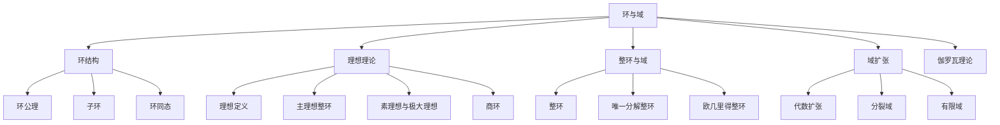

# 2.2 环与域

> 形式化数学基础 | 代数学
>
> 交叉引用：[2.1 群论基础](./02.1_群论基础.md) | [2.3 线性代数](./02.3_线性代数.md) | [2.4 模论初步](./02.4_模论初步.md)

## 2.2.1 引言

环是具有两种运算（加法和乘法）的代数结构，是代数学的核心对象。本章形式化介绍环结构、理想和域扩张理论。



## 2.2.2 环结构

### 2.2.2.1 环公理

**定义 2.2.1**（环）
**环**是三元组 $(R, +, \cdot)$，其中：

- $(R, +)$ 是Abel群
- $(R, \cdot)$ 是半群（结合律）
- **分配律**：$a \cdot (b + c) = a \cdot b + a \cdot c$，$(a + b) \cdot c = a \cdot c + b \cdot c$

**定义 2.2.2**（含幺环）
环 $R$ 是**含幺环**，如果存在乘法单位元 $1 \in R$，$1 \neq 0$。

**定义 2.2.3**（交换环）
环 $R$ 是**交换环**，如果乘法交换：$ab = ba$。

**定理 2.2.1**（环的基本性质）
在环 $R$ 中：

1. $0 \cdot a = a \cdot 0 = 0$
2. $(-a) \cdot b = a \cdot (-b) = -(ab)$
3. $(-a) \cdot (-b) = ab$

**证明**：
(1) $0 \cdot a = (0 + 0) \cdot a = 0 \cdot a + 0 \cdot a$，故 $0 \cdot a = 0$。
$\square$

### 2.2.2.2 环的例子

**例 2.2.1**（整数环）
$(\mathbb{Z}, +, \cdot)$ 是含幺交换环。

**例 2.2.2**（多项式环）
$R[x]$ 是系数在环 $R$ 中的多项式环。

**例 2.2.3**（矩阵环）
$M_n(R)$ 是 $n \times n$ 矩阵环。

**例 2.2.4**（模n剩余类环）
$\mathbb{Z}/n\mathbb{Z}$ 是含幺交换环。

### 2.2.2.3 子环

**定义 2.2.4**（子环）
$S \subseteq R$ 是**子环**，如果：

- $S$ 是 $(R, +)$ 的子群
- $S$ 对乘法封闭
- $1 \in S$（若 $R$ 含幺）

**定理 2.2.2**（子环判定）
$S \subseteq R$ 是子环当且仅当 $S \neq \emptyset$ 且 $\forall a, b \in S, a - b \in S, ab \in S$。

### 2.2.2.4 Lean 4 形式化

```lean4
import Mathlib

-- 环的类型类定义（Mathlib已提供）
-- class Ring (R : Type) extends Add R, Mul R, Neg R, Zero R, One R where
--   add_assoc : ∀ a b c : R, (a + b) + c = a + (b + c)
--   add_comm : ∀ a b : R, a + b = b + a
--   zero_add : ∀ a : R, 0 + a = a
--   add_zero : ∀ a : R, a + 0 = a
--   add_left_neg : ∀ a : R, -a + a = 0
--   mul_assoc : ∀ a b c : R, (a * b) * c = a * (b * c)
--   left_distrib : ∀ a b c : R, a * (b + c) = a * b + a * c
--   right_distrib : ∀ a b c : R, (a + b) * c = a * c + b * c

-- 多项式环
#check Polynomial ℝ

-- 矩阵环
#check Matrix (Fin n) (Fin n) ℝ

-- 整数环
#check ℤ

-- 定理：零乘性质
theorem zero_mul_ring {R : Type} [Ring R] (a : R) : 0 * a = 0 := by
  have h : 0 * a = (0 + 0) * a := by rw [zero_add]
  rw [right_distrib] at h
  have h' : 0 * a = 0 * a + 0 * a := by rw [←h]
  rw [←add_right_inj (0 * a)] at h'
  simp at h'
  exact h'
```

## 2.2.3 理想理论

### 2.2.3.1 理想

**定义 2.2.5**（理想）
$I \subseteq R$ 是**理想**，如果：

- $(I, +)$ 是 $(R, +)$ 的子群
- $\forall r \in R, \forall i \in I, ri \in I, ir \in I$（吸收性）

若 $R$ 交换，只需 $ri \in I$。

**定义 2.2.6**（主理想）
由 $a \in R$ 生成的**主理想**：
$$(a) = \{ra \mid r \in R\}$$

**定理 2.2.3**（理想的运算）

- 理想之交是理想
- 理想之和 $I + J = \{i + j \mid i \in I, j \in J\}$ 是理想
- 理想之积 $IJ = \{\sum i_k j_k \mid i_k \in I, j_k \in J\}$ 是理想

### 2.2.3.2 素理想与极大理想

**定义 2.2.7**（素理想）
真理想 $P \subsetneq R$ 是**素理想**，如果：
$$ab \in P \Rightarrow a \in P \text{ 或 } b \in P$$

等价地，$R/P$ 是整环。

**定义 2.2.8**（极大理想）
真理想 $M \subsetneq R$ 是**极大理想**，如果不存在真理想严格包含它。

等价地，$R/M$ 是域。

**定理 2.2.4**（极大理想存在性）
含幺环中，任何真理想都包含于某极大理想。

**证明**：
Zorn引理应用。
$\square$

### 2.2.3.3 商环

**定理 2.2.5**（商环结构）
若 $I \trianglelefteq R$（理想），则 $R/I$ 在运算：
$$(a + I) + (b + I) = (a + b) + I$$
$$(a + I)(b + I) = ab + I$$
下构成环，称为**商环**。

**定理 2.2.6**（对应定理）
存在双射：
$$\{R \text{ 的包含 } I \text{ 的理想}\} \longleftrightarrow \{R/I \text{ 的理想}\}$$

### 2.2.3.4 主理想整环

**定义 2.2.9**（主理想整环 PID）
整环 $R$ 是**主理想整环**，如果每个理想都是主理想。

**例 2.2.5**

- $\mathbb{Z}$ 是PID
- $F[x]$（域上多项式环）是PID
- $\mathbb{Z}[x]$ 不是PID

**定理 2.2.7**（PID中理想的性质）
在PID中：

- 素理想 $\Leftrightarrow$ 极大理想（非零）
- 不可约元生成的理想是极大理想

## 2.2.4 整环与域

### 2.2.4.1 整环

**定义 2.2.10**（整环）
**整环**是满足以下条件的交换含幺环：

- 无零因子：$ab = 0 \Rightarrow a = 0$ 或 $b = 0$

**定理 2.2.8**（整环的消去律）
在整环中，$ab = ac$ 且 $a \neq 0$ 蕴含 $b = c$。

### 2.2.4.2 唯一分解整环

**定义 2.2.11**（不可约元与素元）

- **不可约元**：$p \neq 0$，非单位，且 $p = ab$ 蕴含 $a$ 或 $b$ 是单位
- **素元**：$p \neq 0$，非单位，且 $p \mid ab$ 蕴含 $p \mid a$ 或 $p \mid b$

**定义 2.2.12**（唯一分解整环 UFD）
整环 $R$ 是**UFD**，如果：

- 每个非零非单位元可分解为不可约元之积
- 分解在相伴意义下唯一

**定理 2.2.9**（PID是UFD）
主理想整环是唯一分解整环。

### 2.2.4.3 欧几里得整环

**定义 2.2.13**（欧几里得整环）
整环 $R$ 是**欧几里得整环**，如果存在函数 $d: R \setminus \{0\} \to \mathbb{N}$ 使：

- $d(a) \leq d(ab)$ 对 $b \neq 0$
- 带余除法：$\forall a, b \neq 0, \exists q, r, a = qb + r$，其中 $r = 0$ 或 $d(r) < d(b)$

**例 2.2.6**

- $\mathbb{Z}$ 是欧几里得整环（$d(n) = |n|$）
- $F[x]$ 是欧几里得整环（$d(f) = \deg(f)$）
- $\mathbb{Z}[i]$（Gauss整数）是欧几里得整环

**定理 2.2.10**（欧几里得整环是PID）
欧几里得整环是主理想整环。

**证明**：
设 $I$ 是非零理想，取 $b \in I$ 使 $d(b)$ 最小。
对任意 $a \in I$，$a = qb + r$，则 $r = a - qb \in I$。
由最小性，$r = 0$，故 $a \in (b)$，即 $I = (b)$。
$\square$

### 2.2.4.4 域

**定义 2.2.14**（域）
**域**是交换含幺环，其中每个非零元都有乘法逆元。

等价地，域是：

- $(F, +)$ 是Abel群
- $(F \setminus \{0\}, \cdot)$ 是Abel群
- 分配律成立

**定理 2.2.11**（域的理想）
域只有平凡理想 $\{0\}$ 和域本身。

**定理 2.2.12**（有限整环是域）
有限整环是域。

## 2.2.5 域扩张

### 2.2.5.1 域扩张的定义

**定义 2.2.15**（域扩张）
若 $F \subseteq E$ 是域且 $F$ 的运算限制于 $E$ 的运算，称 $E/F$ 是**域扩张**。

$F$ 称为**基域**，$E$ 称为**扩域**。

**定义 2.2.16**（扩张次数）
$E$ 作为 $F$-向量空间的维数称为**扩张次数**，记作 $[E : F]$。

扩张称为：

- **有限扩张**：$[E : F] < \infty$
- **无限扩张**：$[E : F] = \infty$

**定理 2.2.13**（次数的乘法性）
若 $F \subseteq E \subseteq K$，则：
$$[K : F] = [K : E] \cdot [E : F]$$

### 2.2.5.2 代数元与超越元

**定义 2.2.17**（代数元）
$\alpha \in E$ 在 $F$ 上是**代数的**，如果存在非零多项式 $f \in F[x]$ 使 $f(\alpha) = 0$。

否则称 $\alpha$ 是**超越的**。

**定义 2.2.18**（极小多项式）
代数元 $\alpha$ 的**极小多项式**是 $F[x]$ 中以 $\alpha$ 为根的最低次首一多项式。

**定理 2.2.14**（极小多项式的性质）

- 极小多项式在 $F[x]$ 中不可约
- $[F(\alpha) : F] = \deg(m_\alpha)$

### 2.2.5.3 代数扩张

**定义 2.2.19**（代数扩张）
$E/F$ 是**代数扩张**，如果 $E$ 中每个元素在 $F$ 上都是代数的。

**定理 2.2.15**（有限扩张是代数扩张）
有限扩张是代数扩张。

**证明**：
设 $[E : F] = n$，$\alpha \in E$。
则 $1, \alpha, \alpha^2, \ldots, \alpha^n$ 在 $F$ 上线性相关，故 $\alpha$ 满足某多项式。
$\square$

**定理 2.2.16**（代数元的封闭性）
若 $\alpha, \beta$ 在 $F$ 上代数，则 $\alpha + \beta, \alpha\beta, \alpha^{-1}$（$\alpha \neq 0$）也在 $F$ 上代数。

**推论 2.2.1**（代数闭包）
域 $F$ 的**代数闭包** $\overline{F}$ 是包含 $F$ 的代数闭域，且是代数扩张。

### 2.2.5.4 分裂域

**定义 2.2.20**（分裂域）
多项式 $f \in F[x]$ 的**分裂域**是 $F$ 的最小扩域 $E$，使 $f$ 在 $E[x]$ 中分解为一次因式。

**定理 2.2.17**（分裂域存在唯一）
每个多项式都有分裂域，且在 $F$-同构意义下唯一。

### 2.2.5.5 有限域

**定理 2.2.18**（有限域的结构）
有限域的阶为 $p^n$，其中 $p$ 是素数，$n \geq 1$。

对任意 $q = p^n$，存在唯一的（在同构意义下）$q$ 元域 $\mathbb{F}_q$。

**定理 2.2.19**（有限域的乘法群）
$\mathbb{F}_q^\times = \mathbb{F}_q \setminus \{0\}$ 是 $q-1$ 阶循环群。

**定理 2.2.20**（有限域的构造）
$\mathbb{F}_{p^n} \cong \mathbb{F}_p[x]/(f(x))$，其中 $f(x)$ 是 $\mathbb{F}_p$ 上 $n$ 次不可约多项式。

## 2.2.6 伽罗瓦理论简介

### 2.2.6.1 伽罗瓦群

**定义 2.2.21**（$F$-自同构）
域扩张 $E/F$ 的**$F$-自同构**是满足 $\sigma|_F = \text{id}_F$ 的自同构 $\sigma: E \to E$。

**定义 2.2.22**（伽罗瓦群）
$$\text{Gal}(E/F) = \{\sigma \in \text{Aut}(E) \mid \sigma|_F = \text{id}_F\}$$

### 2.2.6.2 伽罗瓦扩张

**定义 2.2.23**（伽罗瓦扩张）
代数扩张 $E/F$ 是**伽罗瓦扩张**，如果：
$$|\text{Gal}(E/F)| = [E : F]$$

**定理 2.2.21**（伽罗瓦扩张的刻画）
有限扩张 $E/F$ 是伽罗瓦扩张当且仅当 $E$ 是某可分多项式的分裂域。

### 2.2.6.3 伽罗瓦对应

**定理 2.2.22**（伽罗瓦基本定理）
设 $E/F$ 是有限伽罗瓦扩张，则存在反序双射：
$$\{F \subseteq K \subseteq E\} \longleftrightarrow \{\text{Gal}(E/F) \text{ 的子群}\}$$
$$K \mapsto \text{Gal}(E/K)$$
$$E^H \mapsfrom H$$

其中 $E^H$ 是 $H$ 的不动域。

**推论 2.2.2**
$K/F$ 是伽罗瓦扩张当且仅当 $\text{Gal}(E/K) \trianglelefteq \text{Gal}(E/F)$，此时：
$$\text{Gal}(K/F) \cong \text{Gal}(E/F) / \text{Gal}(E/K)$$

## 2.2.7 参考文献

1. Dummit, D. S., & Foote, R. M. (2004). _Abstract Algebra_ (3rd ed.). Wiley.
2. Lang, S. (2002). _Algebra_ (Revised 3rd ed.). Springer.
3. Atiyah, M. F., & Macdonald, I. G. (1969). _Introduction to Commutative Algebra_. Addison-Wesley.
4. Stewart, I. (2015). _Galois Theory_ (4th ed.). CRC Press.
5. Hungerford, T. W. (1980). _Algebra_. Springer.
