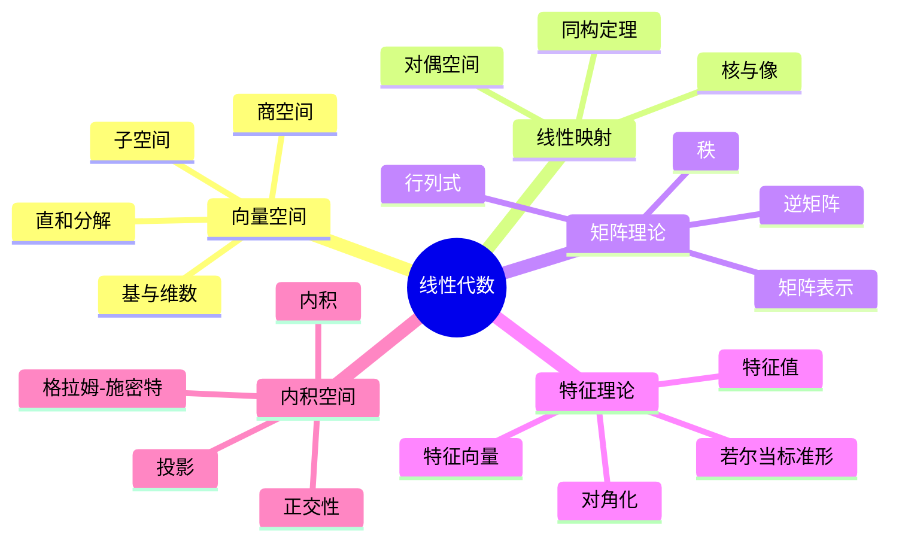
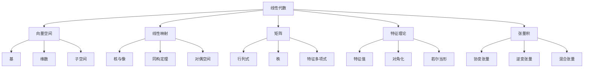

# 2.2 线性代数

## 目录

- [2.2 线性代数](#22-线性代数)
  - [目录](#目录)
  - [2.2.1 引言](#221-引言)
  - [2.2.2 向量空间](#222-向量空间)
    - [2.2.2.1 定义与公理](#2221-定义与公理)
    - [2.2.2.2 基与维数](#2222-基与维数)
    - [2.2.2.3 例子](#2223-例子)
  - [2.2.3 线性映射](#223-线性映射)
    - [2.2.3.1 定义与性质](#2231-定义与性质)
    - [2.2.3.2 秩-零化度定理](#2232-秩-零化度定理)
  - [2.2.4 矩阵理论](#224-矩阵理论)
    - [2.2.4.1 矩阵表示](#2241-矩阵表示)
    - [2.2.4.2 行列式](#2242-行列式)
    - [2.2.4.3 逆矩阵](#2243-逆矩阵)
  - [2.2.5 特征值与对角化](#225-特征值与对角化)
    - [2.2.5.1 特征理论](#2251-特征理论)
    - [2.2.5.2 对角化](#2252-对角化)
  - [2.2.6 张量代数](#226-张量代数)
    - [2.2.6.1 张量积](#2261-张量积)
    - [2.2.6.2 张量类型](#2262-张量类型)
  - [2.2.7 多表征视角](#227-多表征视角)
    - [概念图谱](#概念图谱)
    - [结构与维度关系](#结构与维度关系)
  - [参见](#参见)

---

## 2.2.1 引言

线性代数(Linear Algebra)研究向量空间及其上的线性映射，是数学、物理学、计算机科学和工程学的基础工具。
线性结构的可加性和齐次性使其具有优美的代数和分析性质。

核心主题：

- 向量空间的结构与分类
- 线性映射的表示与标准形
- 特征值理论与谱分解
- 张量积与外代数



---

## 2.2.2 向量空间

### 2.2.2.1 定义与公理

**向量空间(Vector Space)**：设$F$是域，$F$-向量空间是集合$V$配备运算$+: V \times V \to V$和$\cdot: F \times V \to V$满足：

| 公理 | 内容 |
|------|------|
| **V1** | $(V, +)$是阿贝尔群 |
| **V2** | $a \cdot (b \cdot v) = (ab) \cdot v$ |
| **V3** | $1 \cdot v = v$ |
| **V4** | $a \cdot (u + v) = a \cdot u + a \cdot v$ |
| **V5** | $(a + b) \cdot v = a \cdot v + b \cdot v$ |

```lean
class VectorSpace (F : Type*) [Field F] (V : Type*) [AddCommGroup V] where
  smul : F → V → V
  one_smul : ∀ v, smul 1 v = v
  mul_smul : ∀ a b v, smul (a * b) v = smul a (smul b v)
  smul_add : ∀ a u v, smul a (u + v) = smul a u + smul a v
  add_smul : ∀ a b v, smul (a + b) v = smul a v + smul b v
  zero_smul : ∀ v, smul 0 v = 0
  smul_zero : ∀ a, smul a 0 = 0

infixr:73 " • " => VectorSpace.smul
```

### 2.2.2.2 基与维数

**线性组合**：$v = a_1 v_1 + a_2 v_2 + \cdots + a_n v_n$，其中$a_i \in F$

**线性无关**：$a_1 v_1 + \cdots + a_n v_n = 0 \implies a_1 = \cdots = a_n = 0$

**基(Basis)**：线性无关的生成集。任何向量$v \in V$可唯一表示为$v = \sum a_i e_i$。

**维数(Dimension)**：$\dim_F(V) = |\text{基}|$

**定理 2.2.2.1**：所有基具有相同的基数。

```lean
def linear_independent {F V : Type*} [Field F] [VectorSpace F V]
  (s : Set V) : Prop :=
  ∀ (f : s →₀ F), (s.sum fun i => f i • i) = 0 → ∀ i, f i = 0

def is_basis {F V : Type*} [Field F] [VectorSpace F V]
  (s : Set V) : Prop :=
  linear_independent s ∧ span s = ⊤

def dim (F V : Type*) [Field F] [VectorSpace F V] : Cardinal :=
  Cardinal.mk (Classical.choice (exists_basis F V))
```

### 2.2.2.3 例子

| 向量空间 | 域 | 维数 | 标准基 |
|----------|-----|------|--------|
| $F^n$ | $F$ | $n$ | $\{e_1, \ldots, e_n\}$ |
| $F[x]$ | $F$ | $\aleph_0$ | $\{1, x, x^2, \ldots\}$ |
| $M_{m \times n}(F)$ | $F$ | $mn$ | $\{E_{ij}\}$ |
| $C([0,1])$ | $\mathbb{R}$ | 无限 | 无（需要选择公理） |

---

## 2.2.3 线性映射

### 2.2.3.1 定义与性质

**线性映射(Linear Map)**：$T: V \to W$满足：

- $T(u + v) = T(u) + T(v)$（加法保持）
- $T(a \cdot v) = a \cdot T(v)$（数乘保持）

等价地：$T(a u + b v) = a T(u) + b T(v)$

**核(Kernel)**：$\ker(T) = \{v \in V \mid T(v) = 0\}$

**像(Image)**：$\text{im}(T) = \{T(v) \mid v \in V\}$

```lean
structure LinearMap (F : Type*) [Field F] (V W : Type*)
  [VectorSpace F V] [VectorSpace F W] where
  toFun : V → W
  map_add : ∀ u v, toFun (u + v) = toFun u + toFun v
  map_smul : ∀ a v, toFun (a • v) = a • toFun v

def kernel {F V W : Type*} [Field F] [VectorSpace F V] [VectorSpace F W]
  (T : LinearMap F V W) : Set V := {v | T.toFun v = 0}

def image {F V W : Type*} [Field F] [VectorSpace F V] [VectorSpace F W]
  (T : LinearMap F V W) : Set W := {w | ∃ v, T.toFun v = w}
```

### 2.2.3.2 秩-零化度定理

**定理 2.2.3.1 (秩-零化度定理)**：设$T: V \to W$是有限维向量空间间的线性映射，则：

$$\dim(V) = \dim(\ker(T)) + \dim(\text{im}(T))$$

或记作：$\dim(V) = \text{nullity}(T) + \text{rank}(T)$

```lean
theorem rank_nullity {F V W : Type*} [Field F]
  [VectorSpace F V] [VectorSpace F W] [FiniteDimensional F V]
  (T : LinearMap F V W) :
  finrank F V = finrank F (kernel T) + finrank F (image T) := by
  sorry
```

---

## 2.2.4 矩阵理论

### 2.2.4.1 矩阵表示

**矩阵(Matrix)**：$m \times n$矩阵是$F$中元素的矩形阵列：

$$A = \begin{pmatrix} a_{11} & a_{12} & \cdots & a_{1n} \\ a_{21} & a_{22} & \cdots & a_{2n} \\ \vdots & \vdots & \ddots & \vdots \\ a_{m1} & a_{m2} & \cdots & a_{mn} \end{pmatrix}$$

**矩阵与线性映射**：选定基后，线性映射$T: V \to W$对应矩阵$[T]_{\mathcal{B}}^{\mathcal{C}}$。

### 2.2.4.2 行列式

**行列式(Determinant)**：$\det: M_n(F) \to F$是唯一满足：

- 多重线性（对行/列）
- 反对称（行/列交换变号）
- $\det(I) = 1$

**计算**：
$$\det(A) = \sum_{\sigma \in S_n} \text{sgn}(\sigma) \prod_{i=1}^n a_{i,\sigma(i)}$$

```lean
def det {F : Type*} [Field F] {n : ℕ} (A : Matrix (Fin n) (Fin n) F) : F :=
  ∑ σ : Perm (Fin n), σ.sign * ∏ i, A i (σ i)
```

### 2.2.4.3 逆矩阵

**可逆性**：$A$可逆当且仅当$\det(A) \neq 0$。

**逆矩阵公式**：$A^{-1} = \frac{1}{\det(A)} \text{adj}(A)$

其中$\text{adj}(A)$是伴随矩阵（代数余子式的转置）。

---

## 2.2.5 特征值与对角化

### 2.2.5.1 特征理论

**特征值(Eigenvalue)**：$\lambda \in F$是$T$的特征值，如果存在非零$v \in V$使得：

$$T(v) = \lambda v$$

$v$称为对应于$\lambda$的**特征向量(Eigenvector)**。

**特征多项式**：$p_T(\lambda) = \det(T - \lambda I)$

**特征值 = 特征多项式的根**

```lean
def eigenvalue {F V : Type*} [Field F] [VectorSpace F V] [FiniteDimensional F V]
  (T : LinearMap F V V) (λ : F) : Prop :=
  ∃ v : V, v ≠ 0 ∧ T v = λ • v

def eigenvector {F V : Type*} [Field F] [VectorSpace F V]
  (T : LinearMap F V V) (λ : F) (v : V) : Prop :=
  v ≠ 0 ∧ T v = λ • v

def charpoly {F V : Type*} [Field F] [VectorSpace F V] [FiniteDimensional F V]
  (T : LinearMap F V V) : Polynomial F :=
  det (toMatrix T - variable • 1)
```

### 2.2.5.2 对角化

**可对角化**：$T$可对角化如果存在由特征向量组成的基。

等价条件：

- 最小多项式无重根
- 每个特征值的几何重数 = 代数重数
- $V = \bigoplus_{\lambda} E_\lambda$（特征子空间的直和）

**若尔当标准形(Jordan Normal Form)**：任意复矩阵$A$相似于若尔当形：

$$J = \begin{pmatrix} J_{\lambda_1} & & \\ & \ddots & \\ & & J_{\lambda_k} \end{pmatrix}$$

其中$J_\lambda = \begin{pmatrix} \lambda & 1 & & \\ & \lambda & \ddots & \\ & & \ddots & 1 \\ & & & \lambda \end{pmatrix}$是若尔当块。

---

## 2.2.6 张量代数

### 2.2.6.1 张量积

**张量积(Tensor Product)**：向量空间$V$和$W$的张量积$V \otimes W$是满足泛性质的向量空间。

**构造**：$V \otimes W = F(V \times W) / \sim$，其中$\sim$由双线性关系生成。

**性质**：

- $\dim(V \otimes W) = \dim(V) \cdot \dim(W)$
- 基：$\{e_i \otimes f_j\}$

### 2.2.6.2 张量类型

| 类型 | 表示 | 变换规则 |
|------|------|----------|
| (0,0)-张量 | 标量 | 不变 |
| (1,0)-张量 | 向量 | $v' = P v$ |
| (0,1)-张量 | 余向量 | $\omega' = \omega P^{-1}$ |
| (1,1)-张量 | 线性映射 | $T' = P T P^{-1}$ |
| (2,0)-张量 | 双线性形式 | $g' = P^{-T} g P^{-1}$ |
| (0,2)-张量 | 双线性形式 | - |

---

## 2.2.7 多表征视角

### 概念图谱



### 结构与维度关系

| 结构 | 维度公式 | 例子 |
|------|---------|------|
| 直和$V \oplus W$ | $\dim(V) + \dim(W)$ | $\mathbb{R}^2 \oplus \mathbb{R}^3 = \mathbb{R}^5$ |
| 张量积$V \otimes W$ | $\dim(V) \cdot \dim(W)$ | $\mathbb{R}^2 \otimes \mathbb{R}^3$维数6 |
| 同态空间$\text{Hom}(V,W)$ | $\dim(V) \cdot \dim(W)$ | $M_{3 \times 2}(\mathbb{R})$维数6 |
| 外幂$\Lambda^k(V)$ | $\binom{n}{k}$ | $\Lambda^2(\mathbb{R}^3)$维数3 |

---

## 参见

- [抽象代数](./02.1_抽象代数.md) — 模的一般理论（向量空间是域上的模）
- [范畴论代数](./02.3_范畴论代数.md) — 线性代数的范畴论表述
- [实分析](../04_分析学/04.1_实分析.md) — 函数空间的线性结构
- [泛函分析](../04_分析学/04.3_泛函分析.md) — 无限维向量空间
- [微分几何](../03_几何学/03.2_微分几何.md) — 切空间的线性代数
