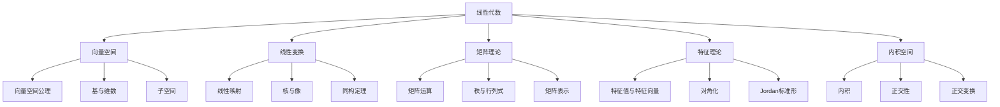

# 2.3 线性代数

> 形式化数学基础 | 代数学
>
> 交叉引用：[2.1 群论基础](./02.1_群论基础.md) | [2.2 环与域](./02.2_环与域.md) | [2.4 模论初步](./02.4_模论初步.md)

## 2.3.1 引言

线性代数研究向量空间及其上的线性变换。本章形式化介绍向量空间结构、线性变换理论和特征理论。



## 2.3.2 向量空间

### 2.3.2.1 向量空间公理

**定义 2.3.1**（向量空间）
设 $F$ 是域，$F$-**向量空间**是集合 $V$ 配备运算 $+: V \times V \to V$ 和 $\cdot: F \times V \to V$ 满足：

**(V1)** $(V, +)$ 是Abel群

- 结合律：$(u + v) + w = u + (v + w)$
- 交换律：$u + v = v + u$
- 零元：$\exists 0 \in V, v + 0 = v$
- 负元：$\forall v, \exists (-v), v + (-v) = 0$

**(V2)** 数乘性质

- $a(bv) = (ab)v$
- $1v = v$

**(V3)** 分配律

- $a(u + v) = au + av$
- $(a + b)v = av + bv$

**定义 2.3.2**（子空间）
$W \subseteq V$ 是**子空间**，如果：

- $W$ 对加法封闭
- $W$ 对数乘封闭
- $0 \in W$

### 2.3.2.2 基与维数

**定义 2.3.3**（线性组合）
向量 $v_1, \ldots, v_n$ 的**线性组合**：
$$a_1v_1 + a_2v_2 + \cdots + a_nv_n, \quad a_i \in F$$

**定义 2.3.4**（线性无关）
集合 $S \subseteq V$ **线性无关**，如果：
$$a_1v_1 + \cdots + a_nv_n = 0 \Rightarrow a_1 = \cdots = a_n = 0$$
对任意有限个不同向量 $v_i \in S$。

**定义 2.3.5**（基）
集合 $B \subseteq V$ 是**基**，如果：

- $B$ 线性无关
- $\text{span}(B) = V$（生成 $V$）

**定理 2.3.1**（基的存在性）
每个向量空间都有基（需要选择公理对无穷维）。

**定理 2.3.2**（维数不变性）
向量空间的任意两个基有相同的基数，称为**维数** $\dim(V)$。

**定理 2.3.3**（维数公式）
若 $W_1, W_2$ 是 $V$ 的有限维子空间：
$$\dim(W_1 + W_2) = \dim(W_1) + \dim(W_2) - \dim(W_1 \cap W_2)$$

### 2.3.2.3 Lean 4 形式化

```lean4
import Mathlib

-- 向量空间类型类（Mathlib已提供）
-- class Module (R : Type) (M : Type) [Semiring R] extends Add M, Zero M, SMul R M where
--   add_smul : ∀ (r s : R) (x : M), (r + s) • x = r • x + s • x
--   zero_smul : ∀ x : M, (0 : R) • x = 0

-- 有限维向量空间
#check FiniteDimensional ℝ (Fin n → ℝ)

-- 基的定义
#check Basis ι R V

-- 维数
theorem dim_eq_card_basis {R V ι : Type} [DivisionRing R] [AddCommGroup V]
  [Module R V] {b : Basis ι R V} [Fintype ι] :
  Module.finrank R V = Fintype.card ι := by
  rw [Module.finrank_eq_card_basis b]
```

## 2.3.3 线性变换

### 2.3.3.1 线性映射

**定义 2.3.6**（线性映射）
映射 $T: V \to W$ 是**线性映射**，如果：

- $T(u + v) = T(u) + T(v)$（加法保持）
- $T(av) = aT(v)$（数乘保持）

等价于 $T(au + bv) = aT(u) + bT(v)$。

**定义 2.3.7**（线性映射的空间）
$\mathcal{L}(V, W) = \{T: V \to W \mid T \text{ 线性}\}$ 是向量空间。

### 2.3.3.2 核与像

**定义 2.3.8**（核与像）

- **核**：$\ker(T) = \{v \in V \mid T(v) = 0\}$
- **像**：$\text{im}(T) = \{T(v) \mid v \in V\}$

**定理 2.3.4**（秩-零化度定理）
对有限维 $V$：
$$\dim(V) = \dim(\ker(T)) + \dim(\text{im}(T))$$

**证明**：
设 $\{v_1, \ldots, v_k\}$ 是 $\ker(T)$ 的基，扩充为 $V$ 的基 $\{v_1, \ldots, v_n\}$。
则 $\{T(v_{k+1}), \ldots, T(v_n)\}$ 是 $\text{im}(T)$ 的基。
$\square$

### 2.3.3.3 同构定理

**定理 2.3.5**（第一同构定理）
$$V/\ker(T) \cong \text{im}(T)$$

**定理 2.3.6**（第二同构定理）
若 $U, W$ 是 $V$ 的子空间：
$$(U + W)/W \cong U/(U \cap W)$$

## 2.3.4 矩阵理论

### 2.3.4.1 矩阵运算

**定义 2.3.9**（矩阵）
$m \times n$ **矩阵**是 $F$ 中元素排成的矩形阵列：
$$A = (a_{ij})_{1 \leq i \leq m, 1 \leq j \leq n}$$

**定义 2.3.10**（矩阵运算）

- **加法**：$(A + B)_{ij} = a_{ij} + b_{ij}$
- **数乘**：$(cA)_{ij} = ca_{ij}$
- **乘法**：$(AB)_{ik} = \sum_j a_{ij}b_{jk}$（若列数匹配）
- **转置**：$(A^T)_{ij} = a_{ji}$

**定理 2.3.7**（矩阵代数）
$M_n(F)$ 是含幺代数，单位矩阵 $I$ 满足 $AI = IA = A$。

### 2.3.4.2 秩与行列式

**定义 2.3.11**（秩）
矩阵 $A$ 的**秩**是行空间（或列空间）的维数。

**定义 2.3.12**（行列式）
$n \times n$ 矩阵的行列式：
$$\det(A) = \sum_{\sigma \in S_n} \text{sgn}(\sigma) \prod_{i=1}^n a_{i,\sigma(i)}$$

**定理 2.3.8**（行列式的性质）

- $\det(AB) = \det(A)\det(B)$
- $\det(A^T) = \det(A)$
- $\det(A^{-1}) = \det(A)^{-1}$
- $A$ 可逆 $\Leftrightarrow$ $\det(A) \neq 0$

### 2.3.4.3 矩阵表示

**定理 2.3.9**（线性变换的矩阵表示）
设 $V, W$ 分别有基 $B = \{v_1, \ldots, v_n\}$ 和 $C = \{w_1, \ldots, w_m\}$。
线性变换 $T: V \to W$ 对应矩阵 $[T]_{B,C}$ 满足：
$$T(v_j) = \sum_{i=1}^m ([T]_{B,C})_{ij} w_i$$

**定理 2.3.10**（基变换）
若 $B, B'$ 是 $V$ 的基，$C, C'$ 是 $W$ 的基：
$$[T]_{B',C'} = P_{C \to C'} [T]_{B,C} P_{B' \to B}$$
其中 $P$ 是基变换矩阵。

## 2.3.5 特征理论

### 2.3.5.1 特征值与特征向量

**定义 2.3.13**（特征值与特征向量）
$T \in \mathcal{L}(V)$ 的**特征值** $\lambda$ 和**特征向量** $v \neq 0$ 满足：
$$Tv = \lambda v$$

**定义 2.3.14**（特征多项式）
$$p_T(\lambda) = \det(\lambda I - T)$$

**定理 2.3.11**（特征值与特征多项式）
$\lambda$ 是 $T$ 的特征值当且仅当 $p_T(\lambda) = 0$。

### 2.3.5.2 对角化

**定义 2.3.15**（可对角化）
$T$ **可对角化**，如果存在由特征向量组成的基。

等价地，存在可逆矩阵 $P$ 使 $P^{-1}TP = D$ 为对角矩阵。

**定理 2.3.12**（可对角化判定）
$T$ 可对角化当且仅当：

- 特征多项式在 $F$ 上完全分解
- 每个特征值的几何重数等于代数重数

**定理 2.3.13**（Cayley-Hamilton）
每个矩阵满足其特征多项式：$p_T(T) = 0$。

### 2.3.5.3 Jordan标准形

**定义 2.3.16**（Jordan块）
$$J_k(\lambda) = \begin{pmatrix} \lambda & 1 & & \\ & \lambda & \ddots & \\ & & \ddots & 1 \\ & & & \lambda \end{pmatrix}_{k \times k}$$

**定理 2.3.14**（Jordan标准形）
代数闭域（如 $\mathbb{C}$）上，每个矩阵都相似于唯一的（Jordan块排列意义下）Jordan标准形。

## 2.3.6 内积空间

### 2.3.6.1 内积

**定义 2.3.17**（内积空间）
$\mathbb{R}$-向量空间 $V$ 上的**内积**是映射 $\langle \cdot, \cdot \rangle: V \times V \to \mathbb{R}$ 满足：

- 对称性：$\langle u, v \rangle = \langle v, u \rangle$
- 线性性：$\langle au + bv, w \rangle = a\langle u, w \rangle + b\langle v, w \rangle$
- 正定性：$\langle v, v \rangle \geq 0$，等号当且仅当 $v = 0$

对 $\mathbb{C}$-向量空间，要求共轭对称：$\langle u, v \rangle = \overline{\langle v, u \rangle}$。

**定义 2.3.18**（范数）
由内积诱导的**范数**：$\|v\| = \sqrt{\langle v, v \rangle}$

### 2.3.6.2 正交性

**定义 2.3.19**（正交）

- $u, v$ **正交**，如果 $\langle u, v \rangle = 0$
- 集合 $S$ **正交规范**，如果 $\langle v_i, v_j \rangle = \delta_{ij}$

**定理 2.3.15**（Gram-Schmidt正交化）
有限维内积空间的任何基可化为正交规范基。

### 2.3.6.3 正交变换

**定义 2.3.20**（正交变换）
线性变换 $T$ 是**正交变换**（酉变换），如果保持内积：
$$\langle Tu, Tv \rangle = \langle u, v \rangle$$

**定理 2.3.16**（谱定理）
实对称矩阵（复Hermite矩阵）可正交（酉）对角化，特征值为实数。

## 2.3.7 参考文献

1. Axler, S. (2015). _Linear Algebra Done Right_ (3rd ed.). Springer.
2. Friedberg, S. H., Insel, A. J., & Spence, L. E. (2003). _Linear Algebra_ (4th ed.). Pearson.
3. Hoffman, K., & Kunze, R. (1971). _Linear Algebra_ (2nd ed.). Prentice-Hall.
4. Lang, S. (1987). _Linear Algebra_ (3rd ed.). Springer.
5. Roman, S. (2008). _Advanced Linear Algebra_ (3rd ed.). Springer.
