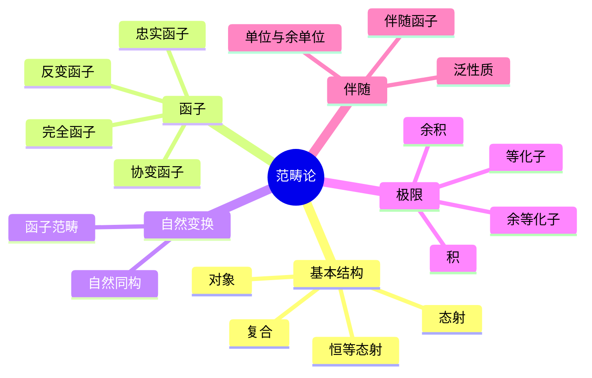
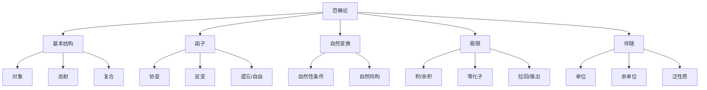

# 2.3 范畴论代数

---

📌 **内容摘要**

本文档深入探讨范畴论代数的核心原理和关键方法。内容涵盖代数学领域的主要知识点，包括函子, 范畴论, 范畴, 自然变换等关键主题。适合初学者建立基础知识体系。

**关键词**: 代数学, 函子, 范畴论, 范畴, 自然变换

📚 **学习目标**
- 理解范畴论代数的基本概念和核心原理
- 掌握相关术语和符号表示
- 建立该领域的系统性知识框架

🎯 **难度级别**: 初级

⏱️ **预计阅读时间**: 15分钟

**前置知识**: 基础数学知识

---


## 目录

- [2.3 范畴论代数](#23-范畴论代数)
  - [目录](#目录)
  - [2.3.1 引言](#231-引言)
  - [2.3.2 范畴的基本概念](#232-范畴的基本概念)
    - [2.3.2.1 范畴的定义](#2321-范畴的定义)
    - [2.3.2.2 常见范畴](#2322-常见范畴)
    - [2.3.2.3 态射的性质](#2323-态射的性质)
  - [2.3.3 函子与自然变换](#233-函子与自然变换)
    - [2.3.3.1 函子](#2331-函子)
    - [2.3.3.2 函子的例子](#2332-函子的例子)
    - [2.3.3.3 自然变换](#2333-自然变换)
  - [2.3.4 泛性质与极限](#234-泛性质与极限)
    - [2.3.4.1 积与余积](#2341-积与余积)
    - [2.3.4.2 极限与余极限](#2342-极限与余极限)
  - [2.3.5 伴随函子](#235-伴随函子)
    - [2.3.5.1 伴随的定义](#2351-伴随的定义)
    - [2.3.5.2 伴随的例子](#2352-伴随的例子)
    - [2.3.5.3 伴随与泛性质](#2353-伴随与泛性质)
  - [2.3.6 代数结构的范畴](#236-代数结构的范畴)
    - [2.3.6.1 具体范畴](#2361-具体范畴)
    - [2.3.6.2 代数范畴的性质](#2362-代数范畴的性质)
  - [2.3.7 多表征视角](#237-多表征视角)
    - [概念图谱](#概念图谱)
    - [范畴论视角下的代数结构](#范畴论视角下的代数结构)
  - [参见](#参见)

---

## 2.3.1 引言

范畴论(Category Theory)由塞缪尔·艾伦伯格(Samuel Eilenberg)和桑德斯·麦克莱恩(Saunders Mac Lane)于1945年创立，旨在为代数拓扑中的自然等价概念提供精确描述。
如今，它已成为统一现代数学的通用语言。

范畴论的核心理念：

- 关注数学对象之间的**关系（态射）**而非对象本身
- 通过**泛性质**定义构造
- 揭示不同数学领域间的**深层同构**



---

## 2.3.2 范畴的基本概念

### 2.3.2.1 范畴的定义

**范畴(Category)** $\mathcal{C}$ 由以下数据组成：

| 组件 | 说明 |
|------|------|
| $\text{Ob}(\mathcal{C})$ | 对象类 |
| $\text{Hom}_{\mathcal{C}}(A, B)$ | 从$A$到$B$的态射集，对每对对象$A, B$ |
| $\circ$ | 态射复合运算 |
| $id_A$ | 恒等态射，对每个对象$A$ |

**公理**：

1. **结合律**：$(h \circ g) \circ f = h \circ (g \circ f)$
2. **恒等律**：$f \circ id_A = f = id_B \circ f$（对$f: A \to B$）

```lean
class Category (obj : Type u) where
  Hom : obj → obj → Type v
  id : ∀ X : obj, Hom X X
  comp : ∀ {X Y Z : obj}, Hom X Y → Hom Y Z → Hom X Z
  id_comp : ∀ {X Y : obj} (f : Hom X Y), comp (id X) f = f
  comp_id : ∀ {X Y : obj} (f : Hom X Y), comp f (id Y) = f
  assoc : ∀ {W X Y Z : obj} (f : Hom W X) (g : Hom X Y) (h : Hom Y Z),
    comp (comp f g) h = comp f (comp g h)

infixr:80 " ⟶ " => Category.Hom
notation:max "𝟙" => Category.id
infixr:80 " ≫ " => Category.comp
```

### 2.3.2.2 常见范畴

| 范畴 | 对象 | 态射 |
|------|------|------|
| $\mathbf{Set}$ | 集合 | 函数 |
| $\mathbf{Grp}$ | 群 | 群同态 |
| $\mathbf{Ab}$ | 阿贝尔群 | 群同态 |
| $\mathbf{Ring}$ | 环 | 环同态 |
| $\mathbf{Vec}_F$ | $F$-向量空间 | 线性映射 |
| $\mathbf{Top}$ | 拓扑空间 | 连续映射 |
| $\mathbf{Pos}$ | 偏序集 | 单调映射 |

### 2.3.2.3 态射的性质

| 性质 | 定义 | 例子 |
|------|------|------|
| **单态射(Monomorphism)** | $f \circ g = f \circ h \implies g = h$ | 单射（在Set中） |
| **满态射(Epimorphism)** | $g \circ f = h \circ f \implies g = h$ | 满射（在Set中） |
| **同构(Isomorphism)** | $\exists g: f \circ g = id, g \circ f = id$ | 双射（在Set中） |
| **自同态(Endomorphism)** | $f: A \to A$ | 方阵 |
| **自同构(Automorphism)** | 自同态 + 同构 | 可逆方阵 |

```lean
def is_iso {C : Type u} [Category C] {X Y : C} (f : X ⟶ Y) : Prop :=
  ∃ g : Y ⟶ X, f ≫ g = 𝟙 X ∧ g ≫ f = 𝟙 Y

def is_mono {C : Type u} [Category C] {X Y : C} (f : X ⟶ Y) : Prop :=
  ∀ {Z : C} (g h : Z ⟶ X), g ≫ f = h ≫ f → g = h

def is_epi {C : Type u} [Category C] {X Y : C} (f : X ⟶ Y) : Prop :=
  ∀ {Z : C} (g h : Y ⟶ Z), f ≫ g = f ≫ h → g = h
```

---

## 2.3.3 函子与自然变换

### 2.3.3.1 函子

**函子(Functor)** $F: \mathcal{C} \to \mathcal{D}$ 包括：

- 对象映射：$F: \text{Ob}(\mathcal{C}) \to \text{Ob}(\mathcal{D})$
- 态射映射：$F: \text{Hom}_{\mathcal{C}}(A, B) \to \text{Hom}_{\mathcal{D}}(F(A), F(B))$

满足：

- $F(id_A) = id_{F(A)}$
- $F(f \circ g) = F(f) \circ F(g)$

```lean
class Functor (C : Type u₁) [Category C] (D : Type u₂) [Category D] where
  obj : C → D
  map : ∀ {X Y : C}, (X ⟶ Y) → (obj X ⟶ obj Y)
  map_id : ∀ X : C, map (𝟙 X) = 𝟙 (obj X)
  map_comp : ∀ {X Y Z : C} (f : X ⟶ Y) (g : Y ⟶ Z),
    map (f ≫ g) = map f ≫ map g
```

### 2.3.3.2 函子的例子

| 函子 | 定义 | 类型 |
|------|------|------|
| **遗忘函子** $U: \mathbf{Grp} \to \mathbf{Set}$ | 遗忘群结构，保留集合 | 忠实 |
| **自由函子** $F: \mathbf{Set} \to \mathbf{Grp}$ | 自由群构造 | 伴随遗忘函子 |
| **同调函子** $H_n$ | 链复形 → 同调群 | 协变 |
| **对偶空间函子** $(-)^*: \mathbf{Vec}_F^{op} \to \mathbf{Vec}_F$ | $V \mapsto V^*$ | 反变 |

### 2.3.3.3 自然变换

**自然变换(Natural Transformation)** $\alpha: F \Rightarrow G$ 是态射族 $(\alpha_A: F(A) \to G(A))_{A \in \mathcal{C}}$，使得下图交换：

```
F(A) --α_A--> G(A)
  |             |
  | F(f)        | G(f)
  v             v
F(B) --α_B--> G(B)
```

即：$\alpha_B \circ F(f) = G(f) \circ \alpha_A$

```lean
structure NatTrans {C D : Type _} [Category C] [Category D]
  (F G : Functor C D) where
  app : ∀ X : C, F.obj X ⟶ G.obj X
  naturality : ∀ {X Y : C} (f : X ⟶ Y),
    F.map f ≫ app Y = app X ≫ G.map f
```

---

## 2.3.4 泛性质与极限

### 2.3.4.1 积与余积

**积(Product)**：对象$X \times Y$配备投影$\pi_1: X \times Y \to X$，$\pi_2: X \times Y \to Y$，满足泛性质：

对任意$Z$和$f: Z \to X$，$g: Z \to Y$，存在唯一的$\langle f, g \rangle: Z \to X \times Y$使得$\pi_1 \circ \langle f, g \rangle = f$，$\pi_2 \circ \langle f, g \rangle = g$。

**余积(Coproduct)**：对偶概念，记为$X + Y$或$X \sqcup Y$。

| 范畴 | 积 | 余积 |
|------|-----|------|
| Set | 笛卡尔积 | 不交并 |
| Grp | 直积 | 自由积 |
| Ab | 直积 | 直和 |
| Top | 积空间 | 不交拓扑和 |

### 2.3.4.2 极限与余极限

**锥(Cone)**：图表$D: \mathcal{J} \to \mathcal{C}$的锥是对象$N$配备态射族$\psi_J: N \to D(J)$，使得所有三角形交换。

**极限(Limit)**：泛锥，即对任意锥$(N, \psi)$，存在唯一态射$u: N \to \lim D$使得$\psi_J = p_J \circ u$。

**余极限(Colimit)**：对偶概念。

```lean
structure Cone {J C : Type _} [Category J] [Category C]
  (F : Functor J C) where
  pt : C
  π : ∀ j : J, pt ⟶ F.obj j
  w : ∀ {j k : J} (f : j ⟶ k), π j ≫ F.map f = π k

structure IsLimit {J C : Type _} [Category J] [Category C]
  {F : Functor J C} (c : Cone F) where
  lift : ∀ (s : Cone F), s.pt ⟶ c.pt
  fac : ∀ (s : Cone F) (j : J), lift s ≫ c.π j = s.π j
  uniq : ∀ (s : Cone F) (m : s.pt ⟶ c.pt)
    (w : ∀ j : J, m ≫ c.π j = s.π j), m = lift s
```

---

## 2.3.5 伴随函子

### 2.3.5.1 伴随的定义

**伴随(Adjunction)**：函子$L: \mathcal{C} \to \mathcal{D}$和$R: \mathcal{D} \to \mathcal{C}$形成伴随$L \dashv R$，如果存在自然同构：

$$\text{Hom}_{\mathcal{D}}(L(X), Y) \cong \text{Hom}_{\mathcal{C}}(X, R(Y))$$

$L$称为**左伴随**，$R$称为**右伴随**。

```lean
class Adjunction {C D : Type _} [Category C] [Category D]
  (L : Functor C D) (R : Functor D C) where
  homEquiv : ∀ (X : C) (Y : D), (L.obj X ⟶ Y) ≃ (X ⟶ R.obj Y)
  unit : 𝟭 C ⟶ L.comp R
  counit : R.comp L ⟶ 𝟭 D
```

### 2.3.5.2 伴随的例子

| 左伴随 $L$ | 右伴随 $R$ | 范畴 |
|-----------|-----------|------|
| 自由群构造 | 遗忘函子 | $\mathbf{Set} \leftrightarrows \mathbf{Grp}$ |
| 自由$R$-模 | 遗忘函子 | $\mathbf{Set} \leftrightarrows R\text{-}\mathbf{Mod}$ |
| 积拓扑 | 底空间 | $\mathbf{Top}/B \leftrightarrows \mathbf{Top}$ |
| 张量积$-\otimes Y$ | 同态函子$[Y, -]$ | $\mathbf{Mod}_R \leftrightarrows \mathbf{Mod}_R$ |

### 2.3.5.3 伴随与泛性质

**单位(Unit)**：$\eta: 1_{\mathcal{C}} \Rightarrow R \circ L$

**余单位(Counit)**：$\varepsilon: L \circ R \Rightarrow 1_{\mathcal{D}}$

**三角恒等式**：

- $(\varepsilon L) \circ (L \eta) = id_L$
- $(R \varepsilon) \circ (\eta R) = id_R$

---

## 2.3.6 代数结构的范畴

### 2.3.6.1 具体范畴

**具体范畴(Concrete Category)**：配备忠实函子$U: \mathcal{C} \to \mathbf{Set}$的范畴。

代数范畴通常是具体的，遗忘函子将代数结构"遗忘"为集合。

### 2.3.6.2 代数范畴的性质

| 性质 | 说明 | 例子 |
|------|------|------|
| **完备性** | 所有小极限存在 | $\mathbf{Grp}, \mathbf{Ring}$ |
| **余完备性** | 所有小余极限存在 | $\mathbf{Grp}, \mathbf{Ring}$ |
| **正则性** | 正则满态射稳定 | 代数范畴 |
| **单射性** | 单态射 = 单射 | 代数范畴 |

---

## 2.3.7 多表征视角

### 概念图谱



### 范畴论视角下的代数结构

| 代数概念 | 范畴论对应 |
|----------|-----------|
| 子群 | 子对象（等价类单态射） |
| 商群 | 商对象（等价类满态射） |
| 直积 | 范畴积 |
| 直和 | 范畴余积（在Ab中） |
| 自由群 | 自由函子（左伴随） |
| 张量积 | 右伴随的左伴随 |

---

## 参见

- [抽象代数](./02.1_抽象代数.md) — 代数结构的具体研究
- [线性代数](./02.2_线性代数.md) — 向量空间的范畴$\mathbf{Vec}_F$
- [集合论基础](../01_元数学基础/01.1_集合论基础.md) — 范畴的集合论基础
- [代数拓扑](../03_几何学/03.3_代数拓扑.md) — 范畴论的诞生地
- [代数几何初步](./02.4_代数几何初步.md) — 概形的范畴
---

## 📋 前置知识

- [2.3 线性代数](../02_代数学/02.3_线性代数.md)

---

## 📚 延伸阅读

- [04.1 范畴基本概念](./02_形式语言/04_范畴论/04.1_范畴基本概念.md)
- [4.1 范畴基础 (Category Theory Foundations)](./02_形式语言/04_范畴论/04.1_范畴基础.md)
- [2.1 抽象代数](../02_代数学/02.1_抽象代数.md)
- [1.1 集合论基础](../01_元数学基础/01.1_集合论基础.md)
- [2.2 线性代数](../02_代数学/02.2_线性代数.md)
