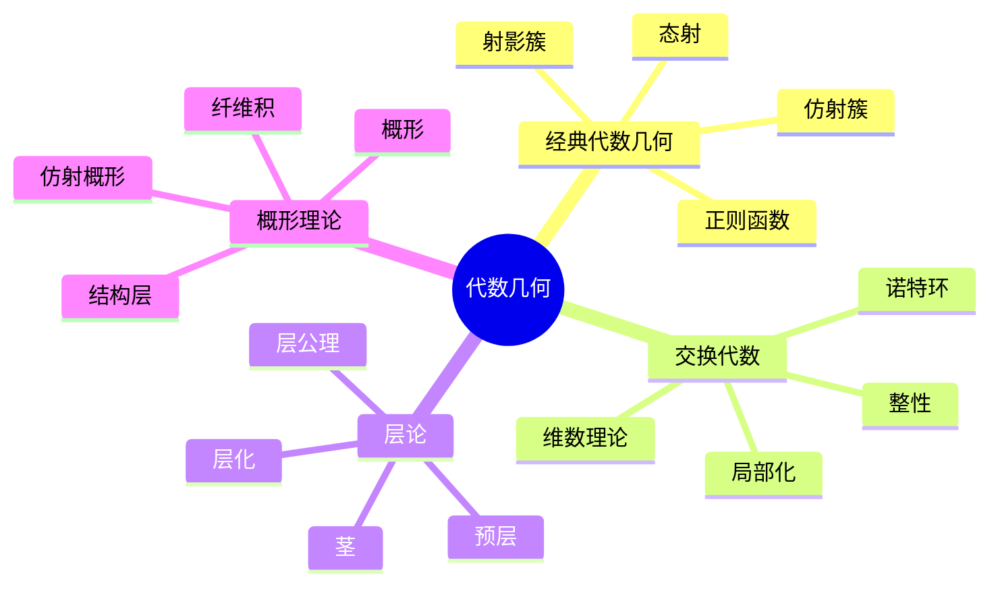
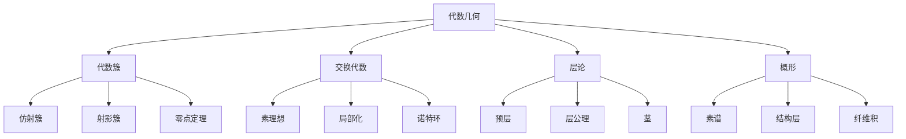

# 2.4 代数几何初步

---

📌 **内容摘要**

本文档深入探讨代数几何初步的核心原理和关键方法。内容涵盖代数学领域的主要知识点，包括相关理论、方法及应用。适合具备相关基础的学习者进行深入研究。

**关键词**: 代数学

📚 **学习目标**
- 深入理解代数几何初步的理论体系和形式化方法
- 能够进行相关定理的形式化证明
- 建立该领域的系统性知识框架

🎯 **难度级别**: 高级

⏱️ **预计阅读时间**: 15分钟

**前置知识**: 该领域的中级知识, 形式化方法基础

---


## 目录

- [2.4 代数几何初步](#24-代数几何初步)
  - [目录](#目录)
  - [2.4.1 引言](#241-引言)
  - [2.4.2 代数簇](#242-代数簇)
    - [2.4.2.1 仿射代数簇](#2421-仿射代数簇)
    - [2.4.2.2 希尔伯特零点定理](#2422-希尔伯特零点定理)
    - [2.4.2.3 代数集与理想的对应](#2423-代数集与理想的对应)
  - [2.4.3 仿射概形](#243-仿射概形)
    - [2.4.3.1 素谱](#2431-素谱)
    - [2.4.3.2 结构层](#2432-结构层)
  - [2.4.4 层论基础](#244-层论基础)
    - [2.4.4.1 预层与层](#2441-预层与层)
    - [2.4.4.2 茎与层化](#2442-茎与层化)
  - [2.4.5 概形](#245-概形)
    - [2.4.5.1 概形的定义](#2451-概形的定义)
    - [2.4.5.2 概形的例子](#2452-概形的例子)
    - [2.4.5.3 纤维积](#2453-纤维积)
  - [2.4.6 多表征视角](#246-多表征视角)
    - [概念图谱](#概念图谱)
    - [代数为几何提供视角](#代数为几何提供视角)
  - [参见](#参见)

---

## 2.4.1 引言

代数几何(Algebraic Geometry)研究多项式方程组的解集（代数簇）及其几何性质。
从经典代数簇到现代概形理论，代数几何已成为数学中最深刻和统一的分支之一，与数论、表示论、数学物理等领域深度交融。

历史脉络：

- 19世纪：黎曼、诺特、希尔伯特的经典代数几何
- 20世纪40-50年代：韦伊(Weil)的抽象代数簇
- 1960年代：格罗滕迪克(Grothendieck)的概形革命



---

## 2.4.2 代数簇

### 2.4.2.1 仿射代数簇

**仿射空间**：$\mathbb{A}^n_k = k^n$，域$k$上的$n$维仿射空间。

**代数集(Algebraic Set)**：多项式集合的零点集

$$V(S) = \{x \in \mathbb{A}^n_k \mid \forall f \in S, f(x) = 0\}$$

其中$S \subseteq k[x_1, \ldots, x_n]$。

**仿射簇(Affine Variety)**：不可约的代数集（不能表示为两个真代数集的并）。

```lean
def algebraicSet {k : Type*} [Field k] {n : ℕ}
  (S : Set (MvPolynomial (Fin n) k)) : Set (Fin n → k) :=
  {x | ∀ f ∈ S, MvPolynomial.eval x f = 0}

def is_irreducible {k : Type*} [Field k] {n : ℕ}
  (V : Set (Fin n → k)) : Prop :=
  ∀ V₁ V₂ : Set (Fin n → k),
    is_algebraic_set V₁ → is_algebraic_set V₂ →
    V = V₁ ∪ V₂ → V = V₁ ∨ V = V₂
```

### 2.4.2.2 希尔伯特零点定理

**定理 2.4.2.1 (希尔伯特零点定理, Nullstellensatz)**：设$k$是代数闭域，$I \subseteq k[x_1, \ldots, x_n]$是理想，则：

$$I(V(I)) = \sqrt{I}$$

其中$\sqrt{I} = \{f \mid \exists n > 0, f^n \in I\}$是$I$的根。

**推论**：$k[x_1, \ldots, x_n]$的极大理想与$\mathbb{A}^n_k$的点一一对应。

```lean
theorem nullstellensatz {k : Type*} [Field k] [IsAlgClosed k] {n : ℕ}
  (I : Ideal (MvPolynomial (Fin n) k)) :
  ideal_of_variety (variety_of_ideal I) = I.radical := by
  sorry
```

### 2.4.2.3 代数集与理想的对应

**对应定理**：设$k$代数闭，存在一一对应：

$$\{\text{仿射簇}\} \leftrightarrow \{\text{素理想}\} \subseteq k[x_1, \ldots, x_n]$$

$$\{\text{代数集}\} \leftrightarrow \{\text{根理想}\} \subseteq k[x_1, \ldots, x_n]$$

---

## 2.4.3 仿射概形

### 2.4.3.1 素谱

**素谱(Prime Spectrum)**：交换环$R$的素谱是：

$$\text{Spec}(R) = \{\mathfrak{p} \subseteq R \mid \mathfrak{p} \text{是素理想}\}$$

**扎里斯基拓扑(Zariski Topology)**：闭集为$V(I) = \{\mathfrak{p} \in \text{Spec}(R) \mid I \subseteq \mathfrak{p}\}$，其中$I$是$R$的理想。

```lean
def Spec (R : Type*) [CommRing R] : Type _ :=
  {p : Ideal R // p.IsPrime}

def ZariskiClosed {R : Type*} [CommRing R] (S : Set (Spec R)) : Prop :=
  ∃ I : Ideal R, S = {p | I ≤ p.val}
```

### 2.4.3.2 结构层

**结构层(Structure Sheaf)**：$\mathcal{O}_{\text{Spec}(R)}$是$\text{Spec}(R)$上的层，定义为：

$$\mathcal{O}_{\text{Spec}(R)}(D(f)) = R_f$$

其中$D(f) = \text{Spec}(R) \setminus V(f)$是基本开集，$R_f$是$R$在$f$处的局部化。

**仿射概形(Affine Scheme)**：局部环化空间$(\text{Spec}(R), \mathcal{O}_{\text{Spec}(R)})$。

---

## 2.4.4 层论基础

### 2.4.4.1 预层与层

**预层(Presheaf)**：拓扑空间$X$上的预层$\mathcal{F}$包括：

- 对每个开集$U \subseteq X$，集合$\mathcal{F}(U)$
- 限制映射$\rho_{UV}: \mathcal{F}(U) \to \mathcal{F}(V)$（对$V \subseteq U$）

满足：$\rho_{UU} = id$，$\rho_{VW} \circ \rho_{UV} = \rho_{UW}$（对$W \subseteq V \subseteq U$）

**层(Sheaf)**：满足层公理的预层：

1. **局部性**：若$s, t \in \mathcal{F}(U)$且$s|_{U_i} = t|_{U_i}$对所有$U_i$成立，则$s = t$
2. **粘合性**：若$s_i \in \mathcal{F}(U_i)$在交上相容，则存在$s \in \mathcal{F}(\bigcup U_i)$使得$s|_{U_i} = s_i$

```lean
structure Presheaf (X : Type*) [TopologicalSpace X] where
  obj : Opens X → Type v
  map : ∀ {U V : Opens X}, V.1 ⊆ U.1 → obj U → obj V
  map_id : ∀ (U : Opens X), map (by rfl) = id
  map_comp : ∀ {U V W : Opens X} (hUV : V.1 ⊆ U.1) (hVW : W.1 ⊆ V.1),
    map hVW ∘ map hUV = map (hVW.trans hUV)

structure Sheaf (X : Type*) [TopologicalSpace X] extends Presheaf X where
  locality : ∀ {U : Opens X} (s t : obj U) {ι : Type*} (Uι : ι → Opens X)
    (hU : U = iSup Uι), (∀ i, map (by rw [hU]; exact le_iSup Uι i) s =
      map (by rw [hU]; exact le_iSup Uι i) t) → s = t
  gluing : ∀ {ι : Type*} (Uι : ι → Opens X) (s : ∀ i, obj (Uι i)),
    (∀ i j, map (by ...) (s i) = map (by ...) (s j)) →
    ∃ s' : obj (iSup Uι), ∀ i, map (by ...) s' = s i
```

### 2.4.4.2 茎与层化

**茎(Stalk)**：$\mathcal{F}_x = \varinjlim_{U \ni x} \mathcal{F}(U)$，点$x$处的茎是正向极限。

**层化(Sheafification)**：任意预层$\mathcal{F}$可函子地对应到一个层$\mathcal{F}^+$，配备态射$\mathcal{F} \to \mathcal{F}^+$满足泛性质。

---

## 2.4.5 概形

### 2.4.5.1 概形的定义

**概形(Scheme)**：局部同构于仿射概形的局部环化空间$(X, \mathcal{O}_X)$。

即：存在$X$的开覆盖$\{U_i\}$使得每个$(U_i, \mathcal{O}_X|_{U_i}) \cong \text{Spec}(R_i)$。

**态射(Morphism of Schemes)**：局部环化空间的态射$(f, f^\sharp): (X, \mathcal{O}_X) \to (Y, \mathcal{O}_Y)$，其中$f^\sharp: \mathcal{O}_Y \to f_*\mathcal{O}_X$是层态射。

### 2.4.5.2 概形的例子

| 概形 | 描述 | 性质 |
|------|------|------|
| $\text{Spec}(\mathbb{Z})$ | 整数环的谱 | 一维、诺特、整 |
| $\mathbb{A}^n_k = \text{Spec}(k[x_1, \ldots, x_n])$ | 仿射空间 | 诺特、整 |
| $\mathbb{P}^n_k$ | 射影空间 | 本征、光滑 |
| $\text{Spec}(k[\epsilon]/\epsilon^2)$ | 对偶数 | 非既约 |

### 2.4.5.3 纤维积

**纤维积(Fiber Product)**：概形的拉回

```
X ×_S Y ----> Y
    |          |
    v          v
    X --------> S
```

纤维积在概形范畴中总存在。

---

## 2.4.6 多表征视角

### 概念图谱



### 代数为几何提供视角

| 几何概念 | 代数对应 | 例子 |
|----------|---------|------|
| 点 | 极大理想 | $\mathfrak{m}_p \subseteq k[x_1, \ldots, x_n]$ |
| 子簇 | 素理想 | $V(\mathfrak{p})$不可约 |
| 正则函数 | 环元素 | $f \in \mathcal{O}_X(X)$ |
| 态射 | 环同态 | $\varphi^*: B \to A$对应$\varphi: \text{Spec}(A) \to \text{Spec}(B)$ |
| 维数 | 克鲁尔维数 | $\dim(X) = \dim(\mathcal{O}_X(X))$ |

---

## 参见

- [抽象代数](./02.1_抽象代数.md) — 环的理想理论
- [范畴论代数](./02.3_范畴论代数.md) — 概形的范畴
- [层论基础](../03_几何学/03.2_微分几何.md) — 微分几何中的层
- [代数拓扑](../03_几何学/03.3_代数拓扑.md) — 层上同调
- [伽罗瓦理论](./02.1_抽象代数.md) — 有限域上的代数几何
---

## 📚 延伸阅读

- [04.1 范畴基本概念](./02_形式语言/04_范畴论/04.1_范畴基本概念.md)
- [4.1 范畴基础 (Category Theory Foundations)](./02_形式语言/04_范畴论/04.1_范畴基础.md)
- [2.1 抽象代数](../02_代数学/02.1_抽象代数.md)
- [3.2 微分几何](../03_几何学/03.2_微分几何.md)
- [2.3 范畴论代数](../02_代数学/02.3_范畴论代数.md)
