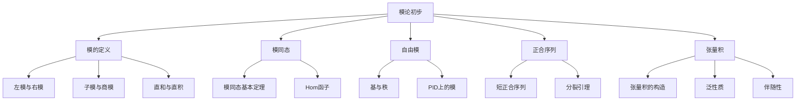

# 2.4 模论初步

---

📌 **内容摘要**

本文档深入探讨模论初步的核心原理和关键方法。内容涵盖代数学领域的主要知识点，包括向量空间, 线性代数, 矩阵等关键主题。适合具备相关基础的学习者进行深入研究。

**关键词**: 向量空间, 代数学, 线性代数, 矩阵

📚 **学习目标**
- 深入理解模论初步的理论体系和形式化方法
- 能够进行相关定理的形式化证明
- 建立该领域的系统性知识框架

🎯 **难度级别**: 高级

⏱️ **预计阅读时间**: 15分钟

**前置知识**: 该领域的中级知识, 形式化方法基础

---


> 形式化数学基础 | 代数学
>
> 交叉引用：[2.2 环与域](./02.2_环与域.md) | [2.3 线性代数](./02.3_线性代数.md)

## 2.4.1 引言

模是向量空间在环上的推广，是代数学中的核心结构。本章形式化介绍模结构和张量积理论。



## 2.4.2 模的定义

### 2.4.2.1 左模与右模

**定义 2.4.1**（左 $R$-模）
设 $R$ 是含幺环，**左 $R$-模**是Abel群 $(M, +)$ 配备数乘 $R \times M \to M$，$(r, m) \mapsto rm$ 满足：

- $r(m_1 + m_2) = rm_1 + rm_2$
- $(r_1 + r_2)m = r_1m + r_2m$
- $(r_1r_2)m = r_1(r_2m)$
- $1m = m$

**定义 2.4.2**（右 $R$-模）
**右 $R$-模**类似定义，数乘为 $M \times R \to M$，满足 $(mr_1)r_2 = m(r_1r_2)$。

**注**：若 $R$ 交换，左模与右模可等同：$rm = mr$。

**例 2.4.1**

- 域 $F$ 上的向量空间是 $F$-模
- Abel群是 $\mathbb{Z}$-模
- 环 $R$ 的理想是 $R$-模
- $R^n$ 是自由 $R$-模

### 2.4.2.2 子模与商模

**定义 2.4.3**（子模）
$N \subseteq M$ 是**子模**，如果：

- $(N, +)$ 是 $(M, +)$ 的子群
- $\forall r \in R, \forall n \in N, rn \in N$

**定理 2.4.1**（子模的交与和）

- 任意子模族的交是子模
- 子模之和 $N_1 + N_2 = \{n_1 + n_2 \mid n_i \in N_i\}$ 是子模

**定义 2.4.4**（商模）
若 $N \subseteq M$ 是子模，**商模** $M/N$ 是商群配备运算：
$$r(m + N) = rm + N$$

**定理 2.4.2**（商模良定性）
上述运算良定，$M/N$ 成为 $R$-模。

### 2.4.2.3 Lean 4 形式化

```lean4
import Mathlib

-- 模的类型类（Mathlib已提供）
-- class Module (R : Type) (M : Type) [Semiring R] [AddCommMonoid M] extends DistribMulAction R M where
--   add_smul : ∀ (r s : R) (x : M), (r + s) • x = r • x + s • x
--   zero_smul : ∀ x : M, (0 : R) • x = 0

-- 子模
#check Submodule R M

-- 商模
#check Module.Quotient N  -- N : Submodule R M

-- 定理：子模的交
theorem Submodule.inf_iff {R M : Type} [Ring R] [AddCommGroup M] [Module R M]
  {N₁ N₂ : Submodule R M} {x : M} :
  x ∈ N₁ ⊓ N₂ ↔ x ∈ N₁ ∧ x ∈ N₂ := by
  simp
```

## 2.4.3 模同态

### 2.4.3.1 定义与例子

**定义 2.4.5**（模同态）
映射 $f: M \to N$ 是**$R$-模同态**，如果：

- $f(m_1 + m_2) = f(m_1) + f(m_2)$
- $f(rm) = rf(m)$

**定义 2.4.6**（同态的分类）

- **单同态**（嵌入）：单射
- **满同态**：满射
- **同构**：双射，记作 $M \cong N$
- **自同态**：$M \to M$
- **自同构**：$M \to M$ 的同构

**定理 2.4.3**（Hom集合的模结构）
$\text{Hom}_R(M, N)$ 是Abel群，若 $R$ 交换则是 $R$-模。

### 2.4.3.2 同态基本定理

**定理 2.4.4**（第一同构定理）
设 $f: M \to N$ 是模同态，则：
$$M/\ker(f) \cong \text{im}(f)$$

**定理 2.4.5**（对应定理）
存在双射：
$$\{M \text{ 的包含 } \ker(f) \text{ 的子模}\} \longleftrightarrow \{\text{im}(f) \text{ 的子模}\}$$

**定理 2.4.6**（第二同构定理）
若 $M_1, M_2$ 是 $M$ 的子模：
$$(M_1 + M_2)/M_2 \cong M_1/(M_1 \cap M_2)$$

**定理 2.4.7**（第三同构定理）
若 $N \subseteq L \subseteq M$ 是子模：
$$(M/N)/(L/N) \cong M/L$$

## 2.4.4 自由模

### 2.4.4.1 基与秩

**定义 2.4.7**（自由模）
$R$-模 $M$ 是**自由模**，如果存在基 $B \subseteq M$：

- $B$ 生成 $M$
- $B$ 是 $R$-线性无关的

等价地，$M \cong R^{(B)}$（$B$ 个 $R$ 的直和）。

**定义 2.4.8**（秩）
自由模的**秩**是基元素的个数（若良定）。

**定理 2.4.8**（PID上秩的良定性）
主理想整环上自由模的任意两个基有相同基数。

**定理 2.4.9**（自由模的泛性质）
自由模 $F$ 有基 $B$，则任意映射 $f: B \to N$ 可唯一扩张为模同态 $\bar{f}: F \to N$。

### 2.4.4.2 PID上的有限生成模

**定理 2.4.10**（PID上有限生成模的结构）
主理想整环 $R$ 上有限生成模 $M$ 有分解：
$$M \cong R^r \oplus R/(d_1) \oplus \cdots \oplus R/(d_k)$$
其中 $d_1 \mid d_2 \mid \cdots \mid d_k$，$r$ 是自由部分的秩。

**推论 2.4.1**（有限生成Abel群）
有限生成Abel群有形式：
$$G \cong \mathbb{Z}^r \oplus \mathbb{Z}/d_1\mathbb{Z} \oplus \cdots \oplus \mathbb{Z}/d_k\mathbb{Z}$$

## 2.4.5 正合序列

### 2.4.5.1 定义

**定义 2.4.9**（正合序列）
模同态序列 $\cdots \to M_{i-1} \xrightarrow{f_{i-1}} M_i \xrightarrow{f_i} M_{i+1} \to \cdots$ **在 $M_i$ 处正合**，如果：
$$\text{im}(f_{i-1}) = \ker(f_i)$$

序列处处正合称为**正合序列**。

**定义 2.4.10**（短正合序列）
$$0 \to A \xrightarrow{f} B \xrightarrow{g} C \to 0$$
正合意味着：

- $f$ 是单射
- $\text{im}(f) = \ker(g)$
- $g$ 是满射

### 2.4.5.2 分裂引理

**定义 2.4.11**（分裂短正合序列）
短正合序列**分裂**，如果满足以下等价条件之一：

- 存在 $s: C \to B$ 使 $g \circ s = \text{id}_C$（截面）
- 存在 $r: B \to A$ 使 $r \circ f = \text{id}_A$（收缩）
- $B \cong A \oplus C$

**定理 2.4.11**（分裂引理）
上述三个条件等价。

**证明**：
$(1 \Rightarrow 3)$：定义 $\varphi: A \oplus C \to B$，$\varphi(a, c) = f(a) + s(c)$。
$(a, c) \in \ker(\varphi) \Rightarrow f(a) = -s(c) \in \text{im}(f) \cap \text{im}(s)$。
由 $g(f(a) + s(c)) = g(s(c)) = c = 0$，得 $c = 0$，从而 $a = 0$。
$\varphi$ 是单射；由维数或构造，是满射。
$\square$

## 2.4.6 张量积

### 2.4.6.1 构造

**定义 2.4.12**（张量积）
$R$-模 $M, N$ 的**张量积** $M \otimes_R N$ 是自由Abel群 $F(M \times N)$ 模去以下关系生成的子群：

- $(m_1 + m_2, n) - (m_1, n) - (m_2, n)$
- $(m, n_1 + n_2) - (m, n_1) - (m, n_2)$
- $(mr, n) - (m, rn)$

元素记作 $m \otimes n$。

**定理 2.4.12**（张量积的模结构）
若 $R$ 交换，$M \otimes_R N$ 是 $R$-模，数乘 $r(m \otimes n) = (rm) \otimes n = m \otimes (rn)$。

### 2.4.6.2 泛性质

**定理 2.4.13**（张量积的泛性质）
双线性映射 $\varphi: M \times N \to P$ 一一对应于线性映射 $\bar{\varphi}: M \otimes N \to P$，使下图交换：

```
M × N --→ M ⊗ N
   \       |
    \      | ∃! φ̄
     ↘     ↓
         P
```

**定理 2.4.14**（张量积的性质）

- $R \otimes_R M \cong M$
- $M \otimes N \cong N \otimes M$（$R$ 交换）
- $(M \otimes N) \otimes P \cong M \otimes (N \otimes P)$
- $(\bigoplus_i M_i) \otimes N \cong \bigoplus_i (M_i \otimes N)$

### 2.4.6.3 Hom-张量伴随

**定理 2.4.15**（伴随性）
对 $R$-模 $M, N, P$，有自然同构：
$$\text{Hom}_R(M \otimes N, P) \cong \text{Hom}_R(M, \text{Hom}_R(N, P))$$

等价地，$-\otimes N$ 是 $\text{Hom}_R(N, -)$ 的左伴随。

**定理 2.4.16**（右正合性）
张量积函子是右正合的：若 $A \to B \to C \to 0$ 正合，则 $A \otimes M \to B \otimes M \to C \otimes M \to 0$ 正合。

**定义 2.4.13**（平坦模）
$M$ 是**平坦模**，如果 $-\otimes M$ 是正合函子。

**定理 2.4.17**（自由模平坦）
自由模是平坦模。

## 2.4.7 参考文献

1. Dummit, D. S., & Foote, R. M. (2004). _Abstract Algebra_ (3rd ed.). Wiley.
2. Lang, S. (2002). _Algebra_ (Revised 3rd ed.). Springer.
3. Rotman, J. J. (2009). _An Introduction to Homological Algebra_ (2nd ed.). Springer.
4. Weibel, C. A. (1994). _An Introduction to Homological Algebra_. Cambridge University Press.
5. Hilton, P. J., & Stammbach, U. (1997). _A Course in Homological Algebra_ (2nd ed.). Springer.
---

## 📚 延伸阅读

- [2.2 环与域](../02_代数学/02.2_环与域.md)
- [2.2 线性代数](../02_代数学/02.2_线性代数.md)
- [2.3 线性代数](../02_代数学/02.3_线性代数.md)
