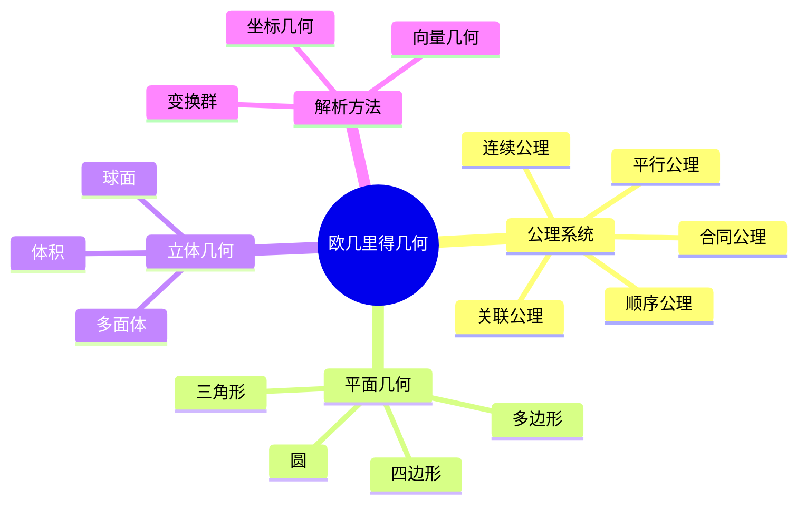
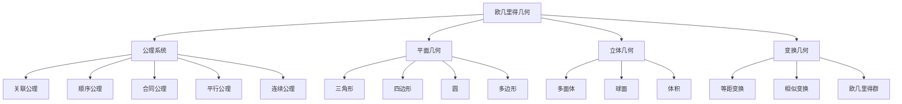

# 3.1 欧几里得几何

---

📌 **内容摘要**

本文档深入探讨欧几里得几何的核心原理和关键方法。内容涵盖几何学领域的主要知识点，包括欧几里得几何, 公理化, 希尔伯特等关键主题。适合初学者建立基础知识体系。

**关键词**: 欧几里得几何, 公理化, 几何学, 希尔伯特

📚 **学习目标**
- 理解欧几里得几何的基本概念和核心原理
- 掌握相关术语和符号表示
- 建立该领域的系统性知识框架

🎯 **难度级别**: 初级

⏱️ **预计阅读时间**: 15分钟

**前置知识**: 基础数学知识

---


## 目录

- [3.1 欧几里得几何](#31-欧几里得几何)
  - [目录](#目录)
  - [3.1.1 引言](#311-引言)
  - [3.1.2 希尔伯特公理系统](#312-希尔伯特公理系统)
    - [3.1.2.1 基本概念](#3121-基本概念)
    - [3.1.2.2 五组公理](#3122-五组公理)
  - [3.1.3 经典定理](#313-经典定理)
    - [3.1.3.1 三角形的基本性质](#3131-三角形的基本性质)
    - [3.1.3.2 圆的性质](#3132-圆的性质)
  - [3.1.4 向量几何](#314-向量几何)
    - [3.1.4.1 向量方法](#3141-向量方法)
    - [3.1.4.2 距离公式](#3142-距离公式)
  - [3.1.5 变换几何](#315-变换几何)
    - [3.1.5.1 欧几里得变换](#3151-欧几里得变换)
    - [3.1.5.2 变换的分类](#3152-变换的分类)
  - [3.1.6 多表征视角](#316-多表征视角)
    - [概念图谱](#概念图谱)
    - [非欧几何对比](#非欧几何对比)
  - [参见](#参见)

---

## 3.1.1 引言

欧几里得几何(Euclidean Geometry)是历史上最古老、最系统化的数学分支之一。
欧几里得的《几何原本》(约公元前300年)建立了公理化方法的典范，影响深远。

现代欧几里得几何基于希尔伯特于1899年提出的严格公理系统，弥补了原始《几何原本》的逻辑漏洞。



---

## 3.1.2 希尔伯特公理系统

### 3.1.2.1 基本概念

**原始概念**（不加定义）：

- 点(Point)
- 直线(Line)
- 平面(Plane)
- 位于(Lies on)：关联关系
- 介于(Between)：顺序关系
- 合同(Congruent)：全等关系

### 3.1.2.2 五组公理

**I. 关联公理(Incidence Axioms)**

| 公理 | 内容 |
|------|------|
| I.1 | 对任意两点$A, B$，存在直线$a$通过它们 |
| I.2 | 对任意不同两点$A, B$，至多存在一条直线通过它们 |
| I.3 | 每条直线上至少有两点；至少存在三点不在同一直线上 |
| I.4-8 | 平面公理（类似直线公理） |

**II. 顺序公理(Order Axioms)**

| 公理 | 内容 |
|------|------|
| II.1 | 若$B$介于$A$和$C$之间，则$A, B, C$是不同的共线点，且$B$介于$C$和$A$之间 |
| II.2 | 对任意两点$A, C$，直线$AC$上至少存在一点$B$使得$C$介于$A$和$B$之间 |
| II.3 | 在共线三点中，至多有一点介于另两点之间 |
| II.4 (帕施公理) | 设$A, B, C$不共线，直线$a$在平面$ABC$上不通过任一点，若$a$通过$AB$上一点介于$A, B$之间，则$a$通过$AC$或$BC$上一点 |

**III. 合同公理(Congruence Axioms)**

| 公理 | 内容 |
|------|------|
| III.1 | 给定$AB$和点$A'$及过$A'$的射线，存在唯一的$B'$使得$A'B' \equiv AB$ |
| III.2 | 合同关系是等价关系 |
| III.3 | 若$AB \equiv A'B'$且$BC \equiv B'C'$，则$AC \equiv A'C'$ |
| III.4-5 | 角的合同公理 |

**IV. 平行公理(Parallel Axiom)**

| 公理 | 内容 |
|------|------|
| IV (欧几里得) | 给定直线$a$和不在$a$上的点$A$，至多存在一条直线通过$A$且与$a$不相交 |

等价形式（普莱费尔公理）：给定直线$a$和不在$a$上的点$A$，存在唯一的直线通过$A$且与$a$平行。

**V. 连续公理(Continuity Axioms)**

| 公理 | 内容 |
|------|------|
| V.1 (阿基米德公理) | 若$AB$和$CD$是任意两线段，则存在有限个点$A_1, \ldots, A_n$在射线$AB$上，使得$AA_1 \equiv A_1A_2 \equiv \cdots \equiv A_{n-1}A_n \equiv CD$且$B$介于$A$和$A_n$之间 |
| V.2 (完备公理) | 直线上的点构成满足上述公理且不能扩充的集合 |

```lean
-- 欧几里得几何公理的形式化结构
class EuclideanGeometry where
  Point : Type
  Line : Type
  Plane : Type

  lies_on : Point → Line → Prop
  between : Point → Point → Point → Prop
  congruent_segments : Line → Line → Prop
  congruent_angles : Angle → Angle → Prop

  -- 关联公理
  incidence1 : ∀ A B : Point, A ≠ B → ∃ l : Line, lies_on A l ∧ lies_on B l
  incidence2 : ∀ A B : Point, A ≠ B → ∀ l m : Line,
    lies_on A l → lies_on B l → lies_on A m → lies_on B m → l = m

  -- 平行公理
  parallel_axiom : ∀ l : Line, ∀ A : Point,
    ¬(lies_on A l) → ∃! m : Line, lies_on A m ∧ parallel l m
```

---

## 3.1.3 经典定理

### 3.1.3.1 三角形的基本性质

**定理 3.1.3.1 (三角形内角和)**：欧几里得平面上，三角形内角和等于$\pi$（或$180°$）。

$$\angle A + \angle B + \angle C = 180°$$

**证明**：过顶点作平行于对边的直线，利用内错角相等。

**定理 3.1.3.2 (勾股定理)**：直角三角形中，斜边平方等于两直角边平方和。

$$c^2 = a^2 + b^2$$

### 3.1.3.2 圆的性质

**定理 3.1.3.3 (圆周角定理)**：圆周角等于其所对圆心角的一半。

**定理 3.1.3.4 (相交弦定理)**：若两弦$AB$和$CD$相交于$P$，则$PA \cdot PB = PC \cdot PD$。

**定理 3.1.3.5 (切割线定理)**：从圆外点$P$引切线$PT$和割线$PAB$，则$PT^2 = PA \cdot PB$。

---

## 3.1.4 向量几何

### 3.1.4.1 向量方法

**位置向量**：点$P$的位置向量$\vec{p} = \overrightarrow{OP}$

**直线方程**：过点$A$方向$\vec{d}$的直线：$\vec{r} = \vec{a} + t\vec{d}$

**平面方程**：法向量$\vec{n}$，过点$A$：$(\vec{r} - \vec{a}) \cdot \vec{n} = 0$

### 3.1.4.2 距离公式

**点到直线距离**：
$$d = \frac{|(\vec{p} - \vec{a}) \times \vec{d}|}{|\vec{d}|}$$

**点到平面距离**：
$$d = \frac{|(\vec{p} - \vec{a}) \cdot \vec{n}|}{|\vec{n}|}$$

---

## 3.1.5 变换几何

### 3.1.5.1 欧几里得变换

**等距变换(Isometry)**：保持距离不变的变换。

| 变换 | 定义 | 自由度 |
|------|------|--------|
| 平移 | $\vec{x} \mapsto \vec{x} + \vec{a}$ | 2（平面）/3（空间） |
| 旋转 | 绕原点/轴旋转$\theta$ | 1/3 |
| 反射 | 关于直线/平面的反射 | 1/1 |
| 滑移反射 | 反射+沿反射轴平移 | 2 |

**欧几里得群** $E(n)$：所有等距变换构成的群。

### 3.1.5.2 变换的分类

**平面等距变换**：

- 保向：平移、旋转
- 反向：反射、滑移反射

**空间等距变换**：

- 真等距：平移、旋转、螺旋运动
- 非正常等距：反射、旋转反射、滑移反射

---

## 3.1.6 多表征视角

### 概念图谱



### 非欧几何对比

| 性质 | 欧几里得 | 椭圆几何 | 双曲几何 |
|------|---------|---------|---------|
| 平行线 | 唯一 | 无 | 无穷多 |
| 三角形内角和 | $= \pi$ | $> \pi$ | $< \pi$ |
| 圆周长 | $2\pi r$ | $< 2\pi r$ | $> 2\pi r$ |
| 曲率 | 0 | 正 | 负 |

---

## 参见

- [微分几何](./03.2_微分几何.md) — 曲率与度量的现代观点
- [代数拓扑](./03.3_代数拓扑.md) — 拓扑不变量
- [线性代数](../02_代数学/02.2_线性代数.md) — 向量几何的代数基础
- [实分析](../04_分析学/04.1_实分析.md) — 连续性的分析基础
---

## 📋 前置知识

- [2.2 线性代数](../02_代数学/02.2_线性代数.md)

---

## 📚 延伸阅读

- [3.1 欧氏几何公理](../03_几何学/03.1_欧氏几何公理.md)
- [4.1 实分析](../04_分析学/04.1_实分析.md)
- [3.2 微分几何](../03_几何学/03.2_微分几何.md)
- [2.2 线性代数](../02_代数学/02.2_线性代数.md)
- [2.3 线性代数](../02_代数学/02.3_线性代数.md)
