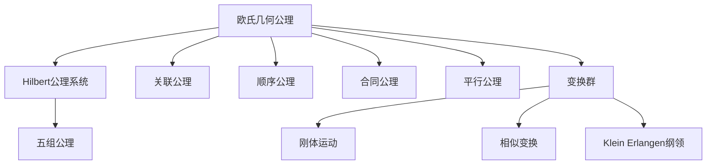

# 3.1 欧氏几何公理

> 形式化数学基础 | 几何学
>
> 交叉引用：[3.2 微分几何](./03.2_微分几何.md) | [3.3 代数拓扑](./03.3_代数拓扑.md)

## 3.1.1 引言

欧氏几何是几何学的基础。本章形式化介绍Hilbert公理系统和变换群观点。



## 3.1.2 Hilbert公理系统

### 3.1.2.1 基本对象与关系

**原始概念**：

- **点**：用 A, B, C, ... 表示
- **直线**：用 a, b, c, ... 表示
- **平面**：用 α, β, γ, ... 表示

**基本关系**：

- 点在直线上：A ∈ a
- 点在平面上：A ∈ α
- 点在两点之间：A _B_ C（介于关系）
- 线段合同：AB ≡ CD
- 角合同：∠ABC ≡ ∠DEF

### 3.1.2.2 关联公理

**公理 I.1**：对任意两点 A, B，存在直线 a 包含它们。

**公理 I.2**：对任意不同两点 A, B，至多存在一条直线包含它们。

**公理 I.3**：每条直线上至少有两点。至少存在三点不在同一直线上。

**公理 I.4**：对任意不共线三点 A, B, C，存在平面 α 包含它们。

**公理 I.5**：对任意不共线三点 A, B, C，至多存在一平面包含它们。

**公理 I.6**：若直线 a 的两点在平面 α 上，则 a 的所有点都在 α 上。

**公理 I.7**：若两平面有一公共点，则它们至少还有另一公共点。

**公理 I.8**：至少存在四点不在同一平面上。

### 3.1.2.3 顺序公理

**公理 II.1**：若 A _B_ C，则 A, B, C 是不同共线点，且 C _B_ A。

**公理 II.2**：对任意不同两点 A, C，存在点 B 使 A _B_ C。

**公理 II.3**：对任意共线三点，至多有一点在其他两点之间。

**公理 II.4**（Pasch公理）：设 A, B, C 不共线，直线 a 在平面上不包含 A, B, C 的任何一点。若 a 过 AB 的内点，则 a 过 AC 或 BC 的内点。

### 3.1.2.4 合同公理

**公理 III.1-III.6**：包括线段合同的传递性、可加性，角的合同，以及SAS合同判定。

### 3.1.2.5 平行公理

**公理 IV**（欧几里得平行公理）：设 a 是直线，A 是不在 a 上一点，则至多存在一条过 A 的直线与 a 不相交。

### 3.1.2.6 连续公理

**公理 V.1**（Archimedes公理）：线段的度量满足Archimedes性质。

**公理 V.2**（完备性公理）：几何元素的集合在保持所有公理的前提下不能再扩充。

## 3.1.3 变换群观点

### 3.1.3.1 Klein Erlangen纲领

**定义 3.1.1**（几何学）
给定集合 X 和变换群 G，几何学是研究在 G 作用下不变性质的学科。

### 3.1.3.2 刚体运动

**定义 3.1.2**（刚体运动）
平面刚体运动（等距变换）是保持距离的双射 f: R² → R²。

**定理 3.1.1**（刚体运动的分类）
平面刚体运动包括平移、旋转、反射、滑动反射。

### 3.1.3.3 相似变换

**定义 3.1.3**（相似变换）
相似变换是保持角度和比例的双射。

## 3.1.4 非欧几何简介

### 3.1.4.1 双曲几何

**公设**（双曲平行公理）：存在直线 a 和点 A 不在 a 上，使过 A 至少有两条直线与 a 不相交。

### 3.1.4.2 椭圆几何

**公设**（椭圆平行公理）：任意两条直线都相交。

## 3.1.5 Lean 4 形式化

```lean4
import Mathlib

-- 欧氏空间定义
#check EuclideanSpace ℝ (Fin n)

-- 等距变换群
#check Isometry (EuclideanSpace ℝ (Fin n)) (EuclideanSpace ℝ (Fin n))

-- 刚体运动（欧氏群）
#check EuclideanGroup n ℝ
```

## 3.1.6 参考文献

1. Hilbert, D. (1899). Grundlagen der Geometrie.
2. Hartshorne, R. (2000). Geometry: Euclid and Beyond. Springer.
3. Coxeter, H. S. M. (1969). Introduction to Geometry. Wiley.
