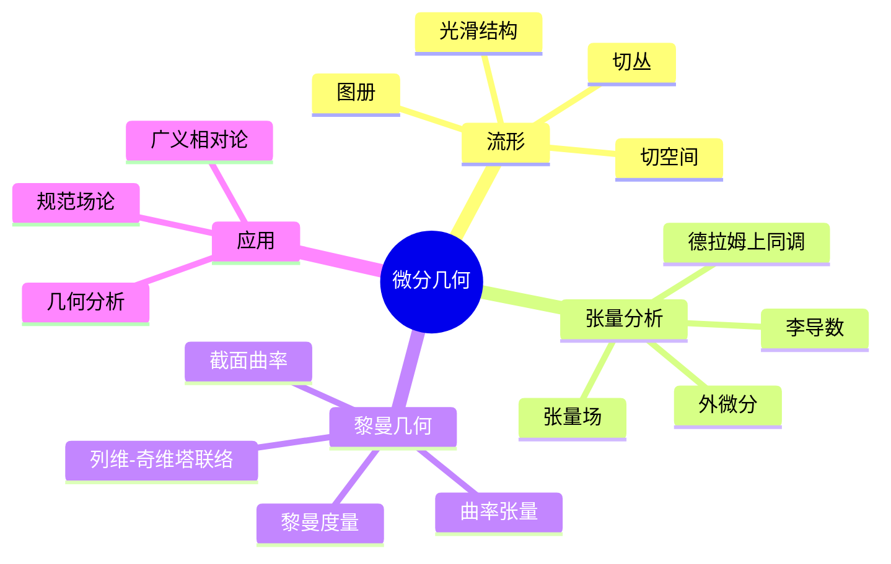
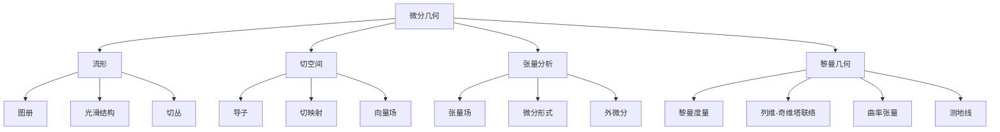

# 3.2 微分几何

---

📌 **内容摘要**

本文档深入探讨微分几何的核心原理和关键方法。内容涵盖几何学领域的主要知识点，包括微分几何, 流形, 黎曼度量等关键主题。适合初学者建立基础知识体系。

**关键词**: 微分几何, 流形, 几何学, 黎曼度量

📚 **学习目标**

- 理解微分几何的基本概念和核心原理
- 掌握相关术语和符号表示
- 建立该领域的系统性知识框架

🎯 **难度级别**: 初级

⏱️ **预计阅读时间**: 15分钟

**前置知识**: 基础数学知识

---


## 目录

- [3.2 微分几何](#32-微分几何)
  - [目录](#目录)
  - [3.2.1 引言](#321-引言)
  - [3.2.2 光滑流形](#322-光滑流形)
    - [3.2.2.1 拓扑流形](#3221-拓扑流形)
    - [3.2.2.2 光滑结构](#3222-光滑结构)
  - [3.2.3 切空间](#323-切空间)
    - [3.2.3.1 切向量的定义](#3231-切向量的定义)
    - [3.2.3.2 切映射](#3232-切映射)
  - [3.2.4 张量场](#324-张量场)
    - [3.2.4.1 张量丛](#3241-张量丛)
    - [3.2.4.2 微分形式](#3242-微分形式)
  - [3.2.5 黎曼几何](#325-黎曼几何)
    - [3.2.5.1 黎曼度量](#3251-黎曼度量)
    - [3.2.5.2 列维-奇维塔联络](#3252-列维-奇维塔联络)
  - [3.2.6 曲率](#326-曲率)
    - [3.2.6.1 黎曼曲率张量](#3261-黎曼曲率张量)
    - [3.2.6.2 曲率不变量](#3262-曲率不变量)
  - [3.2.7 多表征视角](#327-多表征视角)
    - [概念图谱](#概念图谱)
    - [几何结构层次](#几何结构层次)
  - [参见](#参见)
  - [📋 前置知识](#-前置知识)
  - [📚 延伸阅读](#-延伸阅读)

---

## 3.2.1 引言

微分几何(Differential Geometry)运用微积分和线性代数研究光滑曲线、曲面和更高维流形的几何性质。
它将分析工具与几何直觉相结合，是现代数学物理（尤其是广义相对论）的基础。

历史发展：

- 高斯：曲面内蕴几何
- 黎曼：黎曼几何的奠基
- 嘉当：活动标架法、外微分
- 陈省身：示性类理论



---

## 3.2.2 光滑流形

### 3.2.2.1 拓扑流形

**n维拓扑流形**：Hausdorff空间$M$，每点有开邻域同胚于$\mathbb{R}^n$的开集。

**图册(Atlas)**：坐标卡$(U_\alpha, \varphi_\alpha)$的集合，其中$\varphi_\alpha: U_\alpha \to \mathbb{R}^n$是同胚，且$\bigcup U_\alpha = M$。

### 3.2.2.2 光滑结构

**光滑相容**：两坐标卡$(U, \varphi)$和$(V, \psi)$光滑相容如果转移映射

$$\psi \circ \varphi^{-1}: \varphi(U \cap V) \to \psi(U \cap V)$$

是光滑的（$C^\infty$）。

**光滑流形(Smooth Manifold)**：极大光滑图册定义的流形。

```lean
structure SmoothManifold (n : ℕ) where
  carrier : Type*
  topo : TopologicalSpace carrier
  chartedSpace : ChartedSpace (EuclideanSpace ℝ (Fin n)) carrier
  smoothAtlas : ∀ (e e' : PartialHomeomorph carrier (EuclideanSpace ℝ (Fin n))),
    e ∈ atlas → e' ∈ atlas → SmoothOn' ⊤ (e.symm.trans e') (e.symm ≫ e' : carrier → EuclideanSpace ℝ (Fin n))
```

---

## 3.2.3 切空间

### 3.2.3.1 切向量的定义

**几何定义**：切向量是过点$p$的曲线的等价类，曲线$\gamma_1 \sim \gamma_2$如果它们在局部坐标下有相同导数。

**代数定义（导子）**：切向量是线性映射$X: C^\infty(M) \to \mathbb{R}$满足莱布尼茨法则：

$$X(fg) = f(p)X(g) + g(p)X(f)$$

**切空间** $T_pM$：点$p$处所有切向量的向量空间。

```lean
-- 切空间作为导子空间
structure Derivation (p : M) where
  toFun : C^∞(M, ℝ) → ℝ
  linear : IsLinearMap ℝ toFun
  leibniz : ∀ f g : C^∞(M, ℝ),
    toFun (f * g) = f p * toFun g + g p * toFun f

def TangentSpace (p : M) : Type* := Derivation p
```

### 3.2.3.2 切映射

**切映射(Pushforward)**：光滑映射$f: M \to N$诱导线性映射$f_{*p}: T_pM \to T_{f(p)}N$：

$$(f_{*p}X)(g) = X(g \circ f)$$

---

## 3.2.4 张量场

### 3.2.4.1 张量丛

**(r,s)-型张量空间**：

$$T^r_s(T_pM) = \underbrace{T_pM \otimes \cdots \otimes T_pM}_{r} \otimes \underbrace{T_p^*M \otimes \cdots \otimes T_p^*M}_{s}$$

**张量场**：光滑截面$T \in \Gamma(T^r_sM)$

### 3.2.4.2 微分形式

**外形式(Exterior Form)**：反对称的(0,s)-张量。

**外微分(Exterior Derivative)**：$d: \Omega^k(M) \to \Omega^{k+1}(M)$满足：

- $d^2 = 0$
- $d(\alpha \wedge \beta) = d\alpha \wedge \beta + (-1)^k \alpha \wedge d\beta$（$\alpha$是$k$-形式）

**德拉姆上同调(DR Cohomology)**：$H^k_{dR}(M) = \ker(d_k) / \text{im}(d_{k-1})$

```lean
def exteriorDerivative {k : ℕ} : Ω^k M → Ω^(k+1) M := by
  sorry

theorem d_squared_zero {k : ℕ} (ω : Ω^k M) : exteriorDerivative (exteriorDerivative ω) = 0 := by
  sorry
```

---

## 3.2.5 黎曼几何

### 3.2.5.1 黎曼度量

**黎曼度量(Riemannian Metric)**：光滑指派$g_p: T_pM \times T_pM \to \mathbb{R}$，满足：

- 对称：$g(X, Y) = g(Y, X)$
- 双线性
- 正定性：$g(X, X) \geq 0$，等号当且仅当$X = 0$

**黎曼流形**：配备黎曼度量的光滑流形$(M, g)$。

```lean
class RiemannianMetric (M : Type*) [SmoothManifold n M] where
  innerProduct : ∀ p : M, InnerProductSpace ℝ (TangentSpace p)
  smooth : ∀ X Y : VectorField M,
    Smooth' ⊤ (fun p => innerProduct p (X p) (Y p))
```

### 3.2.5.2 列维-奇维塔联络

**定理 3.2.5.1 (Fundamental Theorem of Riemannian Geometry)**：每个黎曼流形上存在唯一的无挠相容联络（列维-奇维塔联络）。

**无挠**：$\nabla_X Y - \nabla_Y X = [X, Y]$

**相容**：$X(g(Y, Z)) = g(\nabla_X Y, Z) + g(Y, \nabla_X Z)$

**克氏符号**（局部坐标）：
$$\Gamma^k_{ij} = \frac{1}{2}g^{kl}(\partial_i g_{jl} + \partial_j g_{il} - \partial_l g_{ij})$$

---

## 3.2.6 曲率

### 3.2.6.1 黎曼曲率张量

**黎曼曲率张量**：$R(X, Y)Z = \nabla_X \nabla_Y Z - \nabla_Y \nabla_X Z - \nabla_{[X,Y]} Z$

**分量形式**：$R^l_{ijk} = \partial_j \Gamma^l_{ik} - \partial_k \Gamma^l_{ij} + \Gamma^m_{ik}\Gamma^l_{mj} - \Gamma^m_{ij}\Gamma^l_{mk}$

### 3.2.6.2 曲率不变量

| 曲率 | 定义 | 几何意义 |
|------|------|---------|
| **截面曲率** | $K(\sigma) = \frac{g(R(X,Y)Y, X)}{|X|^2|Y|^2 - g(X,Y)^2}$ | 2维子空间的高斯曲率 |
| **里奇曲率** | $\text{Ric}(X, Y) = \text{tr}(Z \mapsto R(Z, X)Y)$ | 平均曲率 |
| **标量曲率** | $S = g^{ij}\text{Ric}_{ij}$ | 总曲率度量 |

**高斯-博内定理**：紧致定向二维黎曼流形上，
$$\int_M K \, dA = 2\pi \chi(M)$$

其中$\chi(M)$是欧拉示性数。

---

## 3.2.7 多表征视角

### 概念图谱



### 几何结构层次

| 结构 | 数据 | 几何内容 |
|------|------|---------|
| 拓扑流形 | 图册 | 连续性、紧性 |
| 光滑流形 | 光滑图册 | 微分、光滑函数 |
| 黎曼流形 | 度量张量$g$ | 长度、角度、体积 |
| 定向流形 | 定向图册 | 方向、体积形式 |
| 复流形 | 全纯图册 | 复结构、全纯函数 |
| 辛流形 | 闭非退化2-形式$\omega$ | 哈密顿力学 |

---

## 参见

- [欧几里得几何](./03.1_欧几里得几何.md) — 平坦空间的几何
- [微分拓扑](./03.4_微分拓扑.md) — 光滑映射的拓扑性质
- [代数拓扑](./03.3_代数拓扑.md) — 德拉姆上同调
- [张量代数](../02_代数学/02.2_线性代数.md) — 张量的代数结构
- [实分析](../04_分析学/04.1_实分析.md) — 光滑函数的微积分

---

## 📋 前置知识

- [3.1 欧几里得几何](../03_几何学/03.1_欧几里得几何.md)
- [4.1 实分析](../04_分析学/04.1_实分析.md)

---

## 📚 延伸阅读

- [3.1 欧几里得几何](../03_几何学/03.1_欧几里得几何.md)
- [3.1 欧氏几何公理](../03_几何学/03.1_欧氏几何公理.md)
- [4.1 实分析](../04_分析学/04.1_实分析.md)
- [11.11 分形与幂律](../../11_系统科学/03_复杂系统/03.3_分形与幂律.md)
- [2.2 线性代数](../02_代数学/02.2_线性代数.md)
