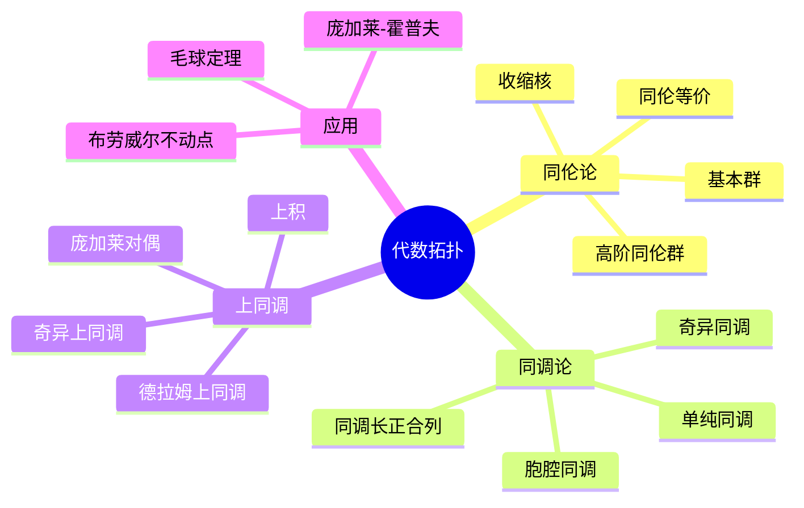
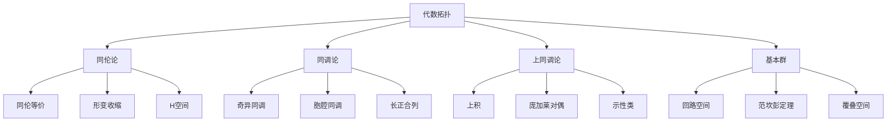

# 3.3 代数拓扑

---

📌 **内容摘要**

本文档深入探讨代数拓扑的核心原理和关键方法。内容涵盖几何学领域的主要知识点，包括上同调, 代数拓扑, 同调群等关键主题。适合初学者建立基础知识体系。

**关键词**: 上同调, 几何学, 代数拓扑, 同调群

📚 **学习目标**
- 理解代数拓扑的基本概念和核心原理
- 掌握相关术语和符号表示
- 建立该领域的系统性知识框架

🎯 **难度级别**: 初级

⏱️ **预计阅读时间**: 15分钟

**前置知识**: 基础数学知识

---


## 目录

- [3.3 代数拓扑](#33-代数拓扑)
  - [目录](#目录)
  - [3.3.1 引言](#331-引言)
  - [3.3.2 同伦论](#332-同伦论)
    - [3.3.2.1 同伦关系](#3321-同伦关系)
    - [3.3.2.2 收缩核](#3322-收缩核)
  - [3.3.3 同调论](#333-同调论)
    - [3.3.3.1 奇异同调](#3331-奇异同调)
    - [3.3.3.2 同调群的性质](#3332-同调群的性质)
    - [3.3.3.3 典型计算](#3333-典型计算)
  - [3.3.4 上同调论](#334-上同调论)
    - [3.3.4.1 奇异上同调](#3341-奇异上同调)
    - [3.3.4.2 上积与环结构](#3342-上积与环结构)
  - [3.3.5 基本群](#335-基本群)
    - [3.3.5.1 定义](#3351-定义)
    - [3.3.5.2 计算方法](#3352-计算方法)
  - [3.3.6 多表征视角](#336-多表征视角)
    - [概念图谱](#概念图谱)
    - [不变量比较](#不变量比较)
  - [参见](#参见)

---

## 3.3.1 引言

代数拓扑(Algebraic Topology)使用代数工具（群、环、模）研究拓扑空间的性质。
其核心思想是将拓扑问题转化为代数问题，利用代数不变量区分拓扑空间。

主要不变量：

- **同伦群**：$\pi_n(X)$，高维洞的计数
- **同调群**：$H_n(X)$，组合洞的代数计数
- **上同调环**：$H^*(X)$，带有乘积结构



---

## 3.3.2 同伦论

### 3.3.2.1 同伦关系

**同伦(Homotopy)**：连续映射$f, g: X \to Y$之间的同伦是连续映射$H: X \times [0,1] \to Y$，满足：

- $H(x, 0) = f(x)$
- $H(x, 1) = g(x)$

记作$f \simeq g$。

**同伦等价**：$X \simeq Y$如果存在$f: X \to Y$和$g: Y \to X$使得$g \circ f \simeq id_X$，$f \circ g \simeq id_Y$。

```lean
def Homotopic {X Y : Type*} [TopologicalSpace X] [TopologicalSpace Y]
  (f g : C(X, Y)) : Prop :=
  ∃ H : C(X × I, Y), ∀ x, H (x, 0) = f x ∧ H (x, 1) = g x

infix:50 " ≃ₕ " => Homotopic

def HomotopyEquiv (X Y : Type*) [TopologicalSpace X] [TopologicalSpace Y] : Prop :=
  ∃ (f : C(X, Y)) (g : C(Y, X)),
    (g.comp f) ≃ₕ ContinuousMap.id X ∧ (f.comp g) ≃ₕ ContinuousMap.id Y
```

### 3.3.2.2 收缩核

**形变收缩核(Deformation Retract)**：$A \subseteq X$是形变收缩核，如果存在收缩$r: X \to A$使得$i \circ r \simeq id_X$（rel $A$）。

例子：

- $\mathbb{R}^n$形变收缩到点
- 莫比乌斯带形变收缩到$S^1$
- 穿孔平面$\mathbb{R}^2 \setminus \{0\}$形变收缩到$S^1$

---

## 3.3.3 同调论

### 3.3.3.1 奇异同调

**奇异单形**：连续映射$\sigma: \Delta^n \to X$，其中$\Delta^n$是标准$n$-单形。

**链复形**：
$$\cdots \xrightarrow{\partial_{n+1}} C_n(X) \xrightarrow{\partial_n} C_{n-1}(X) \xrightarrow{\partial_{n-1}} \cdots$$

其中$C_n(X)$是奇异$n$-链的自由阿贝尔群，$\partial_n$是边缘算子。

**同调群**：$H_n(X) = \ker(\partial_n) / \text{im}(\partial_{n+1})$

```lean
def singularChain (X : Type*) [TopologicalSpace X] (n : ℕ) : Type _ :=
  FreeAbelianGroup (C(Top.of (Simplex n), X))

def boundary {X : Type*} [TopologicalSpace X] {n : ℕ} :
  singularChain X (n + 1) → singularChain X n :=
  FreeAbelianGroup.lift fun σ =>
    ∑ i : Fin (n + 2), (-1 : ℤ)^i.val • FreeAbelianGroup.of (face i σ)

def singularHomology (X : Type*) [TopologicalSpace X] (n : ℕ) : Type _ :=
  ker (boundary (n := n)) ⧸ im (boundary (n := n + 1))
```

### 3.3.3.2 同调群的性质

**定理 3.3.3.1 (同伦不变性)**：若$X \simeq Y$，则$H_n(X) \cong H_n(Y)$对所有$n$成立。

**定理 3.3.3.2 (长正合列)**：对空间对$(X, A)$，存在长正合列：
$$\cdots \to H_n(A) \to H_n(X) \to H_n(X, A) \to H_{n-1}(A) \to \cdots$$

### 3.3.3.3 典型计算

| 空间 | $H_0$ | $H_1$ | $H_2$ | $H_n$ (n>0) |
|------|-------|-------|-------|-------------|
| 点 | $\mathbb{Z}$ | 0 | 0 | 0 |
| $S^1$ | $\mathbb{Z}$ | $\mathbb{Z}$ | 0 | 0 |
| $S^n$ | $\mathbb{Z}$ | 0 | ... | $\mathbb{Z}$ (n) |
| $T^2$ | $\mathbb{Z}$ | $\mathbb{Z}^2$ | $\mathbb{Z}$ | 0 |
| $\mathbb{R}P^n$ | $\mathbb{Z}$ | $\mathbb{Z}/2$ | ... | 0或$\mathbb{Z}$ |

---

## 3.3.4 上同调论

### 3.3.4.1 奇异上同调

**上链复形**：$C^n(X; G) = \text{Hom}(C_n(X), G)$

**上边缘算子**：$\delta^n: C^n \to C^{n+1}$，$\delta^n(\varphi) = \varphi \circ \partial_{n+1}$

**上同调群**：$H^n(X; G) = \ker(\delta^n) / \text{im}(\delta^{n-1})$

### 3.3.4.2 上积与环结构

**上积(Cup Product)**：$\smile: H^p(X) \times H^q(X) \to H^{p+q}(X)$

定义：$(\alpha \smile \beta)(\sigma) = \alpha(\sigma|_{[0,\ldots,p]}) \cdot \beta(\sigma|_{[p,\ldots,p+q]})$

**上同调环**：$H^*(X) = \bigoplus_n H^n(X)$是分次环。

---

## 3.3.5 基本群

### 3.3.5.1 定义

**回路(Loop)**：连续映射$\gamma: [0,1] \to X$，满足$\gamma(0) = \gamma(1) = x_0$。

**回路同伦**：保持端点的同伦。

**基本群(Fundamental Group)**：
$$\pi_1(X, x_0) = \{\text{基于}x_0\text{的回路}\}/\text{同伦}$$

群运算：路径连接。

```lean
def Loop (X : Type*) [TopologicalSpace X] (x₀ : X) : Type _ :=
  {γ : C(I, X) // γ 0 = x₀ ∧ γ 1 = x₀}

def LoopHomotopic {X : Type*} [TopologicalSpace X] {x₀ : X}
  (γ₁ γ₂ : Loop X x₀) : Prop :=
  ∃ H : C(I × I, X),
    (∀ t, H (t, 0) = γ₁ t) ∧
    (∀ t, H (t, 1) = γ₂ t) ∧
    (∀ s, H (0, s) = x₀ ∧ H (1, s) = x₀)

def FundamentalGroup (X : Type*) [TopologicalSpace X] (x₀ : X) : Type _ :=
  Quotient (Setoid.mk LoopHomotopic (by sorry))
```

### 3.3.5.2 计算方法

| 空间 | 基本群 |
|------|--------|
| $\mathbb{R}^n$ | 平凡群（可缩） |
| $S^1$ | $\mathbb{Z}$ |
| $S^n$ ($n \geq 2$) | 平凡群 |
| $T^n$ | $\mathbb{Z}^n$ |
| $\mathbb{R}P^n$ ($n \geq 2$) | $\mathbb{Z}/2$ |
| 8字形 | 自由群$F_2$ |

**定理 3.3.5.1 (范坎彭定理)**：$X = U \cup V$，$U, V$道路连通开集，则：
$$\pi_1(X) = \pi_1(U) *_{\pi_1(U \cap V)} \pi_1(V)$$

---

## 3.3.6 多表征视角

### 概念图谱



### 不变量比较

| 不变量 | 结构 | 可计算性 | 几何信息 |
|--------|------|---------|---------|
| $\pi_1$ | 群 | 中等 | 1维洞 |
| $\pi_n$ ($n \geq 2$) | 阿贝尔群 | 难 | n维洞 |
| $H_n$ | 阿贝尔群 | 易 | n维洞（计数） |
| $H^n$ | 环 | 易 | 带乘法结构 |
| $\chi$ | 整数 | 易 | 欧拉示性数 |

---

## 参见

- [微分几何](./03.2_微分几何.md) — 德拉姆上同调
- [微分拓扑](./03.4_微分拓扑.md) — 横截性、莫尔斯理论
- [范畴论代数](../02_代数学/02.3_范畴论代数.md) — 同调代数
- [抽象代数](../02_代数学/02.1_抽象代数.md) — 群的同调
---

## 📋 前置知识

- [3.2 微分几何](../03_几何学/03.2_微分几何.md)

---

## 📚 延伸阅读

- [04.1 范畴基本概念](./02_形式语言/04_范畴论/04.1_范畴基本概念.md)
- [4.1 范畴基础 (Category Theory Foundations)](./02_形式语言/04_范畴论/04.1_范畴基础.md)
- [2.1 抽象代数](../02_代数学/02.1_抽象代数.md)
- [3.2 微分几何](../03_几何学/03.2_微分几何.md)
- [2.3 范畴论代数](../02_代数学/02.3_范畴论代数.md)
