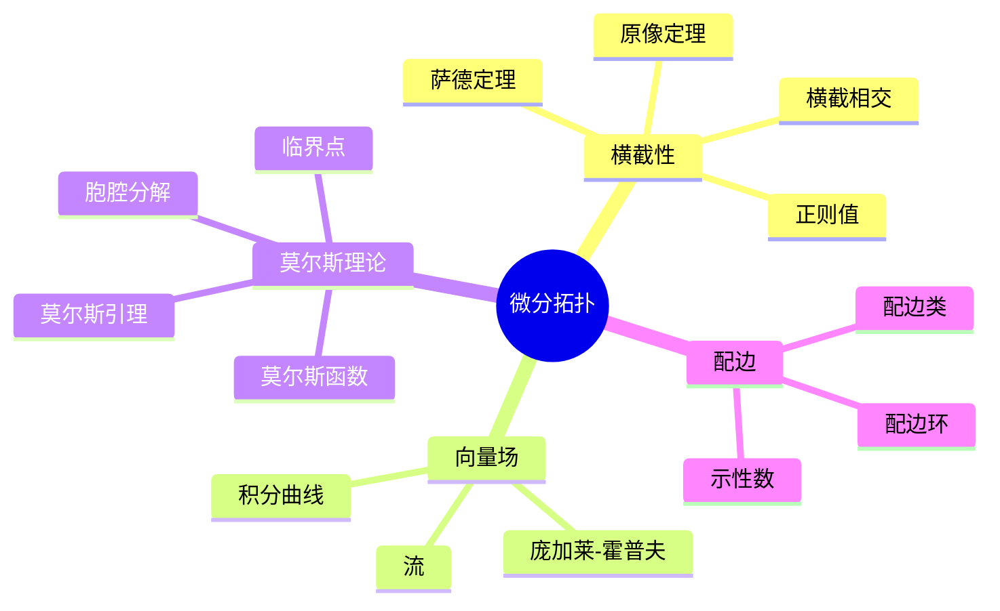
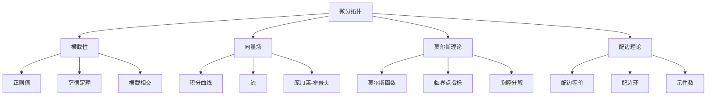

# 3.4 微分拓扑

## 目录

- [3.4 微分拓扑](#34-微分拓扑)
  - [目录](#目录)
  - [3.4.1 引言](#341-引言)
  - [3.4.2 横截性](#342-横截性)
    - [3.4.2.1 正则值与萨德定理](#3421-正则值与萨德定理)
    - [3.4.2.2 横截相交](#3422-横截相交)
  - [3.4.3 向量场与流](#343-向量场与流)
    - [3.4.3.1 积分曲线与流](#3431-积分曲线与流)
    - [3.4.3.2 庞加莱-霍普夫定理](#3432-庞加莱-霍普夫定理)
  - [3.4.4 莫尔斯理论](#344-莫尔斯理论)
    - [3.4.4.1 莫尔斯函数](#3441-莫尔斯函数)
    - [3.4.4.2 胞腔分解](#3442-胞腔分解)
  - [3.4.5 配边理论](#345-配边理论)
    - [3.4.5.1 配边的定义](#3451-配边的定义)
    - [3.4.5.2 托姆配边理论](#3452-托姆配边理论)
  - [3.4.6 多表征视角](#346-多表征视角)
    - [概念图谱](#概念图谱)
    - [维度关系](#维度关系)
  - [参见](#参见)

---

## 3.4.1 引言

微分拓扑(Differential Topology)研究光滑流形的光滑映射的性质，关注那些在微分同胚下不变的性质。
与微分几何不同，微分拓扑不依赖于度量结构，而是关注流形的整体拓扑结构。

核心主题：

- 横截性(Transversality)
- 莫尔斯理论(Morse Theory)
- 配边理论(Cobordism Theory)
- 相交理论(Intersection Theory)



---

## 3.4.2 横截性

### 3.4.2.1 正则值与萨德定理

**正则值(Regular Value)**：$y \in N$是$f: M \to N$的正则值，如果对每个$x \in f^{-1}(y)$，$f_{*x}: T_xM \to T_yN$是满射。

**临界点**：$x \in M$是临界点如果$f_{*x}$不是满射。

**定理 3.4.2.1 (原像定理)**：若$y$是正则值，则$f^{-1}(y)$是$M$的嵌入子流形，维数为$\dim(M) - \dim(N)$。

**定理 3.4.2.2 (萨德定理, Sard's Theorem)**：光滑映射的临界值集在$N$中测度为零。

```lean
def IsRegularValue {M N : Type*} [SmoothManifold m M] [SmoothManifold n N]
  (f : C^∞(M, N)) (y : N) : Prop :=
  ∀ x ∈ f ⁻¹' {y}, Surjective (mfderiv f x)

theorem preimage_submanifold {M N : Type*} [SmoothManifold m M] [SmoothManifold n N]
  (f : C^∞(M, N)) (y : N) (h : IsRegularValue f y) :
  IsEmbeddedSubmanifold (f ⁻¹' {y}) (m - n) := by
  sorry

theorem sard_theorem {M N : Type*} [SmoothManifold m M] [SmoothManifold n N]
  (f : C^∞(M, N)) :
  MeasureZero (criticalValues f) := by
  sorry
```

### 3.4.2.2 横截相交

**横截性(Transversality)**：子流形$X, Y \subseteq M$横截相交（记作$X \pitchfork Y$），如果对所有$p \in X \cap Y$：

$$T_pX + T_pY = T_pM$$

**定理 3.4.2.3**：若$X \pitchfork Y$，则$X \cap Y$是子流形，维数为$\dim(X) + \dim(Y) - \dim(M)$。

---

## 3.4.3 向量场与流

### 3.4.3.1 积分曲线与流

**积分曲线**：曲线$\gamma: I \to M$满足$\gamma'(t) = X_{\gamma(t)}$。

**流(Flow)**：光滑映射$\Phi: M \times \mathbb{R} \to M$满足：

- $\Phi(p, 0) = p$
- $\Phi(\Phi(p, t), s) = \Phi(p, t + s)$

**定理 3.4.3.1**：紧致流形上的光滑向量场生成全局流。

### 3.4.3.2 庞加莱-霍普夫定理

**指标(Index)**：孤立零点$p$的指标是向量场在$p$附近绕$\partial B_\epsilon(p)$的环绕数。

**定理 3.4.3.2 (庞加莱-霍普夫定理)**：紧致定向流形$M$上，

$$\sum_{p \in \text{Zero}(X)} \text{Ind}_p(X) = \chi(M)$$

其中$\chi(M)$是欧拉示性数。

---

## 3.4.4 莫尔斯理论

### 3.4.4.1 莫尔斯函数

**莫尔斯函数(Morse Function)**：$f: M \to \mathbb{R}$的所有临界点都是非退化的（Hessian非奇异）。

**莫尔斯指数(Morse Index)**：临界点$p$的指数是Hessian的负特征值个数。

**定理 3.4.4.1 (莫尔斯引理)**：在莫尔斯函数的非退化临界点$p$附近，存在坐标使得：

$$f(x) = f(p) - x_1^2 - \cdots - x_\lambda^2 + x_{\lambda+1}^2 + \cdots + x_n^2$$

其中$\lambda$是$p$的指数。

```lean
def IsMorseFunction {M : Type*} [SmoothManifold n M] (f : C^∞(M, ℝ)) : Prop :=
  ∀ p : M, (mfderiv f p = 0) → Nondegenerate (mfderiv₂ f p)

def MorseIndex {M : Type*} [SmoothManifold n M] {f : C^∞(M, ℝ)}
  {p : M} (hcrit : mfderiv f p = 0) (hnondeg : Nondegenerate (mfderiv₂ f p)) : ℕ :=
  (mfderiv₂ f p).negEigencount

theorem morse_lemma {M : Type*} [SmoothManifold n M] {f : C^∞(M, ℝ)}
  {p : M} (hmorse : IsMorseFunction f) (hcrit : mfderiv f p = 0) :
  ∃ (chart : ChartAt p), let λ := MorseIndex hcrit (hmorse p hcrit).negEigencount in
    ∀ x, f (chart x) = f p - ∑ i : Fin λ, x i ^ 2 + ∑ i : Fin (n - λ), x (λ + i) ^ 2 := by
  sorry
```

### 3.4.4.2 胞腔分解

**定理 3.4.4.2 (莫尔斯理论基本定理)**：设$M^a = f^{-1}((-\infty, a])$，若$c$是$f$的唯一临界值在$(a, b)$中，对应指数为$\lambda$的临界点，则$M^b$同伦等价于$M^a$粘贴一个$\lambda$-胞腔。

**推论**：紧致流形同伦等价于CW复形，$k$-胞腔数等于指数为$k$的临界点数。

---

## 3.4.5 配边理论

### 3.4.5.1 配边的定义

**配边(Cobordism)**：$(n+1)$-维带边流形$W$称为流形$M$和$N$之间的配边，如果$\partial W = M \sqcup N$。

**配边等价**：$M \sim N$如果存在$M$到$N$的配边。

### 3.4.5.2 托姆配边理论

**定理 3.4.5.1 (托姆)**：n维配边类构成群$\Omega_n$，配边环$\Omega_* = \bigoplus_n \Omega_n$是同调理论。

**示性数**：庞特里亚金数、斯蒂菲尔-惠特尼数决定配边类。

---

## 3.4.6 多表征视角

### 概念图谱



### 维度关系

| 操作 | 输入维数 | 输出维数 | 例子 |
|------|---------|---------|------|
| 正则原像 | m, n | m-n | $f^{-1}(y)$ |
| 横截相交 | m, k, l | k+l-m | $X \cap Y$ |
| 配边 | n | n+1 | W: M ~ N |
| 胞腔粘贴 | n | n | $M^a \cup e^k$ |

---

## 参见

- [微分几何](./03.2_微分几何.md) — 流形的局部性质
- [代数拓扑](./03.3_代数拓扑.md) — 同调与上同调
- [实分析](../04_分析学/04.1_实分析.md) — 光滑函数的分析
