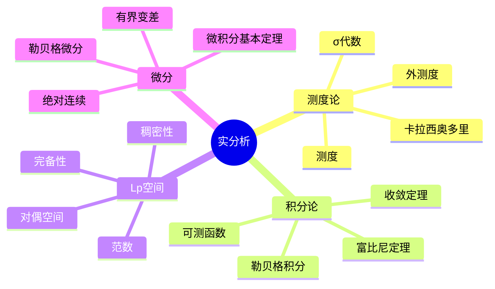
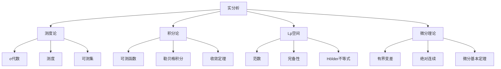

# 4.1 实分析

## 目录

- [4.1 实分析](#41-实分析)
  - [目录](#目录)
  - [4.1.1 引言](#411-引言)
  - [4.1.2 测度论基础](#412-测度论基础)
    - [4.1.2.1 σ-代数](#4121-σ-代数)
    - [4.1.2.2 测度](#4122-测度)
    - [4.1.2.3 外测度与可测集](#4123-外测度与可测集)
  - [4.1.3 勒贝格积分](#413-勒贝格积分)
    - [4.1.3.1 可测函数](#4131-可测函数)
    - [4.1.3.2 勒贝格积分的定义](#4132-勒贝格积分的定义)
  - [4.1.4 L^p空间](#414-lp空间)
    - [4.1.4.1 定义](#4141-定义)
    - [4.1.4.2 范数与完备性](#4142-范数与完备性)
  - [4.1.5 收敛定理](#415-收敛定理)
    - [4.1.5.1 三大收敛定理](#4151-三大收敛定理)
  - [4.1.6 微分与不定积分](#416-微分与不定积分)
    - [4.1.6.1 有界变差函数](#4161-有界变差函数)
    - [4.1.6.2 绝对连续函数](#4162-绝对连续函数)
  - [4.1.7 多表征视角](#417-多表征视角)
    - [概念图谱](#概念图谱)
    - [积分理论比较](#积分理论比较)
  - [参见](#参见)

---

## 4.1.1 引言

实分析(Real Analysis)是研究实值函数和实数集的严格理论。
它通过测度论和勒贝格积分，克服了黎曼积分的局限性，为现代分析学、概率论和泛函分析奠定了坚实基础。

核心主题：

- 测度空间与外测度
- 可测函数与勒贝格积分
- 函数空间的完备性
- 极限过程的交换性



---

## 4.1.2 测度论基础

### 4.1.2.1 σ-代数

**σ-代数(Sigma-Algebra)**：集合$X$的子集族$\mathcal{A}$满足：

1. $X \in \mathcal{A}$
2. $A \in \mathcal{A} \implies A^c \in \mathcal{A}$
3. $A_1, A_2, \ldots \in \mathcal{A} \implies \bigcup_{n=1}^\infty A_n \in \mathcal{A}$

**Borel σ-代数**：由开集生成的最小σ-代数$\mathcal{B}(\mathbb{R}^n)$。

```lean
structure SigmaAlgebra (X : Type*) where
  sets : Set (Set X)
  empty_mem : ∅ ∈ sets
  compl_mem : ∀ s ∈ sets, sᶜ ∈ sets
  iUnion_mem : ∀ (f : ℕ → Set X), (∀ n, f n ∈ sets) → (⋃ n, f n) ∈ sets

def borelSigmaAlgebra (X : Type*) [TopologicalSpace X] : SigmaAlgebra X :=
  { sets := ⋂ (s : SigmaAlgebra X), {t | IsOpen t} ⊆ s.sets }
  sorry
```

### 4.1.2.2 测度

**测度(Measure)**：函数$\mu: \mathcal{A} \to [0, \infty]$满足：

1. $\mu(\emptyset) = 0$
2. 可数可加性：对不相交集合列$\{A_n\}$，$\mu(\bigcup A_n) = \sum \mu(A_n)$

**勒贝格测度**：$\mathbb{R}^n$上平移不变的完备测度，区间体积为边长乘积。

```lean
structure Measure (X : Type*) [SigmaAlgebra X] where
  measure : Set X → ℝ≥0∞
  empty : measure ∅ = 0
  m_iUnion : ∀ (A : ℕ → Set X),
    (∀ i j, i ≠ j → Disjoint (A i) (A j)) →
    measure (⋃ n, A n) = ∑' n, measure (A n)
```

### 4.1.2.3 外测度与可测集

**外测度(Outer Measure)**：$\mu^*: \mathcal{P}(X) \to [0, \infty]$满足：

1. $\mu^*(\emptyset) = 0$
2. 单调性：$A \subseteq B \implies \mu^*(A) \leq \mu^*(B)$
3. 次可数可加性：$\mu^*(\bigcup A_n) \leq \sum \mu^*(A_n)$

**卡拉西奥多里条件**：$E$是$\mu^*$-可测的如果对所有$A \subseteq X$：
$$\mu^*(A) = \mu^*(A \cap E) + \mu^*(A \cap E^c)$$

**定理**：卡拉西奥多里可测集构成σ-代数，且$\mu^*$在其上是完备测度。

---

## 4.1.3 勒贝格积分

### 4.1.3.1 可测函数

**可测函数(Measurable Function)**：$f: X \to \mathbb{R}$可测如果对每个Borel集$B$，$f^{-1}(B) \in \mathcal{A}$。

等价：对所有$a \in \mathbb{R}$，$\{x: f(x) > a\} \in \mathcal{A}$。

**简单函数**：$s(x) = \sum_{i=1}^n a_i \chi_{E_i}(x)$，其中$E_i$可测。

### 4.1.3.2 勒贝格积分的定义

**非负简单函数的积分**：
$$\int s \, d\mu = \sum_{i=1}^n a_i \mu(E_i)$$

**非负可测函数的积分**：
$$\int f \, d\mu = \sup\left\{\int s \, d\mu : 0 \leq s \leq f, s \text{简单}\right\}$$

**一般可测函数**：$f = f^+ - f^-$，若$\int f^+ < \infty$或$\int f^- < \infty$，则：
$$\int f \, d\mu = \int f^+ \, d\mu - \int f^- \, d\mu$$

```lean
def lintegral {X : Type*} [SigmaAlgebra X] (μ : Measure X)
  (f : X → ℝ≥0∞) : ℝ≥0∞ :=
  ⨆ (s : SimpleFunc X ℝ≥0∞) (hs : ∀ x, s x ≤ f x),
    s.lintegral μ

def integral {X : Type*} [SigmaAlgebra X] (μ : Measure X)
  (f : X → ℝ) : ℝ :=
  let f⁺ : X → ℝ≥0∞ := fun x => max (f x) 0
  let f⁻ : X → ℝ≥0∞ := fun x => max (-f x) 0
  (lintegral μ f⁺).toReal - (lintegral μ f⁻).toReal
```

---

## 4.1.4 L^p空间

### 4.1.4.1 定义

**L^p空间**（$1 \leq p < \infty$）：
$$L^p(X, \mu) = \left\{f: \int_X |f|^p \, d\mu < \infty\right\} / \sim$$

其中$f \sim g$如果$f = g$几乎处处。

**L^∞空间**：
$$L^\infty(X, \mu) = \{f: \text{ess sup}|f| < \infty\}$$

### 4.1.4.2 范数与完备性

| 空间 | 范数 |
|------|------|
| $L^p$ ($1 \leq p < \infty$) | $\|f\|_p = \left(\int |f|^p\right)^{1/p}$ |
| $L^\infty$ | $\|f\|_\infty = \text{ess sup}|f|$ |

**定理 4.1.4.1 (Riesz-Fischer)**：$L^p$空间是Banach空间（完备的赋范空间）。

**Hilbert空间**：$L^2$是Hilbert空间，内积为$\langle f, g \rangle = \int f\bar{g}$。

---

## 4.1.5 收敛定理

### 4.1.5.1 三大收敛定理

**定理 4.1.5.1 (单调收敛定理)**：若$0 \leq f_1 \leq f_2 \leq \cdots$且$f_n \to f$点态收敛，则：
$$\lim_{n \to \infty} \int f_n = \int \lim_{n \to \infty} f_n = \int f$$

**定理 4.1.5.2 (法图引理)**：若$f_n \geq 0$，则：
$$\int \liminf_{n \to \infty} f_n \leq \liminf_{n \to \infty} \int f_n$$

**定理 4.1.5.3 (控制收敛定理)**：若$f_n \to f$几乎处处，且存在可积函数$g$使得$|f_n| \leq g$几乎处处，则：
$$\lim_{n \to \infty} \int f_n = \int f$$

```lean
theorem monotone_convergence {X : Type*} [SigmaAlgebra X] {μ : Measure X}
  {f : ℕ → X → ℝ≥0∞} (hmono : ∀ n x, f n x ≤ f (n+1) x) :
  ∫⁻ x, ⨆ n, f n x ∂μ = ⨆ n, ∫⁻ x, f n x ∂μ := by
  sorry

theorem dominated_convergence {X : Type*} [SigmaAlgebra X] {μ : Measure X}
  {f : ℕ → X → ℝ} {g : X → ℝ} (hf : ∀ n, Integrable (f n) μ)
  (hg : Integrable g μ) (hbound : ∀ n, |f n| ≤ g)
  (hlim : ∀ x, Tendsto (λ n => f n x) atTop (𝓝 (f x))) :
  Tendsto (λ n => ∫ x, f n x ∂μ) atTop (𝓝 (∫ x, f x ∂μ)) := by
  sorry
```

---

## 4.1.6 微分与不定积分

### 4.1.6.1 有界变差函数

**全变差(Total Variation)**：
$$V_a^b(f) = \sup_{\mathcal{P}} \sum_{i=1}^n |f(x_i) - f(x_{i-1})|$$

**有界变差(BV)**：$V_a^b(f) < \infty$。

**定理**：BV函数几乎处处可微。

### 4.1.6.2 绝对连续函数

**绝对连续(Absolutely Continuous)**：$f: [a,b] \to \mathbb{R}$绝对连续如果对任意$\epsilon > 0$，存在$\delta > 0$使得对任意有限不交区间族$\{(a_i, b_i)\}$：
$$\sum (b_i - a_i) < \delta \implies \sum |f(b_i) - f(a_i)| < \epsilon$$

**定理 4.1.6.1 (微积分基本定理)**：$f$绝对连续当且仅当存在可积函数$g$使得：
$$f(x) = f(a) + \int_a^x g(t) \, dt$$

此时$f' = g$几乎处处。

---

## 4.1.7 多表征视角

### 概念图谱



### 积分理论比较

| 性质 | 黎曼积分 | 勒贝格积分 |
|------|---------|-----------|
| 可积函数类 | 几乎连续函数 | 可测函数 |
| 极限交换 | 需要一致收敛 | 单调/控制收敛 |
| 完备性 | 不完备 | 完备(L^1) |
| 重积分 | 需要额外条件 | 富比尼定理 |
| 几何基础 | 区间长度 | 一般测度 |

---

## 参见

- [测度论基础](../05_概率论与测度论/05.1_测度论基础.md) — 更详细的测度论
- [泛函分析](./04.3_泛函分析.md) — 函数空间的算子理论
- [概率论公理](../05_概率论与测度论/05.2_概率论公理.md) — 测度论在概率中的应用
