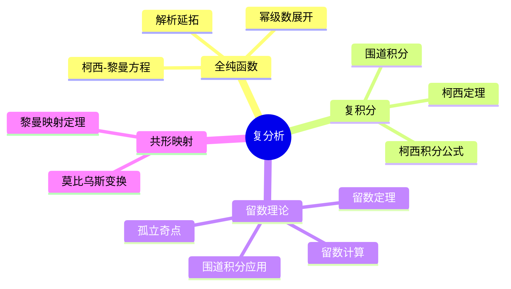
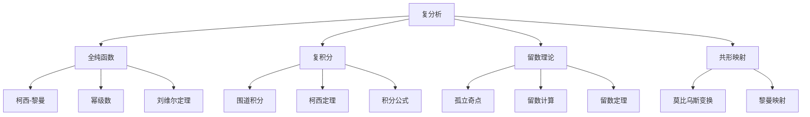

# 4.2 复分析

---

📌 **内容摘要**

本文档深入探讨复分析的核心原理和关键方法。内容涵盖分析学领域的主要知识点，包括全纯函数, 复分析, 留数定理等关键主题。适合具备相关基础的学习者进行深入研究。

**关键词**: 全纯函数, 复分析, 分析学, 留数定理

📚 **学习目标**
- 深入理解复分析的理论体系和形式化方法
- 能够进行相关定理的形式化证明
- 建立该领域的系统性知识框架

🎯 **难度级别**: 高级

⏱️ **预计阅读时间**: 15分钟

**前置知识**: 该领域的中级知识, 形式化方法基础

---


## 目录

- [4.2 复分析](#42-复分析)
  - [目录](#目录)
  - [4.2.1 引言](#421-引言)
  - [4.2.2 全纯函数](#422-全纯函数)
    - [4.2.2.1 定义与柯西-黎曼方程](#4221-定义与柯西-黎曼方程)
    - [4.2.2.2 幂级数展开](#4222-幂级数展开)
  - [4.2.3 复积分](#423-复积分)
    - [4.2.3.1 围道积分](#4231-围道积分)
    - [4.2.3.2 柯西定理](#4232-柯西定理)
  - [4.2.4 留数理论](#424-留数理论)
    - [4.2.4.1 孤立奇点](#4241-孤立奇点)
    - [4.2.4.2 留数计算](#4242-留数计算)
  - [4.2.5 留数计算的应用](#425-留数计算的应用)
    - [4.2.5.1 实积分计算](#4251-实积分计算)
  - [4.2.6 多表征视角](#426-多表征视角)
    - [概念图谱](#概念图谱)
    - [实分析与复分析对比](#实分析与复分析对比)
  - [参见](#参见)

---

## 4.2.1 引言

复分析(Complex Analysis)研究复变函数，尤其是全纯（解析）函数。
全纯函数具有惊人的正则性，其理论优美而深刻，在数学各分支及物理、工程中有广泛应用。

核心特征：

- 全纯函数自动无限可微
- 局部性质决定整体行为
- 围道积分与留数计算



---

## 4.2.2 全纯函数

### 4.2.2.1 定义与柯西-黎曼方程

**全纯(Holomorphic/Analytic)**：$f: D \to \mathbb{C}$在$z_0$全纯如果极限：
$$f'(z_0) = \lim_{h \to 0} \frac{f(z_0 + h) - f(z_0)}{h}$$

存在（与$h \to 0$的方向无关）。

**柯西-黎曼方程**：设$f(z) = u(x,y) + iv(x,y)$，则$f$全纯当且仅当：
$$\frac{\partial u}{\partial x} = \frac{\partial v}{\partial y}, \quad \frac{\partial u}{\partial y} = -\frac{\partial v}{\partial x}$$

即：$\frac{\partial f}{\partial \bar{z}} = 0$

```lean
structure HolomorphicAt (f : ℂ → ℂ) (z₀ : ℂ) : Prop where
  diff : DifferentiableAt ℂ f z₀

def CauchyRiemannEquations (u v : ℝ → ℝ → ℝ) : Prop :=
  ∀ x y, ∂u/∂x (x, y) = ∂v/∂y (x, y) ∧ ∂u/∂y (x, y) = -∂v/∂x (x, y)

theorem holomorphic_iff_CauchyRiemann {f : ℂ → ℂ} (hf : Differentiable ℝ (fun p => f (p.1 + p.2 * Complex.I))) :
  HolomorphicOn f D ↔ CauchyRiemannEquations (fun x y => (f (x + y * Complex.I)).re)
                                              (fun x y => (f (x + y * Complex.I)).im) := by
  sorry
```

### 4.2.2.2 幂级数展开

**定理 4.2.2.1**：$f$在$D$上全纯当且仅当$f$在$D$内每点可展开为幂级数。

$$f(z) = \sum_{n=0}^\infty a_n (z - z_0)^n$$

收敛半径$R = 1/\limsup |a_n|^{1/n}$。

**定理 4.2.2.2 (刘维尔定理)**：有界整函数必为常数。

---

## 4.2.3 复积分

### 4.2.3.1 围道积分

**围道积分**：设$\gamma: [a,b] \to \mathbb{C}$是分段光滑曲线，$f$在$\gamma$上连续：
$$\int_\gamma f(z) \, dz = \int_a^b f(\gamma(t)) \gamma'(t) \, dt$$

```lean
def contourIntegral {E : Type*} [NormedAddCommGroup E] [NormedSpace ℂ E]
  (f : ℂ → E) (γ : ℝ → ℂ) : E :=
  ∫ t in (0)..1, f (γ t) * deriv γ t
```

### 4.2.3.2 柯西定理

**定理 4.2.3.1 (柯西定理)**：若$f$在单连通区域$D$上全纯，$\gamma$是$D$中闭曲线，则：
$$\oint_\gamma f(z) \, dz = 0$$

**定理 4.2.3.2 (柯西积分公式)**：$f$在$D$上全纯，$\gamma$是包围$z_0$的简单闭曲线：
$$f(z_0) = \frac{1}{2\pi i} \oint_\gamma \frac{f(z)}{z - z_0} \, dz$$

高阶导数：
$$f^{(n)}(z_0) = \frac{n!}{2\pi i} \oint_\gamma \frac{f(z)}{(z - z_0)^{n+1}} \, dz$$

---

## 4.2.4 留数理论

### 4.2.4.1 孤立奇点

**孤立奇点(Isolated Singularity)**：$f$在$z_0$的某去心邻域内全纯，但在$z_0$不全纯。

**分类**：

| 类型 | 洛朗级数特征 | 例子 |
|------|-------------|------|
| **可去奇点** | 无负幂项 | $\frac{\sin z}{z}$在$z=0$ |
| **极点** | 有限个负幂项 | $\frac{1}{z^n}$ |
| **本性奇点** | 无限个负幂项 | $e^{1/z}$在$z=0$ |

### 4.2.4.2 留数计算

**留数(Residue)**：$f$在孤立奇点$z_0$的留数是洛朗展开中$(z-z_0)^{-1}$的系数：
$$\text{Res}(f, z_0) = a_{-1} = \frac{1}{2\pi i} \oint_\gamma f(z) \, dz$$

**留数计算公式**：

- 简单极点：$\text{Res}(f, z_0) = \lim_{z \to z_0} (z - z_0)f(z)$
- $n$阶极点：$\text{Res}(f, z_0) = \frac{1}{(n-1)!}\lim_{z \to z_0} \frac{d^{n-1}}{dz^{n-1}}((z-z_0)^n f(z))$

**定理 4.2.4.1 (留数定理)**：$f$在区域$D$内除孤立奇点$z_1, \ldots, z_n$外全纯，$\gamma$包围这些奇点：
$$\oint_\gamma f(z) \, dz = 2\pi i \sum_{k=1}^n \text{Res}(f, z_k)$$

```lean
def residue (f : ℂ → ℂ) (z₀ : ℂ) : ℂ :=
  (2 * π * Complex.I)⁻¹ * ∮ z in (circleMap z₀ r), f z

theorem residue_theorem {f : ℂ → ℂ} {γ : ℝ → ℂ} {S : Set ℂ}
  (h₁ : ∀ z ∈ S, IsolatedSingularity f z)
  (h₂ : ∀ z ∈ interior (pathImage γ), z ∉ S → HolomorphicAt f z) :
  ∮ z in γ, f z = 2 * π * Complex.I * ∑ z ∈ S, residue f z := by
  sorry
```

---

## 4.2.5 留数计算的应用

### 4.2.5.1 实积分计算

**类型1**：$\int_0^{2\pi} R(\cos\theta, \sin\theta) \, d\theta$

令$z = e^{i\theta}$，$d\theta = \frac{dz}{iz}$，$\cos\theta = \frac{z+z^{-1}}{2}$，$\sin\theta = \frac{z-z^{-1}}{2i}$

**类型2**：$\int_{-\infty}^\infty f(x) \, dx$

在上半平面用半圆围道，若$|zf(z)| \to 0$当$|z| \to \infty$。

**类型3**：$\int_{-\infty}^\infty f(x)e^{iax} \, dx$（$a > 0$）

用约当引理处理指数衰减。

---

## 4.2.6 多表征视角

### 概念图谱



### 实分析与复分析对比

| 性质 | 实分析 | 复分析 |
|------|--------|--------|
| 可微性 | 不保证连续 | 保证无限可微 |
| 零点 | 可以聚集 | 孤立（除非恒为零） |
| 最大值 | 可以有局部最大 | 最大模原理（内部无极值） |
| 积分 | 依赖路径 | 单连通域内路径无关 |
| 解析延拓 | 不一定唯一 | 唯一（恒等定理） |

---

## 参见

- [实分析](./04.1_实分析.md) — 实变函数理论
- [调和分析](./04.4_调和分析.md) — 傅里叶分析
- [微分几何](../03_几何学/03.2_微分几何.md) — 黎曼曲面
- [代数几何](../02_代数学/02.4_代数几何初步.md) — 复代数簇
---

## 📋 前置知识

- [4.1 实分析](../04_分析学/04.1_实分析.md)

---

## 📚 延伸阅读

- [4.1 实分析](../04_分析学/04.1_实分析.md)
- [3.2 微分几何](../03_几何学/03.2_微分几何.md)
- [4.4 调和分析](../04_分析学/04.4_调和分析.md)
