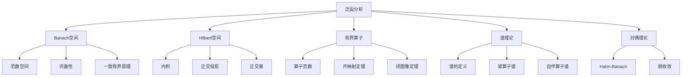

# 4.2 泛函分析

> 形式化数学基础 | 分析学
>
> 交叉引用：[4.1 实分析](./04.1_实分析.md) | [2.3 线性代数](../02_代数学/02.3_线性代数.md)

## 4.2.1 引言

泛函分析研究无穷维向量空间及其上的线性算子。本章形式化介绍Banach空间、Hilbert空间和算子理论。



## 4.2.2 Banach空间

### 4.2.2.1 赋范空间

**定义 4.2.1**（范数）
向量空间 X 上的**范数**是函数 ||·||: X → [0, ∞) 满足：

- 正定性：||x|| = 0 ⇔ x = 0
- 齐次性：||αx|| = |α| ||x||
- 三角不等式：||x + y|| ≤ ||x|| + ||y||

**定义 4.2.2**（Banach空间）
**Banach空间**是完备的赋范空间（所有Cauchy列收敛）。

**例 4.2.1**

- R^n，C^n 是Banach空间
- C(K)（紧集K上连续函数）是Banach空间，sup范数
- L^p(X, μ)（1 ≤ p ≤ ∞）是Banach空间
- l^p（p-可和序列）是Banach空间

### 4.2.2.2 完备化

**定理 4.2.1**（完备化定理）
每个赋范空间 X 存在完备化 X̃，在等距同构意义下唯一。

### 4.2.2.3 重要定理

**定理 4.2.2**（Baire纲定理）
完备度量空间是第二纲集（不能表示为可数个无处稠密集的并）。

**定理 4.2.3**（一致有界原理/Banach-Steinhaus）
设 {Tₐ} ⊂ L(X, Y) 是从Banach空间 X 到赋范空间 Y 的有界线性算子族。
若对每 x ∈ X，supₐ ||Tₐx|| < ∞，则 supₐ ||Tₐ|| < ∞。

**定理 4.2.4**（开映射定理）
Banach空间之间的满射有界线性算子是开映射。

**定理 4.2.5**（逆映射定理）
Banach空间之间的双射有界线性算子的逆也是有界的。

**定理 4.2.6**（闭图像定理）
T: X → Y 是闭的（图像 {(x, Tx)} 闭）当且仅当 T 连续。

## 4.2.3 Hilbert空间

### 4.2.3.1 内积空间

**定义 4.2.3**（内积）
复向量空间 H 上的**内积**是映射 ⟨·,·⟩: H × H → C 满足：

- 对第一变元线性
- 共轭对称：⟨x, y⟩ = ⟨y, x⟩的共轭
- 正定性：⟨x, x⟩ ≥ 0，等号当且仅当 x = 0

**定理 4.2.7**（Cauchy-Schwarz不等式）
|⟨x, y⟩| ≤ ||x|| ||y||

**定义 4.2.4**（Hilbert空间）
**Hilbert空间**是完备的内积空间。

### 4.2.3.2 正交性

**定义 4.2.5**（正交）

- x ⊥ y：⟨x, y⟩ = 0
- x ⊥ M：x ⊥ y 对所有 y ∈ M
- M⊥ = {x | x ⊥ M}

**定理 4.2.8**（正交分解）
对闭子空间 M ⊂ H：
$$H = M \oplus M^\perp$$

**定理 4.2.9**（投影定理）
对闭凸集 C ⊂ H 和 x ∈ H，存在唯一 y ∈ C 使 ||x - y|| = dist(x, C)。

### 4.2.3.3 正交基

**定义 4.2.6**（标准正交基）
{eₙ} 是**标准正交基**，如果：

- ⟨eₙ, eₘ⟩ = δₙₘ
- span{eₙ}的闭包 = H

**定理 4.2.10**（Fourier展开）
对标准正交基 {eₙ}：
$$x = \sum_{n=1}^\infty \langle x, e_n \rangle e_n, \quad ||x||^2 = \sum_{n=1}^\infty |\langle x, e_n \rangle|^2$$

**定理 4.2.11**（可分Hilbert空间的分类）
无穷维可分Hilbert空间都与 l² 等距同构。

## 4.2.4 有界线性算子

### 4.2.4.1 算子范数

**定义 4.2.7**（有界算子）
T: X → Y 是**有界的**，如果：
$$||T|| = \sup_{||x|| \leq 1} ||Tx|| < \infty$$

**定理 4.2.12**（有界与连续等价）
线性算子有界当且仅当连续。

**定义 4.2.8**（算子空间）
L(X, Y) = {T: X → Y | T 有界线性} 是Banach空间（若 Y 完备）。

### 4.2.4.2 对偶空间

**定义 4.2.9**（对偶空间）
**对偶空间** X* = L(X, K)，其中 K = R 或 C。

**定理 4.2.13**（Riesz表示定理，Hilbert空间）
对Hilbert空间 H，映射 y ↦ ⟨·, y⟩ 是 H 到 H* 的共轭线性等距同构。

**定理 4.2.14**（L^p的对偶）
对 1 ≤ p < ∞，1/p + 1/q = 1：
$$(L^p)^* \cong L^q$$

### 4.2.4.3 Hahn-Banach定理

**定理 4.2.15**（Hahn-Banach，实情形）
设 X 是实向量空间，p: X → R 是次线性泛函（正齐次且次可加）。
若 f: M → R 是子空间 M 上的线性泛函，f ≤ p|ₘ，则存在扩张 F: X → R，F|ₘ = f，F ≤ p。

**定理 4.2.16**（Hahn-Banach，范数情形）
设 X 是赋范空间，M 是子空间，f ∈ M*，则存在 F ∈ X*，F|ₘ = f，||F|| = ||f||。

**推论 4.2.1**

- 对 x ≠ 0，存在 f ∈ X* 使 f(x) = ||x||，||f|| = 1
- X* 分离 X 的点

## 4.2.5 谱理论

### 4.2.5.1 谱的定义

**定义 4.2.10**（预解集与谱）
对 T ∈ L(X)：

- **预解集** ρ(T) = {λ ∈ C | (λI - T)⁻¹ ∈ L(X)}
- **谱** σ(T) = C \ ρ(T)

**定义 4.2.11**（谱的分类）

- **点谱** σₚ(T)：特征值（λI - T 非单射）
- **连续谱** σ_c(T)：λI - T 单射、稠密值域但不满射
- **剩余谱** σ_r(T)：λI - T 单射但值域不稠密

### 4.2.5.2 紧算子

**定义 4.2.12**（紧算子）
T ∈ L(X, Y) 是**紧的**，如果 T(单位球) 的闭包是紧的。

**定理 4.2.17**（紧算子的谱）
设 T 是紧算子：

- σ(T) 至多可数，0 是唯一可能的聚点
- 非零谱点是特征值，特征空间有限维

### 4.2.5.3 自伴算子

**定义 4.2.13**（自伴算子）
T ∈ L(H) 是**自伴的**，如果 T = T*（即 ⟨Tx, y⟩ = ⟨x, Ty⟩）。

**定理 4.2.18**（自伴算子的谱性质）

- σ(T) ⊂ R
- ||T|| = sup{|λ| : λ ∈ σ(T)} = r(T)（谱半径）

**定理 4.2.19**（谱定理，紧自伴算子）
设 T 是紧自伴算子，则存在标准正交基 {eₙ} 使：
$$T = \sum_n \lambda_n \langle \cdot, e_n \rangle e_n$$
其中 λₙ 是实特征值，λₙ → 0。

## 4.2.6 Lean 4 形式化

```lean4
import Mathlib

-- Banach空间
#check BanachSpace 𝕜 E

-- Hilbert空间
#check InnerProductSpace 𝕜 E

-- 有界线性算子
#check ContinuousLinearMap 𝕜 E F

-- 对偶空间
#check NormedSpace.Dual 𝕜 E

-- 定理：Cauchy-Schwarz不等式
theorem Cauchy_Schwarz {𝕜 E : Type} [RCLike 𝕜] [InnerProductSpace 𝕜 E]
  (x y : E) : ‖⟪x, y⟫‖ ≤ ‖x‖ * ‖y‖ := by
  apply norm_inner_le_norm
```

## 4.2.7 参考文献

1. Rudin, W. (1991). Functional Analysis (2nd ed.). McGraw-Hill.
2. Conway, J. B. (1990). A Course in Functional Analysis (2nd ed.). Springer.
3. Reed, M., & Simon, B. (1980). Methods of Modern Mathematical Physics I: Functional Analysis. Academic Press.
4. Yosida, K. (1995). Functional Analysis (6th ed.). Springer.
5. Lax, P. D. (2002). Functional Analysis. Wiley.
