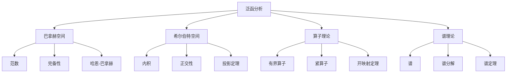

# 4.3 泛函分析

---

📌 **内容摘要**

本文档深入探讨泛函分析的核心原理和关键方法。内容涵盖分析学领域的主要知识点，包括泛函分析, Banach空间, Hilbert空间等关键主题。适合具备相关基础的学习者进行深入研究。

**关键词**: 泛函分析, 分析学, Banach空间, Hilbert空间

📚 **学习目标**
- 深入理解泛函分析的理论体系和形式化方法
- 能够进行相关定理的形式化证明
- 建立该领域的系统性知识框架

🎯 **难度级别**: 高级

⏱️ **预计阅读时间**: 15分钟

**前置知识**: 该领域的中级知识, 形式化方法基础

---


## 目录

- [4.3 泛函分析](#43-泛函分析)
  - [目录](#目录)
  - [4.3.1 引言](#431-引言)
  - [4.3.2 巴拿赫空间](#432-巴拿赫空间)
    - [4.3.2.1 定义](#4321-定义)
    - [4.3.2.2 例子](#4322-例子)
    - [4.3.2.3 哈恩-巴拿赫定理](#4323-哈恩-巴拿赫定理)
  - [4.3.3 希尔伯特空间](#433-希尔伯特空间)
    - [4.3.3.1 内积空间](#4331-内积空间)
    - [4.3.3.2 正交性与投影](#4332-正交性与投影)
  - [4.3.4 算子理论](#434-算子理论)
    - [4.3.4.1 有界线性算子](#4341-有界线性算子)
    - [4.3.4.2 紧算子](#4342-紧算子)
  - [4.3.5 谱理论](#435-谱理论)
    - [4.3.5.1 谱的定义](#4351-谱的定义)
    - [4.3.5.2 自伴算子的谱定理](#4352-自伴算子的谱定理)
  - [4.3.6 多表征视角](#436-多表征视角)
    - [概念图谱](#概念图谱)
    - [空间关系](#空间关系)
  - [参见](#参见)

---

## 4.3.1 引言

泛函分析(Functional Analysis)研究无限维向量空间（通常是函数空间）及其上的线性算子。
它统一了线性代数与分析学，是现代数学物理、偏微分方程和量子力学的基础。

核心对象：

- 巴拿赫空间（完备赋范空间）
- 希尔伯特空间（完备内积空间）
- 有界线性算子与谱理论


---

## 4.3.2 巴拿赫空间

### 4.3.2.1 定义

**赋范空间(Normed Space)**：向量空间$X$配备范数$\|\cdot\|: X \to \mathbb{R}$满足：

1. $\|x\| \geq 0$，等号当且仅当$x = 0$
2. $\|\alpha x\| = |\alpha| \|x\|$
3. $\|x + y\| \leq \|x\| + \|y\|$（三角不等式）

**巴拿赫空间(Banach Space)**：完备的赋范空间（所有柯西列收敛）。

```lean
class NormedSpace (𝕜 : Type*) [NormedField 𝕜] (E : Type*)
  [AddCommGroup E] [Module 𝕜 E] where
  norm : E → ℝ
  dist : E → E → ℝ := fun x y => norm (x - y)
  norm_nonneg : ∀ x, 0 ≤ norm x
  norm_eq_zero : ∀ x, norm x = 0 ↔ x = 0
  norm_smul : ∀ (c : 𝕜) (x : E), norm (c • x) = ‖c‖ * norm x
  norm_triangle : ∀ x y, norm (x + y) ≤ norm x + norm y

class BanachSpace (𝕜 : Type*) [NormedField 𝕜] (E : Type*)
  [AddCommGroup E] [Module 𝕜 E] extends NormedSpace 𝕜 E where
  complete : CompleteSpace E
```

### 4.3.2.2 例子

| 空间 | 范数 | 说明 |
|------|------|------|
| $\mathbb{R}^n$, $\mathbb{C}^n$ | $\|x\|_p = (\sum |x_i|^p)^{1/p}$ | 有限维巴拿赫空间 |
| $C([a,b])$ | $\|f\|_\infty = \sup|f(x)|$ | 连续函数空间 |
| $L^p(X, \mu)$ | $\|f\|_p = (\int |f|^p)^{1/p}$ | Lebesgue可积函数 |
| $l^p$ | $\|x\|_p = (\sum |x_n|^p)^{1/p}$ | 序列空间 |
| $c_0$ | $\|x\|_\infty$ | 收敛到0的序列 |

### 4.3.2.3 哈恩-巴拿赫定理

**定理 4.3.2.1 (哈恩-巴拿赫)**：设$Y$是赋范空间$X$的子空间，$f: Y \to \mathbb{R}$是有界线性泛函，则存在$F: X \to \mathbb{R}$使得：

- $F|_Y = f$（延拓）
- $\|F\| = \|f\|$（范数保持）

**推论**：对任意$x \neq 0$，存在$f \in X^*$使得$f(x) = \|x\|$且$\|f\| = 1$。

---

## 4.3.3 希尔伯特空间

### 4.3.3.1 内积空间

**内积空间(Inner Product Space)**：向量空间$H$配备内积$\langle \cdot, \cdot \rangle: H \times H \to \mathbb{C}$满足：

1. $\langle x, x \rangle \geq 0$，等号当且仅当$x = 0$
2. $\langle x, y \rangle = \overline{\langle y, x \rangle}$
3. $\langle \alpha x + \beta y, z \rangle = \alpha \langle x, z \rangle + \beta \langle y, z \rangle$

**诱导范数**：$\|x\| = \sqrt{\langle x, x \rangle}$

**希尔伯特空间**：完备的内积空间。

```lean
class InnerProductSpace (𝕜 : Type*) [RCLike 𝕜] (E : Type*)
  [AddCommGroup E] [Module 𝕜 E] where
  inner : E → E → 𝕜
  inner_conj_sym : ∀ x y, inner x y = star (inner y x)
  inner_add_left : ∀ x y z, inner (x + y) z = inner x z + inner y z
  inner_smul_left : ∀ (c : 𝕜) x y, inner (c • x) y = c * inner x y
  inner_self_nonneg : ∀ x, 0 ≤ re (inner x x)
  inner_self_eq_zero : ∀ x, inner x x = 0 ↔ x = 0

def norm {𝕜 E : Type*} [RCLike 𝕜] [AddCommGroup E] [Module 𝕜 E]
  [InnerProductSpace 𝕜 E] (x : E) : ℝ :=
  Real.sqrt (re (inner x x))

class HilbertSpace (𝕜 : Type*) [RCLike 𝕜] (E : Type*)
  [AddCommGroup E] [Module 𝕜 E] extends InnerProductSpace 𝕜 E where
  complete : CompleteSpace E
```

### 4.3.3.2 正交性与投影

**正交**：$x \perp y$如果$\langle x, y \rangle = 0$

**正交补**：$M^\perp = \{x \in H : x \perp m, \forall m \in M\}$

**定理 4.3.3.1 (投影定理)**：设$M$是希尔伯特空间$H$的闭子空间，则：
$$H = M \oplus M^\perp$$

每个$x \in H$可唯一分解为$x = m + m^\perp$，其中$m \in M$，$m^\perp \in M^\perp$。

**正交基**：子集$\{e_i\}_{i \in I}$是标准正交基如果：

- $\langle e_i, e_j \rangle = \delta_{ij}$
- $\overline{\text{span}\{e_i\}} = H$

**定理 4.3.3.2 (傅里叶展开)**：若$\{e_n\}$是标准正交基，则：
$$x = \sum_{n=1}^\infty \langle x, e_n \rangle e_n$$

---

## 4.3.4 算子理论

### 4.3.4.1 有界线性算子

**有界线性算子**：$T: X \to Y$线性且存在$C$使得$\|Tx\| \leq C\|x\|$对所有$x$成立。

**算子范数**：$\|T\| = \sup_{\|x\| \leq 1} \|Tx\| = \sup_{\|x\| = 1} \|Tx\|$

**对偶空间**：$X^* = \mathcal{B}(X, \mathbb{C})$（所有有界线性泛函）

```lean
def IsBoundedLinearMap {𝕜 : Type*} [NormedField 𝕜] {E F : Type*}
  [NormedAddCommGroup E] [NormedSpace 𝕜 E]
  [NormedAddCommGroup F] [NormedSpace 𝕜 F] (f : E → F) : Prop :=
  IsLinearMap 𝕜 f ∧ ∃ C, ∀ x, ‖f x‖ ≤ C * ‖x‖

structure ContinuousLinearMap (𝕜 : Type*) [NormedField 𝕜]
  (E F : Type*) [NormedAddCommGroup E] [NormedSpace 𝕜 E]
  [NormedAddCommGroup F] [NormedSpace 𝕜 F] extends E →ₗ[𝕜] F where
  cont : Continuous toFun

notation:25 E " →L[" 𝕜 "] " F => ContinuousLinearMap 𝕜 E F
```

### 4.3.4.2 紧算子

**紧算子(Compact Operator)**：$T: X \to Y$将有界集映为相对紧集。

**弗雷德霍姆理论**：紧算子的谱理论。

---

## 4.3.5 谱理论

### 4.3.5.1 谱的定义

设$T \in \mathcal{B}(H)$，$H$是希尔伯特空间。

**预解集(Resolvent Set)**：$\rho(T) = \{\lambda \in \mathbb{C} : T - \lambda I \text{可逆}\}$

**谱(Spectrum)**：$\sigma(T) = \mathbb{C} \setminus \rho(T)$

**谱分类**：

- **点谱**：$T - \lambda I$不是单射（特征值）
- **连续谱**：$T - \lambda I$是单射、稠值域但不满射
- **剩余谱**：$T - \lambda I$是单射但值域不稠密

### 4.3.5.2 自伴算子的谱定理

**自伴算子**：$T^* = T$，即$\langle Tx, y \rangle = \langle x, Ty \rangle$

**定理 4.3.5.1 (紧自伴算子的谱定理)**：设$T$是希尔伯特空间$H$上的紧自伴算子，则：

- 存在由特征向量组成的标准正交基$\{e_n\}$
- $Te_n = \lambda_n e_n$，其中$\lambda_n \in \mathbb{R}$且$\lambda_n \to 0$

**定理 4.3.5.2 (有界自伴算子的谱定理)**：存在谱测度$E$使得：
$$T = \int_{\sigma(T)} \lambda \, dE(\lambda)$$

---

## 4.3.6 多表征视角

### 概念图谱



### 空间关系

| 空间 | 结构 | 完备性 | 例子 |
|------|------|--------|------|
| 赋范空间 | 范数 | 不一定 | 多项式空间 |
| 巴拿赫空间 | 范数 | 是 | $C([a,b])$, $L^p$ |
| 内积空间 | 内积 | 不一定 | 有限维空间 |
| 希尔伯特空间 | 内积 | 是 | $L^2$, $l^2$ |

---

## 参见

- [实分析](./04.1_实分析.md) — 函数空间$L^p$
- [调和分析](./04.4_调和分析.md) — 函数空间上的算子
- [线性代数](../02_代数学/02.2_线性代数.md) — 有限维情形
- [量子力学应用](../05_概率论与测度论/05.3_随机过程.md) — 希尔伯特空间中的算子
---

## 📚 延伸阅读

- [4.4 调和分析](../04_分析学/04.4_调和分析.md)
- [4.1 实分析](../04_分析学/04.1_实分析.md)
- [5.2 概率论公理](../05_概率论与测度论/05.2_概率论公理.md)
- [5.2 概率论基础](../05_概率论与测度论/05.2_概率论基础.md)
- [5.1 测度空间](../05_概率论与测度论/05.1_测度空间.md)
