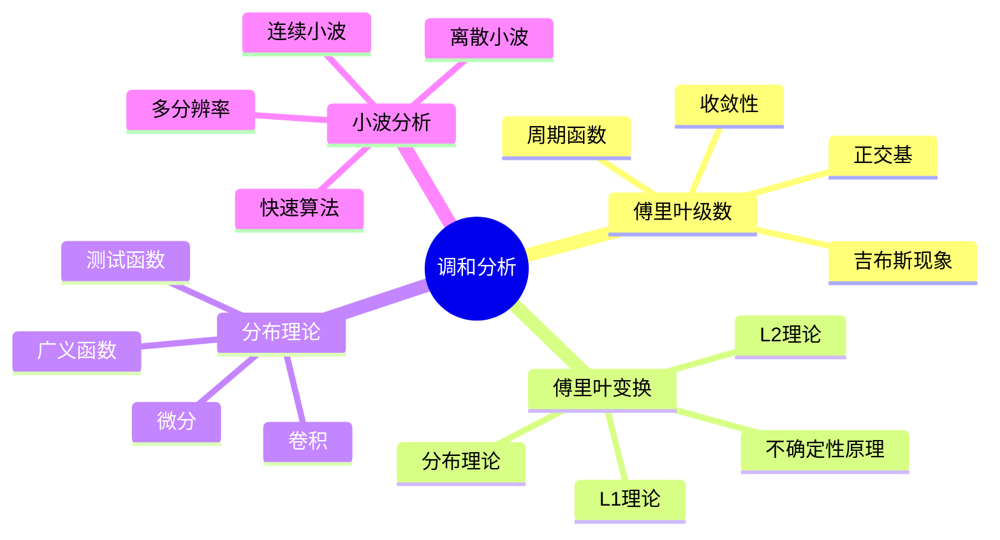
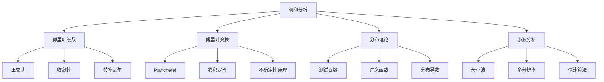

# 4.4 调和分析

## 目录

- [4.4 调和分析](#44-调和分析)
  - [目录](#目录)
  - [4.4.1 引言](#441-引言)
  - [4.4.2 傅里叶级数](#442-傅里叶级数)
    - [4.4.2.1 定义](#4421-定义)
    - [4.4.2.2 收敛性](#4422-收敛性)
  - [4.4.3 傅里叶变换](#443-傅里叶变换)
    - [4.4.3.1 定义](#4431-定义)
    - [4.4.3.2 基本性质](#4432-基本性质)
    - [4.4.3.3 Plancherel定理](#4433-plancherel定理)
    - [4.4.3.4 不确定性原理](#4434-不确定性原理)
  - [4.4.4 分布理论](#444-分布理论)
    - [4.4.4.1 测试函数空间](#4441-测试函数空间)
    - [4.4.4.2 分布的微分](#4442-分布的微分)
  - [4.4.5 小波分析](#445-小波分析)
    - [4.4.5.1 连续小波变换](#4451-连续小波变换)
    - [4.4.5.2 离散小波变换](#4452-离散小波变换)
  - [4.4.6 多表征视角](#446-多表征视角)
    - [概念图谱](#概念图谱)
    - [变换比较](#变换比较)
  - [参见](#参见)

---

## 4.4.1 引言

调和分析(Harmonic Analysis)研究函数在频率域的分解，核心是傅里叶分析。
它将函数表示为基本波（正弦/余弦或小波）的叠加，在信号处理、偏微分方程和数论中有广泛应用。

核心主题：

- 傅里叶级数与傅里叶变换
- 收敛性与求和方法
- 分布与广义函数
- 小波变换



---

## 4.4.2 傅里叶级数

### 4.4.2.1 定义

**傅里叶级数**：周期为$2\pi$的函数$f$展开为：
$$f(x) = \frac{a_0}{2} + \sum_{n=1}^\infty (a_n \cos nx + b_n \sin nx)$$

或复数形式：
$$f(x) = \sum_{n=-\infty}^\infty c_n e^{inx}$$

**傅里叶系数**：

- $a_n = \frac{1}{\pi} \int_{-\pi}^\pi f(x) \cos nx \, dx$
- $b_n = \frac{1}{\pi} \int_{-\pi}^\pi f(x) \sin nx \, dx$
- $c_n = \frac{1}{2\pi} \int_{-\pi}^\pi f(x) e^{-inx} \, dx$

```lean
def fourierCoefficient {𝕜 : Type*} [RCLike 𝕜] (f : ℝ → 𝕜) (n : ℤ) : 𝕜 :=
  (1 / (2 * π)) • ∫ x in (-π)..π, f x * Complex.exp (-n * x * Complex.I)

def fourierSeries (f : ℝ → ℂ) (x : ℝ) : ℂ :=
  ∑' n : ℤ, fourierCoefficient f n * Complex.exp (n * x * Complex.I)
```

### 4.4.2.2 收敛性

**定理 4.4.2.1 (狄利克雷定理)**：若$f$分段光滑，则傅里叶级数在每点$x$收敛于$\frac{f(x^+) + f(x^-)}{2}$。

**定理 4.4.2.2 (帕塞瓦尔等式)**：若$f \in L^2([-\pi, \pi])$，则：
$$\frac{1}{2\pi} \int_{-\pi}^\pi |f(x)|^2 \, dx = \sum_{n=-\infty}^\infty |c_n|^2$$

**Carleson定理**(1966)：$L^2$函数的傅里叶级数几乎处处收敛。

---

## 4.4.3 傅里叶变换

### 4.4.3.1 定义

**傅里叶变换**：$f \in L^1(\mathbb{R}^n)$，
$$\hat{f}(\xi) = \int_{\mathbb{R}^n} f(x) e^{-2\pi i x \cdot \xi} \, dx$$

**逆傅里叶变换**：
$$f(x) = \int_{\mathbb{R}^n} \hat{f}(\xi) e^{2\pi i x \cdot \xi} \, d\xi$$

```lean
def fourierTransform {𝕜 : Type*} [RCLike 𝕜] (f : 𝕜ⁿ → 𝕜) (ξ : 𝕜ⁿ) : 𝕜 :=
  ∫ x, f x * Complex.exp (-2 * π * Complex.I * inner x ξ)

def invFourierTransform {𝕜 : Type*} [RCLike 𝕜] (g : 𝕜ⁿ → 𝕜) (x : 𝕜ⁿ) : 𝕜 :=
  ∫ ξ, g ξ * Complex.exp (2 * π * Complex.I * inner x ξ)
```

### 4.4.3.2 基本性质

| 性质 | 时域 | 频域 |
|------|------|------|
| 线性 | $af + bg$ | $a\hat{f} + b\hat{g}$ |
| 平移 | $f(x - a)$ | $e^{-2\pi i a \cdot \xi}\hat{f}(\xi)$ |
| 调制 | $e^{2\pi i a \cdot x}f(x)$ | $\hat{f}(\xi - a)$ |
| 缩放 | $f(ax)$ | $|a|^{-n}\hat{f}(\xi/a)$ |
| 微分 | $\partial^\alpha f$ | $(2\pi i \xi)^\alpha \hat{f}(\xi)$ |
| 卷积 | $f * g$ | $\hat{f} \cdot \hat{g}$ |

### 4.4.3.3 Plancherel定理

**定理 4.4.3.1 (Plancherel)**：$f \in L^1 \cap L^2(\mathbb{R}^n)$，则$\hat{f} \in L^2$且：
$$\|f\|_{L^2} = \|\hat{f}\|_{L^2}$$

傅里叶变换可延拓为$L^2$上的酉算子。

### 4.4.3.4 不确定性原理

**定理 4.4.3.2 (Heisenberg不确定性原理)**：对$f \in L^2(\mathbb{R})$，$\|f\|_2 = 1$：
$$\left(\int x^2 |f(x)|^2 \, dx\right) \left(\int \xi^2 |\hat{f}(\xi)|^2 \, d\xi\right) \geq \frac{1}{16\pi^2}$$

等号当且仅当$f$是高斯函数。

---

## 4.4.4 分布理论

### 4.4.4.1 测试函数空间

**测试函数**：$\mathcal{D}(\mathbb{R}^n) = C_c^\infty(\mathbb{R}^n)$（紧支光滑函数）

**分布(Distribution)**：$\mathcal{D}'(\mathbb{R}^n)$，$\mathcal{D}$上的连续线性泛函。

**正则分布**：局部可积函数$f$对应分布$T_f(\varphi) = \int f(x)\varphi(x)\, dx$

```lean
def testFunction (n : ℕ) : Type _ := {f : ℝⁿ → ℝ // ContDiff ℝ ⊤ f ∧ HasCompactSupport f}

structure Distribution (n : ℕ) where
  toFun : testFunction n → ℝ
  linear : IsLinearMap ℝ toFun
  cont : ∀ (φk : ℕ → testFunction n), Tendsto φk atTop (𝓝 0) → Tendsto (toFun ∘ φk) atTop (𝓝 0)
```

### 4.4.4.2 分布的微分

**分布导数**：$T' \in \mathcal{D}'$，定义为：
$$T'(\varphi) = -T(\varphi')$$

所有分布都无限可微！

**狄拉克δ函数**：$\delta(\varphi) = \varphi(0)$，不是正则分布。

---

## 4.4.5 小波分析

### 4.4.5.1 连续小波变换

**母小波(Mother Wavelet)**：$\psi \in L^2(\mathbb{R})$，满足**容许条件**：
$$\int_{-\infty}^\infty \frac{|\hat{\psi}(\xi)|^2}{|\xi|} \, d\xi < \infty$$

**小波函数**：
$$\psi_{a,b}(x) = \frac{1}{\sqrt{|a|}} \psi\left(\frac{x-b}{a}\right)$$

其中$a \neq 0$是尺度参数，$b$是平移参数。

**连续小波变换**：
$$W_f(a,b) = \langle f, \psi_{a,b} \rangle = \int_{-\infty}^\infty f(x) \overline{\psi_{a,b}(x)} \, dx$$

### 4.4.5.2 离散小波变换

**二进小波**：$a = 2^j$, $b = k \cdot 2^j$（$j, k \in \mathbb{Z}$）

$$\psi_{j,k}(x) = 2^{-j/2} \psi(2^{-j}x - k)$$

**多分辨率分析(MRA)**：子空间序列$\{V_j\}_{j \in \mathbb{Z}}$满足：

1. $V_j \subseteq V_{j+1}$
2. $\bigcap V_j = \{0\}$, $\overline{\bigcup V_j} = L^2(\mathbb{R})$
3. $f(x) \in V_j \iff f(2x) \in V_{j+1}$
4. 存在尺度函数$\varphi$使得$\{\varphi(x - k)\}_k$是$V_0$的标准正交基

**Mallat算法**：快速小波变换的塔式算法。

---

## 4.4.6 多表征视角

### 概念图谱



### 变换比较

| 特性 | 傅里叶分析 | 小波分析 |
|------|-----------|---------|
| 基函数 | 正弦/余弦 | 局部化小波 |
| 时间-频率定位 | 全局（无时间定位） | 局部化 |
| 多尺度 | 无 | 有 |
| 稀疏表示 | 光滑函数 | 分段光滑 |
| 计算复杂度 | $O(n \log n)$ (FFT) | $O(n)$ (FWT) |

---

## 参见

- [实分析](./04.1_实分析.md) — $L^p$空间与收敛性
- [泛函分析](./04.3_泛函分析.md) — 希尔伯特空间中的正交基
- [复分析](./04.2_复分析.md) — 全纯函数的边界行为
- [概率论](../05_概率论与测度论/05.3_随机过程.md) — 特征函数
