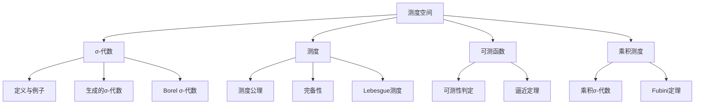

# 5.1 测度空间

> 形式化数学基础 | 概率论与测度论
>
> 交叉引用：[4.1 实分析](../04_分析学/04.1_实分析.md) | [5.2 概率论基础](./05.2_概率论基础.md)

## 5.1.1 引言

测度空间是测度论的基础框架，为概率论和现代分析提供了严格的数学基础。本章形式化介绍σ-代数、测度和可测函数。



## 5.1.2 σ-代数

### 5.1.2.1 定义与基本性质

**定义 5.1.1**（σ-代数）
集合 Ω 的子集族 F 称为 **σ-代数**（sigma-algebra），如果满足：

1. **包含全集**：Ω ∈ F
2. **对补集封闭**：若 A ∈ F，则 A^c = Ω \ A ∈ F
3. **对可数并封闭**：若 A₁, A₂, ... ∈ F，则 ∪_{n=1}^∞ Aₙ ∈ F

**定义 5.1.2**（可测空间）
**可测空间**是二元组 (Ω, F)，其中 F 是 Ω 上的 σ-代数。
F 中的元素称为 **可测集** 或 **事件**（概率论中）。

**定理 5.1.1**（σ-代数的封闭性）
设 F 是 σ-代数，则：

1. ∅ ∈ F
2. 对有限并封闭：A, B ∈ F ⇒ A ∪ B ∈ F
3. 对可数交封闭：Aₙ ∈ F ⇒ ∩_{n=1}^∞ Aₙ ∈ F
4. 对差集封闭：A, B ∈ F ⇒ A \ B ∈ F

**证明**：
(1) ∅ = Ω^c ∈ F
(3) 由De Morgan律：∩Aₙ = (∪Aₙ^c)^c ∈ F
(4) A \ B = A ∩ B^c ∈ F
$\square$

### 5.1.2.2 σ-代数的例子

**例 5.1.1**

1. **平凡σ-代数**：F = {∅, Ω}
2. **离散σ-代数**：F = P(Ω)（Ω的所有子集）
3. **可数-余可数σ-代数**：F = {A ⊂ Ω | A 可数或 A^c 可数}

**例 5.1.2**（由集族生成的σ-代数）
对任意集族 E ⊂ P(Ω)，存在包含 E 的最小σ-代数，记作 σ(E)，称为由 E **生成**的σ-代数。

**证明**：
考虑所有包含 E 的σ-代数之交，验证其仍是σ-代数。
$\square$

### 5.1.2.3 Borel σ-代数

**定义 5.1.3**（Borel σ-代数）
拓扑空间 (X, τ) 的 **Borel σ-代数** 是由开集族生成的σ-代数：
$$\mathcal{B}(X) = \sigma(\tau)$$

Borel集中的元素称为 **Borel集**。

**定理 5.1.2**（R^n的Borel集生成）
B(R^n) 可由以下任一族生成：

- 开集族
- 闭集族
- 开球族
- 闭矩形族 [a₁, b₁] × ... × [aₙ, bₙ]

### 5.1.2.4 Lean 4 形式化

```lean4
import Mathlib

-- σ-代数（Mathlib中称为MeasurableSpace）
#check MeasurableSpace Ω

-- Borel σ-代数
#check borel X  -- X是拓扑空间

-- 生成的σ-代数
#check MeasurableSpace.generateFrom E

-- 定理：σ-代数对可数交封闭
theorem MeasurableSet.iInter {Ω : Type} [MeasurableSpace Ω]
  {f : ℕ → Set Ω} (hf : ∀ n, MeasurableSet (f n)) :
  MeasurableSet (⋂ n, f n) := by
  apply MeasurableSet.iInter
  exact hf
```

## 5.1.3 测度

### 5.1.3.1 测度的定义

**定义 5.1.4**（测度）
可测空间 (Ω, F) 上的 **测度** 是函数 μ: F → [0, +∞] 满足：

1. **非负性**：μ(A) ≥ 0
2. **空集为零**：μ(∅) = 0
3. **可数可加性（σ-可加性）**：对互不相交的可测集列 {Aₙ}：
   $$\mu\left(\bigcup_{n=1}^\infty A_n\right) = \sum_{n=1}^\infty \mu(A_n)$$

**定义 5.1.5**（测度空间）
**测度空间** 是三元组 (Ω, F, μ)，其中 μ 是 (Ω, F) 上的测度。

**定义 5.1.6**（测度的分类）

- **有限测度**：μ(Ω) < ∞
- **概率测度**：μ(Ω) = 1
- **σ-有限测度**：存在 {Ωₙ} 使 Ω = ∪Ωₙ，μ(Ωₙ) < ∞

### 5.1.3.2 测度的基本性质

**定理 5.1.3**（测度的单调性）
若 A ⊂ B，则 μ(A) ≤ μ(B)。

**定理 5.1.4**（测度的连续性）

1. **从下连续**：若 Aₙ ↑ A（单调增），则 μ(Aₙ) ↑ μ(A)
2. **从上连续**：若 Aₙ ↓ A（单调减）且 μ(A₁) < ∞，则 μ(Aₙ) ↓ μ(A)

**证明**：
(1) 令 B₁ = A₁，Bₙ = Aₙ \ A_{n-1}（n ≥ 2），则 {Bₙ} 不交且 ∪Aₙ = ∪Bₙ。
$$\mu(A) = \mu\left(\bigcup B_n\right) = \sum \mu(B_n) = \lim_{N} \sum_{n=1}^N \mu(B_n) = \lim_{N} \mu(A_N)$$

(2) 令 Cₙ = A₁ \ Aₙ，则 Cₙ ↑ A₁ \ A，由(1)：
$$\mu(A_1) - \mu(A) = \lim_{n} (\mu(A_1) - \mu(A_n)) = \mu(A_1) - \lim_{n} \mu(A_n)$$
$\square$

**定理 5.1.5**（次可数可加性）
对任意可测集列 {Aₙ}：
$$\mu\left(\bigcup_{n=1}^\infty A_n\right) \leq \sum_{n=1}^\infty \mu(A_n)$$

### 5.1.3.3 完备测度

**定义 5.1.7**（零测集）
N ∈ F 是 **零测集**（或 **可略集**），如果 μ(N) = 0。

**定义 5.1.8**（完备测度）
测度 μ 是 **完备的**，如果零测集的所有子集都可测（因而也是零测集）。

**定理 5.1.6**（测度的完备化）
任何测度空间 (Ω, F, μ) 都可完备化为 (Ω, F̄, μ̄)，其中：

- F̄ = {A ∪ N | A ∈ F, N ⊂ M ∈ F, μ(M) = 0}
- μ̄(A ∪ N) = μ(A)

## 5.1.4 Lebesgue测度

### 5.1.4.1 Lebesgue外测度

**定义 5.1.9**（Lebesgue外测度）
对 A ⊂ R^n，其 **Lebesgue外测度** 定义为：
$$m^*(A) = \inf\left\{\sum_{k=1}^\infty |I_k| : A \subset \bigcup_{k=1}^\infty I_k, I_k \text{ 是开矩形}\right\}$$

**定理 5.1.7**（外测度的性质）

1. m*(∅) = 0
2. 单调性：A ⊂ B ⇒ m*(A) ≤ m*(B)
3. 次可数可加性

### 5.1.4.2 Carathéodory可测性

**定义 5.1.10**（Carathéodory可测）
A ⊂ R^n 是 **Lebesgue可测的**，如果对任意 E ⊂ R^n：
$$m^*(E) = m^*(E \cap A) + m^*(E \cap A^c)$$

**定理 5.1.8**（Lebesgue测度的存在性）
Lebesgue可测集构成σ-代数 L(R^n)，m* 限制在 L(R^n) 上是完备测度，满足：

- m([a₁, b₁] × ... × [aₙ, bₙ]) = ∏(bᵢ - aᵢ)
- 平移不变性：m(A + x) = m(A)

### 5.1.4.3 Borel集与Lebesgue可测集

**定理 5.1.9**

- B(R^n) ⊂ L(R^n)
- 任何 Lebesgue 可测集可表示为 Borel 集与零测集之并
- Lebesgue测度是Borel测度的完备化

## 5.1.5 可测函数

### 5.1.5.1 可测函数的定义

**定义 5.1.11**（可测函数）
设 (Ω, F) 和 (E, E) 是可测空间，函数 f: Ω → E 是 **可测的**，如果对任意 B ∈ E：
$$f^{-1}(B) \in \mathcal{F}$$

**定理 5.1.10**（可测性的判定）
若 E = σ(C)，则 f 可测当且仅当对任意 C ∈ C，f⁻¹(C) ∈ F。

**例 5.1.3**

1. 连续函数是Borel可测的
2. 可测函数的复合是可测的
3. 指示函数 1_A 可测当且仅当 A 可测

### 5.1.5.2 实值可测函数

**定理 5.1.11**（实值可测函数的运算）
设 f, g: Ω → R 可测，则以下函数也可测：

- f + g, f - g, fg
- max(f, g), min(f, g)
- f⁺ = max(f, 0), f⁻ = max(-f, 0), |f|
- f/g（g ≠ 0）

**定理 5.1.12**（可测函数的极限）
设 {fₙ} 是可测函数列，则以下函数也可测：

- supₙ fₙ, infₙ fₙ
- limsupₙ fₙ, liminfₙ fₙ
- limₙ fₙ（若极限存在）

### 5.1.5.3 简单函数逼近

**定义 5.1.12**（简单函数）
**简单函数**是有限值可测函数，可表示为：
$$s = \sum_{i=1}^n a_i \mathbf{1}_{A_i}$$
其中 aᵢ ∈ R，Aᵢ ∈ F 可测。

**定理 5.1.13**（简单函数逼近）

1. 对非负可测函数 f，存在简单函数列 sₙ ↑ f 点态收敛
2. 对有界可测函数 f，存在简单函数列 sₙ → f 一致收敛

## 5.1.6 乘积测度

### 5.1.6.1 乘积σ-代数

**定义 5.1.13**（乘积σ-代数）
设 (Ω₁, F₁) 和 (Ω₂, F₂) 是可测空间，**乘积σ-代数** 定义为：
$$\mathcal{F}_1 \otimes \mathcal{F}_2 = \sigma(\{A \times B : A \in \mathcal{F}_1, B \in \mathcal{F}_2\})$$

**定理 5.1.14**
若 Ω₁, Ω₂ 是第二可数拓扑空间，则：
$$\mathcal{B}(\Omega_1 \times \Omega_2) = \mathcal{B}(\Omega_1) \otimes \mathcal{B}(\Omega_2)$$

### 5.1.6.2 乘积测度的构造

**定理 5.1.15**（乘积测度的存在唯一性）
设 (Ω₁, F₁, μ₁) 和 (Ω₂, F₂, μ₂) 是σ-有限测度空间，则存在唯一的测度 μ₁ × μ₂ 在 (Ω₁ × Ω₂, F₁ ⊗ F₂) 上满足：
$$(\mu_1 \times \mu_2)(A \times B) = \mu_1(A) \mu_2(B)$$

### 5.1.6.3 Fubini定理

**定理 5.1.16**（Fubini-Tonelli）
设 (Ω₁, F₁, μ₁) 和 (Ω₂, F₂, μ₂) 是σ-有限测度空间。

**Tonelli**：若 f: Ω₁ × Ω₂ → [0, ∞] 可测，则：
$$\int f \, d(\mu_1 \times \mu_2) = \int\left(\int f(x, y) \, d\mu_2(y)\right) d\mu_1(x) = \int\left(\int f(x, y) \, d\mu_1(x)\right) d\mu_2(y)$$

**Fubini**：若 f ∈ L¹(μ₁ × μ₂)，则上述等式成立，且内层积分对几乎处处的 x（或 y）有限。

## 5.1.7 参考文献

1. Folland, G. B. (1999). Real Analysis: Modern Techniques and Their Applications (2nd ed.). Wiley.
2. Billingsley, P. (1995). Probability and Measure (3rd ed.). Wiley.
3. Rudin, W. (1987). Real and Complex Analysis (3rd ed.). McGraw-Hill.
4. Tao, T. (2011). An Introduction to Measure Theory. American Mathematical Society.
5. Halmos, P. R. (1950). Measure Theory. Van Nostrand.
