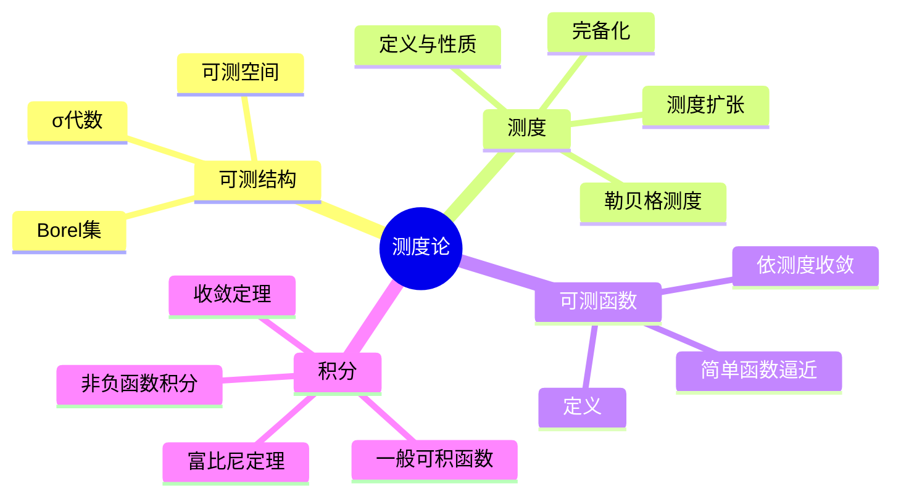
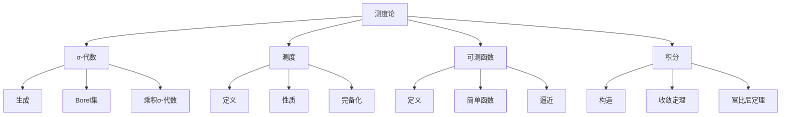

# 5.1 测度论基础

---

📌 **内容摘要**

本文档系统介绍测度论的基础理论和核心概念。内容涵盖概率论与测度论领域的主要知识点，包括测度论, 可测函数, σ-代数等关键主题。适合具备相关基础的学习者进行深入研究。

**关键词**: 测度论, 可测函数, 概率论与测度论, σ-代数

📚 **学习目标**
- 深入理解测度论的理论体系和形式化方法
- 能够进行相关定理的形式化证明
- 建立该领域的系统性知识框架

🎯 **难度级别**: 高级

⏱️ **预计阅读时间**: 15分钟

**前置知识**: 该领域的中级知识, 形式化方法基础, 微积分基础

---


## 目录

- [5.1 测度论基础](#51-测度论基础)
  - [目录](#目录)
  - [5.1.1 引言](#511-引言)
  - [5.1.2 σ-代数与可测空间](#512-σ-代数与可测空间)
    - [5.1.2.1 σ-代数的定义](#5121-σ-代数的定义)
    - [5.1.2.2 生成σ-代数](#5122-生成σ-代数)
    - [5.1.2.3 σ-代数的例子](#5123-σ-代数的例子)
  - [5.1.3 测度及其性质](#513-测度及其性质)
    - [5.1.3.1 测度的定义](#5131-测度的定义)
    - [5.1.3.2 基本性质](#5132-基本性质)
    - [5.1.3.3 完备测度](#5133-完备测度)
  - [5.1.4 可测函数](#514-可测函数)
    - [5.1.4.1 定义](#5141-定义)
    - [5.1.4.2 简单函数](#5142-简单函数)
  - [5.1.5 积分理论](#515-积分理论)
    - [5.1.5.1 勒贝格积分的构造](#5151-勒贝格积分的构造)
    - [5.1.5.2 收敛定理](#5152-收敛定理)
    - [5.1.5.3 富比尼定理](#5153-富比尼定理)
  - [5.1.6 多表征视角](#516-多表征视角)
    - [概念图谱](#概念图谱)
    - [测度论vs黎曼积分](#测度论vs黎曼积分)
  - [参见](#参见)

---

## 5.1.1 引言

测度论(Measure Theory)是研究"大小"、"体积"或"概率"的数学理论。
它为现代分析学、概率论和遍历理论提供了严格的基础框架。
勒贝格(Henri Lebesgue)于20世纪初创立的勒贝格测度和勒贝格积分革命性地改变了人们对积分和极限的理解。

测度论的核心概念：

- σ-代数：定义可测集的集合族
- 测度：为集合赋予"大小"的函数
- 可测函数：保持可测结构的函数
- 积分：基于测度的广义求和



---

## 5.1.2 σ-代数与可测空间

### 5.1.2.1 σ-代数的定义

**σ-代数(Sigma-Algebra)**：集合$X$的子集族$\mathcal{A} \subseteq \mathcal{P}(X)$满足：

| 公理 | 内容 |
|------|------|
| (i) | $X \in \mathcal{A}$ |
| (ii) | $A \in \mathcal{A} \implies A^c = X \setminus A \in \mathcal{A}$（对补封闭） |
| (iii) | $A_1, A_2, \ldots \in \mathcal{A} \implies \bigcup_{n=1}^\infty A_n \in \mathcal{A}$（对可数并封闭） |

**可测空间(Measurable Space)**：二元组$(X, \mathcal{A})$。

```lean
structure SigmaAlgebra (X : Type*) where
  sets : Set (Set X)
  empty_mem : ∅ ∈ sets
  compl_mem : ∀ s ∈ sets, sᶜ ∈ sets
  iUnion_mem : ∀ (f : ℕ → Set X), (∀ n, f n ∈ sets) → (⋃ n, f n) ∈ sets

structure MeasurableSpace (X : Type*) where
  sigmaAlgebra : SigmaAlgebra X
```

### 5.1.2.2 生成σ-代数

**由子集族生成**：给定$\mathcal{C} \subseteq \mathcal{P}(X)$，$\sigma(\mathcal{C})$是包含$\mathcal{C}$的最小σ-代数。

**Borel σ-代数**：$\mathcal{B}(X) = \sigma(\mathcal{O})$，其中$\mathcal{O}$是拓扑空间$X$的开集族。

### 5.1.2.3 σ-代数的例子

| σ-代数 | 描述 |
|--------|------|
| 平凡σ-代数 | $\{\emptyset, X\}$ |
| 离散σ-代数 | $\mathcal{P}(X)$（X的所有子集） |
| Borel σ-代数 | $\mathcal{B}(\mathbb{R}^n)$ |
| 乘积σ-代数 | $\mathcal{A} \otimes \mathcal{B}$ |

---

## 5.1.3 测度及其性质

### 5.1.3.1 测度的定义

**测度(Measure)**：可测空间$(X, \mathcal{A})$上的函数$\mu: \mathcal{A} \to [0, \infty]$满足：

| 公理 | 内容 |
|------|------|
| (i) | $\mu(\emptyset) = 0$ |
| (ii) | 可数可加性：对两两不交的可测集列$\{A_n\}$，$\mu(\bigcup_n A_n) = \sum_n \mu(A_n)$ |

**测度空间(Measure Space)**：三元组$(X, \mathcal{A}, \mu)$。

```lean
structure Measure (X : Type*) [MeasurableSpace X] where
  measure : Set X → ℝ≥0∞
  empty : measure ∅ = 0
  m_iUnion : ∀ (A : ℕ → Set X),
    (∀ i j, i ≠ j → Disjoint (A i) (A j)) →
    measure (⋃ n, A n) = ∑' n, measure (A n)
  measurableSet_iUnion : ∀ (A : ℕ → Set X), (∀ n, MeasurableSet (A n)) → MeasurableSet (⋃ n, A n)
```

### 5.1.3.2 基本性质

**定理 5.1.3.1**：测度具有以下性质：

| 性质 | 描述 |
|------|------|
| **单调性** | $A \subseteq B \implies \mu(A) \leq \mu(B)$ |
| **次可数可加性** | $\mu(\bigcup_n A_n) \leq \sum_n \mu(A_n)$ |
| **下连续性** | $A_n \uparrow A \implies \mu(A_n) \uparrow \mu(A)$ |
| **上连续性** | $A_n \downarrow A$，$\mu(A_1) < \infty$ $\implies$ $\mu(A_n) \downarrow \mu(A)$ |

### 5.1.3.3 完备测度

**完备测度**：若$\mu(N) = 0$且$M \subseteq N$，则$M \in \mathcal{A}$且$\mu(M) = 0$。

**完备化**：任何测度都可以完备化为完备测度。

---

## 5.1.4 可测函数

### 5.1.4.1 定义

**可测函数(Measurable Function)**：$(X, \mathcal{A}) \to (Y, \mathcal{B})$的函数$f$满足：
$$\forall B \in \mathcal{B}, f^{-1}(B) \in \mathcal{A}$$

**实值可测函数**：等价于对所有$a \in \mathbb{R}$，$\{x: f(x) > a\} \in \mathcal{A}$。

```lean
def Measurable {X Y : Type*} [MeasurableSpace X] [MeasurableSpace Y]
  (f : X → Y) : Prop :=
  ∀ (s : Set Y), MeasurableSet s → MeasurableSet (f ⁻¹' s)
```

### 5.1.4.2 简单函数

**简单函数(Simple Function)**：$s(x) = \sum_{i=1}^n a_i \chi_{A_i}(x)$，其中$A_i$可测，$a_i \geq 0$。

**逼近定理**：非负可测函数可被简单函数列单调逼近。

---

## 5.1.5 积分理论

### 5.1.5.1 勒贝格积分的构造

**步骤1：非负简单函数**
$$\int s \, d\mu = \sum_{i=1}^n a_i \mu(A_i)$$

**步骤2：非负可测函数**
$$\int f \, d\mu = \sup\left\{\int s \, d\mu : 0 \leq s \leq f, s \text{简单}\right\}$$

**步骤3：一般可测函数**
$$f = f^+ - f^-, \quad \int f \, d\mu = \int f^+ \, d\mu - \int f^- \, d\mu$$

（要求至少一个积分有限）

### 5.1.5.2 收敛定理

**定理 5.1.5.1 (单调收敛定理)**：$0 \leq f_n \uparrow f$ $\implies$ $\int f_n \uparrow \int f$

**定理 5.1.5.2 (法图引理)**：$f_n \geq 0$ $\implies$ $\int \liminf f_n \leq \liminf \int f_n$

**定理 5.1.5.3 (控制收敛定理)**：$f_n \to f$ a.e.，$|f_n| \leq g$可积 $\implies$ $\int f_n \to \int f$

### 5.1.5.3 富比尼定理

**定理 5.1.5.4 (富比尼-托内利)**：对乘积测度空间$(X \times Y, \mathcal{A} \otimes \mathcal{B}, \mu \times \nu)$：

- 若$f \geq 0$可测，则$\int_{X \times Y} f = \int_X \int_Y f = \int_Y \int_X f$
- 若$f$可积，则上述等式成立

---

## 5.1.6 多表征视角

### 概念图谱



### 测度论vs黎曼积分

| 方面 | 黎曼积分 | 勒贝格积分 |
|------|---------|-----------|
| 分割域 | 区间 | 可测集 |
| 可积函数 | 几乎连续 | 可测函数 |
| 极限交换 | 需要一致收敛 | 单调/控制收敛 |
| 完备性 | 不完备 | 完备($L^1$) |
| 重积分 | 需额外条件 | 富比尼定理 |

---

## 参见

- [实分析](../04_分析学/04.1_实分析.md) — 勒贝格积分详细理论
- [概率论公理](./05.2_概率论公理.md) — 测度论在概率中的应用
- [泛函分析](../04_分析学/04.3_泛函分析.md) — $L^p$空间理论
---

## 📚 延伸阅读

- [5.1 测度空间](../05_概率论与测度论/05.1_测度空间.md)
- [4.1 实分析](../04_分析学/04.1_实分析.md)
- [4.2 泛函分析](../04_分析学/04.2_泛函分析.md)
- [4.3 泛函分析](../04_分析学/04.3_泛函分析.md)
- [5.2 概率论公理](../05_概率论与测度论/05.2_概率论公理.md)
