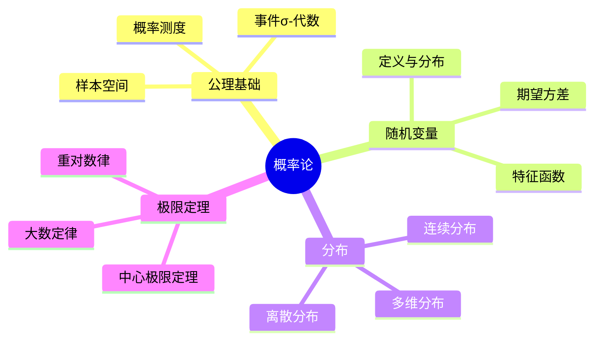
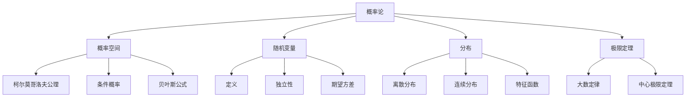

# 5.2 概率论公理

## 目录

- [5.2 概率论公理](#52-概率论公理)
  - [目录](#目录)
  - [5.2.1 引言](#521-引言)
  - [5.2.2 柯尔莫哥洛夫公理](#522-柯尔莫哥洛夫公理)
    - [5.2.2.1 概率空间](#5221-概率空间)
    - [5.2.2.2 条件概率](#5222-条件概率)
  - [5.2.3 随机变量](#523-随机变量)
    - [5.2.3.1 定义](#5231-定义)
    - [5.2.3.2 独立性](#5232-独立性)
  - [5.2.4 概率分布](#524-概率分布)
    - [5.2.4.1 分布函数](#5241-分布函数)
    - [5.2.4.2 离散分布](#5242-离散分布)
    - [5.2.4.3 连续分布](#5243-连续分布)
  - [5.2.5 期望与特征函数](#525-期望与特征函数)
    - [5.2.5.1 期望](#5251-期望)
    - [5.2.5.2 特征函数](#5252-特征函数)
  - [5.2.6 极限定理](#526-极限定理)
    - [5.2.6.1 大数定律](#5261-大数定律)
    - [5.2.6.2 中心极限定理](#5262-中心极限定理)
  - [5.2.7 多表征视角](#527-多表征视角)
    - [概念图谱](#概念图谱)
    - [收敛类型](#收敛类型)
  - [参见](#参见)

---

## 5.2.1 引言

概率论(Probability Theory)研究随机现象的数学规律。
柯尔莫哥洛夫(Andrey Kolmogorov)于1933年建立了概率论的公理化基础，将其建立在测度论之上，使概率论成为严格的数学分支。

概率论的核心：

- 样本空间与事件
- 概率测度
- 随机变量与分布
- 极限定理



---

## 5.2.2 柯尔莫哥洛夫公理

### 5.2.2.1 概率空间

**概率空间(Probability Space)**：三元组$(\Omega, \mathcal{F}, P)$

| 组件 | 名称 | 说明 |
|------|------|------|
| $\Omega$ | 样本空间 | 所有可能结果的集合 |
| $\mathcal{F} \subseteq \mathcal{P}(\Omega)$ | 事件σ-代数 | 可测事件族 |
| $P: \mathcal{F} \to [0,1]$ | 概率测度 | 满足公理的测度 |

**概率测度的公理**：

1. $P(\Omega) = 1$（规范性）
2. 可数可加性：对不交事件列$\{A_n\}$，$P(\bigcup_n A_n) = \sum_n P(A_n)$

```lean
structure ProbabilitySpace (Ω : Type*) extends MeasureSpace Ω where
  isProbabilityMeasure : measure (Set.univ) = 1

def Probability (Ω : Type*) [ProbabilitySpace Ω] (A : Set Ω) : ℝ≥0∞ :=
  measure A
```

### 5.2.2.2 条件概率

**条件概率**：$P(A|B) = \frac{P(A \cap B)}{P(B)}$，$P(B) > 0$

**全概率公式**：若$\{B_i\}$是$\Omega$的划分，则：
$$P(A) = \sum_i P(A|B_i) P(B_i)$$

**贝叶斯公式**：
$$P(B_i|A) = \frac{P(A|B_i) P(B_i)}{\sum_j P(A|B_j) P(B_j)}$$

---

## 5.2.3 随机变量

### 5.2.3.1 定义

**随机变量(Random Variable)**：可测函数$X: (\Omega, \mathcal{F}) \to (\mathbb{R}, \mathcal{B}(\mathbb{R}))$

**σ-代数生成**：$\sigma(X) = X^{-1}(\mathcal{B}(\mathbb{R})) \subseteq \mathcal{F}$

```lean
def RandomVariable {Ω : Type*} [ProbabilitySpace Ω] (X : Ω → ℝ) : Prop :=
  Measurable X
```

### 5.2.3.2 独立性

**事件独立**：$P(A \cap B) = P(A)P(B)$

**随机变量独立**：$X_1, \ldots, X_n$独立如果对任意Borel集$B_1, \ldots, B_n$：
$$P(X_1 \in B_1, \ldots, X_n \in B_n) = \prod_{i=1}^n P(X_i \in B_i)$$

---

## 5.2.4 概率分布

### 5.2.4.1 分布函数

**分布函数(CDF)**：$F_X(x) = P(X \leq x)$

**性质**：

- 单调不减
- 右连续
- $\lim_{x \to -\infty} F(x) = 0$，$\lim_{x \to \infty} F(x) = 1$

### 5.2.4.2 离散分布

| 分布 | PMF | 期望 | 方差 |
|------|-----|------|------|
| 伯努利 Bernoulli($p$) | $P(X=1)=p, P(X=0)=1-p$ | $p$ | $p(1-p)$ |
| 二项 Binomial($n, p$) | $C(n,k)p^k(1-p)^{n-k}$ | $np$ | $np(1-p)$ |
| 泊松 Poisson($\lambda$) | $e^{-\lambda}\frac{\lambda^k}{k!}$ | $\lambda$ | $\lambda$ |
| 几何 Geometric($p$) | $(1-p)^{k-1}p$ | $1/p$ | $(1-p)/p^2$ |

### 5.2.4.3 连续分布

| 分布 | PDF | 期望 | 方差 |
|------|-----|------|------|
| 均匀 Uniform($a, b$) | $\frac{1}{b-a}$ | $\frac{a+b}{2}$ | $\frac{(b-a)^2}{12}$ |
| 正态 Normal($\mu, \sigma^2$) | $\frac{1}{\sqrt{2\pi}\sigma}e^{-\frac{(x-\mu)^2}{2\sigma^2}}$ | $\mu$ | $\sigma^2$ |
| 指数 Exponential($\lambda$) | $\lambda e^{-\lambda x}$ | $1/\lambda$ | $1/\lambda^2$ |
| 伽马 Gamma($\alpha, \beta$) | $\frac{\beta^\alpha}{\Gamma(\alpha)}x^{\alpha-1}e^{-\beta x}$ | $\alpha/\beta$ | $\alpha/\beta^2$ |

---

## 5.2.5 期望与特征函数

### 5.2.5.1 期望

**期望(Expectation)**：$E[X] = \int_\Omega X \, dP$

或：$E[X] = \int_{-\infty}^\infty x \, dF_X(x)$

**方差**：$\text{Var}(X) = E[(X - E[X])^2] = E[X^2] - (E[X])^2$

```lean
def expectation {Ω : Type*} [ProbabilitySpace Ω] (X : Ω → ℝ) : ℝ :=
  integral (fun ω => X ω)

def variance {Ω : Type*} [ProbabilitySpace Ω] (X : Ω → ℝ) : ℝ≥0 :=
  expectation (fun ω => (X ω - expectation X)^2)
```

### 5.2.5.2 特征函数

**特征函数(Characteristic Function)**：
$$\varphi_X(t) = E[e^{itX}] = \int_{-\infty}^\infty e^{itx} \, dF_X(x)$$

**性质**：

- $\varphi(0) = 1$，$|\varphi(t)| \leq 1$
- 一致连续
- 唯一确定分布（唯一性定理）

---

## 5.2.6 极限定理

### 5.2.6.1 大数定律

**定理 5.2.6.1 (弱大数定律)**：$X_1, X_2, \ldots$ i.i.d.，$E[X_i] = \mu$，则：
$$\frac{S_n}{n} = \frac{X_1 + \cdots + X_n}{n} \xrightarrow{P} \mu$$

**定理 5.2.6.2 (强大数定律)**：在上述条件下：
$$\frac{S_n}{n} \xrightarrow{a.s.} \mu$$

### 5.2.6.2 中心极限定理

**定理 5.2.6.3 (林德伯格-列维中心极限定理)**：$X_1, X_2, \ldots$ i.i.d.，$E[X_i] = \mu$，$\text{Var}(X_i) = \sigma^2$，则：
$$\frac{S_n - n\mu}{\sigma\sqrt{n}} \xrightarrow{d} N(0, 1)$$

即：
$$\lim_{n \to \infty} P\left(\frac{S_n - n\mu}{\sigma\sqrt{n}} \leq x\right) = \Phi(x) = \frac{1}{\sqrt{2\pi}} \int_{-\infty}^x e^{-t^2/2} \, dt$$

```lean
theorem central_limit_theorem {Ω : Type*} [ProbabilitySpace Ω]
  {X : ℕ → Ω → ℝ} (h_indep : Pairwise (Independent ∘ X))
  (h_ident : ∀ n, X n = X 0) (h_mean : expectation (X 0) = μ)
  (h_var : variance (X 0) = σ^2) (h_σ_pos : σ > 0) :
  Tendsto (fun n => (fun ω => (∑ i in range n, X i ω - n * μ) / (σ * sqrt n))) atTop
    (𝓝 (GaussianDistribution 0 1)) := by
  sorry
```

---

## 5.2.7 多表征视角

### 概念图谱



### 收敛类型

| 收敛 | 符号 | 定义 |
|------|------|------|
| 几乎必然 | $X_n \xrightarrow{a.s.} X$ | $P(\lim X_n = X) = 1$ |
| 依概率 | $X_n \xrightarrow{P} X$ | $\forall \epsilon > 0, P(|X_n - X| > \epsilon) \to 0$ |
| 依分布 | $X_n \xrightarrow{d} X$ | $F_{X_n}(x) \to F_X(x)$在连续点 |
| $L^p$收敛 | $X_n \xrightarrow{L^p} X$ | $E[|X_n - X|^p] \to 0$ |

---

## 参见

- [测度论基础](./05.1_测度论基础.md) — 概率论的数学基础
- [实分析](../04_分析学/04.1_实分析.md) — 勒贝格积分
- [随机过程](./05.3_随机过程.md) — 随机变量序列的演化
- [数理统计](./05.4_数理统计.md) — 统计推断
- [调和分析](../04_分析学/04.4_调和分析.md) — 特征函数
