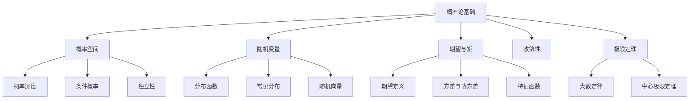

# 5.2 概率论基础

---

📌 **内容摘要**

本文档系统介绍概率论的基础理论和核心概念。内容涵盖概率论与测度论领域的主要知识点，包括测度论, 可测函数, 概率分布, 概率论, 随机变量等关键主题。适合具备相关基础的学习者进行深入研究。

**关键词**: 测度论, 可测函数, 概率分布, 概率论, 随机变量, 实分析, 概率论与测度论, Lebesgue积分

📚 **学习目标**

- 深入理解概率论的理论体系和形式化方法
- 能够进行相关定理的形式化证明
- 建立该领域的系统性知识框架

🎯 **难度级别**: 高级

⏱️ **预计阅读时间**: 15分钟

**前置知识**: 该领域的中级知识, 形式化方法基础, 微积分基础

---


> 形式化数学基础 | 概率论与测度论
>
> 交叉引用：[5.1 测度空间](./05.1_测度空间.md) | [4.1 实分析](../04_分析学/04.1_实分析.md)

## 5.2.1 引言

概率论以测度论为基础，研究随机现象的数学规律。本章形式化介绍概率空间、随机变量、期望和大数定律。



## 5.2.2 概率空间

### 5.2.2.1 概率测度

**定义 5.2.1**（概率空间）
**概率空间** 是测度空间 (Ω, F, P)，其中 P(Ω) = 1。

- **样本空间** Ω：所有可能结果的集合
- **事件域** F：可测集的σ-代数
- **概率测度** P：F → [0, 1]

**定理 5.2.1**（概率的基本性质）

1. P(∅) = 0，P(Ω) = 1
2. P(A^c) = 1 - P(A)
3. P(A ∪ B) = P(A) + P(B) - P(A ∩ B)
4. 若 A ⊂ B，则 P(A) ≤ P(B)

### 5.2.2.2 条件概率

**定义 5.2.2**（条件概率）
设 P(B) > 0，事件 A 在 B 发生条件下的 **条件概率**：
$$P(A|B) = \frac{P(A \cap B)}{P(B)}$$

**定理 5.2.2**（乘法公式）
$$P(A \cap B) = P(A|B)P(B) = P(B|A)P(A)$$

**定理 5.2.3**（全概率公式）
设 {Bₙ} 是 Ω 的分割（互不相交且并集为Ω），P(Bₙ) > 0，则：
$$P(A) = \sum_{n} P(A|B_n)P(B_n)$$

**定理 5.2.4**（Bayes公式）
$$P(B_k|A) = \frac{P(A|B_k)P(B_k)}{\sum_n P(A|B_n)P(B_n)}$$

### 5.2.2.3 独立性

**定义 5.2.3**（事件独立性）
事件 A, B **独立**，如果：
$$P(A \cap B) = P(A)P(B)$$

等价于 P(A|B) = P(A)（若 P(B) > 0）。

**定义 5.2.4**（事件族的独立性）
事件族 {Aᵢ}ᵢ∈ᴵ **相互独立**，如果对任意有限子集 J ⊂ I：
$$P\left(\bigcap_{i \in J} A_i\right) = \prod_{i \in J} P(A_i)$$

**定义 5.2.5**（σ-代数的独立性）
子σ-代数 F₁, ..., Fₙ **独立**，如果对任意 Aᵢ ∈ Fᵢ：
$$P\left(\bigcap_{i=1}^n A_i\right) = \prod_{i=1}^n P(A_i)$$

## 5.2.3 随机变量

### 5.2.3.1 随机变量的定义

**定义 5.2.6**（随机变量）
**随机变量** 是可测函数 X: (Ω, F) → (R, B(R))。

随机变量 X 生成的 σ-代数：σ(X) = {X⁻¹(B) | B ∈ B(R)}。

**定理 5.2.5**（随机变量的判定）
X 是随机变量当且仅当对任意 a ∈ R，{X ≤ a} ∈ F。

### 5.2.3.2 分布函数

**定义 5.2.7**（分布函数）
随机变量 X 的 **分布函数**（或累积分布函数CDF）：
$$F_X(x) = P(X \leq x), \quad x \in \mathbb{R}$$

**定理 5.2.6**（分布函数的性质）

1. F_X 单调不减
2. lim_{x→-∞} F_X(x) = 0，lim_{x→+∞} F_X(x) = 1
3. F_X 右连续：lim_{y↓x} F_X(y) = F_X(x)
4. P(a < X ≤ b) = F_X(b) - F_X(a)

**定义 5.2.8**（分布相同）
随机变量 X, Y **同分布**（记作 X =ᵈ Y），如果 F_X = F_Y。

### 5.2.3.3 离散型与连续型随机变量

**定义 5.2.9**（离散型随机变量）
X 是 **离散型**，如果取值可数，其 **概率质量函数**（PMF）：
$$p_X(x) = P(X = x)$$

**定义 5.2.10**（连续型随机变量）
X 是 **连续型**，如果存在 **概率密度函数**（PDF）f_X 使：
$$F_X(x) = \int_{-\infty}^x f_X(t) \, dt$$

此时 F_X 连续，且 f_X(x) = F'_X(x)（几乎处处）。

### 5.2.3.4 常见分布

**离散分布**：

- **Bernoulli(p)**：P(X=1)=p, P(X=0)=1-p
- **Binomial(n, p)**：P(X=k) = C(n,k) p^k (1-p)^{n-k}
- **Poisson(λ)**：P(X=k) = e^{-λ} λ^k / k!
- **Geometric(p)**：P(X=k) = (1-p)^{k-1}p

**连续分布**：

- **Uniform(a, b)**：f(x) = 1/(b-a)，x ∈ [a,b]
- **Normal(μ, σ²)**：f(x) = (1/√(2πσ²)) exp(-(x-μ)²/(2σ²))
- **Exponential(λ)**：f(x) = λe^{-λx}，x ≥ 0
- **Gamma(α, β)**：f(x) = (β^α/Γ(α)) x^{α-1}e^{-βx}

## 5.2.4 期望与矩

### 5.2.4.1 期望的定义

**定义 5.2.11**（期望）
随机变量 X 的 **期望**（或均值）：
$$E[X] = \int_\Omega X \, dP$$

要求上述积分存在（E|X| < ∞）。

**定理 5.2.7**（期望的计算）

- 离散型：E[X] = Σ x p_X(x)
- 连续型：E[X] = ∫ x f_X(x) dx
- 一般：E[X] = ∫_0^∞ P(X > t) dt - ∫_{-\infty}^0 P(X < t) dt

**定理 5.2.8**（期望的性质）

1. 线性性：E[aX + bY] = aE[X] + bE[Y]
2. 单调性：若 X ≤ Y a.s.，则 E[X] ≤ E[Y]
3. Jensen不等式：若 φ 凸，则 φ(E[X]) ≤ E[φ(X)]

### 5.2.4.2 方差与协方差

**定义 5.2.12**（方差）
$$\text{Var}(X) = E[(X - E[X])^2] = E[X^2] - (E[X])^2$$

**定义 5.2.13**（标准差）
$$\sigma_X = \sqrt{\text{Var}(X)}$$

**定义 5.2.14**（协方差）
$$\text{Cov}(X, Y) = E[(X - E[X])(Y - E[Y])] = E[XY] - E[X]E[Y]$$

**定理 5.2.9**（方差的性质）

1. Var(aX + b) = a²Var(X)
2. Var(X + Y) = Var(X) + Var(Y) + 2Cov(X, Y)
3. 若 X, Y 独立，则 Var(X + Y) = Var(X) + Var(Y)

**定义 5.2.15**（相关系数）
$$\rho(X, Y) = \frac{\text{Cov}(X, Y)}{\sigma_X \sigma_Y}, \quad |\rho| \leq 1$$

### 5.2.4.3 矩与特征函数

**定义 5.2.16**（矩）

- **k阶原点矩**：E[X^k]
- **k阶中心矩**：E[(X - E[X])^k]
- **k阶绝对矩**：E|X|^k

**定义 5.2.17**（特征函数）
X 的 **特征函数**：
$$\varphi_X(t) = E[e^{itX}], \quad t \in \mathbb{R}$$

**定理 5.2.10**（特征函数的性质）

1. φ_X(0) = 1，|φ_X(t)| ≤ 1
2. φ_X 一致连续
3. φ_{aX+b}(t) = e^{ibt}φ_X(at)
4. 若 X, Y 独立，则 φ_{X+Y} = φ_X φ_Y

**定理 5.2.11**（唯一性定理）
分布函数与特征函数一一对应。

## 5.2.5 随机向量

### 5.2.5.1 联合分布

**定义 5.2.18**（联合分布函数）
随机向量 (X, Y) 的 **联合分布函数**：
$$F_{X,Y}(x, y) = P(X \leq x, Y \leq y)$$

**定义 5.2.19**（边缘分布）
$$F_X(x) = \lim_{y \to \infty} F_{X,Y}(x, y) = F_{X,Y}(x, +\infty)$$

### 5.2.5.2 独立性

**定理 5.2.12**（随机变量独立的等价条件）
以下等价：

1. X, Y 独立（σ(X) 与 σ(Y) 独立）
2. F_{X,Y}(x, y) = F_X(x)F_Y(y)
3. （连续型）f_{X,Y}(x, y) = f_X(x)f_Y(y)
4. 对可测函数 g, h，E[g(X)h(Y)] = E[g(X)]E[h(Y)]

### 5.2.5.3 条件期望

**定义 5.2.20**（条件期望）
给定子σ-代数 G ⊂ F，E[X|G] 是满足以下条件的随机变量：

1. E[X|G] 是 G-可测的
2. 对任意 A ∈ G，∫_A E[X|G] dP = ∫_A X dP

**定理 5.2.13**（条件期望的性质）

1. E[E[X|G]] = E[X]
2. 若 X 是 G-可测，则 E[X|G] = X
3. 线性性：E[aX + bY|G] = aE[X|G] + bE[Y|G]
4. 塔性质：若 H ⊂ G，则 E[E[X|G]|H] = E[X|H]
5. 独立性：若 X 与 G 独立，则 E[X|G] = E[X]

## 5.2.6 收敛性

### 5.2.6.1 随机变量的收敛

**定义 5.2.21**（几乎必然收敛）
Xₙ → X **几乎必然**（a.s.），如果 P(lim Xₙ = X) = 1。

**定义 5.2.22**（依概率收敛）
Xₙ → X **依概率**，如果对任意 ε > 0：
$$\lim_{n \to \infty} P(|X_n - X| > \varepsilon) = 0$$

**定义 5.2.23**（L^p收敛）
Xₙ → X **在 L^p**（p ≥ 1），如果：
$$\lim_{n \to \infty} E|X_n - X|^p = 0$$

**定义 5.2.24**（依分布收敛）
Xₙ → X **依分布**，如果 F_{Xₙ}(x) → F_X(x) 在 F_X 的所有连续点。

### 5.2.6.2 收敛性的关系

**定理 5.2.14**

- a.s.收敛 ⇒ 依概率收敛
- L^p收敛 ⇒ 依概率收敛
- 依概率收敛 ⇒ 依分布收敛
- 依概率收敛 ⇒ 存在子列 a.s.收敛

## 5.2.7 极限定理

### 5.2.7.1 大数定律

**定理 5.2.15**（弱大数定律，WLLN）
设 {Xₙ} i.i.d.，E|X₁| < ∞，μ = E[X₁]，则：
$$\frac{S_n}{n} = \frac{X_1 + \cdots + X_n}{n} \xrightarrow{P} \mu$$

**定理 5.2.16**（强大数定律，SLLN）
设 {Xₙ} i.i.d.，E|X₁| < ∞，则：
$$\frac{S_n}{n} \xrightarrow{a.s.} \mu$$

**证明概要**（SLLN）：

1. 先证 E|X₁|⁴ < ∞ 的情形（用Borel-Cantelli引理）
2. 一般情形用截断方法
$\square$

### 5.2.7.2 中心极限定理

**定理 5.2.17**（Lindeberg-Lévy中心极限定理）
设 {Xₙ} i.i.d.，E[X₁] = μ，Var(X₁) = σ² < ∞，则：
$$\frac{S_n - n\mu}{\sigma\sqrt{n}} \xrightarrow{d} N(0, 1)$$

**证明概要**：
设 Yₙ = (Xₙ - μ)/σ，标准化后 E[Yₙ] = 0，Var(Yₙ) = 1。
特征函数：φ_{Sₙ/√n}(t) = φ_Y(t/√n)ⁿ
Taylor展开：φ_Y(t) = 1 - t²/2 + o(t²)
故 φ_{Sₙ/√n}(t) → e^{-t²/2} = φ_{N(0,1)}(t)
由连续性定理得证。
$\square$

## 5.2.8 Lean 4 形式化

```lean4
import Mathlib

-- 概率测度
#check ProbabilityMeasure Ω

-- 随机变量
#check Ω → ℝ  -- 可测函数

-- 期望
#check integral μ X

-- 方差
#check variance X μ

-- 独立随机变量
#check iIndepFun

-- 定理：期望的线性性
theorem expectation_linear {Ω : Type} {mΩ : MeasurableSpace Ω}
  {μ : Measure Ω} [IsProbabilityMeasure μ]
  (X Y : Ω → ℝ) (a b : ℝ) (hX : Integrable X μ) (hY : Integrable Y μ) :
  integral μ (fun ω => a * X ω + b * Y ω) = a * integral μ X + b * integral μ Y := by
  rw [integral_add]
  rw [integral_mul_left]
  rw [integral_mul_left]
  · exact Integrable.mul_const hX a
  · exact Integrable.mul_const hY b
```

## 5.2.9 参考文献

1. Durrett, R. (2019). Probability: Theory and Examples (5th ed.). Cambridge University Press.
2. Billingsley, P. (1995). Probability and Measure (3rd ed.). Wiley.
3. Williams, D. (1991). Probability with Martingales. Cambridge University Press.
4. Chung, K. L. (2001). A Course in Probability Theory (3rd ed.). Academic Press.
5. Shiryaev, A. N. (2016). Probability-1 (3rd ed.). Springer.

---

## 📚 延伸阅读

- [9.2.4 大数定律与中心极限定理](../../09_统计学/02_概率论基础/02.4_大数定律与中心极限定理.md)
- [4.1 实分析](../04_分析学/04.1_实分析.md)
- [5.2 概率论公理](../05_概率论与测度论/05.2_概率论公理.md)
- [5.1 测度空间](../05_概率论与测度论/05.1_测度空间.md)
- [5.1 测度论基础](../05_概率论与测度论/05.1_测度论基础.md)
