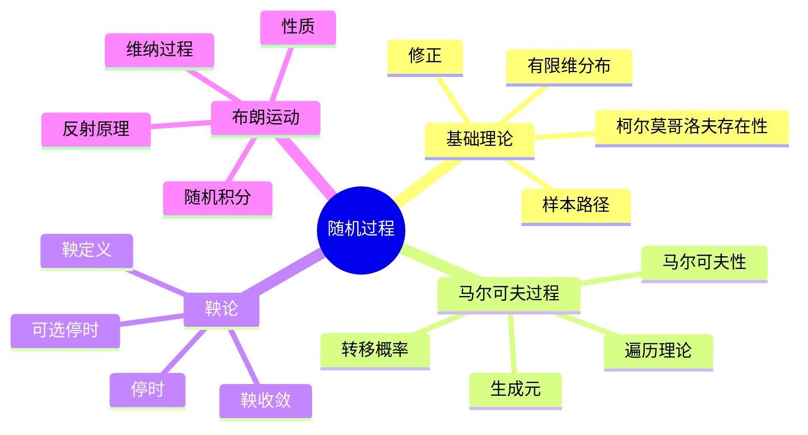
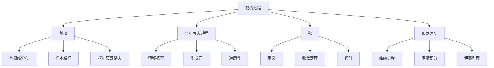

# 5.3 随机过程

---

📌 **内容摘要**

本文档深入探讨随机过程的核心原理和关键方法。内容涵盖概率论与测度论领域的主要知识点，包括鞅, 随机过程, Markov链等关键主题。适合具备相关基础的学习者进行深入研究。

**关键词**: 鞅, 概率论与测度论, 随机过程, Markov链

📚 **学习目标**

- 深入理解随机过程的理论体系和形式化方法
- 能够进行相关定理的形式化证明
- 建立该领域的系统性知识框架

🎯 **难度级别**: 高级

⏱️ **预计阅读时间**: 15分钟

**前置知识**: 该领域的中级知识, 形式化方法基础, 微积分基础

---


## 目录

- [5.3 随机过程](#53-随机过程)
  - [目录](#目录)
  - [5.3.1 引言](#531-引言)
  - [5.3.2 随机过程基础](#532-随机过程基础)
    - [5.3.2.1 定义](#5321-定义)
    - [5.3.2.2 柯尔莫哥洛夫存在性定理](#5322-柯尔莫哥洛夫存在性定理)
  - [5.3.3 马尔可夫过程](#533-马尔可夫过程)
    - [5.3.3.1 马尔可夫性](#5331-马尔可夫性)
    - [5.3.3.2 马尔可夫链](#5332-马尔可夫链)
    - [5.3.3.3 连续时间马尔可夫链](#5333-连续时间马尔可夫链)
  - [5.3.4 鞅论](#534-鞅论)
    - [5.3.4.1 鞅的定义](#5341-鞅的定义)
    - [5.3.4.2 鞅收敛定理](#5342-鞅收敛定理)
    - [5.3.4.3 可选停时定理](#5343-可选停时定理)
  - [5.3.5 布朗运动](#535-布朗运动)
    - [5.3.5.1 定义](#5351-定义)
    - [5.3.5.2 性质](#5352-性质)
  - [5.3.6 随机微积分](#536-随机微积分)
    - [5.3.6.1 伊藤积分](#5361-伊藤积分)
    - [5.3.6.2 伊藤引理](#5362-伊藤引理)
    - [5.3.6.3 随机微分方程](#5363-随机微分方程)
  - [5.3.7 多表征视角](#537-多表征视角)
    - [概念图谱](#概念图谱)
    - [过程类型比较](#过程类型比较)
  - [参见](#参见)
  - [📋 前置知识](#-前置知识)
  - [📚 延伸阅读](#-延伸阅读)

---

## 5.3.1 引言

随机过程(Stochastic Process)是随机变量族$\{X_t\}_{t \in T}$，描述随机现象随时间（或空间）的演化。
它在物理学、金融学、生物学和工程学中有广泛应用。

核心主题：

- 马尔可夫性（未来只依赖于现在）
- 鞅（公平博弈的数学模型）
- 布朗运动（随机游走的连续极限）
- 随机微积分（伊藤积分）



---

## 5.3.2 随机过程基础

### 5.3.2.1 定义

**随机过程(Stochastic Process)**：概率空间$(\Omega, \mathcal{F}, P)$上的一族随机变量$\{X_t\}_{t \in T}$，其中$T$是指标集（通常表示时间）。

**样本路径(Sample Path)**：固定$\omega$，映射$t \mapsto X_t(\omega)$。

**有限维分布**：对任意$t_1, \ldots, t_n \in T$，$(X_{t_1}, \ldots, X_{t_n})$的联合分布。

```lean
def StochasticProcess (Ω : Type*) [ProbabilitySpace Ω] (E : Type*)
  (T : Type*) : Type* := T → Ω → E
```

### 5.3.2.2 柯尔莫哥洛夫存在性定理

**定理 5.3.2.1 (柯尔莫哥洛夫)**：给定一族相容的有限维分布，存在随机过程以这些为有限维分布。

---

## 5.3.3 马尔可夫过程

### 5.3.3.1 马尔可夫性

**马尔可夫性(Markov Property)**：给定现在，未来与过去独立。

形式化：对$s < t$，
$$P(X_t \in B | \mathcal{F}_s) = P(X_t \in B | X_s)$$

或转移概率：$P(X_t \in B | X_s = x) = P(s, x; t, B)$

### 5.3.3.2 马尔可夫链

**马尔可夫链**：离散时间、离散状态的马尔可夫过程。

**转移矩阵**：$P = (p_{ij})$，$p_{ij} = P(X_{n+1} = j | X_n = i)$

**n步转移**：$P^{(n)} = P^n$

### 5.3.3.3 连续时间马尔可夫链

**转移半群**：$P_t(i, j) = P(X_t = j | X_0 = i)$

**生成元(Generator)**：$Q = \lim_{t \to 0} \frac{P_t - I}{t}$

满足Kolmogorov前向/后向方程。

---

## 5.3.4 鞅论

### 5.3.4.1 鞅的定义

**鞅(Martingale)**：适应过程$\{M_t\}$满足：

1. $E[|M_t|] < \infty$（可积）
2. $E[M_t | \mathcal{F}_s] = M_s$（对$s \leq t$）

**下鞅**：$E[M_t | \mathcal{F}_s] \geq M_s$

**上鞅**：$E[M_t | \mathcal{F}_s] \leq M_s$

```lean
def IsMartingale {Ω : Type*} [ProbabilitySpace Ω] {T : Type*}
  [Preorder T] (M : StochasticProcess Ω ℝ T) (F : Filtration T) : Prop :=
  Adapted M F ∧
  ∀ t, Integrable (M t) ∧
  ∀ s ≤ t, expectation (M t | F s) = M s
```

### 5.3.4.2 鞅收敛定理

**定理 5.3.4.1 (Doob鞅收敛定理)**：下鞅$\{M_n\}$满足$\sup_n E[M_n^+] < \infty$，则$M_n$几乎必然收敛。

### 5.3.4.3 可选停时定理

**停时(Stopping Time)**：$\tau: \Omega \to T \cup \{\infty\}$满足$\{\tau \leq t\} \in \mathcal{F}_t$对所有$t$。

**定理 5.3.4.2 (可选停时定理)**：在一定条件下，$E[M_\tau] = E[M_0]$。

---

## 5.3.5 布朗运动

### 5.3.5.1 定义

**布朗运动(Brownian Motion)/维纳过程(Wiener Process)**：$\{B_t\}_{t \geq 0}$满足：

1. $B_0 = 0$
2. 独立增量：$B_t - B_s$独立于$\mathcal{F}_s$（对$s < t$）
3. 平稳增量：$B_t - B_s \sim N(0, t-s)$
4. 连续样本路径

```lean
def IsBrownianMotion {Ω : Type*} [ProbabilitySpace Ω] (B : StochasticProcess Ω ℝ ℝ≥0)
  (F : Filtration ℝ≥0) : Prop :=
  B 0 = 0 ∧
  Continuous B ∧
  ∀ s t, s ≤ t → (B t - B s) = (GaussianDistribution 0 (t - s)) ∧
  Indep (B t - B s) (F s)
```

### 5.3.5.2 性质

**定理 5.3.5.1**：布朗运动具有：

- 自相似性：$\{c^{-1/2}B_{ct}\} \stackrel{d}{=} \{B_t\}$
- 马尔可夫性
- 鞅性
- 二次变差：$\langle B \rangle_t = t$

**定理 5.3.5.2 (反射原理)**：
$$P(\sup_{0 \leq s \leq t} B_s \geq a) = 2P(B_t \geq a)$$

---

## 5.3.6 随机微积分

### 5.3.6.1 伊藤积分

**伊藤积分(Ito Integral)**：对适应过程$H$，定义：
$$\int_0^t H_s \, dB_s = \lim_{|\Pi| \to 0} \sum_{i=1}^n H_{t_{i-1}}(B_{t_i} - B_{t_{i-1}})$$

**伊藤等距**：$E\left[\left(\int_0^t H_s \, dB_s\right)^2\right] = E\left[\int_0^t H_s^2 \, ds\right]$

### 5.3.6.2 伊藤引理

**定理 5.3.6.1 (伊藤引理)**：$f \in C^{2,1}$，$X_t$是伊藤过程，则：
$$df(t, X_t) = \frac{\partial f}{\partial t}dt + \frac{\partial f}{\partial x}dX_t + \frac{1}{2}\frac{\partial^2 f}{\partial x^2}d\langle X \rangle_t$$

这是随机微积分的链式法则，多了二阶项（伊藤修正）。

### 5.3.6.3 随机微分方程

**SDE(随机微分方程)**：
$$dX_t = \mu(t, X_t)dt + \sigma(t, X_t)dB_t$$

或积分形式：
$$X_t = X_0 + \int_0^t \mu(s, X_s)ds + \int_0^t \sigma(s, X_s)dB_s$$

**几何布朗运动(GBM)**：$dS_t = \mu S_t dt + \sigma S_t dB_t$，解为$S_t = S_0 \exp\left((\mu - \frac{\sigma^2}{2})t + \sigma B_t\right)$

---

## 5.3.7 多表征视角

### 概念图谱



### 过程类型比较

| 特性 | 马尔可夫链 | 鞅 | 布朗运动 |
|------|-----------|-----|---------|
| 状态空间 | 离散 | 连续 | 连续 |
| 时间 | 离散/连续 | 离散/连续 | 连续 |
| 关键性质 | 无记忆性 | 公平博弈 | 正态增量 |
| 主要工具 | 转移矩阵 | 条件期望 | 随机积分 |

---

## 参见

- [概率论公理](./05.2_概率论公理.md) — 概率论基础
- [实分析](../04_分析学/04.1_实分析.md) — 条件期望与收敛
- [泛函分析](../04_分析学/04.3_泛函分析.md) — 算子半群
- [微分方程](../04_分析学/04.1_实分析.md) — 确定性对应

---

## 📋 前置知识

- [5.2 概率论公理](../05_概率论与测度论/05.2_概率论公理.md)

---

## 📚 延伸阅读

- [4.1 实分析](../04_分析学/04.1_实分析.md)
- [11.11 分形与幂律](../../11_系统科学/03_复杂系统/03.3_分形与幂律.md)
- [5.2 概率论公理](../05_概率论与测度论/05.2_概率论公理.md)
- [5.2 概率论基础](../05_概率论与测度论/05.2_概率论基础.md)
- [9.2.2 随机变量](../../09_统计学/02_概率论基础/02.2_随机变量.md)
