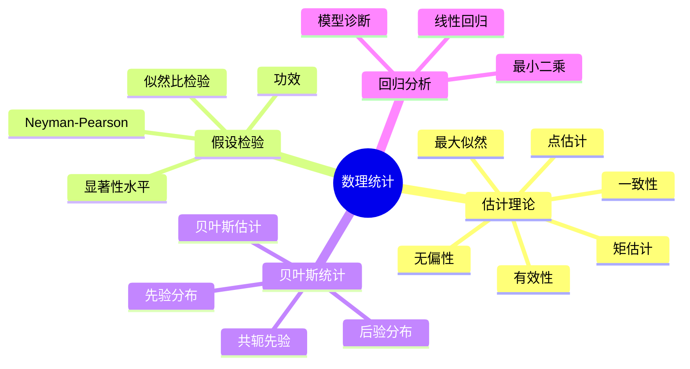
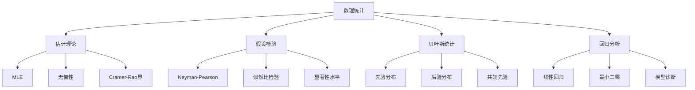

# 5.4 数理统计

---

📌 **内容摘要**

本文档深入探讨数理统计的核心原理和关键方法。内容涵盖概率论与测度论领域的主要知识点，包括贝叶斯统计, 后验, 先验等关键主题。适合具备相关基础的学习者进行深入研究。

**关键词**: 贝叶斯统计, 后验, 概率论与测度论, 先验

📚 **学习目标**

- 深入理解数理统计的理论体系和形式化方法
- 能够进行相关定理的形式化证明
- 建立该领域的系统性知识框架

🎯 **难度级别**: 高级

⏱️ **预计阅读时间**: 15分钟

**前置知识**: 该领域的中级知识, 形式化方法基础, 微积分基础

---

## 目录

- [5.4 数理统计](#54-数理统计)
  - [目录](#目录)
  - [5.4.1 引言](#541-引言)
  - [5.4.2 估计理论](#542-估计理论)
    - [5.4.2.1 点估计](#5421-点估计)
    - [5.4.2.2 优良性准则](#5422-优良性准则)
    - [5.4.2.3 最大似然估计](#5423-最大似然估计)
    - [5.4.2.4 Cramer-Rao下界](#5424-cramer-rao下界)
  - [5.4.3 假设检验](#543-假设检验)
    - [5.4.3.1 Neyman-Pearson框架](#5431-neyman-pearson框架)
    - [5.4.3.2 似然比检验](#5432-似然比检验)
  - [5.4.4 贝叶斯统计](#544-贝叶斯统计)
    - [5.4.4.1 贝叶斯公式](#5441-贝叶斯公式)
    - [5.4.4.2 共轭先验](#5442-共轭先验)
    - [5.4.4.3 贝叶斯估计](#5443-贝叶斯估计)
  - [5.4.5 回归分析](#545-回归分析)
    - [5.4.5.1 线性回归模型](#5451-线性回归模型)
    - [5.4.5.2 最小二乘估计](#5452-最小二乘估计)
    - [5.4.5.3 模型诊断](#5453-模型诊断)
  - [5.4.6 多表征视角](#546-多表征视角)
    - [概念图谱](#概念图谱)
    - [频率派vs贝叶斯派](#频率派vs贝叶斯派)
  - [参见](#参见)
  - [📚 延伸阅读](#-延伸阅读)

---

## 5.4.1 引言

数理统计(Mathematical Statistics)研究如何从数据中提取信息、做出推断和决策。
它建立在概率论基础上，提供了一套严格的统计推断方法。

核心问题：

- 参数估计：从样本推断总体参数
- 假设检验：判断统计假设的真伪
- 贝叶斯推断：结合先验与数据进行推断
- 回归分析：变量间关系的建模

---

## 5.4.2 估计理论

### 5.4.2.1 点估计

**统计模型**：$\{P_\theta\}_{\theta \in \Theta}$，样本$X_1, \ldots, X_n \sim P_\theta$

**估计量(Estimator)**：$\hat{\theta} = T(X_1, \ldots, X_n)$

### 5.4.2.2 优良性准则

| 准则 | 定义 | 说明 |
|------|------|------|
| **无偏性** | $E[\hat{\theta}] = \theta$ | 期望等于真值 |
| **有效性** | $\text{Var}(\hat{\theta})$最小 | 方差最小 |
| **一致性** | $\hat{\theta}_n \xrightarrow{P} \theta$ | 大样本收敛 |
| **充分性** | 包含样本中所有信息 | 因子分解定理 |

### 5.4.2.3 最大似然估计

**似然函数**：$L(\theta | x) = f(x | \theta) = \prod_{i=1}^n f(x_i | \theta)$

**对数似然**：$\ell(\theta) = \log L(\theta | x) = \sum_{i=1}^n \log f(x_i | \theta)$

**MLE**：$\hat{\theta}_{MLE} = \arg\max_\theta L(\theta | x)$

**定理 5.4.2.1 (MLE的渐近性质)**：在正则条件下，
$$\sqrt{n}(\hat{\theta}_{MLE} - \theta) \xrightarrow{d} N(0, I^{-1}(\theta))$$

其中$I(\theta) = E\left[-\frac{\partial^2 \ell}{\partial \theta^2}\right]$是Fisher信息。

### 5.4.2.4 Cramer-Rao下界

**定理 5.4.2.2 (Cramer-Rao不等式)**：对无偏估计量$\hat{\theta}$，
$$\text{Var}(\hat{\theta}) \geq \frac{1}{I_n(\theta)}$$

达到下界的估计量称为有效估计量。

---

## 5.4.3 假设检验

### 5.4.3.1 Neyman-Pearson框架

**假设**：

- $H_0: \theta \in \Theta_0$（原假设）
- $H_1: \theta \in \Theta_1$（备择假设）

**检验函数**：$\phi(x) = P(\text{拒绝}H_0 | x)$

| 错误类型 | 定义 | 概率 |
|----------|------|------|
| I型错误 | 拒绝真$H_0$ | $\alpha = P(\text{拒绝}H_0 | H_0\text{真})$ |
| II型错误 | 接受假$H_0$ | $\beta = P(\text{接受}H_0 | H_1\text{真})$ |

**功效(Power)**：$1 - \beta = P(\text{拒绝}H_0 | H_1\text{真})$

### 5.4.3.2 似然比检验

**似然比统计量**：
$$\Lambda(x) = \frac{\sup_{\theta \in \Theta_0} L(\theta | x)}{\sup_{\theta \in \Theta} L(\theta | x)}$$

拒绝域：$\Lambda(x) < c$，其中$c$由显著性水平$\alpha$确定。

---

## 5.4.4 贝叶斯统计

### 5.4.4.1 贝叶斯公式

**先验分布**：$\pi(\theta)$，对参数的初始信念

**似然**：$f(x | \theta)$

**后验分布**：
$$\pi(\theta | x) = \frac{f(x | \theta)\pi(\theta)}{\int f(x | \theta)\pi(\theta)d\theta} = \frac{f(x | \theta)\pi(\theta)}{m(x)}$$

### 5.4.4.2 共轭先验

| 似然 | 共轭先验 | 后验 |
|------|---------|------|
| 二项 Binomial | Beta | Beta |
| 泊松 Poisson | Gamma | Gamma |
| 正态(已知方差) | Normal | Normal |
| 正态(已知均值) | Inverse-Gamma | Inverse-Gamma |

### 5.4.4.3 贝叶斯估计

**后验均值**：$\hat{\theta}_{Bayes} = E[\theta | X]$

**最大后验(MAP)**：$\hat{\theta}_{MAP} = \arg\max_\theta \pi(\theta | x)$

---

## 5.4.5 回归分析

### 5.4.5.1 线性回归模型

**模型**：$Y = X\beta + \varepsilon$

其中：

- $Y$: $n \times 1$响应变量
- $X$: $n \times p$设计矩阵
- $\beta$: $p \times 1$未知参数
- $\varepsilon$: $n \times 1$误差，$E[\varepsilon] = 0$，$\text{Cov}(\varepsilon) = \sigma^2 I$

### 5.4.5.2 最小二乘估计

**目标**：$\min_\beta \|Y - X\beta\|^2 = \min_\beta (Y - X\beta)^T(Y - X\beta)$

**正规方程**：$X^TX\beta = X^TY$

**OLS估计量**：$\hat{\beta} = (X^TX)^{-1}X^TY$（若$X^TX$可逆）

**性质**：

- 无偏：$E[\hat{\beta}] = \beta$
- Gauss-Markov：在BLUE（最佳线性无偏估计）类中方差最小

### 5.4.5.3 模型诊断

| 诊断 | 目的 |
|------|------|
| $R^2$ | 拟合优度 |
| 残差分析 | 模型假设检验 |
| 影响点 | 异常值检测 |
| 多重共线性 | $X$列相关性 |

---

## 5.4.6 多表征视角

### 概念图谱

### 频率派vs贝叶斯派

| 方面 | 频率派 | 贝叶斯派 |
|------|--------|---------|
| 参数 | 固定未知 | 随机变量 |
| 概率解释 | 长期频率 | 信念程度 |
| 推断基础 | 抽样分布 | 后验分布 |
| 先验 | 不使用 | 核心要素 |
| 计算 | 通常较简单 | MCMC等复杂方法 |

---

## 参见

- [概率论公理](./05.2_概率论公理.md) — 统计推断的概率基础
- [随机过程](./05.3_随机过程.md) — 时序分析基础
- [线性代数](../02_代数学/02.2_线性代数.md) — 回归的矩阵形式
- [泛函分析](../04_分析学/04.3_泛函分析.md) — 估计量的渐近理论

---

## 📚 延伸阅读

- [9.4.3 贝叶斯推断](../../09_统计学/04_贝叶斯统计/04.3_贝叶斯推断.md)
- [5.2 概率论公理](../05_概率论与测度论/05.2_概率论公理.md)
- [5.2 概率论基础](../05_概率论与测度论/05.2_概率论基础.md)
- [9.5.4 渐近理论](../../09_统计学/05_数理统计/05.4_渐近理论.md)
- [5.3 随机过程](../05_概率论与测度论/05.3_随机过程.md)
