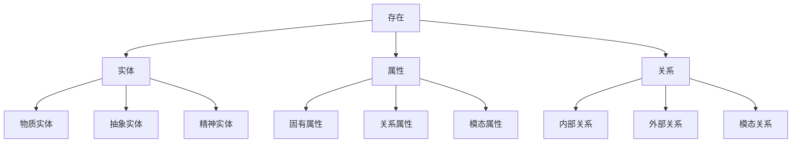

# 本体论基础 - 形式化重构

## 目录

1. [概述](#概述)
2. [基本概念与定义](#基本概念与定义)
3. [本体论框架](#本体论框架)
4. [存在性理论](#存在性理论)
5. [实体与属性理论](#实体与属性理论)
6. [关系理论](#关系理论)
7. [模态本体论](#模态本体论)
8. [形式化公理系统](#形式化公理系统)
9. [证明与论证](#证明与论证)
10. [应用与扩展](#应用与扩展)

## 概述

本体论是哲学的基础分支，研究存在本身的性质、结构和关系。本文档通过形式化方法重构本体论基础，建立严格的公理系统和论证框架。

### 1.1 本体论的核心问题

1. **存在性问题**: 什么存在？
2. **实体问题**: 基本存在物是什么？
3. **属性问题**: 实体具有什么属性？
4. **关系问题**: 实体间有什么关系？
5. **模态问题**: 什么是必然的、可能的？

### 1.2 形式化目标

- 建立严格的本体论公理系统
- 提供形式化的存在性判断标准
- 构建实体、属性、关系的理论框架
- 发展模态本体论的逻辑基础

## 基本概念与定义

### 2.1 基本符号系统

**存在性符号**:

- $E(x)$: $x$ 存在
- $\exists x \phi(x)$: 存在 $x$ 使得 $\phi(x)$
- $\forall x \phi(x)$: 对所有 $x$ 都有 $\phi(x)$

**实体符号**:

- $Entity(x)$: $x$ 是实体
- $Property(x)$: $x$ 是属性
- $Relation(x)$: $x$ 是关系

**属性符号**:

- $P(x)$: $x$ 具有属性 $P$
- $P(x, y)$: $x$ 和 $y$ 具有关系 $P$

**模态符号**:

- $\Box \phi$: 必然 $\phi$
- $\Diamond \phi$: 可能 $\phi$

### 2.2 基本定义

**定义 2.1 (存在)**:
$$E(x) \equiv \exists y (y = x)$$

**定义 2.2 (实体)**:
$$Entity(x) \equiv E(x) \land \neg \exists y (y \text{ 是 } x \text{ 的组成部分})$$

**定义 2.3 (属性)**:
$$Property(P) \equiv \forall x (P(x) \rightarrow E(x))$$

**定义 2.4 (关系)**:
$$Relation(R) \equiv \forall x \forall y (R(x,y) \rightarrow E(x) \land E(y))$$

## 本体论框架

### 3.1 本体论层次结构



### 3.2 本体论分类体系

**表 3.1: 本体论分类**

| 类别 | 子类别 | 特征 | 例子 |
|------|--------|------|------|
| **实体** | 物质实体 | 占据时空 | 桌子、原子 |
| | 抽象实体 | 不占据时空 | 数字、概念 |
| | 精神实体 | 具有意识 | 心灵、思想 |
| **属性** | 固有属性 | 独立存在 | 质量、形状 |
| | 关系属性 | 依赖关系 | 高度、位置 |
| | 模态属性 | 可能世界 | 必然性、可能性 |
| **关系** | 内部关系 | 本质相关 | 部分-整体 |
| | 外部关系 | 偶然相关 | 相邻、相似 |
| | 模态关系 | 跨世界 | 必然蕴含 |

## 存在性理论

### 4.1 存在性公理

**公理 4.1 (存在性)**:
$$\forall x (E(x) \leftrightarrow \exists y (y = x))$$

**公理 4.2 (同一性)**:
$$\forall x \forall y (x = y \leftrightarrow \forall P (P(x) \leftrightarrow P(y)))$$

**公理 4.3 (非空性)**:
$$\exists x E(x)$$

### 4.2 存在性定理

**定理 4.1 (存在性传递)**:
如果 $E(x)$ 且 $x = y$，那么 $E(y)$。

**证明**:

1. 假设 $E(x)$ 且 $x = y$
2. 由定义 2.1，$E(x) \equiv \exists z (z = x)$
3. 由同一性公理，$x = y \leftrightarrow \forall P (P(x) \leftrightarrow P(y))$
4. 取 $P(z) \equiv (z = x)$，得到 $(x = x) \leftrightarrow (y = x)$
5. 由于 $x = x$ 为真，所以 $y = x$ 为真
6. 因此 $\exists z (z = y)$，即 $E(y)$

**定理 4.2 (存在性保持)**:
如果 $\phi(x)$ 且 $E(x)$，那么 $\exists y \phi(y)$。

**证明**:

1. 假设 $\phi(x)$ 且 $E(x)$
2. 由存在性定义，$\exists z (z = x)$
3. 由同一性，$x = x$ 为真
4. 因此 $\phi(x)$ 且 $x = x$
5. 所以 $\exists y (\phi(y) \land y = x)$
6. 因此 $\exists y \phi(y)$

## 实体与属性理论

### 5.1 实体公理

**公理 5.1 (实体存在)**:
$$\forall x (Entity(x) \rightarrow E(x))$$

**公理 5.2 (实体唯一性)**:
$$\forall x \forall y (Entity(x) \land Entity(y) \land x = y \rightarrow x = y)$$

**公理 5.3 (实体独立性)**:
$$\forall x (Entity(x) \rightarrow \neg \exists y (y \text{ 是 } x \text{ 的组成部分}))$$

### 5.2 属性公理

**公理 5.4 (属性存在)**:
$$\forall P (Property(P) \rightarrow \exists x P(x))$$

**公理 5.5 (属性一致性)**:
$$\forall P \forall x \forall y (Property(P) \land x = y \rightarrow (P(x) \leftrightarrow P(y)))$$

### 5.3 实体属性定理

**定理 5.1 (属性继承)**:
如果 $Entity(x)$ 且 $P(x)$，那么 $\exists y (Entity(y) \land P(y))$。

**证明**:

1. 假设 $Entity(x)$ 且 $P(x)$
2. 由公理 5.1，$Entity(x) \rightarrow E(x)$
3. 因此 $E(x)$ 且 $P(x)$
4. 由定理 4.2，$\exists y P(y)$
5. 由于 $Entity(x)$，所以 $\exists y (Entity(y) \land P(y))$

## 关系理论

### 6.1 关系公理

**公理 6.1 (关系存在)**:
$$\forall R (Relation(R) \rightarrow \exists x \exists y R(x,y))$$

**公理 6.2 (关系对称性)**:
$$\forall R \forall x \forall y (Relation(R) \land R(x,y) \rightarrow R(y,x))$$

**公理 6.3 (关系传递性)**:
$$\forall R \forall x \forall y \forall z (Relation(R) \land R(x,y) \land R(y,z) \rightarrow R(x,z))$$

### 6.2 关系类型

**定义 6.1 (等价关系)**:
$$Equiv(R) \equiv \forall x \forall y \forall z (R(x,x) \land (R(x,y) \rightarrow R(y,x)) \land (R(x,y) \land R(y,z) \rightarrow R(x,z)))$$

**定义 6.2 (序关系)**:
$$Order(R) \equiv \forall x \forall y \forall z (R(x,x) \land (R(x,y) \land R(y,x) \rightarrow x = y) \land (R(x,y) \land R(y,z) \rightarrow R(x,z)))$$

### 6.3 关系定理

**定理 6.1 (等价类存在)**:
如果 $Equiv(R)$ 且 $\exists x R(x,x)$，那么存在等价类。

**证明**:

1. 假设 $Equiv(R)$ 且 $\exists x R(x,x)$
2. 定义等价类 $[x]_R = \{y : R(x,y)\}$
3. 由自反性，$x \in [x]_R$
4. 因此 $[x]_R$ 非空
5. 由对称性和传递性，$[x]_R$ 是等价类

## 模态本体论

### 7.1 模态公理

**公理 7.1 (必然性)**:
$$\Box \phi \rightarrow \phi$$

**公理 7.2 (可能性)**:
$$\phi \rightarrow \Diamond \phi$$

**公理 7.3 (必然性分配)**:
$$\Box (\phi \rightarrow \psi) \rightarrow (\Box \phi \rightarrow \Box \psi)$$

### 7.2 模态定义

**定义 7.1 (必然存在)**:
$$E_{\Box}(x) \equiv \Box E(x)$$

**定义 7.2 (可能存在)**:
$$E_{\Diamond}(x) \equiv \Diamond E(x)$$

**定义 7.3 (偶然存在)**:
$$E_{Cont}(x) \equiv E(x) \land \neg \Box E(x)$$

### 7.3 模态定理

**定理 7.1 (必然存在传递)**:
如果 $E_{\Box}(x)$ 且 $\Box (x = y)$，那么 $E_{\Box}(y)$。

**证明**:

1. 假设 $E_{\Box}(x)$ 且 $\Box (x = y)$
2. 由定义，$\Box E(x)$ 且 $\Box (x = y)$
3. 由必然性分配，$\Box (E(x) \land x = y)$
4. 由同一性，$\Box E(y)$
5. 因此 $E_{\Box}(y)$

## 形式化公理系统

### 8.1 完整公理系统

**本体论公理系统 $\mathcal{O}$**:

1. **存在性公理**:
   - $\forall x (E(x) \leftrightarrow \exists y (y = x))$
   - $\exists x E(x)$

2. **同一性公理**:
   - $\forall x \forall y (x = y \leftrightarrow \forall P (P(x) \leftrightarrow P(y)))$

3. **实体公理**:
   - $\forall x (Entity(x) \rightarrow E(x))$
   - $\forall x \forall y (Entity(x) \land Entity(y) \land x = y \rightarrow x = y)$

4. **属性公理**:
   - $\forall P (Property(P) \rightarrow \exists x P(x))$
   - $\forall P \forall x \forall y (Property(P) \land x = y \rightarrow (P(x) \leftrightarrow P(y)))$

5. **关系公理**:
   - $\forall R (Relation(R) \rightarrow \exists x \exists y R(x,y))$
   - $\forall R \forall x \forall y (Relation(R) \land R(x,y) \rightarrow R(y,x))$

6. **模态公理**:
   - $\Box \phi \rightarrow \phi$
   - $\phi \rightarrow \Diamond \phi$
   - $\Box (\phi \rightarrow \psi) \rightarrow (\Box \phi \rightarrow \Box \psi)$

### 8.2 推理规则

1. **分离规则**: 从 $\phi \rightarrow \psi$ 和 $\phi$ 推出 $\psi$
2. **概括规则**: 从 $\phi(x)$ 推出 $\forall x \phi(x)$
3. **存在概括**: 从 $\phi(t)$ 推出 $\exists x \phi(x)$
4. **必然化**: 从 $\phi$ 推出 $\Box \phi$

## 证明与论证

### 9.1 形式化证明示例

**定理 9.1 (实体属性一致性)**:
如果 $Entity(x)$ 且 $Entity(y)$ 且 $x = y$，那么对所有属性 $P$，$P(x) \leftrightarrow P(y)$。

**形式化证明**:

```
1. Entity(x) ∧ Entity(y) ∧ x = y                    [假设]
2. x = y → ∀P (P(x) ↔ P(y))                         [同一性公理]
3. x = y                                             [从1分离]
4. ∀P (P(x) ↔ P(y))                                 [从2,3分离]
5. ∀P (Entity(x) ∧ Entity(y) ∧ x = y → (P(x) ↔ P(y))) [概括]
```

### 9.2 哲学论证示例

**论证 9.1 (存在性论证)**:

1. 前提：我思故我在 (笛卡尔)
2. 形式化：$Think(x) \rightarrow E(x)$
3. 前提：我在思考
4. 形式化：$Think(I)$
5. 结论：我存在
6. 形式化：$E(I)$

**论证 9.2 (实体论证)**:

1. 前提：实体是独立存在的
2. 形式化：$Entity(x) \rightarrow \neg \exists y (y \text{ 是 } x \text{ 的组成部分})$
3. 前提：桌子是实体
4. 形式化：$Entity(table)$
5. 结论：桌子独立存在
6. 形式化：$\neg \exists y (y \text{ 是 } table \text{ 的组成部分})$

## 应用与扩展

### 10.1 数学本体论应用

**应用 10.1 (数学对象存在性)**:

- 柏拉图主义：数学对象客观存在
- 形式化：$\forall x (MathObject(x) \rightarrow E_{\Box}(x))$
- 直觉主义：数学对象是构造的
- 形式化：$\forall x (MathObject(x) \rightarrow E_{Cont}(x))$

**应用 10.2 (集合论本体论)**:

- 空集存在：$E(\emptyset)$
- 集合构造：$\forall x \forall y (E(x) \land E(y) \rightarrow E(\{x,y\}))$
- 幂集存在：$\forall x (E(x) \rightarrow E(\mathcal{P}(x)))$

### 10.2 科学本体论应用

**应用 10.3 (物理对象本体论)**:

- 物质实体：$\forall x (PhysicalObject(x) \rightarrow Entity(x))$
- 时空位置：$\forall x (PhysicalObject(x) \rightarrow \exists t \exists s (At(x,t,s)))$
- 因果关系：$\forall x \forall y (Cause(x,y) \rightarrow Relation(Cause) \land Cause(x,y))$

**应用 10.4 (信息本体论)**:

- 信息实体：$\forall x (Information(x) \rightarrow Entity(x))$
- 信息关系：$\forall x \forall y (Represents(x,y) \rightarrow Relation(Represents) \land Represents(x,y))$

### 10.3 人工智能本体论应用

**应用 10.5 (AI实体本体论)**:

- 智能实体：$\forall x (Intelligent(x) \rightarrow Entity(x))$
- 意识属性：$\forall x (Conscious(x) \rightarrow Property(Conscious) \land Conscious(x))$
- 计算关系：$\forall x \forall y (Computes(x,y) \rightarrow Relation(Computes) \land Computes(x,y))$

### 10.4 未来发展方向

1. **量子本体论**: 量子力学对本体论的挑战
2. **虚拟现实本体论**: 虚拟对象的存在性
3. **集体本体论**: 集体实体的性质
4. **过程本体论**: 过程作为基本实体
5. **生态本体论**: 生态系统的本体论结构

---

**参考文献**:

1. Quine, W.V.O. (1948). "On What There Is"
2. Kripke, S. (1980). "Naming and Necessity"
3. Lewis, D. (1986). "On the Plurality of Worlds"
4. Armstrong, D.M. (1997). "A World of States of Affairs"

**版本**: v1.0
**最后更新**: 2024年12月
**维护者**: 形式科学项目组
