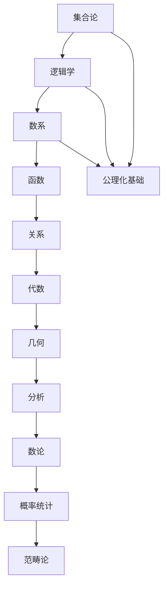

# 数学基础理论

## 📚 **目录结构**

```
02_Mathematical_Foundation/
├── README.md                           # 当前文件 - 总览
├── 01_Set_Theory/                      # 集合论
│   ├── README.md                       # 集合论总览
│   ├── 01_Naive_Set_Theory/            # 朴素集合论
│   │   ├── 01_Set_Basics.md            # 集合基础
│   │   ├── 02_Set_Operations.md        # 集合运算
│   │   └── 03_Set_Relations.md         # 集合关系
│   ├── 02_Axiomatic_Set_Theory/        # 公理化集合论
│   │   ├── 01_ZFC_Axioms.md            # ZFC公理系统
│   │   ├── 02_Ordinals.md              # 序数理论
│   │   └── 03_Cardinals.md             # 基数理论
│   └── 03_Set_Theory_Applications/     # 集合论应用
│       ├── 01_Relations.md             # 关系理论
│       ├── 02_Functions.md             # 函数理论
│       └── 03_Equivalence.md           # 等价关系
├── 02_Logic/                           # 逻辑学
│   ├── README.md                       # 逻辑学总览
│   ├── 01_Propositional_Logic/         # 命题逻辑
│   │   ├── 01_Propositions.md          # 命题基础
│   │   ├── 02_Logical_Connectives.md   # 逻辑联结词
│   │   └── 03_Truth_Tables.md          # 真值表
│   ├── 02_Predicate_Logic/             # 谓词逻辑
│   │   ├── 01_Predicates.md            # 谓词基础
│   │   ├── 02_Quantifiers.md           # 量词理论
│   │   └── 03_First_Order_Logic.md     # 一阶逻辑
│   └── 03_Proof_Theory/                # 证明理论
│       ├── 01_Natural_Deduction.md     # 自然演绎
│       ├── 02_Sequent_Calculus.md      # 相继式演算
│       └── 03_Proof_Strategies.md      # 证明策略
├── 03_Number_Systems/                  # 数系
│   ├── README.md                       # 数系总览
│   ├── 01_Natural_Numbers/             # 自然数
│   │   ├── 01_Peano_Axioms.md          # 皮亚诺公理
│   │   ├── 02_Induction.md             # 数学归纳法
│   │   └── 03_Arithmetic.md            # 算术运算
│   ├── 02_Integers/                    # 整数
│   │   ├── 01_Integer_Construction.md  # 整数构造
│   │   ├── 02_Integer_Operations.md    # 整数运算
│   │   └── 03_Integer_Properties.md    # 整数性质
│   ├── 03_Rational_Numbers/            # 有理数
│   │   ├── 01_Rational_Construction.md # 有理数构造
│   │   ├── 02_Rational_Operations.md   # 有理数运算
│   │   └── 03_Rational_Properties.md   # 有理数性质
│   ├── 04_Real_Numbers/                # 实数
│   │   ├── 01_Real_Construction.md     # 实数构造
│   │   ├── 02_Real_Properties.md       # 实数性质
│   │   └── 03_Completeness.md          # 完备性
│   └── 05_Complex_Numbers/             # 复数
│       ├── 01_Complex_Construction.md  # 复数构造
│       ├── 02_Complex_Operations.md    # 复数运算
│       └── 03_Complex_Properties.md    # 复数性质
├── 04_Functions/                       # 函数
│   ├── README.md                       # 函数总览
│   ├── 01_Function_Basics/             # 函数基础
│   │   ├── 01_Function_Definition.md   # 函数定义
│   │   ├── 02_Function_Types.md        # 函数类型
│   │   └── 03_Function_Properties.md   # 函数性质
│   ├── 02_Function_Operations/         # 函数运算
│   │   ├── 01_Composition.md           # 函数复合
│   │   ├── 02_Inverse.md               # 反函数
│   │   └── 03_Transformation.md        # 函数变换
│   └── 03_Special_Functions/           # 特殊函数
│       ├── 01_Polynomials.md           # 多项式
│       ├── 02_Exponential.md           # 指数函数
│       └── 03_Trigonometric.md         # 三角函数
├── 05_Relations/                       # 关系
│   ├── README.md                       # 关系总览
│   ├── 01_Relation_Basics/             # 关系基础
│   │   ├── 01_Relation_Definition.md   # 关系定义
│   │   ├── 02_Relation_Types.md        # 关系类型
│   │   └── 03_Relation_Properties.md   # 关系性质
│   ├── 02_Equivalence_Relations/       # 等价关系
│   │   ├── 01_Equivalence_Definition.md # 等价关系定义
│   │   ├── 02_Equivalence_Classes.md   # 等价类
│   │   └── 03_Quotient_Sets.md         # 商集
│   └── 03_Order_Relations/             # 序关系
│       ├── 01_Partial_Orders.md        # 偏序
│       ├── 02_Total_Orders.md          # 全序
│       └── 03_Well_Orders.md           # 良序
├── 06_Algebra/                         # 代数
│   ├── README.md                       # 代数总览
│   ├── 01_Group_Theory/                # 群论
│   │   ├── 01_Groups.md                # 群基础
│   │   ├── 02_Subgroups.md             # 子群
│   │   └── 03_Group_Homomorphisms.md   # 群同态
│   ├── 02_Ring_Theory/                 # 环论
│   │   ├── 01_Rings.md                 # 环基础
│   │   ├── 02_Ideals.md                # 理想
│   │   └── 03_Ring_Homomorphisms.md    # 环同态
│   └── 03_Field_Theory/                # 域论
│       ├── 01_Fields.md                # 域基础
│       ├── 02_Field_Extensions.md      # 域扩张
│       └── 03_Finite_Fields.md         # 有限域
├── 07_Geometry/                        # 几何
│   ├── README.md                       # 几何总览
│   ├── 01_Euclidean_Geometry/          # 欧氏几何
│   │   ├── 01_Points_Lines_Planes.md   # 点线面
│   │   ├── 02_Angles.md                # 角
│   │   └── 03_Circles.md               # 圆
│   ├── 02_Topology/                    # 拓扑学
│   │   ├── 01_Topological_Spaces.md    # 拓扑空间
│   │   ├── 02_Continuity.md            # 连续性
│   │   └── 03_Connectedness.md         # 连通性
│   └── 03_Differential_Geometry/       # 微分几何
│       ├── 01_Manifolds.md             # 流形
│       ├── 02_Tangent_Spaces.md        # 切空间
│       └── 03_Curvature.md             # 曲率
├── 08_Analysis/                        # 分析
│   ├── README.md                       # 分析总览
│   ├── 01_Real_Analysis/               # 实分析
│   │   ├── 01_Limits.md                # 极限
│   │   ├── 02_Continuity.md            # 连续性
│   │   └── 03_Differentiation.md       # 微分
│   ├── 02_Complex_Analysis/            # 复分析
│   │   ├── 01_Complex_Functions.md     # 复函数
│   │   ├── 02_Analytic_Functions.md    # 解析函数
│   │   └── 03_Residues.md              # 留数
│   └── 03_Functional_Analysis/         # 泛函分析
│       ├── 01_Normed_Spaces.md         # 赋范空间
│       ├── 02_Hilbert_Spaces.md        # 希尔伯特空间
│       └── 03_Operators.md             # 算子
├── 09_Number_Theory/                   # 数论
│   ├── README.md                       # 数论总览
│   ├── 01_Elementary_Number_Theory/    # 初等数论
│   │   ├── 01_Divisibility.md          # 整除性
│   │   ├── 02_Primes.md                # 素数
│   │   └── 03_Congruences.md           # 同余
│   ├── 02_Algebraic_Number_Theory/     # 代数数论
│   │   ├── 01_Algebraic_Numbers.md     # 代数数
│   │   ├── 02_Number_Fields.md         # 数域
│   │   └── 03_Ideal_Theory.md          # 理想理论
│   └── 03_Analytic_Number_Theory/      # 解析数论
│       ├── 01_Zeta_Functions.md        # ζ函数
│       ├── 02_L_Functions.md           # L函数
│       └── 03_Prime_Number_Theorem.md  # 素数定理
├── 10_Probability_Statistics/          # 概率统计
│   ├── README.md                       # 概率统计总览
│   ├── 01_Probability_Theory/          # 概率论
│   │   ├── 01_Probability_Spaces.md    # 概率空间
│   │   ├── 02_Random_Variables.md      # 随机变量
│   │   └── 03_Distributions.md         # 分布
│   ├── 02_Statistics/                  # 统计学
│   │   ├── 01_Descriptive_Statistics.md # 描述统计
│   │   ├── 02_Inferential_Statistics.md # 推断统计
│   │   └── 03_Hypothesis_Testing.md    # 假设检验
│   └── 03_Stochastic_Processes/        # 随机过程
│       ├── 01_Markov_Chains.md         # 马尔可夫链
│       ├── 02_Brownian_Motion.md       # 布朗运动
│       └── 03_Poisson_Processes.md     # 泊松过程
└── 11_Category_Theory/                 # 范畴论
    ├── README.md                       # 范畴论总览
    ├── 01_Basic_Categories/            # 基础范畴
    │   ├── 01_Categories.md            # 范畴基础
    │   ├── 02_Functors.md              # 函子
    │   └── 03_Natural_Transformations.md # 自然变换
    ├── 02_Advanced_Categories/         # 高级范畴
    │   ├── 01_Limits_Colimits.md       # 极限与余极限
    │   ├── 02_Adjoints.md              # 伴随
    │   └── 03_Monads.md                # 单子
    └── 03_Category_Applications/       # 范畴应用
        ├── 01_Topos_Theory.md          # 拓扑斯理论
        ├── 02_Homotopy_Theory.md       # 同伦论
        └── 03_Categorical_Logic.md     # 范畴逻辑
```

## 🎯 **核心主题导航**

### 1. 基础理论层
- [01_Set_Theory/](01_Set_Theory/) - 集合论
- [02_Logic/](02_Logic/) - 逻辑学
- [03_Number_Systems/](03_Number_Systems/) - 数系

### 2. 结构理论层
- [04_Functions/](04_Functions/) - 函数
- [05_Relations/](05_Relations/) - 关系
- [06_Algebra/](06_Algebra/) - 代数

### 3. 空间理论层
- [07_Geometry/](07_Geometry/) - 几何
- [08_Analysis/](08_Analysis/) - 分析

### 4. 高级理论层
- [09_Number_Theory/](09_Number_Theory/) - 数论
- [10_Probability_Statistics/](10_Probability_Statistics/) - 概率统计
- [11_Category_Theory/](11_Category_Theory/) - 范畴论

## 📊 **内容统计**

| 分支 | 子主题数 | 文档数 | 完成度 | 最后更新 |
|------|----------|--------|--------|----------|
| 集合论 | 3 | 9 | 25% | 2024-12-20 |
| 逻辑学 | 3 | 9 | 30% | 2024-12-20 |
| 数系 | 5 | 15 | 20% | 2024-12-19 |
| 函数 | 3 | 9 | 15% | 2024-12-19 |
| 关系 | 3 | 9 | 10% | 2024-12-18 |
| 代数 | 3 | 9 | 20% | 2024-12-18 |
| 几何 | 3 | 9 | 15% | 2024-12-17 |
| 分析 | 3 | 9 | 12% | 2024-12-17 |
| 数论 | 3 | 9 | 8% | 2024-12-16 |
| 概率统计 | 3 | 9 | 10% | 2024-12-16 |
| 范畴论 | 3 | 9 | 25% | 2024-12-15 |

## 🔗 **理论关联**

### 数学内部关联



### 跨学科关联

- **集合论** ↔ [哲学基础理论](../01_Philosophical_Foundation/)
- **逻辑学** ↔ [形式语言理论](../03_Formal_Language_Theory/)
- **函数** ↔ [类型理论](../04_Type_Theory/)
- **代数** ↔ [控制理论](../05_Control_Theory/)
- **分析** ↔ [分布式系统理论](../06_Distributed_Systems_Theory/)
- **范畴论** ↔ [形式模型理论](../09_Formal_Model_Theory/)

## 📝 **形式化规范**

### 数学表示

所有数学概念都提供严格的形式化表示：

```rust
// 集合类型
trait Set<T> {
    fn contains(&self, element: &T) -> bool;
    fn is_subset(&self, other: &Set<T>) -> bool;
    fn union(&self, other: &Set<T>) -> Set<T>;
    fn intersection(&self, other: &Set<T>) -> Set<T>;
}

// 函数类型
trait Function<A, B> {
    fn apply(&self, input: A) -> B;
    fn is_injective(&self) -> bool;
    fn is_surjective(&self) -> bool;
    fn is_bijective(&self) -> bool;
}

// 关系类型
trait Relation<A> {
    fn relates(&self, a: &A, b: &A) -> bool;
    fn is_reflexive(&self) -> bool;
    fn is_symmetric(&self) -> bool;
    fn is_transitive(&self) -> bool;
}
```

### 公理系统

每个理论都建立完整的公理系统：

```haskell
-- 集合公理
class Set a where
    contains :: a -> Element -> Bool
    isSubset :: a -> a -> Bool
    union :: a -> a -> a
    intersection :: a -> a -> a

-- 函数公理
class Function f where
    apply :: f -> Domain -> Codomain
    isInjective :: f -> Bool
    isSurjective :: f -> Bool
    isBijective :: f -> Bool
```

## 🚀 **快速导航**

### 最新更新
- [集合论基础](01_Set_Theory/01_Naive_Set_Theory/01_Set_Basics.md)
- [逻辑学基础](02_Logic/01_Propositional_Logic/01_Propositions.md)
- [数系基础](03_Number_Systems/01_Natural_Numbers/01_Peano_Axioms.md)

### 核心概念
- [集合与运算](01_Set_Theory/01_Naive_Set_Theory/)
- [逻辑与推理](02_Logic/01_Propositional_Logic/)
- [数与运算](03_Number_Systems/01_Natural_Numbers/)

### 应用领域
- [代数结构](06_Algebra/01_Group_Theory/01_Groups.md)
- [几何空间](07_Geometry/01_Euclidean_Geometry/01_Points_Lines_Planes.md)
- [分析理论](08_Analysis/01_Real_Analysis/01_Limits.md)

## 📅 **更新日志**

### 2024-12-20
- 建立数学基础理论目录结构
- 创建集合论基础内容
- 创建逻辑学基础内容
- 建立数系理论框架

### 2024-12-21 (计划)
- 完成函数理论建立
- 完成关系理论建立
- 开始代数理论建立

---

**最后更新**: 2024-12-20  
**版本**: v1.0.0  
**维护者**: 数学基础理论团队
