# 数学基础理论 (Mathematical Foundation)

## 🎯 **概述**

数学基础理论是形式科学体系的核心支柱，为整个知识体系提供严格的数学语言、逻辑框架和形式化方法。

## 📋 **目录结构**

### 1. 集合论基础 (Set Theory Foundation)
- **2.1_Set_Theory/**
  - 2.1.1 朴素集合论
  - 2.1.2 公理集合论
  - 2.1.3 序数与基数
  - 2.1.4 选择公理
  - 2.1.5 大基数理论

### 2. 逻辑学基础 (Logic Foundation)
- **2.2_Logic_Foundation/**
  - 2.2.1 命题逻辑
  - 2.2.2 谓词逻辑
  - 2.2.3 模态逻辑
  - 2.2.4 直觉主义逻辑
  - 2.2.5 证明论

### 3. 代数结构 (Algebraic Structures)
- **2.3_Algebraic_Structures/**
  - 2.3.1 群论基础
  - 2.3.2 环论基础
  - 2.3.3 域论基础
  - 2.3.4 线性代数
  - 2.3.5 范畴论基础

### 4. 拓扑学基础 (Topology Foundation)
- **2.4_Topology_Foundation/**
  - 2.4.1 点集拓扑
  - 2.4.2 代数拓扑
  - 2.4.3 微分拓扑
  - 2.4.4 同伦论
  - 2.4.5 纤维丛理论

### 5. 范畴论基础 (Category Theory Foundation)
- **2.5_Category_Theory/**
  - 2.5.1 基本概念
  - 2.5.2 函子与自然变换
  - 2.5.3 极限与余极限
  - 2.5.4 伴随函子
  - 2.5.5 高阶范畴

## 🔗 **快速导航**

### 按主题分类
- [集合论基础](2.1_Set_Theory/README.md)
- [逻辑学基础](2.2_Logic_Foundation/README.md)
- [代数结构](2.3_Algebraic_Structures/README.md)
- [拓扑学基础](2.4_Topology_Foundation/README.md)
- [范畴论基础](2.5_Category_Theory/README.md)

### 按层次分类
- **基础层**: 集合论、逻辑学
- **结构层**: 代数结构、拓扑学
- **统一层**: 范畴论

## 📊 **数学基础理论图谱**

```mermaid
graph TB
    A[数学基础理论] --> B[集合论基础]
    A --> C[逻辑学基础]
    A --> D[代数结构]
    A --> E[拓扑学基础]
    A --> F[范畴论基础]
    
    B --> B1[朴素集合论]
    B --> B2[公理集合论]
    B --> B3[序数与基数]
    B --> B4[选择公理]
    B --> B5[大基数理论]
    
    C --> C1[命题逻辑]
    C --> C2[谓词逻辑]
    C --> C3[模态逻辑]
    C --> C4[直觉主义逻辑]
    C --> C5[证明论]
    
    D --> D1[群论基础]
    D --> D2[环论基础]
    D --> D3[域论基础]
    D --> D4[线性代数]
    D --> D5[范畴论基础]
    
    E --> E1[点集拓扑]
    E --> E2[代数拓扑]
    E --> E3[微分拓扑]
    E --> E4[同伦论]
    E --> E5[纤维丛理论]
    
    F --> F1[基本概念]
    F --> F2[函子与自然变换]
    F --> F3[极限与余极限]
    F --> F4[伴随函子]
    F --> F5[高阶范畴]
```

## 🎯 **重构原则**

### 1. 形式化规范
- 严格的数学符号和公式
- 完整的证明过程
- 规范的定理定义

### 2. 多表征方式
- 文字描述
- 数学公式
- 图表说明
- 代码示例

### 3. 一致性保证
- 术语一致性
- 符号一致性
- 逻辑一致性
- 引用一致性

### 4. 系统性组织
- 层次化结构
- 模块化设计
- 交叉引用
- 索引导航

## 📈 **进度跟踪**

### 已完成模块
- [x] 目录结构设计
- [x] 导航系统构建
- [x] 理论框架建立

### 进行中模块
- [ ] 集合论基础重构
- [ ] 逻辑学基础重构
- [ ] 代数结构重构

### 待完成模块
- [ ] 拓扑学基础重构
- [ ] 范畴论基础重构

## 🔄 **持续更新**

本文档将持续更新，反映数学基础理论重构的进度和发展。

**最后更新时间**: 2024-12-20
**版本**: v1.0.0
**状态**: 进行中 