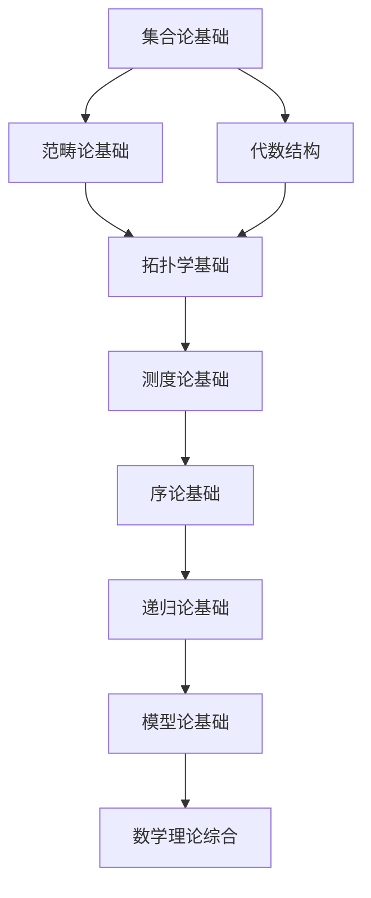

# 数学基础理论索引 (Mathematical Foundation Index)

## 📋 **目录**

### 1. [集合论基础](02.1_Set_Theory_Foundation.md)

### 2. [范畴论基础](02.2_Category_Theory_Foundation.md)

### 3. [代数结构](02.3_Algebraic_Structures.md)

### 4. [拓扑学基础](02.4_Topology_Foundation.md)

### 5. [测度论基础](02.5_Measure_Theory_Foundation.md)

### 6. [序论基础](02.6_Order_Theory_Foundation.md)

### 7. [递归论基础](02.7_Recursion_Theory_Foundation.md)

### 8. [模型论基础](02.8_Model_Theory_Foundation.md)

---

## 🎯 **数学基础理论概述**

数学基础理论为形式科学体系提供严格的数学工具和结构。它建立了形式化推理的数学基础，确保所有理论在数学上的严谨性和一致性。

### 核心特征

1. **公理化严格性**：所有理论都基于严格的公理系统
2. **逻辑一致性**：确保数学结构的内在一致性
3. **抽象化能力**：提供高度抽象化的数学工具
4. **构造性方法**：支持构造性的数学证明
5. **形式化表示**：所有概念都有精确的形式化表示

### 理论层次

```
┌─────────────────────────────────────────────────────────────┐
│                    数学理论综合 (2.9)                         │
├─────────────────────────────────────────────────────────────┤
│ 模型论 (2.8) │ 递归论 (2.7) │ 序论 (2.6) │ 测度论 (2.5) │
├─────────────────────────────────────────────────────────────┤
│ 拓扑学 (2.4) │ 代数结构 (2.3) │ 范畴论 (2.2) │ 集合论 (2.1) │
└─────────────────────────────────────────────────────────────┘
```

---

## 🔗 **理论关联图**



---

## 📚 **详细主题结构**

### 2.1 集合论基础

- **2.1.1** [朴素集合论](02.1_Set_Theory_Foundation.md#211-朴素集合论)
- **2.1.2** [公理集合论](02.1_Set_Theory_Foundation.md#212-公理集合论)
- **2.1.3** [序数与基数](02.1_Set_Theory_Foundation.md#213-序数与基数)
- **2.1.4** [选择公理与连续统假设](02.1_Set_Theory_Foundation.md#214-选择公理与连续统假设)

### 2.2 范畴论基础

- **2.2.1** [范畴的基本概念](02.2_Category_Theory_Foundation.md#221-范畴的基本概念)
- **2.2.2** [函子与自然变换](02.2_Category_Theory_Foundation.md#222-函子与自然变换)
- **2.2.3** [极限与余极限](02.2_Category_Theory_Foundation.md#223-极限与余极限)
- **2.2.4** [伴随函子](02.2_Category_Theory_Foundation.md#224-伴随函子)

### 2.3 代数结构

- **2.3.1** [群论基础](02.3_Algebraic_Structures.md#231-群论基础)
- **2.3.2** [环论基础](02.3_Algebraic_Structures.md#232-环论基础)
- **2.3.3** [域论基础](02.3_Algebraic_Structures.md#233-域论基础)
- **2.3.4** [模论基础](02.3_Algebraic_Structures.md#234-模论基础)

### 2.4 拓扑学基础

- **2.4.1** [点集拓扑学](02.4_Topology_Foundation.md#241-点集拓扑学)
- **2.4.2** [代数拓扑学](02.4_Topology_Foundation.md#242-代数拓扑学)
- **2.4.3** [微分拓扑学](02.4_Topology_Foundation.md#243-微分拓扑学)
- **2.4.4** [同伦论](02.4_Topology_Foundation.md#244-同伦论)

### 2.5 测度论基础

- **2.5.1** [测度空间](02.5_Measure_Theory_Foundation.md#251-测度空间)
- **2.5.2** [可测函数](02.5_Measure_Theory_Foundation.md#252-可测函数)
- **2.5.3** [积分理论](02.5_Measure_Theory_Foundation.md#253-积分理论)
- **2.5.4** [概率论基础](02.5_Measure_Theory_Foundation.md#254-概率论基础)

### 2.6 序论基础

- **2.6.1** [偏序集](02.6_Order_Theory_Foundation.md#261-偏序集)
- **2.6.2** [格论](02.6_Order_Theory_Foundation.md#262-格论)
- **2.6.3** [布尔代数](02.6_Order_Theory_Foundation.md#263-布尔代数)
- **2.6.4** [完全格](02.6_Order_Theory_Foundation.md#264-完全格)

### 2.7 递归论基础

- **2.7.1** [递归函数](02.7_Recursion_Theory_Foundation.md#271-递归函数)
- **2.7.2** [图灵机](02.7_Recursion_Theory_Foundation.md#272-图灵机)
- **2.7.3** [可计算性理论](02.7_Recursion_Theory_Foundation.md#273-可计算性理论)
- **2.7.4** [复杂度理论](02.7_Recursion_Theory_Foundation.md#274-复杂度理论)

### 2.8 模型论基础

- **2.8.1** [一阶逻辑模型](02.8_Model_Theory_Foundation.md#281-一阶逻辑模型)
- **2.8.2** [模型构造](02.8_Model_Theory_Foundation.md#282-模型构造)
- **2.8.3** [模型完备性](02.8_Model_Theory_Foundation.md#283-模型完备性)
- **2.8.4** [稳定性理论](02.8_Model_Theory_Foundation.md#284-稳定性理论)

---

## 🔄 **与其他理论的关联**

### 向上关联

- **哲学基础理论**：[01_Foundational_Theory](../01_Foundational_Theory/01_Philosophical_Foundation_Index.md)

### 向下关联

- **形式语言理论**：[03_Formal_Language_Theory](../03_Formal_Language_Theory/01_Formal_Language_Theory_Index.md)
- **类型理论**：[04_Type_Theory](../04_Type_Theory/01_Type_Theory_Index.md)

---

## 📖 **学习路径建议**

### 基础路径

1. 集合论基础 → 代数结构 → 拓扑学基础
2. 范畴论基础 → 序论基础 → 测度论基础
3. 递归论基础 → 模型论基础 → 数学理论综合

### 专业路径

- **代数方向**：代数结构 → 群论 → 环论 → 域论
- **拓扑方向**：拓扑学基础 → 代数拓扑 → 同伦论
- **逻辑方向**：集合论 → 递归论 → 模型论

---

## 🎯 **核心概念索引**

| 概念 | 定义位置 | 相关理论 |
|------|----------|----------|
| 集合 | [2.1.1](02.1_Set_Theory_Foundation.md#211-朴素集合论) | 集合论基础 |
| 范畴 | [2.2.1](02.2_Category_Theory_Foundation.md#221-范畴的基本概念) | 范畴论基础 |
| 群 | [2.3.1](02.3_Algebraic_Structures.md#231-群论基础) | 代数结构 |
| 拓扑空间 | [2.4.1](02.4_Topology_Foundation.md#241-点集拓扑学) | 拓扑学基础 |
| 测度 | [2.5.1](02.5_Measure_Theory_Foundation.md#251-测度空间) | 测度论基础 |
| 偏序集 | [2.6.1](02.6_Order_Theory_Foundation.md#261-偏序集) | 序论基础 |
| 递归函数 | [2.7.1](02.7_Recursion_Theory_Foundation.md#271-递归函数) | 递归论基础 |
| 模型 | [2.8.1](02.8_Model_Theory_Foundation.md#281-一阶逻辑模型) | 模型论基础 |

---

## 🔄 **持续更新**

**最后更新时间**：2024-12-20
**版本**：v1.0.0
**维护者**：数学基础理论重构团队

---

## 📋 **待完成任务**

- [ ] 创建所有子主题的详细文档
- [ ] 建立数学概念间的交叉引用系统
- [ ] 完善形式化证明和推导
- [ ] 构建数学理论与应用理论的桥梁 